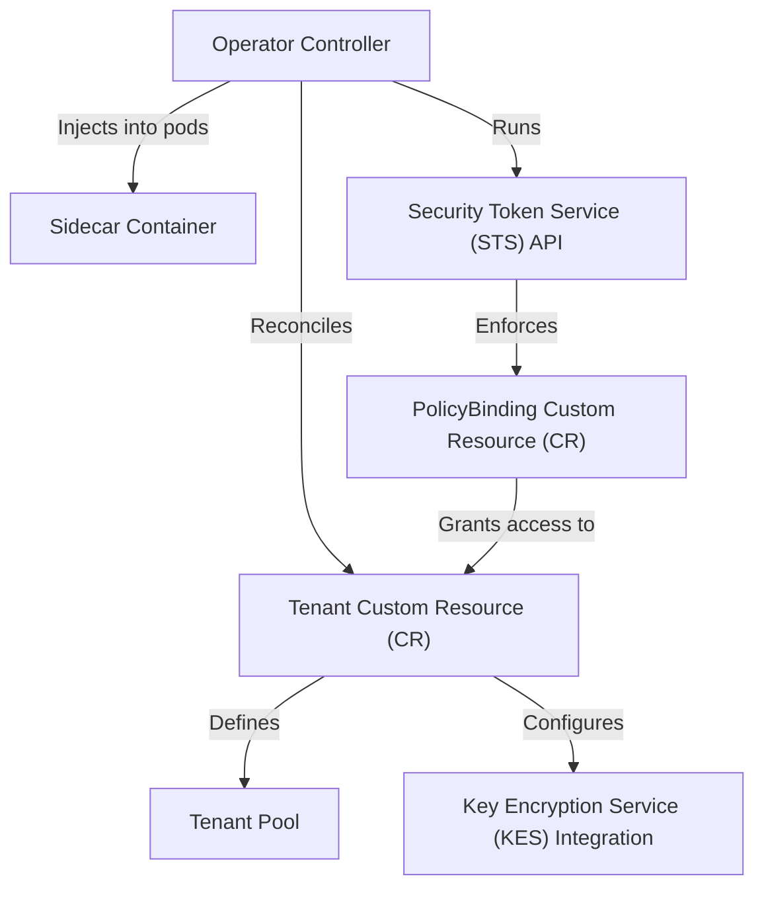

# Tutorial: operator

The MinIO Operator simplifies running *high-performance, S3-compatible object storage* on Kubernetes. You define your desired storage setup in a single configuration file called a **`Tenant`**. The Operator then acts like an automated administrator, deploying and managing all the necessary components to create a complete, independent MinIO instance for you. It also handles advanced features like *encryption* and provides a secure, Kubernetes-native way for your applications to access the storage.

**Source Repository:** [None](None)

## Chapters

1. [Tenant Custom Resource (CR)
](01_tenant_custom_resource__cr__.md)
2. [Tenant Pool
](02_tenant_pool_.md)
3. [Operator Controller
](03_operator_controller_.md)
4. [PolicyBinding Custom Resource (CR)
](04_policybinding_custom_resource__cr__.md)
5. [Security Token Service (STS) API
](05_security_token_service__sts__api_.md)
6. [Key Encryption Service (KES) Integration
](06_key_encryption_service__kes__integration_.md)
7. [Sidecar Container
](07_sidecar_container_.md)

---

Generated by [AI Codebase Knowledge Builder](https://github.com/The-Pocket/Tutorial-Codebase-Knowledge)