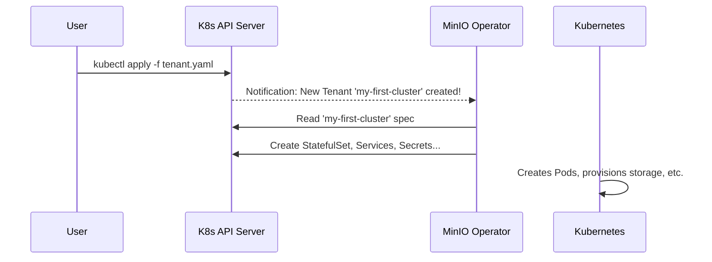

# Chapter 1: Tenant Custom Resource (CRD)

Welcome to the MinIO Operator tutorial! In this series, we'll explore the core concepts that make the MinIO Operator a powerful tool for managing high-performance object storage on Kubernetes. Let's start with the most important concept of all.

### The Challenge: Deploying a Distributed System

Imagine you want to set up a robust, scalable, and fault-tolerant object storage system like MinIO. This isn't as simple as running a single program. It involves managing multiple server processes, networking them together, provisioning storage for each one, handling credentials, and ensuring the whole system can recover from failures.

Doing this manually on Kubernetes would mean writing many complex YAML files for StatefulSets, Services, PersistentVolumeClaims, Secrets, and more. You'd be responsible for making sure they all work together perfectly. It's a lot of work and requires deep Kubernetes expertise.

This is the problem the MinIO Operator solves, and its primary tool is the `Tenant`.

### The Solution: The `Tenant` Blueprint

The `Tenant` is the master blueprint for a complete, independent MinIO object storage cluster.

Think of it like this: instead of building a house by buying every nail, brick, and wire yourself, you give a detailed blueprint to a general contractor. The contractor then handles all the complex work of hiring electricians, plumbers, and carpenters to bring your vision to life.

In our world:
*   **You** are the architect.
*   The `Tenant` YAML file is your **blueprint**.
*   The **MinIO Operator** is your general contractor.

You simply describe the MinIO cluster you want in a single, high-level `Tenant` file. The MinIO Operator reads this blueprint and automatically creates and manages all the low-level Kubernetes resources for you.

### What is a Custom Resource (CRD)?

Before we look at a `Tenant` file, let's quickly understand what a Custom Resource Definition (CRD) is. By default, Kubernetes knows about objects like `Pod`, `Service`, and `Deployment`. A CRD is a way to teach Kubernetes a new type of object.

When you install the MinIO Operator, it tells your Kubernetes cluster about a new object `kind: Tenant`. This lets you manage a MinIO cluster using familiar commands like `kubectl apply` and `kubectl get tenants`, just as you would with any standard Kubernetes object.

### Let's Build a MinIO Tenant

Let's use our `Tenant` blueprint to create a simple MinIO cluster. Our goal is to create a small but resilient cluster with 4 servers, where each server has access to 4 separate storage volumes.

Here is the minimal `Tenant` blueprint (YAML) to achieve this:

```yaml
# my-first-tenant.yaml
apiVersion: minio.min.io/v2
kind: Tenant
metadata:
  name: my-first-cluster
  namespace: minio-tenant
spec:
  pools:
  - servers: 4
    volumesPerServer: 4
    volumeClaimTemplate:
      spec:
        storageClassName: local-storage
        resources:
          requests:
            storage: 10Gi
```

Let's break this blueprint down:

*   `kind: Tenant`: This tells Kubernetes we are defining a MinIO Tenant.
*   `metadata.name`: We're giving our cluster a unique name: `my-first-cluster`.
*   `spec.pools`: This is the most important section. A `Tenant` is made up of one or more "pools" of servers. For now, just think of a pool as a group of servers that work together. We will explore this powerful concept in detail in the [Pool](02_pool_.md) chapter.
*   `servers: 4`: We are asking for 4 MinIO server Pods in our pool.
*   `volumesPerServer: 4`: Each of those 4 servers will get 4 persistent storage volumes. (Total of 4x4 = 16 volumes).
*   `volumeClaimTemplate`: This is our request for storage. We're asking for a 10Gi volume for each of the 16 slots from the `local-storage` class.

To bring this cluster to life, you simply apply this file to Kubernetes:

```sh
kubectl apply -f my-first-tenant.yaml
```

**What happens next?** The MinIO Operator, our "general contractor," sees this new `Tenant` resource. It reads your specifications and immediately gets to work building your MinIO cluster. You don't have to create Pods or Services yourself; the Operator handles everything.

### Under the Hood: From Blueprint to Running Cluster

So what does the Operator actually *do* when you apply a `Tenant`?

1.  **You** submit the `Tenant` YAML to the Kubernetes API.
2.  The **MinIO Operator**, which is always watching for `Tenant` resources, is notified of your new request.
3.  The Operator reads the `spec` of your `my-first-cluster` Tenant.
4.  Based on your blueprint, it generates the necessary Kubernetes resources in memory:
    *   A `StatefulSet` to manage the 4 MinIO server Pods.
    *   16 `PersistentVolumeClaims` to request the 16 storage volumes.
    *   A `Service` (`my-first-cluster-hl`) for internal pod-to-pod communication.
    *   A `Service` (`my-first-cluster`) for applications to access the S3 API.
    *   A `Service` (`my-first-cluster-console`) to expose the MinIO web console.
    *   `Secrets` to hold the access keys and other sensitive configuration.
5.  The Operator then applies these generated resources to Kubernetes, which in turn creates the actual Pods, binds the storage, and configures the networking.

This entire process can be visualized with a simple diagram:



The definition of the `Tenant` that you write in YAML is mapped directly to a Go programming structure within the Operator's code. This is how the operator understands your request.

Here's a simplified look at the Go struct that represents the `Tenant` specification.

**File:** `pkg/apis/minio.min.io/v2/types.go`
```go
// TenantSpec defines the desired state of Tenant
type TenantSpec struct {
	// An array of objects describing each MinIO server pool.
	// This is where you define servers and volumes.
	Pools []Pool `json:"pools"`

	// The Docker image to use for deploying MinIO.
	Image string `json:"image,omitempty"`

	// ... other fields for security, networking, etc.
}
```
As you can see, the `Pools` field in the Go code maps directly to the `pools` key in our YAML file, thanks to the `json:"pools"` tag. The logic inside the [Main Controller](03_main_controller_.md) reads this structured data and executes the steps needed to build your cluster.

### Conclusion

You've just learned about the most fundamental concept in the MinIO Operator: the **`Tenant` CRD**. It is the simple, powerful blueprint you provide to the Operator to build and manage a complete MinIO object storage cluster. You declare the *what* (4 servers, 16 disks), and the Operator handles the *how*.

We mentioned that a `Tenant` is built from one or more `pools`. These pools are the key to scaling your cluster and organizing its storage into different tiers. In the next chapter, we'll dive deep into the concept of the [Pool](02_pool_.md) and see how it gives you fine-grained control over your MinIO deployment.

---

Generated by [AI Codebase Knowledge Builder](https://github.com/The-Pocket/Tutorial-Codebase-Knowledge)