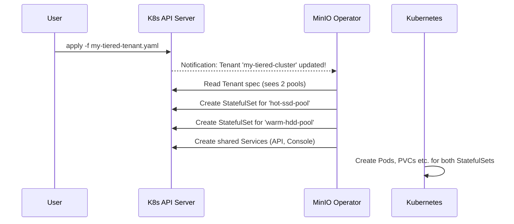

# Chapter 2: Pool

In the [previous chapter](01_tenant_custom_resource__crd__.md), we introduced the `Tenant` as the master blueprint for our MinIO cluster. We saw a `pools` section in our YAML, but we treated it as a single block. Now, let's unlock the true power of that section by diving into the concept of a `Pool`.

### The Challenge: One Size Doesn't Fit All

Imagine you're building a real data center. Would you use the exact same type of storage for everything? Probably not.
*   For a busy database, you'd want super-fast, but expensive, SSDs (Solid State Drives).
*   For long-term backups and archives, you'd want massive, but cheaper, HDDs (Hard Disk Drives).

A single, uniform cluster forces a compromise. It's either too expensive for bulk storage or too slow for high-performance needs. We need a way to create different "tiers" or "zones" of storage within the same MinIO system.

### The Solution: The Storage Pool

A `Pool` is a fundamental building block inside a `Tenant`. It represents a group of MinIO server pods and their associated storage.

Think of your `Tenant` as the entire data center blueprint, and each `Pool` as a blueprint for a specific "storage wing".

*   **Wing A (Pool 1):** The "High-Performance Wing" with a few servers backed by fast SSD storage.
*   **Wing B (Pool 2):** The "Bulk-Storage Wing" with many servers backed by large HDD storage.

A single `Tenant` can have multiple pools. This allows you to combine different types of storage and hardware into one unified MinIO cluster, all managed by a single `Tenant` resource. Under the hood, the MinIO Operator manages each `Pool` as a separate Kubernetes `StatefulSet`.

### Building a Tenant with Storage Tiers

Let's build a MinIO `Tenant` that has two distinct pools:
1.  A "hot" pool with 4 servers on fast SSDs for frequently accessed data.
2.  A "warm" pool with 8 servers on larger HDDs for less-frequently accessed data.

We will tell Kubernetes where to place these pods using `nodeSelector`, assuming our Kubernetes nodes are labeled appropriately (e.g., `disktype: ssd` or `disktype: hdd`).

```yaml
# my-tiered-tenant.yaml
apiVersion: minio.min.io/v2
kind: Tenant
metadata:
  name: my-tiered-cluster
  namespace: minio-tenant
spec:
  pools:
  # Pool 1: The fast, "hot" tier
  - name: hot-ssd-pool
    servers: 4
    volumesPerServer: 4
    nodeSelector:
      disktype: ssd # Ask Kubernetes to use nodes with SSDs
    volumeClaimTemplate:
      spec:
        storageClassName: fast-storage # Ask for fast storage
        resources:
          requests:
            storage: 1Ti

  # Pool 2: The large, "warm" tier
  - name: warm-hdd-pool
    servers: 8
    volumesPerServer: 8
    nodeSelector:
      disktype: hdd # Ask Kubernetes to use nodes with HDDs
    volumeClaimTemplate:
      spec:
        storageClassName: large-storage # Ask for large storage
        resources:
          requests:
            storage: 10Ti
```

Let's break down this multi-pool blueprint:

*   `spec.pools`: This is now a list with two items, one for each pool.
*   `name: hot-ssd-pool`: We give each pool a unique name. This is crucial for identifying it.
*   `nodeSelector`: This tells Kubernetes to only schedule the pods for this pool on nodes that have a matching label. This is how we ensure our "hot" pool runs on SSD hardware.
*   `storageClassName`: This requests a specific class of storage, which your cluster administrator would have configured to point to different physical storage systems (SSDs vs HDDs).

When you run `kubectl apply -f my-tiered-tenant.yaml`, the MinIO Operator sees this blueprint and builds *both* storage wings for you automatically.

### Under the Hood: One Pool, One StatefulSet

What does the Operator do with this two-pool `Tenant`? It doesn't just create one giant `StatefulSet`. Instead, it intelligently creates one `StatefulSet` *for each pool*.

This is a critical concept: **Pools provide isolation and independent scalability.**



The Operator creates:
*   `StatefulSet-A` for `hot-ssd-pool` with 4 pods, targeting nodes with the `disktype: ssd` label.
*   `StatefulSet-B` for `warm-hdd-pool` with 8 pods, targeting nodes with the `disktype: hdd` label.
*   A single set of `Services` that allows you to access the entire `Tenant` (both pools) through one endpoint. MinIO handles routing the data to the correct pool internally.

### A Look at the Code

This logic is clearly reflected in the Operator's source code. The YAML you write is mapped directly to a Go data structure (a "struct").

The `Pool` struct defines all the configuration options for a single storage wing.

**File:** `pkg/apis/minio.min.io/v2/types.go`
```go
// Pool (`pools`) defines a MinIO server pool on a Tenant.
type Pool struct {
	// Specify the name of the pool.
	Name string `json:"name"`

	// The number of MinIO server pods to deploy in the pool.
	Servers int32 `json:"servers"`

	// The number of Persistent Volume Claims to generate for each server.
	VolumesPerServer int32 `json:"volumesPerServer"`

	// Configuration for Persistent Volume Claims.
	VolumeClaimTemplate *corev1.PersistentVolumeClaim `json:"volumeClaimTemplate"`

	// The filter to select which nodes to deploy pods on.
	NodeSelector map[string]string `json:"nodeSelector,omitempty"`
	// ... other pool-specific settings like resources, affinity, etc.
}
```
Notice how the fields `Name`, `Servers`, `VolumeClaimTemplate`, and `NodeSelector` in the code directly correspond to the keys in our YAML file.

The core logic that processes these pools lives in the [Main Controller](03_main_controller_.md). It iterates through the list of `Pool` objects you defined and creates the necessary Kubernetes resources for each one.

Here is a simplified view of how the controller might get all the `StatefulSet`s for a `Tenant`.

**File:** `pkg/controller/pools.go`
```go
// Simplified concept
func (c *Controller) getAllSSForTenant(tenant *miniov2.Tenant) (map[int]*appsv1.StatefulSet, error) {
    // Create a place to store the StatefulSets we find
	poolStatefulSets := make(map[int]*appsv1.StatefulSet)

    // Loop through each pool defined in the Tenant's spec
	for i := range tenant.Spec.Pools {
        // For each pool, try to get its corresponding StatefulSet
		ss, err := c.getSSForPool(tenant, &tenant.Spec.Pools[i])
        // ... (error handling) ...
		if ss != nil {
			poolStatefulSets[i] = ss
		}
	}
	return poolStatefulSets, nil
}
```
This loop is the heart of the matter. It confirms that the Operator processes each pool individually, leading to the creation of separate `StatefulSet` resources.

### Conclusion

You've now learned about the `Pool`, a powerful feature for organizing and scaling your MinIO `Tenant`. A `Pool` acts as an independent "storage wing," managed by its own `StatefulSet`. By defining multiple pools, you can create sophisticated storage tiers (like hot/warm data), isolate workloads, and scale different parts of your cluster independently.

So far, we've seen *what* we can define in a `Tenant` blueprint. But what is the "brain" that reads this blueprint and orchestrates all this work? In the next chapter, we'll meet the engine of the Operator: the [Main Controller](03_main_controller_.md).

---

Generated by [AI Codebase Knowledge Builder](https://github.com/The-Pocket/Tutorial-Codebase-Knowledge)