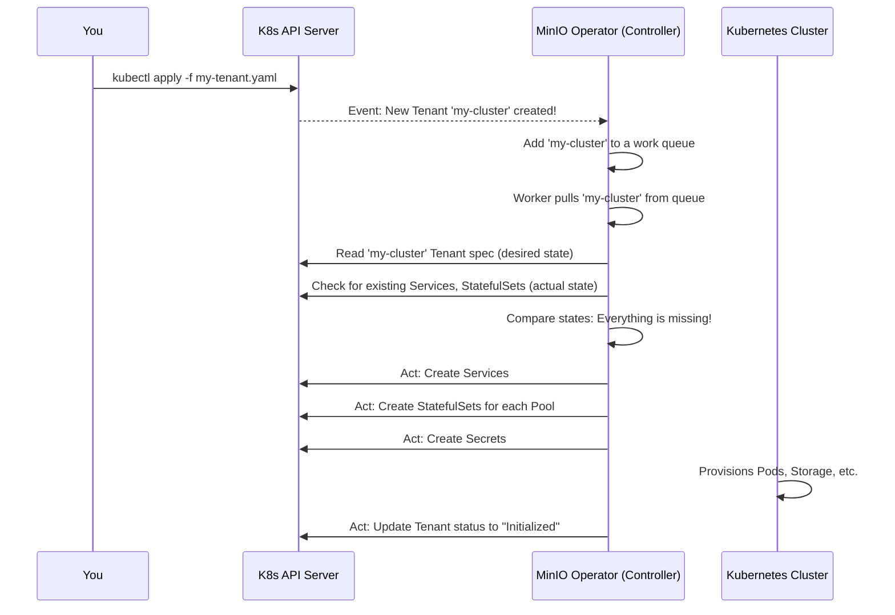

# Chapter 3: Main Controller

In the [previous chapter](02_pool_.md), we learned how to design sophisticated MinIO clusters with different storage tiers using [Pools](02_pool_.md). We created a detailed blueprint—our `Tenant` YAML file—that describes exactly what we want.

But a blueprint is just a plan. How does that plan get turned into a real, running MinIO cluster? Who reads the blueprint and does all the hard work? Let's meet the brain of the operation.

### The Challenge: From Plan to Reality

Imagine you've handed your house blueprint to the general contractor. What happens next? The contractor doesn't just stare at the paper. They need to:
1.  Read and understand every detail of the plan.
2.  Check the construction site to see what's already built.
3.  Figure out the difference between the plan and the current reality.
4.  Create a to-do list: "Pour foundation," "Frame walls," "Install windows."
5.  Execute the list, step-by-step.

Our `Tenant` YAML is the blueprint. The Kubernetes cluster is the construction site. We need an intelligent process that constantly compares the two and takes action to make them match.

### The Solution: The Main Controller and its Loop

The **Main Controller** is the core intelligence of the MinIO Operator. It's the "brain" of our general contractor. It runs inside the Operator Pod and contains all the logic for managing `Tenant` resources.

The Controller works in a continuous cycle called a **reconciliation loop**. This concept is at the heart of how Kubernetes operators function. It's a simple but powerful pattern:

1.  **Watch:** The Controller constantly watches the Kubernetes API for any changes to `Tenant` resources. Has a new one been created? Has an existing one been updated?
2.  **Compare:** When a change is detected, the Controller fetches the `Tenant`'s specification (the *desired state*). It then checks the cluster to see what Kubernetes resources (like `StatefulSets` and `Services`) currently exist for that `Tenant` (the *actual state*).
3.  **Act:** If the actual state doesn't match the desired state, the Controller takes action. If a `Service` is missing, it creates it. If a `StatefulSet`'s container image is wrong, it updates it. If a `Tenant` is deleted, it cleans up everything.

This loop ensures that your MinIO cluster will always move towards the state you defined in your YAML, automatically correcting any differences.

### A Day in the Life of the Controller

Let's follow the Controller as you apply a new `Tenant` blueprint.



The key takeaway is that the Controller is the *active* component. It's not a one-time script; it's a persistent process that constantly works to enforce your blueprint.

### Under the Hood: The Code that Powers the Brain

The Controller's logic is primarily written in Go. Let's look at a few simplified snippets to see how it works.

#### 1. The Endless Loop

The Controller needs to run forever. A "worker" function is started that endlessly pulls tasks from a queue and processes them.

**File:** `pkg/controller/main-controller.go`
```go
// runWorker is a long-running function that will continually process items.
func (c *Controller) runWorker() {
	// Loop forever, or until the program is told to stop.
	for processNextItem(c.workqueue, c.syncHandler) {
	}
}
```
The `processNextItem` function (not shown) simply gets the next `Tenant` key (like `minio-tenant/my-first-cluster`) from the queue and calls the main logic function, `syncHandler`.

#### 2. The Main Logic: `syncHandler`

This is the heart of the Controller. It contains the "Compare" and "Act" steps of our reconciliation loop. Here is a heavily simplified version of what it does.

**File:** `pkg/controller/main-controller.go`
```go
// syncHandler compares the actual state with the desired, and attempts to
// converge the two.
func (c *Controller) syncHandler(key string) (Result, error) {
	// ... code to get the Tenant object from the key ...
	tenant, err := c.minioClientSet.MinioV2().Tenants(namespace).Get(...)
	// ... error handling ...

	// Ensure defaults are set on the Tenant spec
	tenant.EnsureDefaults()

	// Act: Check and create the necessary Kubernetes Services
	err = c.checkMinIOSvc(ctx, tenant, nsName)
	// ... more service checks ...

	// Act: Loop through each Pool defined in the blueprint
	for i, pool := range tenant.Spec.Pools {
		// Does a StatefulSet for this pool already exist?
		ss, err := c.statefulSetLister.StatefulSets(tenant.Namespace).Get(...)
		if k8serrors.IsNotFound(err) {
			// If not, create it!
			ss = statefulsets.NewPool(...) // Generate the StatefulSet YAML
			c.kubeClientSet.AppsV1().StatefulSets(tenant.Namespace).Create(ctx, ss, ...)
		}
		// ... logic to update the StatefulSet if it exists but is different ...
	}
	
	// ... logic to create users, buckets, etc. ...

	// Finally, update the Tenant's status to report our progress.
	c.updateTenantStatus(ctx, tenant, StatusInitialized, ...)
	return Result{}, nil
}
```
This function is the master checklist. It goes through every part of the `Tenant` spec and creates or updates the corresponding Kubernetes resources. Notice the loop over `tenant.Spec.Pools`—this is where it uses the logic from the [Pool](02_pool_.md) chapter to create a `StatefulSet` for each storage wing.

#### 3. Reporting Back: Updating Status

How do you know what the Controller is doing? It reports its progress back to you by updating the `.status` field of your `Tenant` resource. You can see this with `kubectl describe tenant my-first-cluster`.

A dedicated function handles this update.

**File:** `pkg/controller/status.go`
```go
// updateTenantStatus updates the status of the Tenant resource.
func (c *Controller) updateTenantStatus(ctx context.Context, tenant *miniov2.Tenant, currentState string, ...) (*miniov2.Tenant, error) {
	tenantCopy := tenant.DeepCopy()
	tenantCopy.Status.CurrentState = currentState
	// ... set other status fields ...

	// Call the Kubernetes API to update the status subresource
	t, err := c.minioClientSet.MinioV2().Tenants(tenant.Namespace).UpdateStatus(ctx, tenantCopy, ...)
	return t, err
}
```
When `syncHandler` finishes its work, it calls this function with a message like `StatusInitialized`. This is how you, the user, get feedback on the state of your cluster build-out.

### Conclusion

You've now met the **Main Controller**, the tireless brain of the MinIO Operator. It embodies the "Watch, Compare, Act" reconciliation pattern that makes operators so powerful. It reads your `Tenant` and `Pool` blueprints and orchestrates all the low-level Kubernetes work to bring your cluster to life, continuously ensuring that reality matches your desired plan.

We have a running MinIO cluster. But who can access it, and what can they do? In the next chapter, we will explore how the Operator manages access control using the [PolicyBinding CRD & STS](04_policybinding_crd___sts_.md).

---

Generated by [AI Codebase Knowledge Builder](https://github.com/The-Pocket/Tutorial-Codebase-Knowledge)