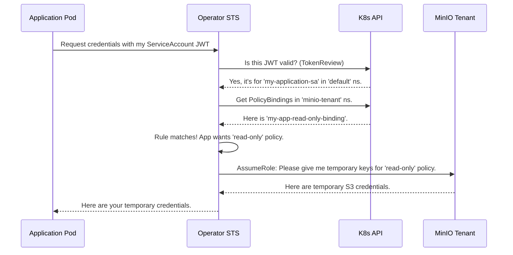

# Chapter 4: PolicyBinding CRD & STS

In the [previous chapter](03_main_controller_.md), we met the **[Main Controller](03_main_controller_.md)**, the tireless brain that builds our MinIO cluster from a `Tenant` blueprint. We now have a fully functional object storage system. But how do our applications running inside Kubernetes pods securely talk to it?

### The Challenge: Who Gets the Keys to the Kingdom?

Imagine your application, running in a pod, needs to read and write files to your new MinIO `Tenant`. How do you give it access?

The simplest way is to create a MinIO access key and secret, put them in a Kubernetes `Secret`, and mount that secret into your application's pod. This works, but it has significant security drawbacks:
*   **Permanent Keys:** The keys are long-lived. If they are ever leaked, an attacker has permanent access until you manually rotate them.
*   **Manual Rotation:** Changing keys is a manual process. You have to create new keys, update the Kubernetes `Secret`, and restart your application. It's tedious and often forgotten.
*   **Broad Permissions:** The key might have more permissions than the application strictly needs, violating the principle of least privilege.

We need a system that is automated, secure, and provides short-lived, temporary access tailored to a specific application's needs.

### The Solution: A Security Guard for Your Tenant

The MinIO Operator provides an elegant solution using two components: the **`PolicyBinding` Custom Resource (CRD)** and a built-in **Security Token Service (STS)**.

Let's use an analogy. Think of your MinIO `Tenant` as a high-security data vault.

*   **Your Application Pod:** An employee who needs access to the vault.
*   **Kubernetes `ServiceAccount`:** The employee's official company ID badge. It proves who they are but doesn't grant any access on its own.
*   **MinIO Policies:** A set of specific permissions, like "access to Room 101" or "permission to open Safe B."
*   **`PolicyBinding` CRD:** A list held by the security guard at the vault's entrance. This list maps employee ID badges to the permissions they are allowed to have. For example: "Employee ID #123 (your app's `ServiceAccount`) is cleared for 'access to Room 101' and 'permission to open Safe B'."
*   **Operator's STS:** The smart security guard. When the employee presents their ID badge, the guard checks the `PolicyBinding` list. If they are on the list, the guard gives them a temporary keycard that only works for the approved rooms and expires in one hour.

This system is far more secure. The employee never holds a permanent master key. Their access is temporary and strictly limited to what the `PolicyBinding` rules allow.

### How it Works: A Practical Example

Let's walk through setting this up. Our goal is to give a specific application pod read-only access to our MinIO `Tenant`.

**Pre-requisite:** We assume a `read-only` policy already exists within our MinIO `Tenant`.

#### Step 1: Create an ID Badge for our Application

First, we create a standard Kubernetes `ServiceAccount`. This will be the unique identity, or "ID badge," for our application pod.

```yaml
# my-app-identity.yaml
apiVersion: v1
kind: ServiceAccount
metadata:
  name: my-application-sa
  namespace: default
```

This YAML just creates a `ServiceAccount` named `my-application-sa` in the `default` namespace.

#### Step 2: Create the Security Rulebook (`PolicyBinding`)

Now for the magic. We create a `PolicyBinding` resource. This tells the Operator's STS which "ID badge" (`ServiceAccount`) is allowed to assume which MinIO policies.

```yaml
# my-app-access-rules.yaml
apiVersion: sts.min.io/v1beta1
kind: PolicyBinding
metadata:
  name: my-app-read-only-binding
  namespace: minio-tenant # IMPORTANT: The binding lives in the Tenant's namespace
spec:
  application:
    namespace: default
    serviceaccount: my-application-sa
  policies:
    - "read-only"
```

Let's break this down:
*   `metadata.namespace: minio-tenant`: The `PolicyBinding` must be created in the same namespace as the MinIO `Tenant` it applies to.
*   `spec.application.namespace: default`: The namespace where our application's `ServiceAccount` lives.
*   `spec.application.serviceaccount: my-application-sa`: The name of the "ID badge" we are creating a rule for.
*   `spec.policies`: A list of MinIO policy names this `ServiceAccount` is allowed to use. Here, just `read-only`.

#### Step 3: The Application Requests Access

When your application pod starts (using `serviceAccountName: my-application-sa`), Kubernetes automatically mounts a temporary JWT token for that `ServiceAccount` inside the pod.

The application's code (or an init container) uses this JWT token to call the Operator's STS endpoint. The Operator validates the token, checks the `PolicyBinding` rules, and returns temporary MinIO credentials. The application can then use these credentials to access MinIO.

### Under the Hood: The STS Handshake

Let's visualize the flow when the application requests credentials.



The Operator's STS service acts as a secure broker, ensuring that only authenticated `ServiceAccounts` with a corresponding `PolicyBinding` can get credentials, and only for the policies they are explicitly allowed.

### A Look at the Code

Let's see how this is represented in the Operator's code.

#### 1. The `PolicyBinding` Blueprint

First, the YAML we write is defined as a CRD. The `spec` section clearly outlines the fields for the application's identity and the policies.

**File:** `resources/base/crds/sts.min.io_policybindings.yaml`
```yaml
# ... (metadata)
spec:
  group: sts.min.io
  names:
    kind: PolicyBinding
# ... (other fields)
  versions:
  - name: v1beta1
    schema:
      openAPIV3Schema:
        properties:
          spec:
            properties:
              application:
                # ... defines namespace and serviceaccount
              policies:
                # ... defines an array of strings
```

This CRD teaches Kubernetes about the `PolicyBinding` object, just like the `Tenant` CRD we saw in [Chapter 1](01_tenant_custom_resource__crd__.md).

This YAML structure maps directly to a Go struct that the controller uses.

**File:** `pkg/apis/sts.min.io/v1beta1/types.go`
```go
// PolicyBindingSpec defines the configuration of a MinIO PolicyBinding object.
type PolicyBindingSpec struct {
	// The Application Property identifies the namespace and service account
	Application *Application `json:"application"`

	// List of policies the application can use
	Policies []string `json:"policies"`
}

// Application defines the `Namespace` and `ServiceAccount`
type Application struct {
	Namespace      string `json:"namespace"`
	ServiceAccount string `json:"serviceaccount"`
}
```
The `json` tags tell Go how to map the YAML fields to the struct fields, making it easy for the **[Main Controller](03_main_controller_.md)** to read your rules.

#### 2. The STS Handler

The core logic for handling credential requests lives in the STS handler. This is the code that acts as our "security guard".

**File:** `pkg/controller/sts_handlers.go`
```go
// AssumeRoleWithWebIdentityHandler handles requests for credentials.
func (c *Controller) AssumeRoleWithWebIdentityHandler(w http.ResponseWriter, r *http.Request) {
	// 1. Get the JWT token from the incoming request
	accessToken := r.Form.Get(stsWebIdentityToken)

	// 2. Ask Kubernetes to validate the token
	saAuthResult, err := c.ValidateServiceAccountJWT(&ctx, accessToken)
	// ... (handle errors) ...

	// 3. Get the ServiceAccount name and namespace from the validated token
	saNamespace := chunks[0]
	saName := chunks[1]

	// 4. Find all PolicyBindings that match this ServiceAccount
	// ... (code to list PolicyBindings and loop through them) ...
	if len(policyBindings) == 0 {
		// No matching rule found, deny access!
		writeSTSErrorResponse(w, true, ErrSTSAccessDenied, ...)
		return
	}

	// 5. If a rule is found, request temporary credentials from the MinIO Tenant
	stsCredentials, err := AssumeRole(ctx, c, &tenant, region, combinedPolicy, ...)
	// ... (handle errors) ...
	
	// 6. Return the temporary credentials to the application
	writeSuccessResponseXML(w, ...)
}
```
This simplified function shows the exact steps from our sequence diagram: get token, validate it, find a matching rule, request credentials from the `Tenant`, and send them back.

### Conclusion

You've just learned about the **`PolicyBinding` CRD** and the built-in **STS**, a powerful combination for managing access to your MinIO `Tenant` in a secure, automated, and Kubernetes-native way. By replacing static, long-lived keys with temporary, scoped credentials, you significantly improve the security posture of your applications.

So far, we have a running `Tenant` and a secure way for applications to access it. But what about the data itself? How do we protect data at rest? In the next chapter, we'll explore another critical security feature: **[KES (Key Encryption Service) Integration](05_kes__key_encryption_service__integration_.md)**.

---

Generated by [AI Codebase Knowledge Builder](https://github.com/The-Pocket/Tutorial-Codebase-Knowledge)