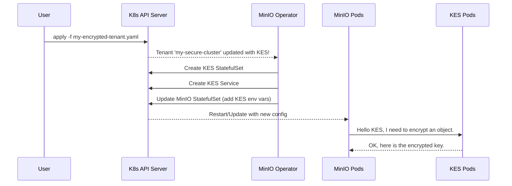

# Chapter 5: KES (Key Encryption Service) Integration

In the [previous chapter](04_policybinding_crd___sts_.md), we learned how to securely manage who can access our MinIO `Tenant` using the [PolicyBinding CRD & STS](04_policybinding_crd___sts_.md). We've locked the front door. But what about the data itself? How do we protect it even if an attacker gets access to the physical storage drives?

### The Challenge: The Key Under the Doormat

Imagine you store all your valuable documents in a high-tech safe. That's great! But what if you tape the key to the safe right on top of it? If a burglar breaks in, they have both the safe and the key. The safe is useless.

This is a common problem in data security. We can encrypt our data (put it in a safe), but if the encryption key is stored on the same server or disk as the data, an attacker who gains access to the machine gets both. This is called "encryption at rest," but it's not truly secure without proper key management.

### The Solution: An External Vault for Your Keys

The MinIO Operator solves this with **KES (Key Encryption Service) Integration**.

Think of KES as a highly secure, external vault manager for your encryption keys.

*   **MinIO** is the bank teller who handles the customer's data (objects).
*   **KES** is the vault manager who works in a separate, high-security room. The vault manager is the only one who can create and access master keys.

When MinIO needs to save a new piece of data, it doesn't create its own key. Instead, it asks the KES vault manager for help. KES uses its master key to encrypt the data. This **decouples** the data from its encryption keys, providing a critical layer of security. If the teller's area (the MinIO server) is compromised, the vault (KES) and its master keys remain safe.

The best part? The MinIO Operator can automatically deploy and configure a KES service right alongside your MinIO `Tenant`.

### Enabling KES in Your Tenant

Let's add server-side encryption to our `Tenant`. We do this by adding a `kes` section to our `Tenant` blueprint. This tells the Operator, "I want a KES vault manager for this MinIO cluster."

First, we need a Kubernetes `Secret` to hold the configuration for KES. This configuration tells KES how to behave—for example, whether to store its master key in memory or to connect to an even more secure external system like HashiCorp Vault. For this example, we'll assume a basic configuration secret is already created.

```yaml
# A secret named 'kes-config' that holds the KES server configuration.
# This tells KES how to manage its keys.
apiVersion: v1
kind: Secret
metadata:
  name: kes-config
# ... (data for the secret) ...
```

Now, we can update our `Tenant` YAML to use it.

```yaml
# my-encrypted-tenant.yaml
apiVersion: minio.min.io/v2
kind: Tenant
metadata:
  name: my-secure-cluster
  namespace: minio-tenant
spec:
  # ... other tenant specs like pools ...
  pools:
  - servers: 4
    # ... (pool details)

  # Add this section to enable KES
  kes:
    replicas: 2
    image: quay.io/minio/kes:v0.22.0
    kesSecret:
      name: kes-config
```

Let's break down the new `kes` section:
*   `kes:`: This key tells the Operator to enable KES integration.
*   `replicas: 2`: We are asking for 2 KES server pods for high availability.
*   `image:`: The Docker image for the KES server.
*   `kesSecret.name: kes-config`: This is the crucial part. We are telling the Operator to use the Kubernetes `Secret` named `kes-config` to configure our KES pods.

That's it! By adding this small block, you've instructed the Operator to set up a complete server-side encryption system.

### Under the Hood: Orchestrating the Vault

When the [Main Controller](03_main_controller_.md) sees the `kes` section in your `Tenant`, it performs a special orchestration:

1.  It reads your `kes` specification.
2.  It creates a brand new `StatefulSet` just for the KES pods. This is separate from the MinIO server `StatefulSets`.
3.  It creates a Kubernetes `Service` so the MinIO pods have a stable address to find the KES pods.
4.  It automatically generates the required TLS certificates so that communication between MinIO and KES is secure and encrypted.
5.  It injects special environment variables into the MinIO server pods, telling them where the KES service is and how to talk to it.

From that point on, every object written to MinIO will be automatically encrypted.



### A Look at the Code

This powerful feature is, like everything else, defined by clear structures in the Operator's code.

#### 1. The KES Blueprint in Go

The `kes` section in your YAML maps directly to a `KESConfig` Go struct. This is how the Operator understands your request.

**File:** `pkg/apis/minio.min.io/v2/types.go`
```go
// KESConfig (`kes`) defines the configuration of the KES StatefulSet.
type KESConfig struct {
	// Specify the number of replica KES pods to deploy.
	Replicas int32 `json:"replicas,omitempty"`

	// The Docker image to use for deploying MinIO KES.
	Image string `json:"image,omitempty"`

	// Specify a Kubernetes secret which contains environment variables
	// to use for setting up the KES service.
	Configuration *corev1.LocalObjectReference `json:"kesSecret"`
	
	// ... other KES settings ...
}
```
The `json` tags link the YAML keys (like `replicas`) to the fields in the struct, allowing the Operator to read your blueprint into a format it can work with.

#### 2. The Controller's Trigger

The [Main Controller](03_main_controller_.md) has specific logic to handle KES. It checks if you've enabled it and then calls the necessary functions.

**File:** `pkg/controller/kes.go`
```go
// Simplified logic
func (c *Controller) checkKESStatus(ctx context.Context, tenant *miniov2.Tenant, ...) error {
    // Has the user enabled KES in their Tenant spec?
	if tenant.HasKESEnabled() {
		// If yes, proceed to check certificates, services, and the StatefulSet.
		if err := c.checkKESCertificatesStatus(ctx, tenant, ...); err != nil {
			return err
		}
		
		// ... code to create KES Service ...

		// Check if the KES StatefulSet exists. If not, create it.
		if _, err := c.statefulSetLister.StatefulSets(...).Get(...); k8serrors.IsNotFound(err) {
            // Create the StatefulSet for KES
			ks := statefulsets.NewForKES(tenant, ...) 
			c.kubeClientSet.AppsV1().StatefulSets(...).Create(ctx, ks, ...)
		}
	}
	return nil
}
```
This snippet shows the controller's main decision point. The `tenant.HasKESEnabled()` check is the trigger that kicks off the entire KES deployment process.

#### 3. Building the KES StatefulSet

The `statefulsets.NewForKES` function is the factory that constructs the KES `StatefulSet` resource based on your blueprint.

**File:** `pkg/resources/statefulsets/kes-statefulset.go`
```go
// NewForKES creates a new KES StatefulSet for the given Tenant.
func NewForKES(t *miniov2.Tenant, serviceName string) *appsv1.StatefulSet {
	replicas := t.KESReplicas() // Get replicas from Tenant spec

	// ... logic to set up volumes and certificates ...

	ss := &appsv1.StatefulSet{
		ObjectMeta: metav1.ObjectMeta{
			Name: t.KESStatefulSetName(), // e.g., "my-secure-cluster-kes"
			// ...
		},
		Spec: appsv1.StatefulSetSpec{
			Replicas:    &replicas,
			ServiceName: serviceName,
			Template: corev1.PodTemplateSpec{
                // Defines the KES pods, using the image from the spec
				Spec: corev1.PodSpec{
					Containers: []corev1.Container{KESServerContainer(t)},
					// ...
				},
			},
			// ...
		},
	}
	return ss
}
```
This function takes your simple `kes` definition from the `Tenant` YAML and translates it into a full, detailed Kubernetes `StatefulSet` resource, ready to be created in the cluster.

### Conclusion

You've now learned how to enable robust, server-side encryption for your data at rest using **KES integration**. By simply adding a `kes` block to your `Tenant` blueprint, you command the MinIO Operator to deploy and manage an entire key management service for you. This decouples your data from its encryption keys, providing a massive boost to your security posture.

We have a secure, multi-tenant, encrypted object storage cluster running. But what if we need to extend its functionality? For example, what if we want to add a custom logging agent or a metrics exporter to every single MinIO pod? In the next chapter, we'll explore how the [Sidecar](06_sidecar_.md) feature makes this easy.

---

Generated by [AI Codebase Knowledge Builder](https://github.com/The-Pocket/Tutorial-Codebase-Knowledge)