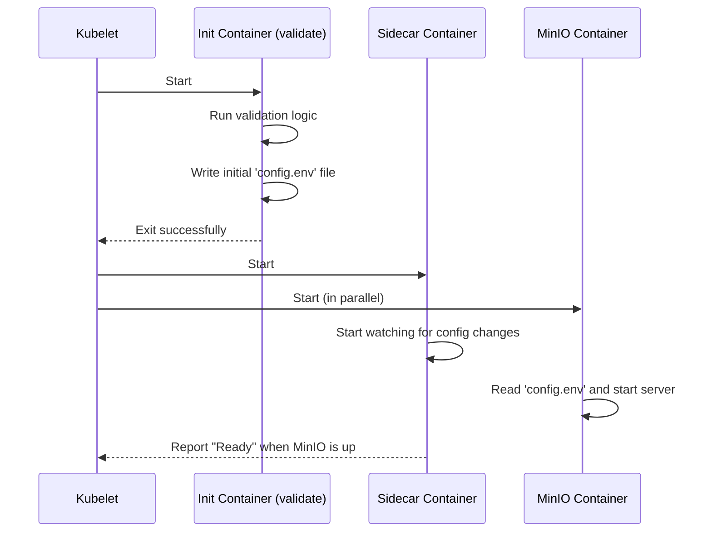

# Chapter 6: Sidecar

Welcome to the final chapter of our MinIO Operator tutorial! In the [previous chapter](05_kes__key_encryption_service__integration_.md), we secured our data at rest by integrating an external **[KES (Key Encryption Service)](05_kes__key_encryption_service__integration_.md)**. We now have a fully-featured, secure, and resilient object storage cluster.

But how does each MinIO server in our `Tenant` start up so perfectly every time? How does it get its configuration, and how can that configuration be updated without restarting the server? Let's meet the unsung hero that works behind the scenes.

### The Challenge: The Pre-Flight Checklist

Imagine a complex aircraft. Before every flight, a ground crew performs a detailed pre-flight check. They validate the flight plan, check the fuel, inspect the engines, and ensure everything is perfect *before* the pilot starts the main engines. This initialization step is critical for a safe and successful flight.

A MinIO server pod is similar. Before the main `minio server` process starts, many things need to be in place:
*   Its configuration needs to be fetched from Kubernetes `Secrets`.
*   This configuration must be validated to make sure it's correct.
*   The environment needs to be prepared.

Doing this inside the main MinIO program would make it more complex. We need a specialized "ground crew" to handle all this preparation work.

### The Solution: The Sidecar "Initialization Crew"

The **`Sidecar`** is a small, specialized helper container that runs alongside every MinIO server pod in a [Tenant](01_tenant_custom_resource__crd__.md). It acts as the dedicated "initialization crew" for each server.

Think of it like this:
*   **MinIO Server Container:** The powerful main engine of the aircraft.
*   **Sidecar Container:** The diligent ground crew that runs a pre-flight checklist.

The Sidecar's jobs include:
1.  **Validation (Init Container):** Before the main engine even starts, a special version of the sidecar runs as an "init container" to validate the configuration. If the root credentials are missing, it stops the pod from starting, preventing a misconfiguration.
2.  **Preparation:** It dynamically generates the final configuration file that the MinIO server will use.
3.  **Readiness Probes:** It provides a reliable health check to tell Kubernetes exactly when the MinIO server is ready to accept traffic.
4.  **Dynamic Updates:** It continuously watches for changes to your `Tenant` or its configuration `Secret`. If you make a change, the Sidecar can regenerate the configuration file, and MinIO will pick it up without needing a full restart. This is a huge advantage for uptime.

You don't need to configure this Sidecar yourself; the [Main Controller](03_main_controller_.md) automatically injects it into every MinIO pod it creates. It's a built-in feature that makes the whole system more robust.

### Under the Hood: The Pod Startup Sequence

Let's look at what happens inside a MinIO pod when it starts up. Kubernetes starts the containers in a specific order.



1.  **Init Container:** Kubernetes first runs the `initContainer`. This container's only job is to run the `validate` command. It fetches the `Tenant` spec and the configuration `Secret`, generates the initial `config.env` file, and then exits. If it fails, the pod startup is aborted.
2.  **Main Containers:** Once the init container succeeds, Kubernetes starts the main containers: `minio` and `sidecar`.
3.  **Sidecar:** The `sidecar` container starts its own small controller. It watches for any updates to the configuration `Secret` or the `Tenant` resource and keeps the `config.env` file up-to-date. It also exposes a `/ready` endpoint that Kubernetes uses for health checks.
4.  **MinIO:** The `minio` container starts the main server process, which reads its settings from the `config.env` file prepared by its helpers.

### A Look at the Code

Let's see how this orchestration is defined in the Operator's code.

#### 1. Injecting the Helpers

The [Main Controller](03_main_controller_.md) uses a function to build the `StatefulSet` for each MinIO [Pool](02_pool_.md). Inside this logic, it explicitly adds the init and sidecar containers.

**File:** `pkg/resources/statefulsets/minio-statefulset.go`
```go
// Simplified function to create the sidecar container
func getSideCarContainer(t *miniov2.Tenant, pool *miniov2.Pool) corev1.Container {
	sidecarContainer := corev1.Container{
		Name:  "sidecar",
		Image: getSidecarImage(), // The special sidecar image
		Args: []string{
			"sidecar",         // Command to run
			"--tenant",        // For this Tenant...
			t.Name,
			"--config-name",   // Watching this Secret...
			t.Spec.Configuration.Name,
		},
		// ... (readiness probe, volume mounts, etc.)
	}
	return sidecarContainer
}
```
This function creates the `sidecar` container definition. Note the arguments: it's told exactly which `Tenant` and `Secret` to watch.

A similar function, `getInitContainer`, creates the init container that runs the `validate` command.

#### 2. The Validation Logic

The `validate` command, which runs in the init container, has one critical job: ensure the configuration is usable before MinIO starts.

**File:** `sidecar/pkg/validator/validator.go`
```go
// Validate checks the configuration and creates a valid one for MinIO to start
func Validate(tenantName string) {
	// 1. Get the Tenant resource from Kubernetes API
	tenant, err := controllerClient.MinioV2().Tenants(...).Get(...)
	// ...

	// 2. Get the associated configuration Secret
	configSecret, err := kubeClient.CoreV1().Secrets(...).Get(...)
	// ...

	// 3. Generate the full config content from the Tenant and Secret
	fileContents, rootUserFound, rootPwdFound := configuration.GetFullTenantConfig(...)

	// 4. CRITICAL: If no root user/pass, exit with an error!
	if !rootUserFound || !rootPwdFound {
		log.Println("Missing root credentials. MinIO won't start")
		os.Exit(1)
	}

	// 5. Write the valid configuration to a shared file
	err = os.WriteFile(miniov2.CfgFile, []byte(fileContents), 0o644)
	// ...
}
```
This logic acts as a gateway. It prevents a MinIO pod from ever starting in a broken state, which is much better than having it start and then fail.

#### 3. The Dynamic Update Logic

The main `sidecar` container runs its own mini-controller to watch for changes. This is what enables zero-downtime configuration updates.

**File:** `sidecar/pkg/sidecar/sidecar_utils.go`
```go
// Simplified logic for the sidecar controller
func NewSideCarController(...) *Controller {
	// ... (setup informers to watch secrets and tenants) ...

	// Add a function to handle Secret updates
	secretInformer.Informer().AddEventHandler(cache.ResourceEventHandlerFuncs{
		UpdateFunc: func(oldObj, newObj interface{}) {
			// This code runs whenever the config Secret is updated!
			log.Printf("Config secret was updated, regenerating config...")
			c.regenCfgWithSecret(newObj.(*corev1.Secret))
		},
	})
	
	// Add a similar handler for Tenant updates
	// ...
	
	return c
}
```
The `UpdateFunc` is the key. When you `kubectl apply` a change to your configuration `Secret`, this function is triggered inside the sidecar. It calls `regenCfgWithSecret`, which rewrites the `config.env` file. The main MinIO process detects the file change and reloads its configuration automatically.

### Conclusion

Congratulations! You've reached the end of the MinIO Operator tutorial. You've learned about the fundamental concepts that make the Operator a powerful, declarative tool for managing object storage on Kubernetes.

Let's recap our journey:
1.  **[Tenant Custom Resource (CRD)](01_tenant_custom_resource__crd__.md):** The master blueprint for an entire MinIO cluster.
2.  **[Pool](02_pool_.md):** The building block for creating storage tiers within a `Tenant`.
3.  **[Main Controller](03_main_controller_.md):** The "brain" of the Operator that reads your blueprints and builds the cluster.
4.  **[PolicyBinding CRD & STS](04_policybinding_crd___sts__.md):** The secure, Kubernetes-native way to manage application access with temporary credentials.
5.  **[KES Integration](05_kes__key_encryption_service__integration_.md):** The robust system for enabling server-side encryption by decoupling data from its keys.
6.  **Sidecar:** The invisible helper that ensures every MinIO pod starts correctly and can be updated dynamically.

Together, these components provide a production-grade, automated, and easy-to-manage object storage solution. You are now equipped with the knowledge to deploy and manage your own high-performance MinIO clusters with confidence.

---

Generated by [AI Codebase Knowledge Builder](https://github.com/The-Pocket/Tutorial-Codebase-Knowledge)