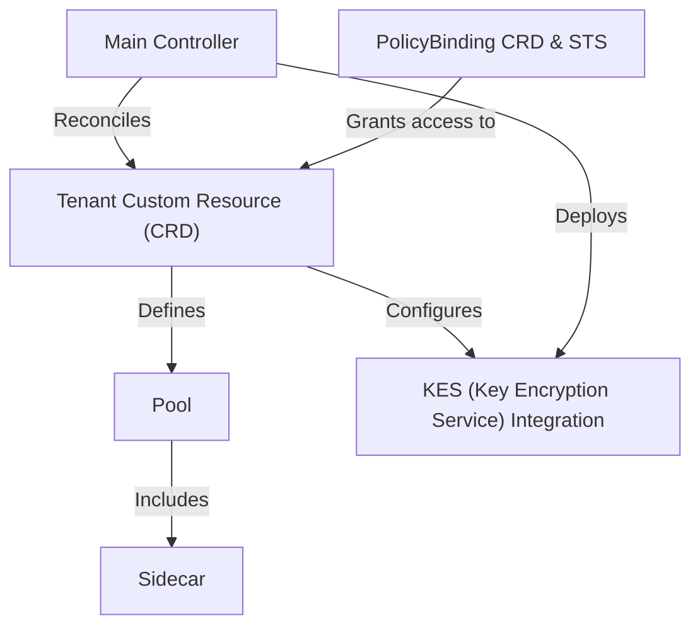

# Tutorial: operator

The MinIO Operator is a powerful tool for Kubernetes that simplifies deploying and managing *MinIO object storage*. Users define a **`Tenant`** custom resource, which acts as a blueprint for a complete storage cluster. The operator's main **`Controller`** then automatically builds and maintains all the necessary Kubernetes components, automating complex tasks like scaling, security, and encryption.

**Source Repository:** [None](None)

## Chapters

1. [Tenant Custom Resource (CRD)
](01_tenant_custom_resource__crd__.md)
2. [Pool
](02_pool_.md)
3. [Main Controller
](03_main_controller_.md)
4. [PolicyBinding CRD & STS
](04_policybinding_crd___sts_.md)
5. [KES (Key Encryption Service) Integration
](05_kes__key_encryption_service__integration_.md)
6. [Sidecar
](06_sidecar_.md)

---

Generated by [AI Codebase Knowledge Builder](https://github.com/The-Pocket/Tutorial-Codebase-Knowledge)