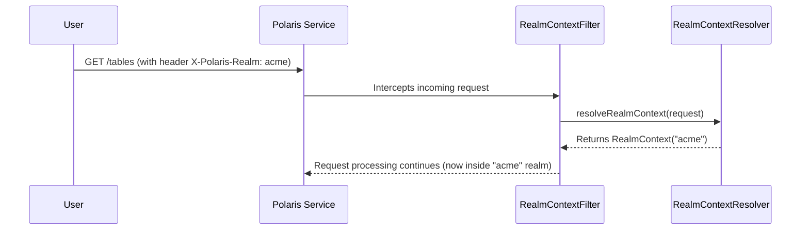

# Chapter 1: Realm and Call Context

Welcome to the Polaris tutorial! We're excited to have you on board. This first chapter introduces the most fundamental concept in Polaris: how it manages and isolates different environments or organizations. Let's dive in!

### The Problem: Sharing a Service Without Sharing Data

Imagine you are building a data service for two different companies, "Acme Corp" and "Globex Inc." Both companies need to store their own private data tables. You want to run a *single* Polaris instance to serve both of them, but you absolutely must ensure that Acme Corp can *never* see or modify Globex Inc.'s data, and vice-versa.

This is a classic problem called **multi-tenancy**. How do you build a system where multiple tenants (in this case, Acme and Globex) can share the same application, but their data and operations are completely isolated as if they were running on separate machines?

Polaris solves this with two core concepts: the **Realm** and the **Call Context**.

### Key Concepts: The Office Building Analogy

To make this easy to understand, let's use an analogy.

*   A **`RealmContext`** is like a separate, isolated **office building** for a specific tenant. Acme Corp gets its own building, and Globex Inc. gets another. Everything inside Acme's building—its files, employees, and meeting rooms—belongs only to Acme.

*   A **`CallContext`** is like a temporary **access badge** for a single visit (a single API request). When someone from Acme wants to access their data, they are given a badge that is only valid for the "Acme Corp" building. This badge holds information about:
    *   **Who is visiting?** (The user or service making the request).
    *   **Which building are they in?** (The `RealmContext`).
    *   **What are they trying to do?** (The specific API request, e.g., "list all tables").

Every single action you perform in Polaris happens within the context of a specific "building" (Realm) using a specific "access badge" (Call Context). This is how Polaris guarantees that Globex can't accidentally wander into Acme's office.

#### The `RealmContext`: Your Isolated Universe

The `RealmContext` is a very simple object. Its main job is to hold the unique name of the realm, or the "name of the office building."

```java
// From: polaris-core/src/main/java/org/apache/polaris/core/context/RealmContext.java

/**
 * Represents the elements of a REST request associated with routing
 * to independent and isolated "universes".
 */
public interface RealmContext {
  String getRealmIdentifier();
}
```
This interface is simple but powerful. If `getRealmIdentifier()` returns `"acme"`, Polaris knows that every subsequent operation for this request must happen inside the "acme" universe.

#### The `CallContext`: Your Access Badge for a Single Request

The `CallContext` holds everything needed to process one specific API request. Most importantly, it holds onto the `RealmContext`.

```java
// From: polaris-core/src/main/java/org/apache/polaris/core/context/CallContext.java

/**
 * Stores elements associated with an individual REST request such as
 * RealmContext, caller identity/role, etc.
 */
public interface CallContext {
  // ... other methods
  RealmContext getRealmContext();
}
```
When a request comes in, Polaris creates a `CallContext`. The first thing it does is figure out the `RealmContext` (which building to enter). Then, it handles things like who the user is. This `CallContext` is then passed along to every other part of the system for that request.

### How It Works: A Request's Journey

Let's follow a request from an Acme Corp user who wants to list their tables.

1.  The user's application sends an HTTP request to Polaris. To specify which realm it's for, it includes a special header. For example:
    ```http
    GET /api/v1/tables
    Host: polaris.service.io
    X-Polaris-Realm: acme
    Authorization: Bearer <token>
    ```

2.  Polaris receives this request. Before it does anything else, it needs to figure out the realm.

3.  A component called `RealmContextFilter` intercepts the request. Think of it as the main security gate for the entire office park.

4.  The `RealmContextFilter` asks a `RealmContextResolver` to inspect the request and find the realm ID. The resolver is like a detective who looks for clues, and in this case, the clue is the `X-Polaris-Realm` header.

5.  The resolver reports back: "The realm is `acme`."

6.  The filter then creates a `RealmContext` for "acme" and attaches it to the request's context.

From this point on, every operation for this request—from checking permissions to listing tables—knows it is operating *only* within the "acme" realm.

Here is a simple diagram of that flow:



### Under the Hood: Code and Configuration

Now let's look at some of the actual code and configuration that makes this happen.

#### 1. Configuration

First, you need to tell Polaris which realms exist. You do this in your configuration file (e.g., `application.properties`).

```properties
# A list of all supported realms. The first one is the default.
polaris.realm-context.realms=acme,globex

# The HTTP header name to look for the realm identifier.
polaris.realm-context.header-name=X-Polaris-Realm

# Whether to reject requests that are missing the realm header.
polaris.realm-context.require-header=true

# The type of resolver to use. 'header' is the most common.
polaris.realm-context.type=header
```
This configuration tells Polaris:
*   There are two valid realms: `acme` and `globex`.
*   Look for the realm name in the `X-Polaris-Realm` HTTP header.
*   If that header is missing, reject the request.

This is powered by the `RealmContextConfiguration` interface.

```java
// From: runtime/service/src/main/java/org/apache/polaris/service/context/RealmContextConfiguration.java
@ConfigMapping(prefix = "polaris.realm-context")
public interface RealmContextConfiguration {
  @Size(min = 1)
  List<String> realms();

  String headerName();
  // ... other settings
}
```

#### 2. The Filter

The `RealmContextFilter` is the first piece of Polaris code that runs for a request. Its job is to orchestrate the realm resolution.

```java
// From: runtime/service/src/main/java/org/apache/polaris/service/context/RealmContextFilter.java
public class RealmContextFilter {
  // The resolver is injected automatically
  @Inject RealmContextResolver realmContextResolver;

  @ServerRequestFilter // This makes it run for every request
  public Uni<Response> resolveRealmContext(ContainerRequestContext rc) {
    // 1. Call the resolver to figure out the realm
    return Uni.createFrom()
        .completionStage(() -> realmContextResolver.resolveRealmContext(...))
        // 2. If successful, save the realm context for later use
        .invoke(realmContext -> rc.setProperty("realmContext", realmContext))
        // ... error handling
  }
}
```
This code snippet shows the filter's main responsibility: it uses the injected `realmContextResolver` to get the `RealmContext` and then stores it so other parts of the application can access it.

### Conclusion

You've just learned the most important concept for supporting multi-tenancy in Polaris!

*   **`RealmContext`** provides the fundamental isolation between tenants, like separate office buildings.
*   **`CallContext`** carries the `RealmContext` and other user information for a single request, like a temporary access badge.
*   This is all determined at the very beginning of an API request, ensuring every subsequent action is securely scoped to the correct tenant.

Now that we understand how Polaris keeps different tenants' worlds separate, let's look at the fundamental building blocks you'll be working with inside each of those worlds.

Next up: [Chapter 2: Polaris Entity](02_polaris_entity_.md)

---

Generated by [AI Codebase Knowledge Builder](https://github.com/The-Pocket/Tutorial-Codebase-Knowledge)