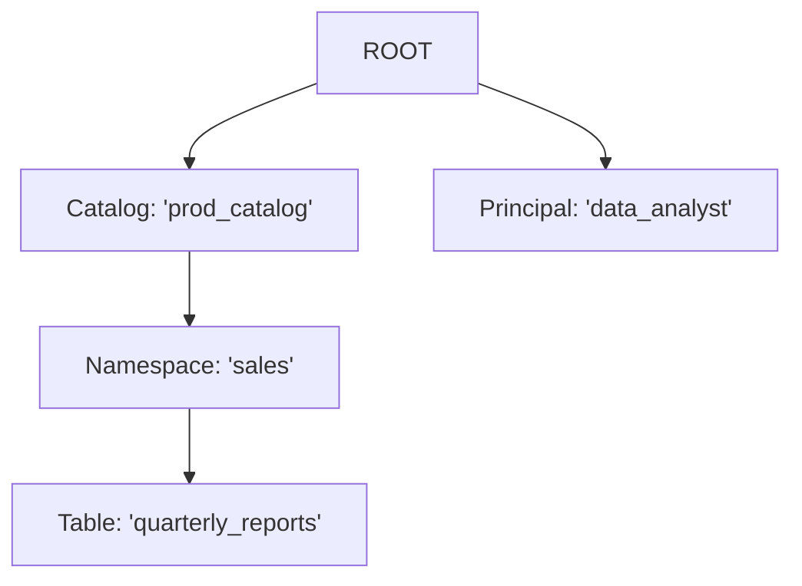

# Chapter 2: Polaris Entity

In the [previous chapter on Realm and Call Context](01_realm_and_call_context_.md), we learned how Polaris creates separate, isolated "office buildings" (Realms) for different tenants. Now, let's step inside one of those buildings and look at how everything is organized.

### The Problem: Organizing Different Kinds of Information

Inside our "Acme Corp" realm, we need to manage many different kinds of things:
*   A **catalog** to hold our data, let's call it `prod_catalog`.
*   A **namespace** (like a database schema) inside that catalog, called `sales`.
*   A **table** inside that namespace, called `quarterly_reports`.
*   A **principal** (a user or application) that needs to access this data, named `data_analyst`.

How can Polaris handle all these different objects—data containers, schemas, and users—in a consistent way? If they were all treated differently, the code for listing them, securing them, and managing them would become incredibly complex.

Polaris solves this with a simple, elegant concept: the **`PolarisEntity`**.

### Key Concept: The Universal Blueprint

Think of a `PolarisEntity` as a **universal blueprint** or a standard filing folder. It doesn't matter what you put *inside* the folder (table details, user information, etc.); every folder itself has the same basic properties:
*   A unique **ID tag** (`id`).
*   A **name** written on the tab (`name`).
*   A location telling you which drawer it's in (its `parentId`).
*   A **type** stamp indicating if it's a "Catalog" folder, a "Table" folder, or a "User" folder.

Every single thing managed by Polaris—catalogs, namespaces, tables, and principals—is a `PolarisEntity`. This common structure is the foundation that allows Polaris to handle metadata, permissions, and relationships consistently across the entire system.

### The Entity Hierarchy: A Digital Filing Cabinet

Because every entity has a `parentId`, we can organize them into a hierarchy, just like a filing cabinet or a folder structure on your computer.

The very top of this hierarchy is a special, invisible entity called `ROOT`. Everything else lives under it.

Let's visualize the structure for our "Acme Corp" example:



*   The `prod_catalog`'s parent is `ROOT`.
*   The `data_analyst` principal's parent is also `ROOT`.
*   The `sales` namespace's parent is the `prod_catalog` entity.
*   The `quarterly_reports` table's parent is the `sales` namespace entity.

This clear, tree-like structure makes it easy to navigate and manage relationships between objects.

### Under the Hood: The Code

Let's look at how this blueprint is defined in the code. The core fields are found in `PolarisBaseEntity`.

#### 1. The Core Blueprint: `PolarisBaseEntity.java`

This class defines the common properties shared by everything. Here is a simplified view of its most important fields.

```java
// From: polaris-core/src/main/java/org/apache/polaris/core/entity/PolarisBaseEntity.java

public class PolarisBaseEntity extends PolarisEntityCore {
  // A unique number for this entity
  protected final long id;

  // The ID of the entity that contains this one
  protected final long parentId;

  // The name of the entity, e.g., "sales"
  protected final String name;

  // A code representing the type (e.g., CATALOG, NAMESPACE)
  protected final int typeCode;

  // ... other properties like timestamps and version ...
}
```
This simple structure is the heart of every object in Polaris.

#### 2. Defining Entity Types: `PolarisEntityType.java`

How does Polaris know what `typeCode` means? It uses an `enum` to define all the possible types of entities.

```java
// From: polaris-core/src/main/java/org/apache/polaris/core/entity/PolarisEntityType.java

public enum PolarisEntityType {
  ROOT(1, ...),
  PRINCIPAL(2, ...),    // Represents a user or application
  CATALOG(4, ...),      // A top-level data container
  NAMESPACE(6, ...),    // A schema or database
  TABLE_LIKE(7, ...);   // A table, view, etc.

  private final int code;
  // ...
}
```
When we create a new entity, we assign it one of these types. This tells Polaris how to treat the object and where it fits in the hierarchy.

#### 3. Creating Specialized Entities

While the base `PolarisEntity` provides the common structure, we have specialized classes for each type that add specific details.

For example, when creating a **Principal**, we need to store a `clientId`. The `PrincipalEntity` class handles this.

```java
// From: polaris-core/src/main/java/org/apache/polaris/core/entity/PrincipalEntity.java

public class PrincipalEntity extends PolarisEntity {

  // A method to get a principal-specific property
  public String getClientId() {
    // Looks inside a map of properties for the client ID
    return getInternalPropertiesAsMap().get("clientId");
  }

  public static class Builder extends PolarisEntity.BaseBuilder<...> {
    public Builder() {
      super();
      // Important: Sets the type for this blueprint!
      setType(PolarisEntityType.PRINCIPAL);
    }
    // ...
  }
}
```
Notice how the `Builder` immediately sets the `type` to `PRINCIPAL`. This "stamps" the folder with the correct type.

Similarly, a `CatalogEntity` has its own specific details, like a default storage location.

```java
// From: polaris-core/src/main/java/org/apache/polaris/core/entity/CatalogEntity.java

public class CatalogEntity extends PolarisEntity {

  // A method to get a catalog-specific property
  public String getBaseLocation() {
    return getPropertiesAsMap().get("default-base-location");
  }

  public static class Builder extends PolarisEntity.BaseBuilder<...> {
    public Builder() {
      super();
      // Sets the type for this blueprint
      setType(PolarisEntityType.CATALOG);
    }
    // ...
  }
}
```
By extending the same base `PolarisEntity`, both `PrincipalEntity` and `CatalogEntity` get the common features (`id`, `name`, `parentId`) for free, while also adding their own specialized information.

### Why This Matters

This "universal blueprint" approach is incredibly powerful. Because everything is an entity, we can build features that work on *any* type of object.
*   **Permissions:** We can create a [Polaris Policy](06_polaris_policy_.md) that grants a `PrincipalEntity` access to a `CatalogEntity` or a `TableEntity` using the same underlying security model.
*   **Auditing:** We can log changes to any entity in a standardized way.
*   **API Design:** Our APIs can be more consistent, whether you are fetching a list of users or a list of tables.

### Conclusion

You've now learned about the fundamental data model in Polaris:

*   The **`PolarisEntity`** is the universal blueprint for all manageable objects.
*   Every entity shares common properties like `id`, `name`, and `parentId`, which creates a **hierarchy**.
*   This common structure allows for consistent management of metadata, permissions, and relationships across the entire system.

Now that we understand what the building blocks *are*, the next logical step is to learn how we control who can see and use them.

Next up: [Chapter 3: Authentication and Authorization](03_authentication_and_authorization_.md)

---

Generated by [AI Codebase Knowledge Builder](https://github.com/The-Pocket/Tutorial-Codebase-Knowledge)