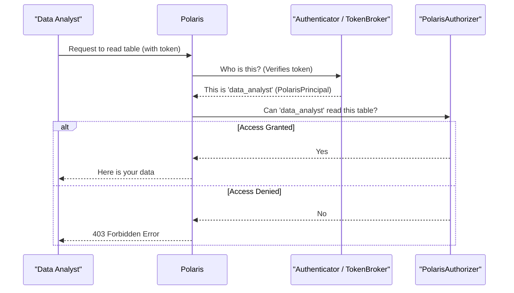

# Chapter 3: Authentication and Authorization

In the [previous chapter on Polaris Entity](02_polaris_entity_.md), we learned that everything in Polaris, from catalogs to users, is a standardized `PolarisEntity`. Now that we have these building blocks, we need to control who can access and modify them. It's time to meet Polaris's security guard!

### The Problem: Guarding the Data

Let's go back to our "Acme Corp" realm. We have a `PrincipalEntity` named `data_analyst` and a `TableEntity` called `quarterly_reports`. The `data_analyst` needs to run a query to read data from that table.

This raises two critical security questions:
1.  **Authentication**: How do we know the person making the request is *actually* the `data_analyst`? What if it's an imposter?
2.  **Authorization**: Once we've confirmed their identity, how do we know the `data_analyst` is *allowed* to read the `quarterly_reports` table? What if they should only be able to see the `marketing_campaigns` table?

Polaris solves this with a two-step security check that works just like a security guard at a high-tech facility.

### Key Concepts: The Two-Step Security Check

Imagine you're trying to enter a secure room in an office building.

1.  **Authentication (Checking your ID)**: First, the guard asks for your ID badge. They scan it to make sure it's a valid, unexpired badge issued by the company. This step is about verifying **who you are**.
2.  **Authorization (Checking your permissions)**: After confirming your identity, the guard checks a list on a clipboard. This list says which rooms your specific ID is cleared to enter. This step is about verifying **what you are allowed to do**.

Polaris has components that map directly to this analogy:

*   **`Authenticator` & `TokenBroker`**: These are like the ID scanner and the system that issues badges. The `TokenBroker` creates and validates access tokens (your ID badge), and the `Authenticator` uses them to confirm your identity.
*   **`PolarisPrincipal`**: This is your confirmed identity after the ID check. It's an object that says, "Yes, this is definitely the `data_analyst`."
*   **`PolarisAuthorizer`**: This is the guard's clipboard. It holds all the rules and policies. It takes your confirmed identity (`PolarisPrincipal`) and the action you want to perform (e.g., "read table `quarterly_reports`") and gives a simple "yes" or "no" answer.

### How It Works: A Request's Security Journey

Let's follow the `data_analyst`'s request to read the table.

1.  **The Request**: The analyst's tool sends a request to Polaris. This request includes a special "Bearer Token" in the header, which is their digital ID badge.
    ```http
    GET /api/v1/catalogs/prod_catalog/namespaces/sales/tables/quarterly_reports
    X-Polaris-Realm: acme
    Authorization: Bearer <some_long_encrypted_token>
    ```

2.  **Authentication**: Polaris's first stop is the security desk.
    *   It hands the token to the `TokenBroker` to check if it's valid and not tampered with.
    *   If the token is good, the `Authenticator` creates a `PolarisPrincipal` object representing the `data_analyst`.

3.  **Authorization**: Now that Polaris knows who is asking, it goes to the `PolarisAuthorizer`.
    *   It asks, "Is this `PolarisPrincipal` (the `data_analyst`) allowed to perform the `TABLE_READ_DATA` action on the `quarterly_reports` entity?"
    *   The `PolarisAuthorizer` checks its rulebook (which we'll explore in the [Polaris Policy](06_polaris_policy_.md) chapter).

4.  **The Decision**:
    *   If the authorizer says "yes," the request proceeds, and the data is returned.
    *   If the authorizer says "no," Polaris immediately stops and sends back a `403 Forbidden` error.

Here is a diagram of that flow:



### Under the Hood: The Code

Let's peek at the interfaces that define this security system.

#### 1. Authentication: The `Authenticator`

The `Authenticator`'s job is simple: take some credentials and, if they are valid, return a verified principal.

```java
// From: runtime/service/src/main/java/org/apache/polaris/service/auth/Authenticator.java

public interface Authenticator {
  /**
   * Authenticates the given credentials and returns
   * an authenticated PolarisPrincipal.
   */
  PolarisPrincipal authenticate(PolarisCredential credentials)
      throws NotAuthorizedException;
}
```
This is the heart of the identity check. An implementation of this interface would contain the logic to validate a password, check a token's signature, or connect to an external identity provider.

#### 2. The Result of Authentication: `PolarisPrincipal`

Once authentication succeeds, we get a `PolarisPrincipal`. This object securely represents the user for the rest of the request.

```java
// From: polaris-core/src/main/java/org/apache/polaris/core/auth/PolarisPrincipal.java

public interface PolarisPrincipal extends Principal {
  // The unique ID of the principal entity
  long getId();

  // The name of the principal, e.g., "data_analyst"
  @Override
  String getName();

  // Any roles the principal has, e.g., "analyst_role"
  Set<String> getRoles();
}
```
This object is then passed to the authorizer to make access decisions.

#### 3. Authorization: The `PolarisAuthorizer`

The `PolarisAuthorizer` is the final checkpoint. Its main job is to answer the "is this allowed?" question. If the action is *not* allowed, it throws an exception to stop the process cold.

```java
// From: polaris-core/src/main/java/org/apache/polaris/core/auth/PolarisAuthorizer.java

public interface PolarisAuthorizer {
  /**
   * Checks if the principal is authorized to perform an operation.
   * Throws an exception if not authorized.
   */
  void authorizeOrThrow(
      @Nonnull PolarisPrincipal polarisPrincipal,
      // ... other arguments about the operation ...
      @Nonnull PolarisAuthorizableOperation authzOp,
      @Nullable PolarisResolvedPathWrapper target);
}
```
The `authorizeOrThrow` method is the gatekeeper for every protected action in Polaris.

#### How Authorization Works Hierarchically

A key feature of `PolarisAuthorizerImpl` is that it understands the entity hierarchy from Chapter 2. Imagine you want to check if the `data_analyst` can read the `quarterly_reports` table. The authorizer is smart enough to check permissions in order:

1.  Does the `data_analyst` have permission on the `quarterly_reports` **table itself**?
2.  If not, do they have permission on its parent, the `sales` **namespace**? (Permission on a namespace often implies permission for all tables inside it).
3.  If not, do they have permission on the `prod_catalog` **catalog**? (Permission on a catalog is very powerful).

This hierarchical check, performed by a method called `hasTransitivePrivilege`, makes managing permissions much simpler. You can grant broad access at a high level (the catalog) or fine-grained access at a low level (a specific table).

### Conclusion

You've just learned how Polaris secures every single request using a robust, two-step process:

*   **Authentication** answers "Who are you?" using components like `Authenticator` and `TokenBroker` to produce a verified `PolarisPrincipal`.
*   **Authorization** answers "What can you do?" using the `PolarisAuthorizer` to check the principal's permissions against the requested action.

This clear separation of concerns ensures that Polaris is secure by default, protecting your data from unauthorized access.

Now that we understand how requests are secured, let's look at the layer that receives the HTTP requests and orchestrates these checks.

Next up: [Chapter 4: REST API Layer (Adapters & Handlers)](04_rest_api_layer__adapters___handlers__.md)

---

Generated by [AI Codebase Knowledge Builder](https://github.com/The-Pocket/Tutorial-Codebase-Knowledge)