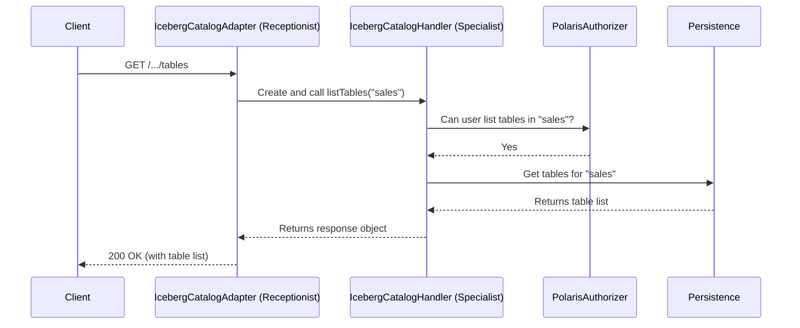

# Chapter 4: REST API Layer (Adapters & Handlers)

In the [previous chapter on Authentication and Authorization](03_authentication_and_authorization_.md), we learned how Polaris's security guard checks a user's ID and permissions before letting them proceed. Now that our authenticated user is inside the building, they need to actually ask for something to be done. They need to go to the reception desk.

### The Problem: From a Web Request to a Real Action

A client, like a Spark job, doesn't speak in terms of Java objects like `PolarisEntity` or `PolarisPrincipal`. It speaks the language of the web: HTTP. It sends a simple request like this:

```http
GET /v1/prod_catalog/namespaces/sales/tables
Host: polaris.service.io
Authorization: Bearer <token>
X-Polaris-Realm: acme
```

How does Polaris translate this raw text-based request into a secure, specific action like "list all the tables in the `sales` namespace for the `acme` realm"? How does it know which part of its code should handle this task versus, say, a request to create a new user?

This is the job of the REST API Layer, which acts as the service's public-facing "reception desk."

### Key Concepts: The Reception Desk Analogy

Let's imagine our Polaris service is a large company office.

*   **The OpenAPI Specification:** This is like the **directory board** in the lobby. It lists all the services the company offers (`listTables`, `createPrincipal`, `getCatalog`, etc.) and the exact format you must use to ask for them (e.g., "Go to the `/v1/.../tables` desk"). Polaris has two main API specifications: one for data operations (`polaris-catalog-service.yaml`) and one for management (`polaris-management-service.yml`).

*   **The Adapter (`IcebergCatalogAdapter`):** This is the **receptionist**. Their job is to greet the visitor (the HTTP request), understand what they're asking for based on the directory, and route them to the right department. The adapter handles all the messy details of HTTP, like parsing URLs and headers.

*   **The Handler (`IcebergCatalogHandler`, `PolarisAdminService`):** These are the **specialist departments**. The `IcebergCatalogHandler` is the "Data Operations Department," and the `PolarisAdminService` is the "Administration Department." Once the receptionist sends a request to them, they perform the actual work. They know the step-by-step process for a task, which always includes a final authorization check before proceeding.

This separation is critical:
*   **Adapters** worry about *how* the request was made (the protocol, HTTP).
*   **Handlers** worry about *what* needs to be done (the business logic).

### How It Works: A Request's Journey to the Right Department

Let's follow our request to list tables as it arrives at Polaris.

1.  **Arrival:** The HTTP `GET /v1/prod_catalog/namespaces/sales/tables` request hits the Polaris service.

2.  **Routing to Reception:** The web framework sees the URL and, based on the OpenAPI spec, knows this request should be handled by the `IcebergCatalogAdapter`—our receptionist.

3.  **The Adapter's Job:** The `IcebergCatalogAdapter`'s `listTables` method is called. It does two things:
    *   It parses the URL to understand the key pieces of information: the prefix is `prod_catalog` and the namespace is `sales`.
    *   It knows this is a data operation, so it creates a new, temporary `IcebergCatalogHandler` (the specialist) to handle the actual work.

4.  **The Handler's Job:** The adapter calls the `listTables` method on the `IcebergCatalogHandler`. The handler now takes over and orchestrates the core logic:
    *   **Final Security Check:** It calls the [PolarisAuthorizer](03_authentication_and_authorization_.md) and asks, "Does this user have `LIST_TABLES` permission on the `sales` namespace?"
    *   **Do the Work:** If authorization passes, it contacts the [Persistence Layer (MetaStoreManager)](10_persistence_layer__metastoremanager__.md) to fetch the list of tables from the database.
    *   **Prepare the Response:** It packages the list of tables into a standard response object.

5.  **Sending the Reply:** The handler returns the response object to the adapter. The adapter then converts this into a final HTTP response with a `200 OK` status and the list of tables in the body, sending it back to the client.

This flow ensures that every request is cleanly translated, properly authorized, and handled by the correct specialist code.



### Under the Hood: Code Examples

Let's look at the code that makes this happen.

#### 1. The OpenAPI Specification (The Directory Board)

The journey starts with the API definition. This snippet from `spec/polaris-catalog-service.yaml` defines the endpoint for listing tables. The web framework uses this to know where to route incoming requests.

```yaml
# From: spec/polaris-catalog-service.yaml
paths:
  /v1/{prefix}/namespaces/{namespace}/tables:
    get:
      operationId: listTables
      description: List all tables in a namespace
      # ... parameters and responses
```
This tells Polaris that any `GET` request matching this path pattern should be sent to the method named `listTables`.

#### 2. The Adapter (The Receptionist)

The `IcebergCatalogAdapter` has the `listTables` method. Its main job is to set up the handler and delegate the work.

```java
// From: runtime/service/src/main/java/org/apache/polaris/service/catalog/iceberg/IcebergCatalogAdapter.java

@RequestScoped // A new adapter is created for each request
public class IcebergCatalogAdapter {

  public Response listTables(String prefix, String namespace, ...) {
    Namespace ns = decodeNamespace(namespace);
    // The 'withCatalog' helper creates the handler for us
    return withCatalog(
        securityContext,
        prefix,
        // Delegate the actual work to the handler
        catalog -> Response.ok(catalog.listTables(ns, ...)).build());
  }
}
```
Notice how little business logic is here. The adapter's role is purely translation and delegation. It calls the `withCatalog` helper, which creates an `IcebergCatalogHandler` and passes the work to it.

#### 3. The Handler (The Specialist)

The `IcebergCatalogHandler` contains the real step-by-step logic. It's where security is checked and data is fetched.

```java
// From: runtime/service/src/main/java/org/apache/polaris/service/catalog/iceberg/IcebergCatalogHandler.java

public class IcebergCatalogHandler {

  public ListTablesResponse listTables(Namespace namespace, ...) {
    // 1. Perform the final, specific authorization check
    authorizeBasicNamespaceOperationOrThrow(
        PolarisAuthorizableOperation.LIST_TABLES, namespace);

    // 2. If authorized, do the actual work
    Page<TableIdentifier> results = polarisCatalog.listTables(namespace, ...);
    
    // 3. Build and return the response
    return ListTablesResponse.builder().addAll(results.items()).build();
  }
}
```
This code is much more focused. It first calls `authorize...OrThrow` to check permissions, and only then does it proceed to `listTables` on the underlying catalog object, which interacts with the persistence layer.

#### Handling a Different Request: `PolarisAdminService`

What about a request to manage users? That goes to a different specialist. A request like `GET /principals` would be routed to the `PolarisAdminService`.

```java
// From: runtime/service/src/main/java/org/apache/polaris/service/admin/PolarisAdminService.java

@RequestScoped
public class PolarisAdminService {

  public List<Principal> listPrincipals() {
    // 1. Authorize the "list principals" operation on the root level
    authorizeBasicRootOperationOrThrow(
        PolarisAuthorizableOperation.LIST_PRINCIPALS);

    // 2. Load all principal entities from the metastore
    return metaStoreManager
        .loadEntitiesAll(...)
        // ... mapping logic
        .toList();
  }
}
```
The pattern is the same: the handler first authorizes the specific action, then performs the core business logic. This consistent structure makes the codebase easy to understand and secure.

### Conclusion

You've now seen how Polaris's "reception desk"—the REST API Layer—works!

*   **OpenAPI specs** define the public API contract.
*   **Adapters** act like receptionists, translating incoming HTTP requests into method calls.
*   **Handlers** are the specialists that contain the actual business logic, orchestrating authorization and data persistence for each request.

This clean separation keeps the code organized and ensures that every action is properly secured. So far, we've focused on how the Polaris *service* works. In the next chapter, we'll switch perspectives and see how a *client* uses this API.

Next up: [Chapter 5: Spark Catalog Plugin](05_spark_catalog_plugin_.md)

---

Generated by [AI Codebase Knowledge Builder](https://github.com/The-Pocket/Tutorial-Codebase-Knowledge)