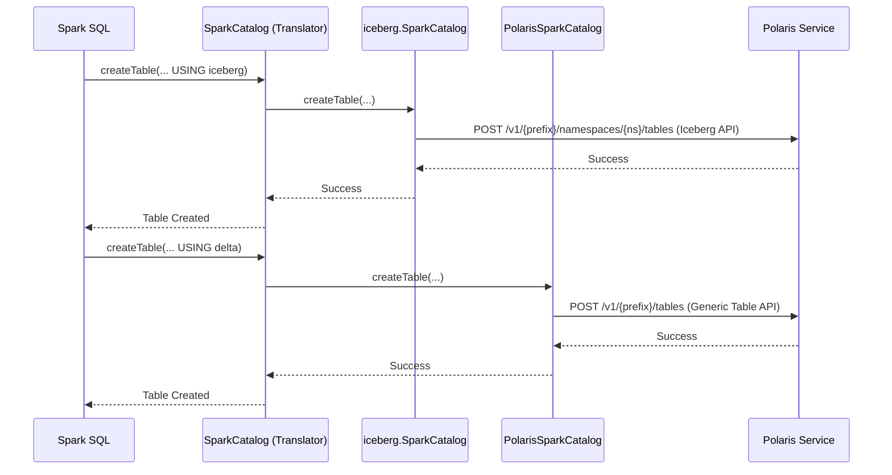

# Chapter 5: Spark Catalog Plugin

In the [previous chapter on the REST API Layer](04_rest_api_layer__adapters___handlers__.md), we saw how Polaris works like a well-organized office, with a reception desk (Adapters) and specialist departments (Handlers) to process requests. But how do our "customers"—data processing engines like Apache Spark—talk to this office? They don't want to craft raw HTTP requests; they want to speak their own language: SQL.

This chapter introduces the client-side component that makes this seamless communication possible.

### The Problem: Speaking Spark's Language

Imagine you are a data engineer at Acme Corp. Your favorite tool is Apache Spark, and you use it for everything. You want to create a new Delta Lake table to store customer data and an Iceberg table for sales reports. You want to do this using the SQL you already know:

```sql
-- In a Spark shell
CREATE TABLE sales_reports (...) USING iceberg;

CREATE TABLE customer_data (...) USING delta LOCATION '...';
```

How can Spark understand that these commands should be sent to Polaris? And how can Polaris, which has separate API endpoints for Iceberg and other table types, know how to handle each request correctly? We need something in the middle to translate Spark's intentions into specific Polaris API calls.

This is exactly the job of the **Polaris Spark Catalog Plugin**.

### Key Concept: The Universal Translator

Think of the Spark Catalog Plugin as a **universal translator** that lives inside your Spark application.

*   **Spark** speaks its native language, "Spark SQL."
*   **Polaris** understands two different dialects: the "Iceberg REST API" and the "Generic Table REST API" (for things like Delta Lake).
*   The **`SparkCatalog` plugin** listens to what Spark is saying. When it hears a command like `CREATE TABLE`, it looks at the table format (`USING iceberg` or `USING delta`). Based on the format, it translates the command into the correct dialect and sends it to the right Polaris API endpoint.

This translator is smart. It knows that anything related to Iceberg should go to the Iceberg API, while anything for Delta Lake should be translated for the Generic Table API. This makes Polaris a single, unified catalog for all your different table formats right inside Spark.

### How It Works: Connecting Spark to Polaris

Let's see how you would use this translator. First, you need to tell Spark to use it by providing some configuration when you start your Spark session.

#### 1. Configuring Spark

When you launch Spark, you configure a new catalog (let's call it `polaris`) and tell it to use the `org.apache.polaris.spark.SparkCatalog` class.

Here's a simplified example of the configuration:

```shell
# In your spark-shell command or Spark configuration
--conf spark.sql.catalog.polaris=org.apache.polaris.spark.SparkCatalog \
--conf spark.sql.catalog.polaris.uri=http://localhost:8181/api/catalog \
--conf spark.sql.catalog.polaris.credential="root:secret"
```

This tells Spark:
1.  "Create a catalog named `polaris`."
2.  "Use the `SparkCatalog` class as the translator for it."
3.  "The Polaris service (the office) is located at `http://localhost:8181/api/catalog`."
4.  "Here are the credentials to log in."

#### 2. Running SQL Commands

Once Spark is running with this configuration, you can use the `polaris` catalog to manage your tables.

```sql
-- Tell Spark to use our new catalog
USE polaris;

-- Create an Iceberg table
CREATE TABLE my_iceberg_table (id int) USING iceberg;

-- Create a Delta Lake table
CREATE TABLE my_delta_table (name string) USING delta LOCATION 's3://my-bucket/delta/table';
```

When you run these commands, you don't see what's happening behind the scenes. The translator—our `SparkCatalog` plugin—is hard at work, making the right API calls to Polaris for you.

### Under the Hood: The Translation Process

So what does the translator actually do? Let's follow the `CREATE TABLE` command on its journey.

1.  **Spark Receives the Command:** You run your SQL. Spark's engine parses it and understands you want to create a table in the `polaris` catalog.
2.  **Call the Translator:** Spark hands the request over to our `SparkCatalog` plugin's `createTable` method.
3.  **The Routing Decision:** The plugin inspects the `USING` clause.
    *   If it sees `USING iceberg`, it knows this is an Iceberg table. It delegates the request to a standard, built-in Iceberg catalog client.
    *   If it sees `USING delta`, it knows this is a non-Iceberg table. It delegates the request to a special `PolarisSparkCatalog` helper designed for generic tables.
4.  **API Call:** The appropriate helper (Iceberg or Generic) makes the final REST API call to the correct Polaris endpoint.
5.  **Confirmation:** Polaris creates the table's metadata in its [Persistence Layer](10_persistence_layer__metastoremanager__.md) and sends back a success response, which travels all the way back to your Spark shell.

This routing logic is the secret to supporting multiple table formats seamlessly.



#### Code: The Central Router

The core of this logic is in the `SparkCatalog.java` class. Its `createTable` method acts as the central router.

```java
// From: plugins/spark/v3.5/spark/src/main/java/org/apache/polaris/spark/SparkCatalog.java

public Table createTable(Identifier ident, ..., Map<String, String> properties) {
  // Get the table format from the "provider" property, e.g., "iceberg" or "delta"
  String provider = properties.get("provider");

  if (useIceberg(provider)) {
    // If it's Iceberg, delegate to the standard Iceberg catalog helper
    return this.icebergsSparkCatalog.createTable(ident, ...);
  } else {
    // For anything else (like Delta), delegate to our custom Polaris helper
    return this.polarisSparkCatalog.createTable(ident, ...);
  }
}
```
This simple `if/else` block is the brain of the translator. It decides which specialized helper should handle the request based on the table format.

#### Code: The Generic Table Specialist

For non-Iceberg tables, the work is passed to `PolarisSparkCatalog.java`. This class knows how to talk to Polaris's Generic Table API endpoints.

```java
// From: plugins/spark/v3.5/spark/src/main/java/org/apache/polaris/spark/PolarisSparkCatalog.java

public Table createTable(Identifier identifier, ..., Map<String, String> properties) {
  try {
    // Call the underlying Polaris client, which makes the REST API call
    // to the generic table creation endpoint.
    GenericTable genericTable = this.polarisCatalog.createGenericTable(
        identifier,
        format,
        baseLocation,
        ...);
    
    // Convert the API response back into a Spark table object
    return PolarisCatalogUtils.loadSparkTable(genericTable);
  } catch (AlreadyExistsException e) {
    // Handle errors
  }
}
```
This code shows the final step: it calls `createGenericTable`, which triggers the HTTP request to Polaris to register the new Delta table.

### Conclusion

You've just seen how Polaris connects to one of the most popular data processing engines in the world!

*   The **Spark Catalog Plugin** acts as a **universal translator** between Spark SQL and the Polaris REST API.
*   The `SparkCatalog` class is the heart of the plugin, **routing requests** for Iceberg and non-Iceberg (like Delta Lake) tables to different internal helpers.
*   This makes Polaris a **unified catalog**, allowing you to manage multiple table formats from a single Spark environment with the SQL commands you already know.

Now that we can create tables and principals, it's time to learn how we can define fine-grained rules to control who can do what.

Next up: [Chapter 6: Polaris Policy](06_polaris_policy_.md)

---

Generated by [AI Codebase Knowledge Builder](https://github.com/The-Pocket/Tutorial-Codebase-Knowledge)