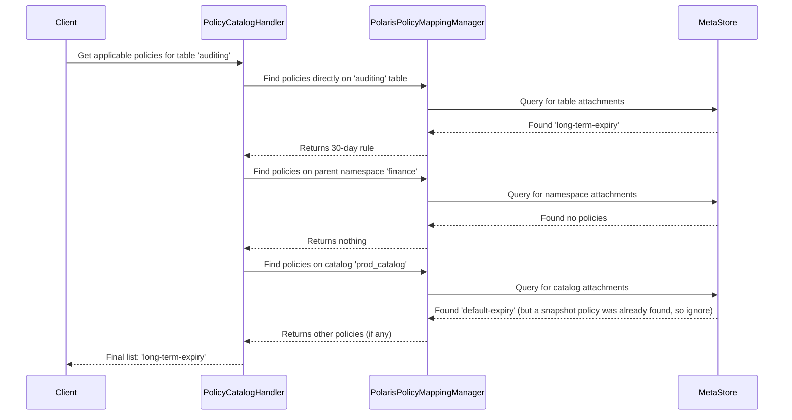

# Chapter 6: Polaris Policy

In the [previous chapter on the Spark Catalog Plugin](05_spark_catalog_plugin_.md), we learned how clients like Spark can create and manage tables in Polaris. But as a data platform grows, simply creating data isn't enough. We need rules to govern it. How do we ensure our data is managed efficiently, consistently, and automatically?

### The Problem: Managing Data Rules at Scale

Imagine you are the data administrator for Acme Corp. Your company has hundreds of tables, and you've been given two important tasks to keep the data platform healthy and cost-effective:
1.  **Compaction**: For performance, small data files in your Iceberg tables should be regularly merged into larger ones. The target file size should be 128MB.
2.  **Expiration**: To save on storage costs, old table snapshots (backups) that are older than 7 days should be automatically deleted.

How would you enforce these rules? Going to each of the hundreds of tables and setting these properties manually would be a nightmare. What if a new table is created? You'd have to remember to configure it too. And what if a specific team needs to keep snapshots for 30 days for their critical `auditing` table? You need a system that is both centralized and flexible.

This is where the **Polaris Policy** engine comes in. It's the central rulebook for your entire data platform.

### Key Concepts: A Company Policy Manual

Think of Polaris Policy like a company's policy manual. It's a structured way to define rules and apply them across the organization.

*   **`PolicyEntity` (The Rule Memo):** This is a single, specific rule written on a memo. For example, a memo titled `weekly-snapshot-cleanup` that says, "Delete snapshots older than 7 days." This memo has two key parts: its **type** and its **content**.

*   **`PolicyType` (The Memo Category):** This is the category of the rule, which tells you what the memo is about and how to read it. For example, a memo could be a `system.snapshot-expiry` type or a `system.data-compaction` type. The type determines the structure of the rules written in the `content`.

*   **Attachment & Inheritance (The Bulletin Board):** You don't just write a rule; you have to post it somewhere for it to take effect. You can "attach" a policy memo to a bulletin board at different levels:
    *   **The Main Company Board (Catalog):** A rule posted here applies to everyone.
    *   **A Department Board (Namespace):** A rule posted here applies to that department. If the department has its own "snapshot expiry" rule, it *overrides* the main company one for that department.
    *   **A Team's Desk (Table):** A rule posted here is the most specific and overrides any department or company-wide rules of the same type.

This hierarchical system means you can set a sensible default for everyone (at the catalog level) and allow for specific exceptions where needed, giving you both central control and local flexibility.

### How It Works: Setting Up a Cleanup Rule

Let's solve our "snapshot expiration" problem. We want a default 7-day expiration policy but a 30-day one for the `auditing` table.

#### 1. Create the Policies

First, we create two policy "memos." These don't do anything yet; they just exist as templates.

**Policy 1: The Default 7-Day Rule**
We send a request to create a policy named `default-expiry`.

```http
POST /v1/prod_catalog/namespaces/default/policies
{
  "name": "default-expiry",
  "type": "system.snapshot-expiry",
  "content": "{ \"max_snapshot_age_days\": 7 }"
}
```

**Policy 2: The Special 30-Day Rule**
Then, we create another policy for the special case.

```http
POST /v1/prod_catalog/namespaces/default/policies
{
  "name": "long-term-expiry",
  "type": "system.snapshot-expiry",
  "content": "{ \"max_snapshot_age_days\": 30 }"
}
```

#### 2. Attach the Policies

Now, we "pin" these memos to the right bulletin boards.

*   We attach the `default-expiry` policy to the entire `prod_catalog`. This makes it the default for every table inside.

    ```http
    PUT /v1/prod_catalog/namespaces/default/policies/default-expiry/mappings
    {
      "target": { "type": "catalog" }
    }
    ```

*   We attach the `long-term-expiry` policy specifically to the `auditing` table.

    ```http
    PUT /v1/prod_catalog/namespaces/default/policies/long-term-expiry/mappings
    {
      "target": { "type": "table-like", "path": ["finance", "auditing"] }
    }
    ```
    *Note: `path` refers to the namespace and table name.*

#### 3. Check the Effective Rules

Now, the system is configured! If a data maintenance job wants to know the rules for a table, it can ask Polaris.

*   **For a regular table like `sales.quarterly_reports`:** Polaris will look at the table, see no policy, then look at its namespace `sales`, see no policy, and finally look at the catalog. It finds the `default-expiry` rule. **Result: 7 days.**
*   **For the `finance.auditing` table:** Polaris looks at the table and immediately finds the `long-term-expiry` rule attached. It stops searching and uses this one. **Result: 30 days.**

This is the power of inheritance and overrides in action!

### Under the Hood: Finding the Right Policy

When you ask for the applicable policies on a table, how does Polaris figure out the answer? It walks up the entity hierarchy.

1.  **Request:** A client asks for the policies for the table `finance.auditing`.
2.  **The Handler:** The `PolicyCatalogHandler` receives this request.
3.  **Hierarchy Traversal:** The handler asks the `PolarisPolicyMappingManager`, "What policies are attached *directly* to this table?" It finds our 30-day rule. Since it found a `system.snapshot-expiry` policy, it knows it doesn't need to look any higher for that *type* of policy.
4.  **Keep Looking for Other Types:** It continues walking up to the `finance` namespace and then the `prod_catalog` to look for *other* types of policies (like a `system.data-compaction` policy) that might also apply.
5.  **The Result:** It assembles the final, effective list of policies from all levels and returns it.

Here is a simplified diagram of that search process:



#### The `PolicyEntity` Code

Under the hood, a `PolicyEntity` is just a specialized [Polaris Entity](02_polaris_entity_.md). It stores its crucial information, like the `type` and `content`, in its generic properties map.

```java
// From: polaris-core/src/main/java/org/apache/polaris/core/policy/PolicyEntity.java

public class PolicyEntity extends PolarisEntity {
  public static final String POLICY_TYPE_CODE_KEY = "policy-type-code";
  public static final String POLICY_CONTENT_KEY = "policy-content";

  // ...

  public PolicyType getPolicyType() {
    // Reads the type code from the properties map
    String typeCode = getPropertiesAsMap().get(POLICY_TYPE_CODE_KEY);
    return PolicyType.fromCode(Integer.parseInt(typeCode));
  }

  public String getContent() {
    // Reads the rule content from the properties map
    return getPropertiesAsMap().get(POLICY_CONTENT_KEY);
  }
}
```
This shows how the generic entity model is used to build a powerful, specific feature.

#### The `PolicyType` Code

The `PolicyType` defines what kind of rule it is and, importantly, if it can be inherited. Most system policies are inheritable.

```java
// From: polaris-core/src/main/java/org/apache/polaris/core/policy/PolicyType.java

public interface PolicyType {
  // A unique number for the policy type
  int getCode();

  // The human-readable name, e.g., "system.snapshot-expiry"
  String getName();

  // The key property: can this rule be inherited by children?
  boolean isInheritable();
}
```

#### The Handler Logic

The `PolicyCatalogHandler` orchestrates the process. When you ask to get applicable policies, it first performs a security check to make sure you're allowed to see the resource, then it delegates to the underlying catalog to do the hierarchical lookup.

```java
// From: runtime/service/src/main/java/org/apache/polaris/service/catalog/policy/PolicyCatalogHandler.java

public class PolicyCatalogHandler extends CatalogHandler {
  public GetApplicablePoliciesResponse getApplicablePolicies(
      Namespace namespace, String targetName, PolicyType policyType) {
    // 1. First, check if the user is authorized to view this resource.
    authorizeGetApplicablePoliciesOperationOrThrow(namespace, targetName);

    // 2. If authorized, find all policies by walking the hierarchy.
    return GetApplicablePoliciesResponse.builder()
        .setApplicablePolicies(
            policyCatalog.getApplicablePolicies(namespace, targetName, policyType))
        .build();
  }
}
```

### Conclusion

You've now learned how Polaris's governance engine works!

*   **Polaris Policy** allows you to define operational rules (`PolicyEntity`) for your data.
*   The **`PolicyType`** determines the rule's behavior, such as `system.data-compaction` or `system.snapshot-expiry`.
*   Policies are applied through a powerful **hierarchical and inheritable** system, allowing you to set broad defaults at the catalog or namespace level and override them with specific exceptions on individual tables.

This system provides a scalable and flexible way to enforce data governance and lifecycle management across your entire platform. So far, we've been thinking about rules inside a single catalog. But what if your organization uses more than one?

Next up: [Chapter 7: Catalog Federation](07_catalog_federation_.md)

---

Generated by [AI Codebase Knowledge Builder](https://github.com/The-Pocket/Tutorial-Codebase-Knowledge)