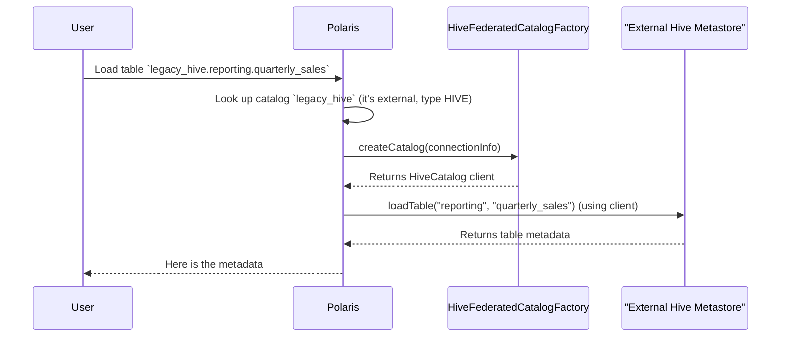

# Chapter 7: Catalog Federation

In the [previous chapter on Polaris Policy](06_polaris_policy_.md), we learned how to set up rules to govern the data stored inside a Polaris catalog. But what if your data isn't all in one place? In a large organization, data often lives in many different systems built over many years.

### The Problem: Too Many Remote Controls

Imagine your company, Acme Corp, has a long history.
*   You have a brand new Iceberg data lake managed by Polaris.
*   You also have a critical, ten-year-old **Hive Metastore** that contains thousands of important tables.
*   To make things even more interesting, another department just set up their own separate **Iceberg REST catalog** for a special project.

Your data engineers are frustrated. To find a table, they have to remember which system it's in. They have to switch between different tools and configurations to talk to each catalog. It's like having three different remote controls for your TV, sound system, and streaming box. You just want to press one "play" button!

How can we provide a single, unified view of all this data, so it feels like it's all in one place?

This is the problem that **Catalog Federation** solves. It turns Polaris into a **universal remote** for all your data catalogs.

### Key Concepts: The Universal Remote Analogy

Let's stick with our remote control analogy.

*   **Polaris as the Universal Remote:** Instead of just controlling its own "device" (its internal storage), Polaris can be programmed to control other devices.

*   **External Catalogs (The Devices):** Your Hive Metastore and the other Iceberg catalog are like your TV and your sound system. They are separate devices that speak their own languages.

*   **`ExternalCatalogFactory` (The Setup Code):** When you set up a universal remote, you enter a code for your TV's brand (e.g., "Sony," "Samsung"). The remote then knows which signals to send. An `ExternalCatalogFactory` is like that setup code. Polaris has a `HiveFederatedCatalogFactory` that knows how to "speak Hive" and an `IcebergRESTExternalCatalogFactory` that knows how to "speak Iceberg REST."

When a request comes into Polaris for a table in the Hive Metastore, Polaris looks up the right "setup code" (the factory), creates the correct temporary remote control (a Hive client), and uses it to forward the request.

### How It Works: Accessing a Hive Table Through Polaris

Let's see how an administrator would set this up and how a user would benefit.

#### 1. Registering the External Catalog

First, an admin tells Polaris about the old Hive Metastore. They make an API call to create a new catalog entry named `legacy_hive`, but they mark it as an `EXTERNAL` catalog and provide the connection details.

This is like telling your universal remote: "I'm adding a new device. It's a TV, and its address is `thrift://hive-meta.acme.com:9083`."

#### 2. Querying Through Polaris

Now, a data engineer using Spark can connect *only* to Polaris. To them, the Hive tables just look like they are inside Polaris.

```sql
-- The user is connected only to the 'polaris' catalog in Spark
USE polaris.legacy_hive.reporting;

-- This query looks simple, but behind the scenes, a lot is happening!
SELECT * FROM quarterly_sales LIMIT 10;
```

The user doesn't need to know or care that `quarterly_sales` actually lives in a separate Hive Metastore. Polaris handles all the translation and forwarding automatically. The user gets one simple, unified experience.

### Under the Hood: The Journey of a Federated Request

Let's trace that `SELECT` query to see how the magic happens.

1.  **Request Arrives:** Polaris receives a request: "Get me the metadata for the table `legacy_hive.reporting.quarterly_sales`."
2.  **Catalog Lookup:** The [REST API Layer](04_rest_api_layer__adapters___handlers__.md) looks up the catalog named `legacy_hive`. It sees that this is an **external** catalog of type `HIVE`.
3.  **Find the Right Factory:** Polaris now needs to find the right "setup code." It looks for a registered `ExternalCatalogFactory` that can handle the `HIVE` type. It finds the `HiveFederatedCatalogFactory`.
4.  **Create the Client:** Polaris calls the `createCatalog` method on this factory, passing it the connection details for `legacy_hive` (like the thrift URI). The factory returns a specialized `HiveCatalog` client object—a temporary remote control programmed to talk to our specific Hive Metastore.
5.  **Forward the Request:** Polaris now uses this newly created `HiveCatalog` client to call its `loadTable` method. The client connects directly to the Hive Metastore, fetches the metadata for `quarterly_sales`, and returns it to Polaris.
6.  **Return to User:** Polaris takes the metadata it received from Hive and sends it back to the user's Spark job.

To the user, it was a single, seamless interaction.



### Under the Hood: The Code

Let's look at the key interfaces and classes that enable this.

#### 1. The Universal Factory Blueprint: `ExternalCatalogFactory`

This is the core interface. Any class that wants to teach Polaris how to talk to a new type of external catalog must implement this. It has one main job: create a catalog client.

```java
// From: polaris-core/src/main/java/org/apache/polaris/core/catalog/ExternalCatalogFactory.java
public interface ExternalCatalogFactory {

  /**
   * Creates a catalog handle for the given connection configuration.
   */
  Catalog createCatalog(
      ConnectionConfigInfoDpo connectionConfig,
      UserSecretsManager userSecretsManager);
  
  // ... a similar method for generic tables
}
```
This simple interface is the contract for every "setup code" plugin.

#### 2. The Hive Factory: `HiveFederatedCatalogFactory`

This is the implementation for our Hive Metastore. The most important part is the `@Identifier` annotation. This is how Polaris knows this factory is the one to use for `HIVE` type catalogs.

```java
// From: extensions/federation/hive/src/main/java/org/apache/polaris/extensions/federation/hive/HiveFederatedCatalogFactory.java

@ApplicationScoped
@Identifier(ConnectionType.HIVE_FACTORY_IDENTIFIER) // This links it to "HIVE"
public class HiveFederatedCatalogFactory implements ExternalCatalogFactory {

  @Override
  public Catalog createCatalog(ConnectionConfigInfoDpo config, ...) {
    // Create a new HiveCatalog client object
    HiveCatalog hiveCatalog = new HiveCatalog();
    
    // Initialize it with the specific connection properties
    hiveCatalog.initialize("hive", config.asIcebergCatalogProperties(...));

    return hiveCatalog;
  }
  // ...
}
```
This class is the specialist that knows the exact steps to create a functioning client for a Hive Metastore.

#### 3. The Iceberg REST Factory: `IcebergRESTExternalCatalogFactory`

Just to show how the system is extensible, here is the factory for connecting to another Iceberg REST catalog. It follows the exact same pattern but creates a different type of client (`RESTCatalog`).

```java
// From: runtime/service/src/main/java/org/apache/polaris/service/catalog/iceberg/IcebergRESTExternalCatalogFactory.java

@ApplicationScoped
@Identifier(ConnectionType.ICEBERG_REST_FACTORY_IDENTIFIER) // For "ICEBERG_REST"
public class IcebergRESTExternalCatalogFactory implements ExternalCatalogFactory {

  @Override
  public Catalog createCatalog(ConnectionConfigInfoDpo config, ...) {
    // Create and initialize a RESTCatalog client
    RESTCatalog federatedCatalog = new RESTCatalog(...);
    federatedCatalog.initialize("rest", config.asIcebergCatalogProperties(...));
    return federatedCatalog;
  }
  // ...
}
```
By creating new implementations of `ExternalCatalogFactory`, you can teach Polaris to talk to virtually any kind of data catalog.

### Conclusion

You've just learned how Polaris can break down data silos and become a true central hub for all your metadata.

*   **Catalog Federation** turns Polaris into a **universal remote** for multiple, disparate data catalogs like Hive or other Iceberg services.
*   It works by using a plugin system of **`ExternalCatalogFactory`** implementations, each one acting as a "setup code" that knows how to connect to and communicate with a specific type of external catalog.
*   This provides a **unified access point** for users, simplifying data discovery and access across an entire organization, regardless of where the data is physically stored.

Now that we've seen how Polaris can connect to many different systems, we need a way to configure all these details. How do we tell Polaris which realms exist, which factories to use, and where to find the database?

Next up: [Chapter 8: Configuration Management](08_configuration_management_.md)

---

Generated by [AI Codebase Knowledge Builder](https://github.com/The-Pocket/Tutorial-Codebase-Knowledge)