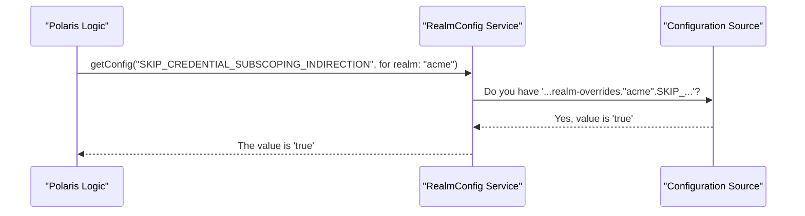

# Chapter 8: Configuration Management

In the [previous chapter on Catalog Federation](07_catalog_federation_.md), we saw how Polaris can connect to external systems like Hive. But how do we enable that feature? How do we tell Polaris where its own database is, or what tenants (realms) it should serve? Every application needs a control panel, and this chapter is all about Polaris's.

### The Problem: One Program, Many Personalities

Imagine you have just downloaded the Polaris server software. It's a single binary file. You need to use this same file in two very different scenarios:

1.  **For Local Testing:** You want to run it on your laptop. You need it to start up quickly, use a simple in-memory database that disappears when you shut it down, and serve a single test realm called `local-dev`.
2.  **For Production:** You need to deploy it to a powerful server. It must connect to a durable PostgreSQL database, handle multiple tenants like `acme` and `globex`, and have all security features turned on.

How can a single program behave so differently without changing its code? It needs a way to read settings from the outside world. This is the job of **Configuration Management**.

### Key Concepts: The Server's Control Panel

Polaris is built on the Quarkus framework, which provides a powerful and flexible configuration system. Think of it as the server's main control panel, with lots of dials and switches you can adjust.

You can change these settings in several ways, and they are applied in a specific order of priority (higher on the list overrides lower):

1.  **System Properties:** (Highest priority) Settings you pass on the command line when starting Java. `java -Dpolaris.persistence.type=in-memory ...`
2.  **Environment Variables:** Settings from your operating system's environment. `export POLARIS_PERSISTENCE_TYPE=in-memory`
3.  **`application.properties` file:** (Most common) A simple text file where you list your settings.

Within Polaris, there are two key types of settings you'll encounter:

*   **`FeatureConfiguration` (The Main Switches):** These are the big, server-wide switches that enable or disable major features. For example, a switch to turn on [Catalog Federation](07_catalog_federation_.md) for the entire server.
*   **`RealmConfig` (Per-Tenant Tweaks):** This is the system that allows you to apply settings on a per-tenant basis. It's how you can have a general rule for everyone, but then create a specific exception for the `acme` realm.

### How It Works: Configuring Your Polaris Server

Let's solve our "local vs. production" problem using a simple `application.properties` file. This is the most common way to configure Polaris.

#### 1. Local Testing Configuration

For your laptop, you would create an `application.properties` file with these settings:

```properties
# Use the simple in-memory database
polaris.persistence.type=in-memory

# Define a single realm for local development
polaris.realm-context.realms=local-dev

# For testing, we might want to disable a security feature
# Note: This is an example property name.
polaris.features.ENFORCE_PRINCIPAL_CREDENTIAL_ROTATION_REQUIRED_CHECKING=false
```

When you start Polaris with this file, it will:
*   Start up without needing an external database.
*   Only accept requests for the `local-dev` realm.
*   Run with the specified security check turned off.

#### 2. Production Configuration

For your production server, your `application.properties` file would look very different:

```properties
# --- Database Settings ---
# Use a durable JDBC database
polaris.persistence.type=relational-jdbc
quarkus.datasource.db-kind=postgresql
quarkus.datasource.username=polaris_user
quarkus.datasource.password=super_secret
quarkus.datasource.jdbc.url=jdbc:postgresql://db.prod.server:5432/polaris

# --- Multi-Tenancy Settings ---
# Define the realms for our production tenants
polaris.realm-context.realms=acme,globex

# --- Feature Switches ---
# Make sure security features are enabled in production
polaris.features.ENFORCE_PRINCIPAL_CREDENTIAL_ROTATION_REQUIRED_CHECKING=true

# Enable the Catalog Federation feature
polaris.features.ENABLE_CATALOG_FEDERATION=true
```

Using this configuration, the *exact same* Polaris program now behaves like a production-grade service.

#### 3. Realm-Specific Overrides

Now, let's get a bit more advanced. What if the `acme` realm is a trusted, internal system, and we want to relax a specific rule just for them? We can use a special syntax for realm overrides.

```properties
# This is a global setting for all realms
polaris.features.SKIP_CREDENTIAL_SUBSCOPING_INDIRECTION=false

# But we want to override it ONLY for the 'acme' realm
polaris.features.realm-overrides."acme".SKIP_CREDENTIAL_SUBSCOPING_INDIRECTION=true
```
This powerful feature allows for fine-grained, per-tenant control over the server's behavior.

### Under the Hood: How a Setting is Read

When a request comes in for the `acme` realm and the code needs to check a feature flag, what happens?

1.  **The Request:** A part of the Polaris code needs to know if it should `SKIP_CREDENTIAL_SUBSCOPING_INDIRECTION`. It asks the `RealmConfig` service for the current realm (`acme`).
2.  **Check for Override:** The `RealmConfig` service first looks for a realm-specific override. It checks for the property `polaris.features.realm-overrides."acme".SKIP_CREDENTIAL_SUBSCOPING_INDIRECTION`.
3.  **Override Found:** In our case, it finds the override and sees its value is `true`.
4.  **Return Value:** It immediately returns `true` to the calling code. It doesn't even bother looking at the global setting.

If there were no override, it would have then checked the global setting (`polaris.features.SKIP_CREDENTIAL_SUBSCOPING_INDIRECTION`) and returned its value (`false`).

Here's a diagram of that logic:



### Under the Hood: The Code

Let's look at how these configuration options are defined and used in the code.

#### 1. Defining a Feature: `FeatureConfiguration.java`

Every configurable feature is defined as a static object, usually in `FeatureConfiguration.java`. This creates a central, type-safe registry of all available settings.

```java
// From: polaris-core/src/main/java/org/apache/polaris/core/config/FeatureConfiguration.java

public class FeatureConfiguration<T> extends PolarisConfiguration<T> {

  // Definition for a boolean feature switch
  public static final FeatureConfiguration<Boolean> ENABLE_CATALOG_FEDERATION =
      PolarisConfiguration.<Boolean>builder()
          // The key used in application.properties
          .key("ENABLE_CATALOG_FEDERATION")
          .description("If true, allows creating and using ExternalCatalogs...")
          // The value if the user doesn't specify one
          .defaultValue(false)
          .buildFeatureConfiguration();
}
```
This code defines the `ENABLE_CATALOG_FEDERATION` switch. It specifies its name, what it does, and that its default value is `false`.

#### 2. Reading a Setting: `RealmConfig.java`

When code needs to read a configuration value, it uses the `RealmConfig` interface. This is the component that understands how to find the right value, including checking for realm-specific overrides.

```java
// From: polaris-core/src/main/java/org/apache/polaris/core/config/RealmConfig.java

/** Realm-specific configuration used to retrieve runtime parameters. */
public interface RealmConfig {
  /**
   * Retrieve the current value for a configuration.
   */
  <T> T getConfig(PolarisConfiguration<T> config);
}
```
A piece of code would use it like this:

```java
// In some service class...
@Inject
RealmConfig realmConfig;

public void doSomething() {
  // Read the current value for the federation feature
  boolean isFederationEnabled = realmConfig.getConfig(
      FeatureConfiguration.ENABLE_CATALOG_FEDERATION);
  
  if (isFederationEnabled) {
    // ... proceed with federation logic
  }
}
```
This is how the rest of the application interacts with the control panel—by asking the `RealmConfig` for the current value of a specific, statically-defined `FeatureConfiguration`.

### Conclusion

You've just learned how to pilot the Polaris server!

*   **Configuration Management** is Polaris's "control panel," allowing you to change its behavior without recompiling code.
*   You can set properties via `application.properties`, environment variables, or system properties.
*   **`FeatureConfiguration`** provides the main on/off switches for major server features.
*   **`RealmConfig`** is the intelligent system that reads these settings, allowing for powerful **per-tenant overrides**.

This flexible system is what makes a single Polaris binary adaptable to any environment, from your laptop to a massive, multi-tenant production cluster. Now that you know how to configure the server, let's look at a command-line tool you can use to interact with it.

Next up: [Chapter 9: Admin Tool](09_admin_tool_.md)

---

Generated by [AI Codebase Knowledge Builder](https://github.com/The-Pocket/Tutorial-Codebase-Knowledge)