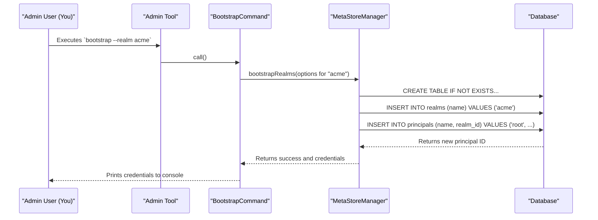

# Chapter 9: Admin Tool

In the [previous chapter on Configuration Management](08_configuration_management_.md), we learned how to configure the Polaris server to connect to a database and serve different tenants. But this raises a classic chicken-and-egg problem: if you have a brand-new, completely empty database, how do you create the first realm and the first administrative user? You can't use the REST API, because you need an authenticated user to call the API!

This is where the **Admin Tool** comes in. It's the special key you use to unlock Polaris for the very first time.

### The Problem: Unlocking an Empty Building

Imagine Polaris is a brand new, high-tech office building. The main service is the front door, complete with security guards (our [Authentication and Authorization](03_authentication_and_authorization_.md) layer). But on day one, the building is empty. The security system isn't even programmed yet. There are no employee badges, no access lists—nothing. How does the very first administrator get in to set everything up?

They don't use the front door. They use a special, secure service entrance in the back. This is the **Admin Tool**. It's a command-line utility that bypasses the main API and talks directly to the building's foundation—the database. It's used for critical, low-level tasks that can't be done through the normal day-to-day interface.

### Key Concepts: The Superintendent's Master Key

Think of the Admin Tool as the building superintendent's master key. It's not for daily use, but it's essential for a few critical jobs:

*   **The Tool Itself:** A standalone program (`polaris-admin-tool.jar`) that you run from your terminal. It connects directly to the Polaris database, using the same configuration file as the main server to find it.

*   **`bootstrap` command:** This is the most important function. It's like the initial setup for the building. It does three things:
    1.  **Builds the internal structure:** It creates the necessary database tables (the schema).
    2.  **Defines a tenant space:** It creates and initializes a new [Realm](01_realm_and_call_context_.md).
    3.  **Issues the first master key:** It creates the initial "root" administrative user for that realm and gives you their secret credentials.

*   **`purge` command:** This is the "demolition" command. It completely and irreversibly deletes a realm and all the data inside it. This is extremely powerful and dangerous, but useful for cleaning up test environments or decommissioning a tenant.

### How It Works: Setting Up Your First Realm

Let's use the Admin Tool to set up a new realm called `acme`.

#### 1. Configuration is Key

First, the Admin Tool needs to know where the database is. It does this by reading the same `application.properties` file that your main Polaris server uses. Ensure your configuration is set up correctly, for example:

```properties
# Tell Polaris where to find the database
polaris.persistence.type=relational-jdbc
quarkus.datasource.db-kind=postgresql
quarkus.datasource.jdbc.url=jdbc:postgresql://localhost:5432/polaris_db
# ... other database credentials
```

#### 2. Running the `bootstrap` Command

Now, from your terminal, you run the Admin Tool. The most critical command is `bootstrap`. We will tell it to create the `acme` realm and print the credentials for its new root user.

```shell
java -jar polaris-admin-tool-runner.jar bootstrap \
  --realm acme \
  --print-credentials
```

This command tells the tool: "Initialize the `acme` realm, and once you've created the first admin user, show me their login details on the screen."

#### 3. What Happens and What You Get

After you run the command, the tool will connect to the database and perform its magic. The output will look something like this:

```
Realm 'acme' successfully bootstrapped.
realm: acme root principal credentials: 288f553-acme-root:SECRET_KEY_HERE
Bootstrap completed successfully.
```

Success! You now have:
*   A fully initialized `acme` realm in your database.
*   A root user with a `clientId` (`288f553-acme-root`) and a `clientSecret` (`SECRET_KEY_HERE`).

You can now take these credentials and use them to make your very first authenticated call to the main Polaris REST API! The chicken-and-egg problem is solved.

### Under the Hood: A Direct Path to the Database

Unlike a normal API request that goes through many layers, the Admin Tool's path is much more direct.

Here is a simplified diagram of what happens when you run `bootstrap`:



The tool bypasses the entire REST API and security stack, directly instructing the [Persistence Layer (MetaStoreManager)](10_persistence_layer__metastoremanager__.md) to set up the database.

### Under the Hood: The Code

The Admin Tool is a command-line application built using a library called Picocli, which makes it easy to define commands and options.

#### 1. The Main Entry Point: `PolarisAdminTool.java`

This is the top-level command. Its main job is to register the subcommands that do the real work, like `bootstrap` and `purge`.

```java
// From: runtime/admin/src/main/java/org/apache/polaris/admintool/PolarisAdminTool.java

@TopCommand
@Command(
    name = "polaris-admin-tool.jar",
    // ...
    subcommands = {
      BootstrapCommand.class, // <-- Registers our bootstrap command
      PurgeCommand.class,     // <-- Registers our purge command
    })
public class PolarisAdminTool extends BaseCommand {
  // ...
}
```
This class acts as a router, directing the tool to run the `BootstrapCommand` when you type `bootstrap`.

#### 2. The Bootstrap Logic: `BootstrapCommand.java`

This class defines the options for the `bootstrap` command and contains the logic to execute it.

```java
// From: runtime/admin/src/main/java/org/apache/polaris/admintool/BootstrapCommand.java

@Command(name = "bootstrap", description = "Bootstraps realms...")
public class BootstrapCommand extends BaseCommand {

  // This defines the --realm option on the command line
  @CommandLine.Option(names = {"-r", "--realm"}, required = true)
  List<String> realms;

  // This defines the --print-credentials flag
  @CommandLine.Option(names = {"-p", "--print-credentials"})
  boolean printCredentials;

  @Override
  public Integer call() {
    // 1. Build options from command-line arguments
    BootstrapOptions bootstrapOptions =
        ImmutableBootstrapOptions.builder()
            .realms(realms)
            // ...
            .build();

    // 2. Execute the bootstrap via the MetaStoreManager
    Map<String, PrincipalSecretsResult> results =
        metaStoreManagerFactory.bootstrapRealms(bootstrapOptions);
    
    // 3. Print the results
    // ...
  }
}
```
This code shows the core pattern:
1.  Use `@CommandLine.Option` to declare the command-line arguments.
2.  The `call()` method is run when the command is executed.
3.  It packages the arguments into an `Options` object.
4.  It calls the underlying `metaStoreManagerFactory` to do the heavy lifting in the database.

### Conclusion

You've now learned about the essential "master key" for managing a Polaris instance.

*   The **Admin Tool** is a command-line utility for performing critical administrative tasks directly on the database.
*   Its most important command, **`bootstrap`**, solves the initial setup problem by creating the database schema, initializing a realm, and generating the first root credentials.
*   The **`purge`** command provides a powerful way to completely remove a realm's data.
*   This tool is crucial for the initial setup of any Polaris environment and for disaster recovery scenarios.

Both the Admin Tool and the main Polaris service rely on a common component to talk to the database. In our final chapter, we will dive into this last, fundamental layer.

Next up: [Chapter 10: Persistence Layer (MetaStoreManager)](10_persistence_layer__metastoremanager__.md)

---

Generated by [AI Codebase Knowledge Builder](https://github.com/The-Pocket/Tutorial-Codebase-Knowledge)