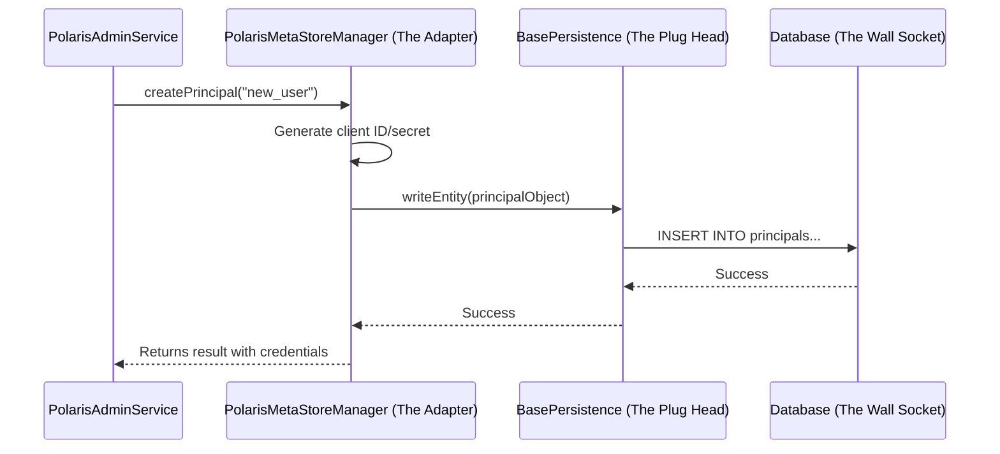

# Chapter 10: Persistence Layer (MetaStoreManager)

In the [previous chapter on the Admin Tool](09_admin_tool_.md), we saw how a special command-line utility could directly manipulate the database to bootstrap a new realm. Both the main Polaris service and the Admin Tool need to read and write information about realms, users, and tables. But how do they do this without tying the entire application to one specific database like PostgreSQL?

This is the final piece of the puzzle. Let's look at Polaris's "storage engine."

### The Problem: Supporting Different Databases

Imagine you are developing Polaris. You want to make it as easy as possible for people to try it out, but also powerful enough for large-scale production.

*   **For a quick demo or testing**, you want Polaris to run instantly on a developer's laptop without any external database setup. An `in-memory` database that lives and dies with the server process is perfect.
*   **For a production environment**, you need Polaris to store its state in a robust, reliable database like PostgreSQL or MySQL. The data must survive server restarts and be backed up.

How can you write the core logic of Polaris—the code that creates tables, checks permissions, and manages users—just *once*, but have it work seamlessly with both an in-memory store and a full-fledged relational database? You need an abstraction layer that separates the "what" (e.g., "save this user") from the "how" (e.g., "run this specific SQL `INSERT` command").

This is the job of the **Persistence Layer**, orchestrated by the `MetaStoreManager`.

### Key Concepts: The Universal Power Adapter

Think of the Persistence Layer as a **universal power adapter** for Polaris.

*   **Polaris Core Logic (Your Laptop):** The main application logic needs "power" (a way to store and retrieve data). It has a standard plug.

*   **`MetaStoreManagerFactory` (The Adapter Store):** This is like the store where you buy your power adapter. Based on your [Configuration Management](08_configuration_management_.md) settings (e.g., `polaris.persistence.type=in-memory`), it gives you the right adapter.

*   **`PolarisMetaStoreManager` (The Adapter Itself):** This is the adapter. It provides a standard interface (e.g., `createPrincipal`, `readEntityByName`) that the rest of Polaris plugs into. It handles high-level logic and orchestrates the work.

*   **`BasePersistence` (The Changeable Head):** This is the specific plug head that fits into the wall socket (`in-memory`, `relational-jdbc`). It contains the actual, low-level code to talk to a specific type of database.

This design means the "laptop" (Polaris core) never needs to know what kind of "wall socket" (database) it's plugged into. It just talks to the standard adapter, which handles the translation.

### How It Works: Creating a Principal

Let's follow a request to create a new principal and see how it flows through the persistence layer.

1.  **The Request:** An API call to create a principal named `new_user` reaches the `PolarisAdminService` [Handler](04_rest_api_layer__adapters___handlers__.md).
2.  **Call the Adapter:** The handler calls the `createPrincipal` method on the `PolarisMetaStoreManager` instance it has. The handler doesn't know or care if this is an in-memory or JDBC manager.
3.  **High-Level Logic:** The `MetaStoreManager` begins its work. It might start a transaction, generate a new client ID and secret for the user, and prepare the `PrincipalEntity` object.
4.  **Delegate to the "Plug Head":** For the actual database write, the `MetaStoreManager` calls the `writeEntity` method on its `BasePersistence` object.
5.  **Low-Level Write:**
    *   If you're using `relational-jdbc`, the `JdbcBasePersistenceImpl` implementation of `BasePersistence` generates and executes an `INSERT INTO ...` SQL statement.
    *   If you're using `in-memory`, a different implementation would just add the object to a `HashMap`.
6.  **Return:** The result flows back up the chain, and a success response is sent to the user.

This ensures the main application logic in the `MetaStoreManager` is completely decoupled from the database-specific code in `BasePersistence`.



### Under the Hood: The Code

Let's look at the key interfaces and classes that define this powerful abstraction.

#### 1. The Factory: `MetaStoreManagerFactory.java`

This is the main entry point for the persistence layer. Its job is to provide the correct, configured `MetaStoreManager` for a given realm.

```java
// From: polaris-core/src/main/java/org/apache/polaris/core/persistence/MetaStoreManagerFactory.java

public interface MetaStoreManagerFactory {
  // Gets or creates the manager for a specific realm
  PolarisMetaStoreManager getOrCreateMetaStoreManager(RealmContext realmContext);

  // Gets or creates the low-level session handler
  BasePersistence getOrCreateSession(RealmContext realmContext);
  
  // ... other methods like bootstrapRealms
}
```
The application asks this factory for the components it needs.

#### 2. A Concrete Factory: `JdbcMetaStoreManagerFactory.java`

This is the factory implementation for JDBC databases. The `@Identifier` annotation is crucial. It links this code to the value you set in your `application.properties`.

When you set `polaris.persistence.type=relational-jdbc`, Polaris knows to use this specific factory.

```java
// From: persistence/relational-jdbc/src/main/java/org/apache/polaris/persistence/relational/jdbc/JdbcMetaStoreManagerFactory.java

@ApplicationScoped
@Identifier("relational-jdbc") // This connects to the configuration!
public class JdbcMetaStoreManagerFactory implements MetaStoreManagerFactory {

  // ...
  
  @Override
  public synchronized PolarisMetaStoreManager getOrCreateMetaStoreManager(
      RealmContext realmContext) {
    
    if (!metaStoreManagerMap.containsKey(realmContext.getRealmIdentifier())) {
      // ... initialization logic ...
      // Creates a new manager and stores it for the realm
    }
    return metaStoreManagerMap.get(realmContext.getRealmIdentifier());
  }
}
```

#### 3. The High-Level Manager: `PolarisMetaStoreManager.java`

This interface defines the high-level business operations. Notice the method names are about *what* to do, not *how*. They deal with Polaris concepts like "catalogs" and "principals."

```java
// From: polaris-core/src/main/java/org/apache/polaris/core/persistence/PolarisMetaStoreManager.java

public interface PolarisMetaStoreManager {
  // A high-level business operation
  @Nonnull
  CreatePrincipalResult createPrincipal(
      @Nonnull PolarisCallContext callCtx, @Nonnull PolarisBaseEntity principal);
      
  // Another business operation
  @Nonnull
  EntityResult readEntityByName(
      @Nonnull PolarisCallContext callCtx,
      // ... arguments
      @Nonnull String name);
}
```

#### 4. The Low-Level Interface: `BasePersistence.java`

This is the "plug head." The methods here are very generic and low-level. They deal with raw `PolarisBaseEntity` objects and fundamental actions like `write`, `read`, and `delete`.

```java
// From: polaris-core/src/main/java/org/apache/polaris/core/persistence/BasePersistence.java

public interface BasePersistence {
  // A low-level, atomic write operation
  void writeEntity(
      @Nonnull PolarisCallContext callCtx,
      @Nonnull PolarisBaseEntity entity,
      boolean nameOrParentChanged,
      @Nullable PolarisBaseEntity originalEntity);

  // A low-level, atomic delete operation
  void deleteEntity(@Nonnull PolarisCallContext callCtx, @Nonnull PolarisBaseEntity entity);
}
```
An implementation of this interface for JDBC would contain SQL statements, while an in-memory version would manipulate data structures in memory.

### Conclusion

Congratulations, you have reached the end of the Polaris tutorial! You've just learned about the foundational layer that makes everything else possible.

*   The **Persistence Layer** is an abstraction that separates Polaris's core logic from the physical storage mechanism.
*   It's orchestrated by the **`MetaStoreManagerFactory`**, which provides different implementations (`in-memory`, `relational-jdbc`) based on your configuration.
*   The **`PolarisMetaStoreManager`** handles high-level business logic, while the **`BasePersistence`** interface handles the low-level, database-specific read/write operations.
*   This design makes Polaris flexible, testable, and adaptable to different production environments without changing its core code.

From the multi-tenant security of the [Realm and Call Context](01_realm_and_call_context_.md) to the flexible storage of the Persistence Layer, you now have a comprehensive understanding of Polaris's architecture. We hope this tour has been helpful, and we're excited to see what you build with Polaris

---

Generated by [AI Codebase Knowledge Builder](https://github.com/The-Pocket/Tutorial-Codebase-Knowledge)