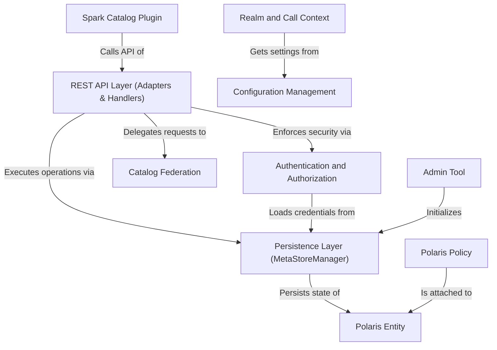

# Tutorial: polaris

Polaris is a centralized, universal metadata service that acts as a single source of truth for various data table formats like *Iceberg* and *Delta Lake*. It provides a **REST API** for clients, such as Apache Spark, to discover and manage data assets. A core feature is its robust security model, which includes *authentication* and fine-grained *authorization* to control data access. Polaris is designed for multi-tenancy using **Realms**, which are isolated environments for different teams or organizations. It also supports advanced governance through **Policies** for managing the data lifecycle and can act as a unified gateway to other existing catalogs via **Catalog Federation**.

**Source Repository:** [None](None)

## Chapters

1. [Realm and Call Context
](01_realm_and_call_context_.md)
2. [Polaris Entity
](02_polaris_entity_.md)
3. [Authentication and Authorization
](03_authentication_and_authorization_.md)
4. [REST API Layer (Adapters & Handlers)
](04_rest_api_layer__adapters___handlers__.md)
5. [Spark Catalog Plugin
](05_spark_catalog_plugin_.md)
6. [Polaris Policy
](06_polaris_policy_.md)
7. [Catalog Federation
](07_catalog_federation_.md)
8. [Configuration Management
](08_configuration_management_.md)
9. [Admin Tool
](09_admin_tool_.md)
10. [Persistence Layer (MetaStoreManager)
](10_persistence_layer__metastoremanager__.md)

---

Generated by [AI Codebase Knowledge Builder](https://github.com/The-Pocket/Tutorial-Codebase-Knowledge)