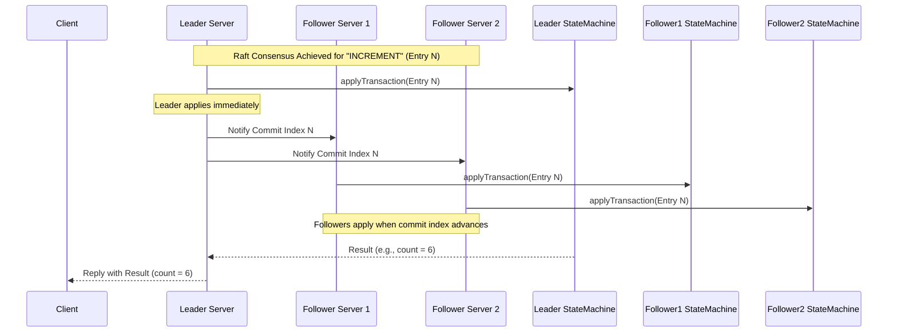

# Chapter 1: StateMachine

Welcome to the Apache Ratis tutorial! Ratis is a library that helps you build fault-tolerant, replicated applications. It uses the Raft consensus algorithm to make sure your application's state remains consistent across multiple servers, even if some servers fail.

In this first chapter, we'll explore one of the most fundamental concepts in Ratis: the **StateMachine**.

## What Problem Does StateMachine Solve?

Imagine you're building a simple distributed counter service. Multiple users might send requests to increment the counter, and you want this counter to be reliable. If one server crashes, you don't want to lose the count! You need multiple servers (a cluster) to hold the counter's value, and they all must agree on the *exact* same value.

How do you ensure that if server A increments the counter from 5 to 6, server B and server C *also* increment it from 5 to 6, and not in some different order or apply the increment twice?

This is where Ratis and the `StateMachine` come in. Ratis handles the complex task of making sure commands (like "increment the counter") are agreed upon by a majority of servers and delivered in the same order everywhere. The `StateMachine` is the component *you* write to actually *do* the work for those commands – in this case, incrementing the counter value.

## What is a StateMachine?

Think of the `StateMachine` as the heart or the brain of your specific application logic that runs on top of the reliable Ratis foundation.

*   **It holds the state:** For our counter example, the `StateMachine` would hold the current integer value of the counter.
*   **It defines the logic:** It knows *how* to change the state based on commands. For the counter, it knows how to handle an "INCREMENT" command (add 1 to the value) and a "GET" command (return the current value).

Ratis guarantees that whenever a command (like "INCREMENT") is successfully agreed upon by the cluster (we call this "committed"), it will deliver this command to the `StateMachine` on *each* server in the *same order*. Your `StateMachine` implementation then applies this command to its local state. Because every `StateMachine` instance receives the same commands in the same order, they all end up in the same state, achieving consistency!

The key interface you'll work with is `org.apache.ratis.statemachine.StateMachine`.

```java
// From: ratis-server-api/src/main/java/org/apache/ratis/statemachine/StateMachine.java
public interface StateMachine extends Closeable {
    // ... many methods ...

    /**
     * Apply a committed log entry to the state machine.
     * ... must be deterministic ...
     */
    CompletableFuture<Message> applyTransaction(TransactionContext trx);

    /**
     * Query the state machine. The request must be read-only.
     */
    CompletableFuture<Message> query(Message request);

    /**
     * Initializes the State Machine ...
     */
    void initialize(RaftServer raftServer, RaftGroupId raftGroupId, RaftStorage storage) throws IOException;

    /**
     * @return the last term-index applied by this StateMachine.
     */
    TermIndex getLastAppliedTermIndex();

    /**
     * Dump the in-memory state into a snapshot file...
     */
    long takeSnapshot() throws IOException;

    // ... other methods and nested interfaces ...
}
```

This interface defines the contract between Ratis and your application logic. Don't worry about all the methods right now; we'll focus on the most important ones.

## Implementing a Simple StateMachine

Let's build a basic `StateMachine` for our counter example. Ratis provides a helpful base class, `org.apache.ratis.statemachine.impl.BaseStateMachine`, which gives default implementations for many methods. We can extend it.

```java
// Simplified Example - CounterStateMachine
import org.apache.ratis.statemachine.impl.BaseStateMachine;
import java.util.concurrent.atomic.AtomicInteger;
// ... other imports

public class CounterStateMachine extends BaseStateMachine {

    private final AtomicInteger counter = new AtomicInteger(0);

    // We will implement applyTransaction and query here
}
```

This simple class extends `BaseStateMachine` and holds our state: an `AtomicInteger`.

### Applying Changes: `applyTransaction`

This is the core method for changing the state. Ratis calls this method when a command (encapsulated in a `LogEntryProto` within the `TransactionContext`) has been successfully replicated and committed by the cluster.

Your implementation *must* be deterministic. Given the same initial state and the same sequence of `TransactionContext` inputs, it must *always* produce the same final state and the same results. This is crucial for consistency.

```java
// Inside CounterStateMachine

@Override
public CompletableFuture<Message> applyTransaction(TransactionContext trx) {
    // 1. Get the log entry containing the command
    final LogEntryProto entry = trx.getLogEntryUnsafe();
    // 2. Extract the command message (e.g., "INCREMENT")
    final String command = entry.getStateMachineLogEntry()
                                .getLogData().toStringUtf8();

    int result = -1; // Default invalid result

    // 3. Execute the command
    if ("INCREMENT".equals(command)) {
        result = counter.incrementAndGet();
        LOG.info("Applied INCREMENT: New count = {}", result);
    } else {
        LOG.warn("Unknown command: {}", command);
        // Optionally return an error to the client
    }

    // 4. Update the last applied index (BaseStateMachine helps here)
    updateLastAppliedTermIndex(entry.getTerm(), entry.getIndex());

    // 5. Return the result (e.g., the new count) to the client
    //    We wrap the int result in a Ratis Message.
    final String resultString = String.valueOf(result);
    return CompletableFuture.completedFuture(
        Message.valueOf(resultString)
    );
}
```

**Explanation:**

1.  We get the committed `LogEntryProto` from the `TransactionContext`.
2.  We extract the actual command sent by the client (here, assuming it's a simple string like "INCREMENT").
3.  We check the command and update our state (`counter.incrementAndGet()`).
4.  We tell Ratis (via the `BaseStateMachine` helper method `updateLastAppliedTermIndex`) which command we just finished applying. This is important for tracking progress.
5.  We return a `CompletableFuture<Message>` that completes immediately with the result (the new counter value as a `String` wrapped in a `Message`). This result will eventually be sent back to the client who issued the command.

### Reading State: `query`

This method handles read-only requests. It should *not* modify the state machine's state.

```java
// Inside CounterStateMachine

@Override
public CompletableFuture<Message> query(Message request) {
    final String command = request.getContent().toStringUtf8();
    int result = -1; // Default invalid result

    if ("GET".equals(command)) {
        result = counter.get();
        LOG.info("Queried GET: Current count = {}", result);
    } else {
        LOG.warn("Unknown query command: {}", command);
    }

    // Wrap the result in a Ratis Message
    final String resultString = String.valueOf(result);
    return CompletableFuture.completedFuture(
        Message.valueOf(resultString)
    );
}
```

**Explanation:**

1.  We get the query command from the `Message`.
2.  We check if it's a "GET" command.
3.  If it is, we read the current state (`counter.get()`). We *do not* change the state here.
4.  We wrap the result in a `Message` and return it in a `CompletableFuture`.

## How Ratis Uses Your StateMachine

Now that you've defined *how* to modify and query the state, how does Ratis interact with it?

1.  **Client Sends Command:** A client sends a command (e.g., "INCREMENT") to the cluster, usually targeting the current leader server. ([RaftClient](03_raftclient_.md))
2.  **Leader Proposes:** The leader server wraps the command in a log entry and proposes it to its followers via the Raft protocol. ([RaftServer](04_raftserver_.md), [RaftLog](05_raftlog_.md))
3.  **Consensus:** Ratis runs the Raft algorithm. Followers receive the proposed entry, store it in their log, and acknowledge it back to the leader.
4.  **Commit:** Once the leader receives acknowledgments from a *majority* of servers, the log entry is considered "committed". The leader notes the new commit index.
5.  **Apply:** The leader (and eventually all followers, as they learn about the new commit index) pass the committed log entry to their local `StateMachine` instance by calling `applyTransaction(trx)`.
6.  **State Update:** Your `StateMachine` code executes, updating its state (e.g., incrementing the counter).
7.  **Response:** The leader's `StateMachine` returns a result via the `CompletableFuture`. The leader server sends this result back to the client.

Here's a simplified diagram of the "apply" phase for a committed entry:



Because Ratis ensures every server applies the *same* committed entries in the *same order*, all `CounterStateMachine` instances across the cluster will consistently reach the state `count = 6`.

## Other Important Methods (Briefly)

*   `initialize(...)`: Called when the Ratis server starts up for a specific Raft group. This is where you'd typically load the last saved state (e.g., from a snapshot).
*   `takeSnapshot()`: Ratis log entries accumulate over time. To save space, Ratis periodically asks the `StateMachine` to save its *entire current state* to a file (a snapshot). Ratis can then discard older log entries. This method implements the snapshot-saving logic. We'll cover this more in the [Snapshotting](07_snapshotting__snapshotinfo__statemachinestorage_.md) chapter.
*   `startTransaction(RaftClientRequest request)`: Before a command is even proposed via Raft, Ratis calls this method on the leader. It allows the `StateMachine` to validate the request or transform it into the format it wants to be stored in the Raft log. For simple cases, it might just wrap the client's message content.

There are also more advanced optional interfaces like `DataApi` (for handling large data streams, see [DataStream API](08_datastream_api_.md)) and `EventApi` (for receiving notifications about cluster events like leader changes), but you don't need them for basic `StateMachine`s.

## Conclusion

The `StateMachine` is where your application-specific logic resides within a Ratis application. It holds the state and defines how that state changes (`applyTransaction`) or is read (`query`). Ratis leverages the Raft consensus algorithm to ensure that committed commands are applied consistently and in the same order to every `StateMachine` instance in the cluster, providing fault tolerance and reliability.

Remember:
*   Implement the `StateMachine` interface (often by extending `BaseStateMachine`).
*   `applyTransaction` handles state changes and *must* be deterministic.
*   `query` handles read-only requests.
*   Ratis ensures ordered, consistent application of committed transactions.

Now that we understand how application logic is handled, let's explore how servers are organized into groups in Ratis.

**Next:** [Chapter 2: RaftGroup & RaftPeer](02_raftgroup___raftpeer_.md)

---

Generated by [AI Codebase Knowledge Builder](https://github.com/The-Pocket/Tutorial-Codebase-Knowledge)