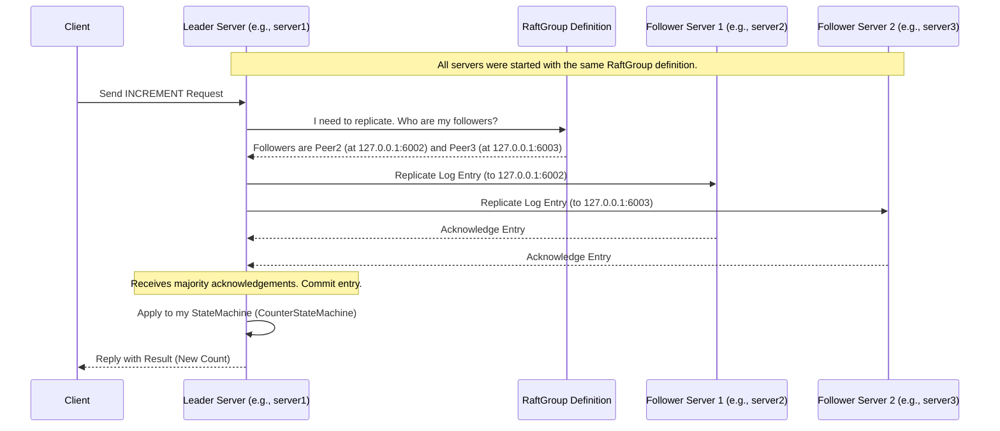

# Chapter 2: RaftGroup & RaftPeer

In the [previous chapter](01_statemachine_.md), we learned about the `StateMachine`, which holds your application's data and logic (like our counter example). But a single server isn't fault-tolerant! If that server crashes, our counter is lost.

To make our counter reliable, we need multiple servers working together as a team, replicating the counter's state using Ratis. But how do these servers know who else is on the team? How do they form a coordinated group?

This is where `RaftGroup` and `RaftPeer` come in. They define the **membership** of our Ratis cluster.

## What Problem Do They Solve?

Imagine you have three computers (servers) ready to run our counter application. Let's call them Server A, Server B, and Server C.

*   How does Server A know it should talk to Server B and Server C?
*   How does a client application know which servers are part of the counter service?
*   If we have *another* independent application (say, a distributed lock service) running on different servers (D, E, F), how do we keep the counter group (A, B, C) separate from the lock group (D, E, F)?

`RaftGroup` and `RaftPeer` solve this by explicitly defining which servers belong to which group and how to contact them.

## What is a RaftPeer?

Think of a `RaftPeer` as a **single member** of the team or committee. It represents one specific server participating in the Raft consensus process for a particular application.

Each `RaftPeer` needs two key pieces of information:

1.  **A Unique ID (`RaftPeerId`):** This is like a unique name badge for the server within the Ratis world. It distinguishes this server from all others. It's usually created from a string (like "s1", "s2") or a UUID.
2.  **Network Address:** This is the server's contact information – typically its IP address and port number (e.g., "192.168.1.101:6000"). This tells other servers how to send messages to this peer.

Let's see how you create a `RaftPeer` in Java using its `Builder`:

```java
import org.apache.ratis.protocol.RaftPeer;
import org.apache.ratis.protocol.RaftPeerId;

// Define a unique ID for our first server
RaftPeerId peerId1 = RaftPeerId.valueOf("server1");

// Create the RaftPeer object
RaftPeer peer1 = RaftPeer.newBuilder()
    .setId(peerId1)                  // Set the unique ID
    .setAddress("127.0.0.1:6001")     // Set its network address
    // Optional: Set addresses for client/admin/datastream traffic if different
    .setClientAddress("127.0.0.1:7001")
    .build();                       // Build the immutable RaftPeer object

System.out.println("Created Peer: " + peer1);
```

**Explanation:**

*   We first create a `RaftPeerId` from the string "server1".
*   We use `RaftPeer.newBuilder()` to start constructing the peer definition.
*   `.setId()` assigns the unique ID.
*   `.setAddress()` specifies the main address other Ratis servers will use to communicate with this peer for Raft protocol messages (like voting or log replication).
*   `.setClientAddress()` (optional) specifies a potentially different address clients use to talk to this peer. If not set, the main `address` might be used.
*   `.build()` finalizes the creation and gives us an immutable `RaftPeer` object.

**Example Output:**

```
Created Peer: server1|127.0.0.1:6001
```

## What is a RaftGroup?

If a `RaftPeer` is an individual member, the `RaftGroup` is the **entire team or committee**. It represents a collection of `RaftPeer`s that work together to replicate the state for a *single* logical application (like our counter).

Each `RaftGroup` also needs two key pieces of information:

1.  **A Unique ID (`RaftGroupId`):** This is like a unique name for the entire team (e.g., "counter-group"). It distinguishes this group of servers from any other Raft groups that might be running. It's often created from a UUID to ensure global uniqueness.
2.  **A Collection of `RaftPeer`s:** This is the list of members (the `RaftPeer` objects we defined earlier) that make up this specific group.

Here's how you create a `RaftGroup` in Java:

```java
import org.apache.ratis.protocol.RaftGroup;
import org.apache.ratis.protocol.RaftGroupId;
import org.apache.ratis.protocol.RaftPeer;
import org.apache.ratis.protocol.RaftPeerId;
import java.util.Arrays;
import java.util.List;
import java.util.UUID;

// Assume we created three peers: peer1, peer2, peer3
RaftPeerId peerId1 = RaftPeerId.valueOf("server1");
RaftPeer peer1 = RaftPeer.newBuilder().setId(peerId1).setAddress("127.0.0.1:6001").build();

RaftPeerId peerId2 = RaftPeerId.valueOf("server2");
RaftPeer peer2 = RaftPeer.newBuilder().setId(peerId2).setAddress("127.0.0.1:6002").build();

RaftPeerId peerId3 = RaftPeerId.valueOf("server3");
RaftPeer peer3 = RaftPeer.newBuilder().setId(peerId3).setAddress("127.0.0.1:6003").build();

// Create a list of the peers
List<RaftPeer> clusterPeers = Arrays.asList(peer1, peer2, peer3);

// Create a unique ID for this group (using a fixed UUID for example)
UUID groupIdUUID = UUID.fromString("0a1b2c3d-4e5f-6a7b-8c9d-0e1f2a3b4c5d");
RaftGroupId counterGroupId = RaftGroupId.valueOf(groupIdUUID);

// Create the RaftGroup
RaftGroup counterGroup = RaftGroup.valueOf(counterGroupId, clusterPeers);

System.out.println("Created Group: " + counterGroup);
System.out.println("Peers in group: " + counterGroup.getPeers());
```

**Explanation:**

*   We assume `peer1`, `peer2`, and `peer3` have already been created as shown previously.
*   We put these `RaftPeer` objects into a `List`.
*   We create a unique `RaftGroupId`. Using `UUID.fromString` gives us a predictable ID for this example, but `RaftGroupId.randomId()` is often used for truly unique IDs.
*   `RaftGroup.valueOf()` takes the `RaftGroupId` and the collection of `RaftPeer`s to create the immutable `RaftGroup` object.

**Example Output:**

```
Created Group: group-0a1b2c3d-4e5f-6a7b-8c9d-0e1f2a3b4c5d:[server3|127.0.0.1:6003, server2|127.0.0.1:6002, server1|127.0.0.1:6001]
Peers in group: [server3|127.0.0.1:6003, server2|127.0.0.1:6002, server1|127.0.0.1:6001]
```

## How They Work Together

The `RaftGroup` object bundles everything together: the group's identity and the list of its members (`RaftPeer`s) with their contact information.

This `RaftGroup` object is fundamental for configuring Ratis:

1.  **Starting Servers:** When you start a [RaftServer](04_raftserver_.md) process, you provide it with the `RaftGroup` definition. This tells the server which group it belongs to and who its fellow peers are.
2.  **Client Communication:** When a [RaftClient](03_raftclient_.md) wants to send a request (like "INCREMENT" for our counter), it needs to know which group to talk to and the addresses of the servers in that group. The client is typically configured with the `RaftGroup`.
3.  **Internal Communication:** Inside the Ratis cluster, when the leader needs to replicate a log entry or followers need to talk to the leader, they use the peer addresses stored within the `RaftGroup` definition to establish connections using the [RPC Layer](06_rpc_layer__rpctype__rpcfactory__raftserverrpc__raftclientrpc__.md).

Here's a simple diagram showing how the group definition helps a leader contact its followers:



Without the `RaftGroup` defining the members and their addresses, the servers wouldn't know who to talk to, and the cluster couldn't function.

## Relevant Code

The core classes defining these concepts are:

*   `org.apache.ratis.protocol.RaftPeer`: Represents a single server.
*   `org.apache.ratis.protocol.RaftPeerId`: The unique ID for a `RaftPeer`.
*   `org.apache.ratis.protocol.RaftGroup`: Represents the collection of peers.
*   `org.apache.ratis.protocol.RaftGroupId`: The unique ID for a `RaftGroup`.

You can find these in the `ratis-common` module of the Ratis source code.

## Conclusion

`RaftPeer` and `RaftGroup` are essential building blocks for setting up a Ratis cluster. They answer the fundamental questions: "Who is on the team?" and "How can we reach them?".

*   A `RaftPeer` represents a single server with a unique `RaftPeerId` and network addresses.
*   A `RaftGroup` represents the entire team (cluster) with a unique `RaftGroupId` and a collection of `RaftPeer`s.
*   This group definition is used by servers to know their peers and by clients to connect to the correct cluster.

Now that we understand how to define our application logic ([StateMachine](01_statemachine_.md)) and how to define the group of servers running it (`RaftGroup` & `RaftPeer`), let's see how an external application interacts with this cluster using the `RaftClient`.

**Next:** [Chapter 3: RaftClient](03_raftclient_.md)

---

Generated by [AI Codebase Knowledge Builder](https://github.com/The-Pocket/Tutorial-Codebase-Knowledge)