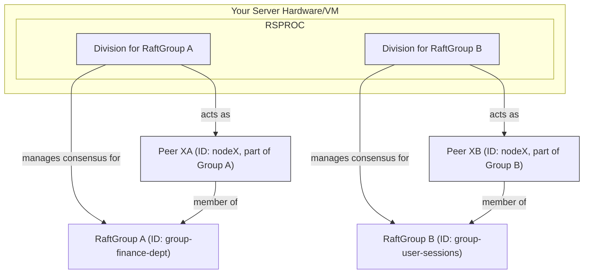
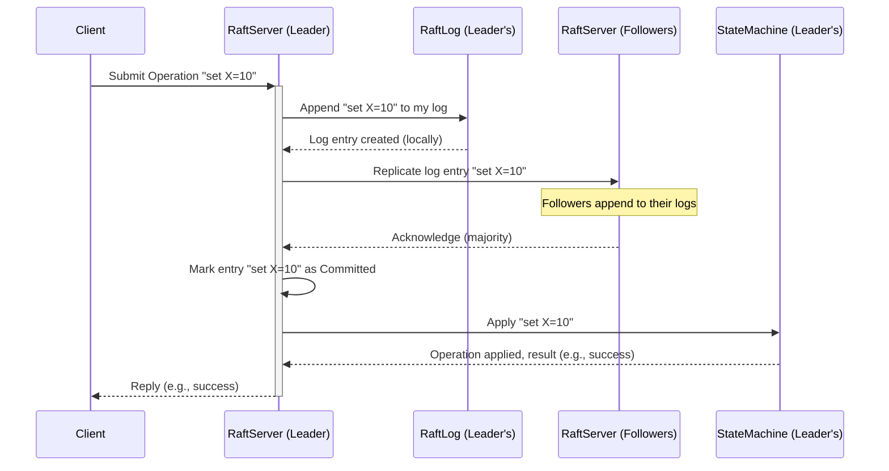

# Chapter 2: RaftServer - The Engine of Consensus

In [Chapter 1: RaftGroup & RaftPeer](01_raftgroup___raftpeer_.md), we learned how servers in a Ratis cluster identify each other (`RaftPeer`) and how they form teams (`RaftGroup`) to work on specific tasks. We have our team rosters and contact cards ready. But who actually does the hard work of coordinating these teams, making decisions, and ensuring everyone agrees?

Meet the `RaftServer`!

Imagine each server in our distributed system has a very diligent and crucial manager. This manager is the `RaftServer`. Its primary job is to work tirelessly with the other managers (other `RaftServer`s in the same `RaftGroup`) to achieve consensus. They need to agree on a sequence of operations (like commands to execute or data to store) and make sure this sequence is reliably recorded and applied everywhere, even if some managers (servers) temporarily go offline.

## What is a RaftServer? The Diligent Manager

A `RaftServer` is the main engine of the Ratis system running on each node (physical or virtual server) that participates in a distributed consensus process. For any given `RaftGroup`, one `RaftServer` instance on each member peer will be responsible for that group's consensus.

The `RaftServer` is responsible for:

1.  **Leader Election**: The "managers" in a `RaftGroup` need to decide who will be the "lead manager" (the Leader) at any given time. The `RaftServer` handles this election process.
2.  **Log Replication**: The Leader is responsible for taking new operations, recording them in its "notebook" (the [RaftLog](03_raftlog_.md)), and then making sure all other active managers (Followers) in the group also record the exact same operations in the exact same order in their notebooks.
3.  **Group Coordination & Fault Tolerance**: It ensures that the group can continue to operate correctly even if some servers fail (up to a certain limit). If the Leader fails, the remaining `RaftServer`s will elect a new one.
4.  **Applying Committed Operations**: Once an operation is safely replicated to a majority of servers in the group (it's "committed"), the `RaftServer` ensures it's passed to the [StateMachine](04_statemachine_.md), which is the component that actually executes the operation (e.g., updates a database, changes a value).

A single, physical Ratis server process can be part of multiple `RaftGroup`s. This means one `RaftServer` process can act as a manager for several independent "teams" simultaneously, each team working on a different consensus problem.

## The RaftServer's Day Job (for a specific RaftGroup)

Let's look at the key roles and activities a `RaftServer` performs for a particular `RaftGroup` it's a member of.

### Roles on the Team

Within a `RaftGroup`, a `RaftServer` can be in one of three main roles at any time:

*   **Leader**: The boss. There's at most one Leader in a group at any given time. The Leader is responsible for:
    *   Receiving requests from clients (applications that want to perform operations).
    *   Adding these requests as entries to its [RaftLog](03_raftlog_.md).
    *   Replicating these log entries to Follower servers.
    *   Telling Followers when it's safe to apply committed entries to their [StateMachine](04_statemachine_.md).
    *   Sending regular "heartbeats" to Followers to maintain its authority.

*   **Follower**: A loyal team member. Most servers in a group are usually Followers. Followers:
    *   Passively wait for instructions (log entries or heartbeats) from the Leader.
    *   Replicate log entries sent by the Leader.
    *   If they don't hear from the Leader for a certain amount of time (an election timeout), they assume the Leader might have failed and can become a Candidate to start a new election.
    *   Forward client requests to the Leader.

*   **Candidate**: An applicant for the boss position. If a Follower times out waiting for the Leader, or at the very start, it can transition to the Candidate role:
    *   It increments the current "term" (like an election cycle number).
    *   It votes for itself.
    *   It requests votes from all other servers in the group.
    *   If it receives votes from a majority of the servers, it becomes the new Leader.
    *   If another server establishes itself as Leader, or if the election times out, it reverts to being a Follower.

(There's also a `Listener` role for peers that receive log entries but don't participate in voting or count towards majorities for commitment. We'll keep it simple and focus on the main three for now.)

```mermaid
graph TD
    subgraph RaftGroup
        L[Leader]
        F1[Follower 1]
        F2[Follower 2]
        C[Candidate]
    end

    Client --> L{Requests}
    L --> F1{Replicate Log}
    L --> F2{Replicate Log}
    F1 --> L{Ack}
    F2 --> L{Ack}

    subgraph Election
        F1 -. Timeout .-> C
        C --> F1{Request Vote}
        C --> F2{Request Vote}
        C --> L{Request Vote (Old Leader, if reachable)}
        F1 --> C{Vote}
        F2 --> C{Vote}
    end

    style L fill:#f9f,stroke:#333,stroke-width:2px
    style F1 fill:#ccf,stroke:#333,stroke-width:2px
    style F2 fill:#ccf,stroke:#333,stroke-width:2px
    style C fill:#fcf,stroke:#333,stroke-width:2px
```
This diagram shows a Leader receiving client requests and replicating to Followers. It also shows a Follower (F1) becoming a Candidate due to a timeout and requesting votes.

### Getting Elected (Leader Election)

When a `RaftGroup` starts, or if an existing Leader fails, an election process begins. A `RaftServer` (as a Candidate) will ask others to vote for it. To win, it needs a majority. This ensures that only one server can be the leader. The `RaftServer` manages its participation in this process, whether it's initiating an election, voting for another, or becoming the leader.

### Keeping Everyone on the Same Page (Log Replication)

Once a Leader is elected, it takes charge of all changes. When a client wants to make an operation (e.g., "set value X to 10"), the Leader `RaftServer`:
1.  Adds this operation to its own [RaftLog](03_raftlog_.md).
2.  Sends this new log entry to all Follower `RaftServer`s in the group.
3.  Waits for a majority of Followers to acknowledge that they've received and saved the entry.
4.  Once a majority has acknowledged, the entry is considered "committed".

The `RaftServer` on follower nodes is responsible for receiving these entries, saving them, and sending acknowledgments.

### Doing the Actual Work (Applying to StateMachine)

After a log entry is committed, the Leader informs the Followers. Then, each `RaftServer` (Leader and Followers alike) independently applies the operation in that committed log entry to its local [StateMachine](04_statemachine_.md). The [StateMachine](04_statemachine_.md) is where your application-specific logic lives (e.g., updating an in-memory key-value store). Because everyone applies the same sequence of committed entries from the [RaftLog](03_raftlog_.md), their StateMachines remain consistent.

## Meet the RaftServer: A Simple Example

To run a Ratis server, you need to create and configure a `RaftServer` instance. This is typically done using `RaftServer.newBuilder()`.

Let's imagine we want to set up a `RaftServer` for one of the peers (`s1`) in `ourAwesomeTeam` from Chapter 1.

```java
import org.apache.ratis.conf.RaftProperties;
import org.apache.ratis.protocol.RaftGroup;
import org.apache.ratis.protocol.RaftGroupId;
import org.apache.ratis.protocol.RaftPeer;
import org.apache.ratis.protocol.RaftPeerId;
import org.apache.ratis.server.RaftServer;
import org.apache.ratis.server.RaftServerConfigKeys;
import org.apache.ratis.statemachine.StateMachine;
import org.apache.ratis.statemachine.impl.BaseStateMachine; // A simple StateMachine base

import java.io.File;
import java.io.IOException;
import java.nio.file.Files;
import java.util.Arrays;
import java.util.Collections;

public class SimpleRaftServer {

    public static void main(String[] args) throws IOException, InterruptedException {
        // 1. Define the RaftGroup (from Chapter 1)
        RaftPeerId s1Id = RaftPeerId.valueOf("s1");
        RaftPeerId s2Id = RaftPeerId.valueOf("s2");
        RaftPeerId s3Id = RaftPeerId.valueOf("s3");

        RaftPeer peer1 = RaftPeer.newBuilder().setId(s1Id).setAddress("localhost:6001").build();
        RaftPeer peer2 = RaftPeer.newBuilder().setId(s2Id).setAddress("localhost:6002").build();
        RaftPeer peer3 = RaftPeer.newBuilder().setId(s3Id).setAddress("localhost:6003").build();

        RaftGroupId groupId = RaftGroupId.randomId();
        RaftGroup raftGroup = RaftGroup.valueOf(groupId, Arrays.asList(peer1, peer2, peer3));

        // 2. Define RaftProperties (configuration for the server)
        RaftProperties properties = new RaftProperties();
        // Set a unique storage directory for this server and group
        File storageDir = Files.createTempDirectory("ratis-server-" + s1Id.toString()).toFile();
        storageDir.deleteOnExit(); // Clean up
        RaftServerConfigKeys.setStorageDir(properties, Collections.singletonList(storageDir));

        // 3. Create a StateMachineRegistry.
        // For simplicity, one StateMachine for all groups this server might manage.
        // (More on StateMachine in a later chapter)
        StateMachine.Registry smRegistry = शासनGid -> new BaseStateMachine() {
            // This is a very basic state machine that does nothing
            // In a real app, this would handle your application logic
        };

        // 4. Build the RaftServer for peer s1
        RaftServer server = RaftServer.newBuilder()
                .setServerId(s1Id)      // This server's ID
                .setGroup(raftGroup)    // The group this server is part of (for initialization)
                .setStateMachineRegistry(smRegistry) // How to find the StateMachine for a group
                .setProperties(properties) // Server-wide configurations
                .build();

        System.out.println(s1Id + " built. Starting...");
        // 5. Start the server
        server.start();
        System.out.println(s1Id + " started. Belongs to group: " + server.getGroupIds());

        // Keep the server running (e.g., for a minute in this demo)
        // In a real application, it would run until explicitly stopped or process terminated
        // Thread.sleep(60000);

        // 6. Close the server
        // server.close();
        // System.out.println(s1Id + " closed.");
        // For this simple example, we might not close it immediately to allow it to run.
        // In a real setup, ensure servers are properly closed on shutdown.
    }
}
```

Let's break down the `RaftServer.newBuilder()` part:
*   `.setServerId(s1Id)`: Tells this `RaftServer` instance which `RaftPeerId` it represents. Here, it's "s1".
*   `.setGroup(raftGroup)`: Informs the server about an initial `RaftGroup` it should be a part of. If the server's storage is empty, it will initialize itself for this group. If storage already exists for this group, it will load that state.
*   `.setStateMachineRegistry(smRegistry)`: A `StateMachine.Registry` is a way for the `RaftServer` to find the correct [StateMachine](04_statemachine_.md) for a given `RaftGroupId`. Here, we provide a very simple one that returns a basic `BaseStateMachine`. The [StateMachine](04_statemachine_.md) is where your actual application logic (like updating data) goes.
*   `.setProperties(properties)`: Provides various configurations for the server, like where to store its data ([RaftLog](03_raftlog_.md), snapshots). `RaftServerConfigKeys.setStorageDir(...)` is crucial. Each server needs its own dedicated storage directory.

When you run this (and similar code for `s2` and `s3` on different ports/processes), these three `RaftServer`s would:
1.  Discover each other based on the `RaftGroup` definition.
2.  Elect a leader.
3.  Be ready to accept and replicate operations for `raftGroup`.

Output (for s1, if run alone or first):
```
s1 built. Starting...
s1 started. Belongs to group: [group-xxxxxxxx-xxxx-xxxx-xxxx-xxxxxxxxxxxx]
```
(The group ID will be a random UUID). If other servers (s2, s3) in the group are also started, they will form a consensus group.

## One Server Process, Multiple Consensus Teams

A single `RaftServer` *process* (the Java program you run) is capable of managing multiple, independent `RaftGroup`s simultaneously. Think of our talented manager again, who is part of the "Book Club" and the "Hiking Club". The Ratis server process is that manager.

For each `RaftGroup` it manages, the `RaftServer` has a dedicated internal component. In Ratis, this is represented by the `RaftServer.Division` interface. A `Division` is essentially the portion of the `RaftServer`'s logic and resources that is dedicated to handling consensus for one specific `RaftGroup`.


In this diagram:
*   A single `RaftServer Java Process` is running on "PhysicalNodeX".
*   This process manages two independent `RaftGroup`s: "RaftGroup A" and "RaftGroup B".
*   It does this through two separate `Division`s.
*   `Division A` acts as `Peer XA` for `RaftGroup A`.
*   `Division B` acts as `Peer XB` for `RaftGroup B`.
*   These divisions operate independently, each running its own Raft consensus algorithm for its respective group.

This multi-group capability is powerful because it allows you to reuse the same Ratis infrastructure for different distributed applications or datasets, each with its own isolated consensus.

## A Peek Under the Hood

Let's briefly look at how a `RaftServer` is structured internally without getting lost in too much detail.

**Conceptual Flow of a Write Request (when this server is Leader):**

Imagine a client sends a request to change a value, and our `RaftServer` is the Leader for that group.



**Key Internal Components:**

*   **`RaftServer.java` (Interface)** (`ratis-server-api/.../RaftServer.java`):
    This is the main interface defining what a Raft server can do. A key part is the `Division` nested interface:

    ```java
    // Simplified snippet from RaftServer.java
    public interface RaftServer extends Closeable, /* other protocols */ {
        // ... other methods like getId(), start(), close() ...

        /** A division of a RaftServer for a particular RaftGroup. */
        interface Division extends Closeable {
            RaftGroupMemberId getMemberId(); // Who am I in this group?
            RaftGroup getGroup();            // Which group is this for?
            StateMachine getStateMachine();  // The app logic for this group
            RaftLog getRaftLog();            // The log for this group
            // ...
        }

        Division getDivision(RaftGroupId groupId) throws IOException;
        Iterable<RaftGroupId> getGroupIds();
    }
    ```
    A `RaftServer` can provide access to its `Division` for a specific `RaftGroupId`. Each `Division` is like a self-contained Raft instance for that group.

*   **`RaftServerProxy.java` (Implementation Detail)** (`ratis-server/.../RaftServerProxy.java`):
    When you use `RaftServer.newBuilder().build()`, you typically get an instance of `RaftServerProxy`. This class acts as a top-level container. It's the "manager of managers" if a single process is handling multiple Raft groups. It holds a map of `RaftGroupId` to the actual `RaftServerImpl` (which is a `Division`) for that group.

    ```java
    // Conceptual snippet based on RaftServerProxy's ImplMap
    class RaftServerProxy implements RaftServer {
        // ...
        // Map: RaftGroupId -> Future<RaftServerImpl for that group>
        private final ConcurrentMap<RaftGroupId, CompletableFuture<RaftServerImpl>> implsMap;

        // When a new group is added or server starts with a group:
        CompletableFuture<RaftServerImpl> addNewGroupImpl(RaftGroup group) {
            // Create a new RaftServerImpl (a Division) for this group
            RaftServerImpl divisionImpl = new RaftServerImpl(group, stateMachineRegistry, this, ...);
            implsMap.put(group.getGroupId(), CompletableFuture.completedFuture(divisionImpl));
            // ... start the divisionImpl ...
            return CompletableFuture.completedFuture(divisionImpl);
        }

        @Override
        public Division getDivision(RaftGroupId groupId) throws IOException {
            CompletableFuture<RaftServerImpl> futureImpl = implsMap.get(groupId);
            // ... get and return the RaftServerImpl ...
        }
        // ...
    }
    ```
    The `RaftServerProxy` delegates group-specific operations to the corresponding `RaftServerImpl` (Division).

*   **`RaftServerImpl.java` (Implementation Detail)** (`ratis-server/.../RaftServerImpl.java`):
    This class is the workhorse that implements the `RaftServer.Division` interface. An instance of `RaftServerImpl` contains all the Raft logic for *one specific `RaftGroup`*. It manages the state, roles, log, and communication for that group.

    ```java
    // Conceptual snippet from RaftServerImpl.java
    class RaftServerImpl implements RaftServer.Division {
        private final RaftGroupMemberId memberId; // My ID within this group
        private final ServerState state;          // Holds term, votedFor, log, conf
        private final RoleInfo roleInfo;          // Tracks current role (Leader, Follower, Candidate)
        private final StateMachine stateMachine;  // The application logic module
        // ... leader-specific state, follower-specific state, election logic ...

        RaftServerImpl(RaftGroup group, StateMachine sm, RaftServerProxy proxy, ...) {
            this.memberId = RaftGroupMemberId.valueOf(proxy.getId(), group.getGroupId());
            this.stateMachine = sm;
            this.state = new ServerState(proxy.getId(), group, sm, this, ...);
            this.roleInfo = new RoleInfo(proxy.getId());
            // ... initialization ...
        }

        @Override
        public StateMachine getStateMachine() { return this.stateMachine; }

        @Override
        public RaftLog getRaftLog() { return this.state.getLog(); }
        // ... many other methods implementing Raft protocol logic ...
    }
    ```

*   **Managing State and Roles**:
    *   **`ServerState.java`** (`ratis-server/.../ServerState.java`): Each `RaftServerImpl` has a `ServerState` object. This crucial class keeps track of persistent and volatile state for that server within its group:
        *   Current term, who it voted for in the current term.
        *   A reference to the [RaftLog](03_raftlog_.md).
        *   The current [RaftConfiguration](07_configuration_management_.md) (list of peers in the group).
        *   Information about the latest snapshot.
    *   **`RoleInfo.java`** (`ratis-server/.../RoleInfo.java`): This helper class within `RaftServerImpl` manages the server's current role (Leader, Follower, Candidate) and handles the transitions between these roles. It also holds references to role-specific state objects (like `LeaderStateImpl` or `FollowerState`).
        ```java
        // Simplified snippet from RoleInfo.java
        class RoleInfo {
            private final AtomicReference<RaftPeerRole> role = new AtomicReference<>();
            private final AtomicReference<LeaderStateImpl> leaderState; // If I am leader
            private final AtomicReference<FollowerState> followerState; // If I am follower
            // ...
            void transitionRole(RaftPeerRole newRole) { this.role.set(newRole); /* ... */ }
            RaftPeerRole getCurrentRole() { return role.get(); }
        }
        ```
    *   **`LeaderStateImpl.java`** (`ratis-server/.../LeaderStateImpl.java`): If a `RaftServerImpl` becomes the Leader, it uses a `LeaderStateImpl` object to manage all leader-specific responsibilities. This includes:
        *   Tracking the progress of each Follower ([LogAppender](06_rpc_abstraction__raftserverrpc___raftclientrpc_.md) for each).
        *   Deciding when log entries are committed.
        *   Handling client requests.
        *   Managing configuration changes.

These components work together within a `RaftServerImpl` (Division) to execute the Raft consensus algorithm for its assigned `RaftGroup`. The `RaftServerProxy` allows a single process to host many such `RaftServerImpl` divisions.

## Conclusion

The `RaftServer` is the heart of a Ratis node. It's the engine that drives the consensus process. It takes on different roles (Leader, Follower, Candidate), participates in elections, replicates data, and ensures that all members of a `RaftGroup` agree on the state of your distributed application. Furthermore, a single Ratis server process can efficiently manage consensus for multiple independent `RaftGroup`s using the `RaftServer.Division` abstraction.

Now that we understand the "manager" (`RaftServer`) and the "team" (`RaftGroup`), what exactly are they agreeing upon? They are agreeing on a sequence of entries in a special kind of distributed, replicated log. In the next chapter, we'll dive into this crucial component: the [RaftLog](03_raftlog_.md).

---

Generated by [AI Codebase Knowledge Builder](https://github.com/The-Pocket/Tutorial-Codebase-Knowledge)