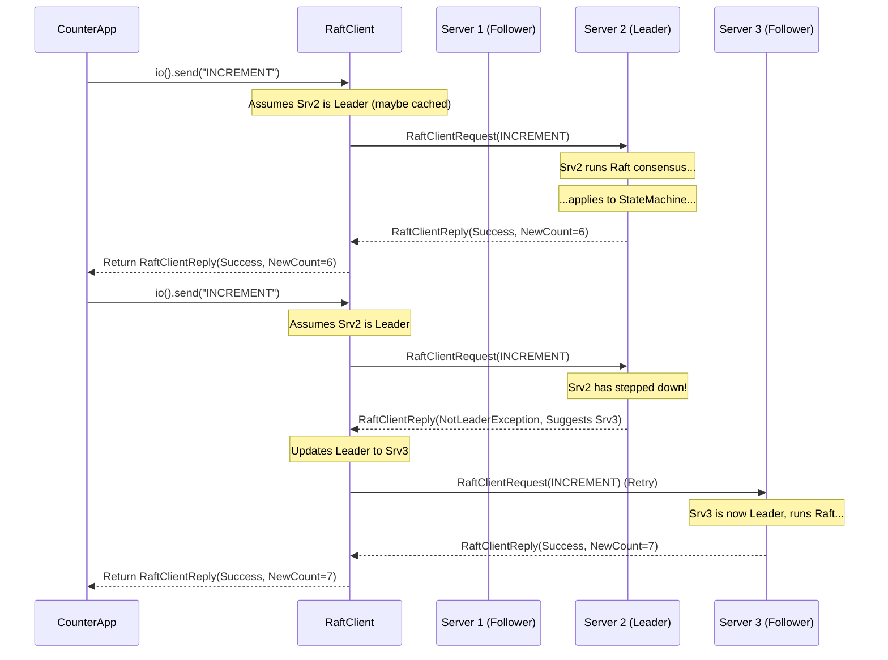

# Chapter 3: RaftClient

In the [previous chapter](02_raftgroup___raftpeer_.md), we learned how to define a team of servers using `RaftGroup` and `RaftPeer`. We now have a cluster defined for our reliable counter service. But how does an application *outside* this cluster, maybe a command-line tool or another web service, actually *use* the counter? How does it send the "INCREMENT" command or ask for the current "GET" value?

This is where the `RaftClient` comes in. It's the bridge between your external application and the Ratis cluster.

## What Problem Does RaftClient Solve?

Imagine you built your amazing, fault-tolerant counter service using Ratis, running on three servers (peer1, peer2, peer3) defined in a `RaftGroup`. Now, you want to write a simple application (let's call it `CounterApp`) that needs to:

1.  Increment the counter.
2.  Get the current value of the counter.

How does `CounterApp` know which of the three servers to talk to? What if the leader server (the one coordinating writes) crashes and a new leader is elected? Does `CounterApp` need complex logic to track the leader and handle failures?

`RaftClient` solves this! It acts like a **smart remote control** for your Ratis cluster. You tell the `RaftClient` about the `RaftGroup` (the team members), and it handles the complexities of:

*   **Finding the Leader:** Automatically figures out which server is the current leader.
*   **Sending Requests:** Sends your commands ("INCREMENT", "GET") to the right server (usually the leader).
*   **Handling Failures & Retries:** If the leader crashes or doesn't respond, the `RaftClient` automatically retries the request, potentially finding a new leader.

Essentially, `RaftClient` gives your application a stable way to interact with the Ratis cluster without needing to know the nitty-gritty details of the Raft protocol or current cluster status.

## How to Use RaftClient

Let's see how our `CounterApp` can use `RaftClient` to interact with the counter service.

### 1. Building the Client

First, we need to create a `RaftClient` instance. We use the `RaftClient.newBuilder()` for this. We need to provide it with the cluster information (`RaftGroup`) and some basic configuration (`RaftProperties`).

```java
import org.apache.ratis.client.RaftClient;
import org.apache.ratis.conf.RaftProperties;
import org.apache.ratis.protocol.*; // For RaftGroup, RaftPeer, etc.
import org.apache.ratis.thirdparty.com.google.protobuf.ByteString; // For Message content

import java.io.IOException;
import java.util.Arrays;
import java.util.List;
import java.util.UUID;

// Assume counterGroup is the RaftGroup we defined in Chapter 2
// RaftGroup counterGroup = ... ; (Defined with peer1, peer2, peer3)

// Basic properties (can be empty for simple cases)
RaftProperties properties = new RaftProperties();

// Build the client
RaftClient client = RaftClient.newBuilder()
        .setRaftGroup(counterGroup) // Tell the client about the cluster
        .setProperties(properties) // Provide configuration
        // .setRetryPolicy(...) // Optional: customize retry behavior
        // .setClientId(...) // Optional: Give the client a specific ID
        .build();

System.out.println("RaftClient created for group: " + client.getGroupId());
```

**Explanation:**

*   We import necessary classes.
*   We assume `counterGroup` (our `RaftGroup` containing `peer1`, `peer2`, `peer3`) is already defined, as shown in [Chapter 2: RaftGroup & RaftPeer](02_raftgroup___raftpeer_.md).
*   We create an empty `RaftProperties` object. More advanced configuration can be set here ([Configuration & Properties](09_configuration___properties__raftproperties__raftserverconfigkeys__etc__.md)).
*   `RaftClient.newBuilder()` starts the building process.
*   `.setRaftGroup(counterGroup)` is crucial – it tells the client which servers are part of the service.
*   `.setProperties(properties)` applies our configuration.
*   `.build()` creates the `RaftClient` instance.

This client is now ready to send requests to our counter cluster!

### 2. Sending a Write Request (INCREMENT)

To change the state (increment the counter), we typically send a request to the leader. `RaftClient` helps us do this easily. Ratis operations usually work with `Message` objects, which wrap the actual content (like our "INCREMENT" command).

We'll use the **blocking API** (`client.io()`) for simplicity here. This means our `CounterApp` will wait until the operation is complete and a reply is received.

```java
// Our command as a Message
Message incrementMessage = Message.valueOf("INCREMENT");

try {
    // Send the message via the blocking API
    RaftClientReply reply = client.io().send(incrementMessage);

    // Check if the operation was successful on the cluster
    if (reply.isSuccess()) {
        // The StateMachine (CounterStateMachine) returns the result
        String result = reply.getMessage().getContent().toStringUtf8();
        System.out.println("Successfully incremented. New count: " + result);
        System.out.println("Operation achieved commit index: " + reply.getLogIndex());
    } else {
        // Handle errors (e.g., cluster unavailable, exception from StateMachine)
        System.err.println("Increment failed: " + reply.getException());
    }

} catch (IOException e) {
    // Handle network or other communication errors
    System.err.println("Error communicating with Ratis cluster: " + e);
}
```

**Explanation:**

*   `Message.valueOf("INCREMENT")` creates a `Message` object containing our command string.
*   `client.io().send(incrementMessage)` sends the message. The `RaftClient` finds the leader, sends the request, waits for the Raft consensus process to commit the change, gets the result from the leader's [StateMachine](01_statemachine_.md), and returns it. This call *blocks* until the process completes or fails.
*   The returned `RaftClientReply` contains information about the operation.
*   `reply.isSuccess()` tells us if the command was successfully committed and applied by the cluster majority.
*   If successful, `reply.getMessage().getContent().toStringUtf8()` gives us the result returned by our `CounterStateMachine`'s `applyTransaction` method (the new count).
*   `reply.getLogIndex()` tells us the Raft log index assigned to this operation.
*   If not successful (`!reply.isSuccess()`), `reply.getException()` provides details about the failure.
*   The `try-catch` block handles potential communication issues.

### 3. Sending a Read Request (GET)

Reading the state usually doesn't require the full Raft consensus for *every* read, although Ratis supports different consistency levels. The simplest read just asks the leader for the current value.

```java
// Our query command as a Message
Message getMessage = Message.valueOf("GET");

try {
    // Send the read-only message via the blocking API
    // This typically goes to the leader by default
    RaftClientReply reply = client.io().sendReadOnly(getMessage);

    if (reply.isSuccess()) {
        String result = reply.getMessage().getContent().toStringUtf8();
        System.out.println("Successfully got count: " + result);
    } else {
        System.err.println("Get failed: " + reply.getException());
    }

} catch (IOException e) {
    System.err.println("Error communicating with Ratis cluster: " + e);
}

// Don't forget to close the client when done
try {
    client.close();
} catch (IOException e) {
    System.err.println("Error closing client: " + e);
}
```

**Explanation:**

*   `Message.valueOf("GET")` creates the query message.
*   `client.io().sendReadOnly(getMessage)` sends a read-only request. The `RaftClient` directs this to the current leader by default. The leader asks its local `CounterStateMachine`'s `query` method for the value and sends it back.
*   The reply handling is similar to the write request.
*   `client.close()` releases resources associated with the client (like network connections) when the application is finished.

### Other APIs

`RaftClient` provides more than just the blocking (`io()`) API:

*   **Async API (`async()`):** Sends requests and returns `CompletableFuture`s, allowing your application to do other things while waiting for the reply without blocking a thread. (See `org.apache.ratis.client.api.AsyncApi`)
*   **Message Stream API (`getMessageStreamApi()`):** Efficiently streams large messages to the leader, breaking them into smaller chunks. (See `org.apache.ratis.client.api.MessageStreamApi`)
*   **Data Stream API (`getDataStreamApi()`):** Streams potentially very large data blobs directly to *all* servers in the cluster, often leveraging network proximity. This is covered in more detail in the [DataStream API](08_datastream_api_.md) chapter. (See `org.apache.ratis.client.api.DataStreamApi`)
*   **Admin API (`admin()`):** Allows administrative tasks like adding/removing servers from the group.

## How RaftClient Works Internally (Simplified)

What magic happens when you call `client.io().send(incrementMessage)`?

1.  **Identify Leader:** The `RaftClient` checks who it currently thinks the leader is. It might have a cached leader ID. If not, or if the cached leader doesn't respond, it might ask one of the peers in the `RaftGroup` who the current leader is.
2.  **Prepare Request:** It wraps your `Message` ("INCREMENT") into a `RaftClientRequest` protocol message, adding details like the client's unique ID (`ClientId`) and a sequence number (`CallId`) to track the request.
3.  **Send via RPC:** It uses its internal [RPC Layer](06_rpc_layer__rpctype__rpcfactory__raftserverrpc__raftclientrpc_.md) component (`RaftClientRpc`) to send the `RaftClientRequest` over the network to the identified leader's address.
4.  **Wait for Reply:** The client waits for a `RaftClientReply` from the server.
5.  **Handle Reply:**
    *   **Success:** If the reply indicates success, it means the leader successfully replicated the command via Raft, applied it to its [StateMachine](01_statemachine_.md), and got a result. The client returns this result to your application. It also caches the leader ID if it wasn't sure before.
    *   **Not Leader Error:** If the reply says "I'm not the leader, try server X", the `RaftClient` updates its leader information to server X and automatically retries the request by sending it to server X. (See `RaftClientImpl::handleNotLeaderException`)
    *   **Timeout/Network Error:** If the request times out or there's a network error talking to the supposed leader, the `RaftClient` might pick another server from the `RaftGroup` to ask who the leader is, or it might retry the request to the same server after a delay, according to its configured `RetryPolicy`. (See `RaftClientImpl::handleIOException`)
    *   **Other Error:** If the reply contains an exception from the StateMachine or another Raft-level error, the client propagates this back to your application in the `RaftClientReply`.

Here's a simplified sequence diagram:



### Relevant Code

*   **Client Interface:** `org.apache.ratis.client.RaftClient` (in `ratis-client/src/main/java/org/apache/ratis/client/RaftClient.java`) defines the main API, including the builder and methods to get specific APIs (`io()`, `async()`, etc.).
*   **Implementation:** `org.apache.ratis.client.impl.RaftClientImpl` (in `ratis-client/src/main/java/org/apache/ratis/client/impl/RaftClientImpl.java`) contains the core logic, including leader tracking, retry handling (`handleIOException`, `handleNotLeaderException`), and coordinating with the `RaftClientRpc`.
*   **APIs:** The specific API implementations like `org.apache.ratis.client.impl.BlockingImpl` and `org.apache.ratis.client.impl.AsyncImpl` handle translating the API calls into `RaftClientRequest`s and processing the replies.

Looking at the `RaftClient.newBuilder()` in `RaftClient.java`:

```java
// From: ratis-client/src/main/java/org/apache/ratis/client/RaftClient.java
public final class Builder {
    // ... fields for clientId, clientRpc, group, leaderId, properties ...
    private RaftGroup group;
    private RaftProperties properties;
    private RetryPolicy retryPolicy = RetryPolicies.retryForeverNoSleep();
    // ... other fields ...

    public Builder setRaftGroup(RaftGroup grp) {
      this.group = grp; // Stores the group info
      return this;
    }

    public Builder setProperties(RaftProperties properties) {
      this.properties = properties; // Stores properties
      return this;
    }

    public RaftClient build() {
      // ... logic to initialize clientRpc based on properties if needed ...
      Objects.requireNonNull(group, "The 'group' field is not initialized.");
      // ...
      return ClientImplUtils.newRaftClient(clientId, group, leaderId, /*...*/);
    }
    // ... other setters ...
}
```

This builder simply collects the necessary configuration (`RaftGroup`, `RaftProperties`, `RetryPolicy`, etc.) before creating the actual `RaftClientImpl` instance.

## Conclusion

The `RaftClient` is your application's gateway to interacting with a Ratis cluster. It simplifies communication by handling leader discovery, request routing, and basic retries, allowing you to focus on your application logic. You configure it with the `RaftGroup` and then use one of its APIs (like the blocking `io()` or the non-blocking `async()`) to send commands or queries to the replicated service.

Key takeaways:

*   `RaftClient` connects external applications to a Ratis `RaftGroup`.
*   It automatically finds the leader and handles leader changes.
*   It provides different APIs (blocking, async, streaming) for sending requests.
*   It uses `Message` objects to wrap request content.
*   It returns results or errors in a `RaftClientReply`.

Now that we understand how a client talks to the cluster, let's look at the other side: the server process that actually runs the Raft protocol and hosts the StateMachine.

**Next:** [Chapter 4: RaftServer](04_raftserver_.md)

---

Generated by [AI Codebase Knowledge Builder](https://github.com/The-Pocket/Tutorial-Codebase-Knowledge)