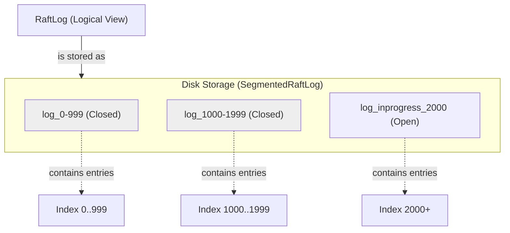

# Chapter 3: RaftLog - The Distributed System's Memory

In [Chapter 2: RaftServer - The Engine of Consensus](02_raftserver_.md), we met the `RaftServer`, the diligent manager responsible for coordinating agreement within a `RaftGroup`. We learned that these servers elect a Leader and work together to make decisions. But what exactly are they agreeing upon? And how do they remember these agreements reliably, especially if some servers crash or restart?

This is where the `RaftLog` comes in. It's the heart of keeping everyone on the same page.

## What is a RaftLog? The Unforgettable Ledger

Imagine our `RaftGroup` is a team managing a shared digital to-do list.
*   User Alice adds "Buy milk".
*   User Bob adds "Walk the dog".
*   User Carol adds "Pay bills".

For the to-do list to be consistent for everyone, all `RaftServer`s in the group must:
1.  Agree on the **exact order** of these tasks. Did "Buy milk" come before "Walk the dog"?
2.  **Reliably store** this sequence of tasks, even if some servers temporarily go offline or restart.
3.  Ensure that once a task is agreed upon by a majority, it's **permanently recorded**.

The **RaftLog** is the component that achieves this. Think of it as a **shared, ordered, and durable ledger** that all servers in a `RaftGroup` maintain and agree upon.

*   **Shared**: Every server in the group keeps a copy (or tries to keep its copy up-to-date with the Leader).
*   **Ordered**: Every entry (operation/task) in the log has a unique sequence number (an "index"). This defines the order.
*   **Durable**: Entries are typically written to persistent storage (like a hard drive), so they survive server restarts.

Every operation that changes the system's state (like adding a task to our to-do list, or setting a value in a distributed key-value store) is first written as an **entry** in this log. Once a majority of servers have this entry in their logs, it's considered **"committed"**. Only then can the operation be safely applied to the actual application data (which we'll cover in the [StateMachine](04_statemachine_.md) chapter).

The RaftLog ensures that even if some servers fail, the sequence of operations remains consistent across the surviving servers. This is the backbone of Raft's fault tolerance.

## Anatomy of a Log Entry

Each entry in the RaftLog isn't just the raw command; it has a bit more structure to help with coordination. Typically, a log entry contains:

1.  **Index**: A unique, sequential, positive integer. The first entry might be index 1, the next index 2, and so on. This determines the order of operations.
2.  **Term**: A number indicating the "election term" in which this entry was created by the Leader. Terms increase over time. This helps servers identify outdated or conflicting entries.
3.  **Command**: The actual operation requested by the client (e.g., "add task: Buy milk", or a more structured command like `SetValue("myKey", "myValue")`).
4.  **Type**: Information about the entry, e.g., whether it's a regular state machine command, a configuration change (like adding/removing servers), or a metadata update.

In Ratis, these log entries are represented internally by a Protocol Buffers message called `LogEntryProto`.

Let's look at a conceptual example of a few entries in a RaftLog for our to-do list:

| Index | Term | Command                 | Status      |
| :---- | :--- | :---------------------- | :---------- |
| 1     | 1    | Add: "Buy milk"         | Committed   |
| 2     | 1    | Add: "Walk the dog"     | Committed   |
| 3     | 2    | Add: "Pay bills"        | Committed   |
| 4     | 2    | Add: "Call mom"         | Uncommitted |

Here:
*   Entries 1, 2, and 3 are **committed**, meaning a majority of servers have them, and they can be applied.
*   Entry 4 is **uncommitted**; the Leader has proposed it, but not enough servers have acknowledged it yet.
*   Notice the term changed from 1 to 2 at index 3, likely because a new Leader was elected.

## The Journey of a Log Entry: From Proposal to Application

How does an operation make its way into the log and become official?

1.  **Proposal**: A client sends an operation (e.g., "Add: Water plants") to the current Leader `RaftServer`.
2.  **Local Append (Leader)**: The Leader assigns the next available index and its current term to the operation, creating a log entry. It appends this entry to its *own* RaftLog and persists it to its local storage.
3.  **Replication (Leader to Followers)**: The Leader then sends this new log entry (or multiple entries) to all Follower `RaftServer`s in the group via an "AppendEntries" RPC (Remote Procedure Call).
4.  **Local Append (Followers)**: Each Follower, upon receiving the entry, validates it (e.g., checks the term). If valid, it appends the entry to its own RaftLog and persists it. It then sends an acknowledgment back to the Leader.
5.  **Commitment (Leader)**: Once the Leader receives acknowledgments from a *majority* of the servers in the group (including itself), it considers the entry **committed**. The Leader keeps track of the highest index known to be committed (`commitIndex`).
6.  **Notification (Leader to Followers)**: The Leader informs Followers about the new `commitIndex` in subsequent AppendEntries RPCs (often in heartbeats). Followers then update their own `commitIndex`.
7.  **Application (All Servers)**: Once an entry is committed, each `RaftServer` (Leader and Followers) can independently "apply" the command in that log entry to its [StateMachine](04_statemachine_.md). Since they all apply the same sequence of committed entries, their StateMachines remain consistent.

This process is visualized below:

```mermaid
sequenceDiagram
    participant Client
    participant LeaderServer as RaftServer (Leader)
    participant LeaderLog as RaftLog (Leader)
    participant FollowerServer as RaftServer (Follower)
    participant FollowerLog as RaftLog (Follower)

    Client->>LeaderServer: Propose "Add: Water plants"
    LeaderServer->>LeaderLog: AppendEntry(term=2, index=5, "Water plants")
    Note over LeaderLog: Persists to disk
    LeaderLog-->>LeaderServer: Entry appended (Index 5)
    LeaderServer->>FollowerServer: AppendEntriesRPC(term=2, index=5, "Water plants")
    FollowerServer->>FollowerLog: AppendEntry(term=2, index=5, "Water plants")
    Note over FollowerLog: Persists to disk
    FollowerLog-->>FollowerServer: Entry appended (Index 5)
    FollowerServer-->>LeaderServer: Success (ACK for Index 5)
    LeaderServer->>LeaderLog: Update commitIndex to 5 (assuming majority ACKs)
    Note right of LeaderLog: Entry 5 is now committed!
    LeaderServer->>FollowerServer: Heartbeat (includes commitIndex=5)
    Note over FollowerServer: Learns Entry 5 is committed
    Note over LeaderServer, FollowerServer: Both can now apply "Water plants" to StateMachine
end
```

## Visualizing RaftLogs Across Servers

Let's imagine a `RaftGroup` with one Leader and two Followers. Their logs might look something like this at a point in time:

```mermaid
graph TD
    subgraph ClusterState [Raft Group State]
        direction TB
        subgraph LeaderNode [Leader Server]
            direction LR
            L_Log["RaftLog (Leader)"]
            L_Entry1["Idx 1, Term 1, Cmd A <br/>(Committed)"]
            L_Entry2["Idx 2, Term 1, Cmd B <br/>(Committed)"]
            L_Entry3["Idx 3, Term 2, Cmd C <br/>(Committed)"]
            L_Entry4["Idx 4, Term 2, Cmd D <br/>(Uncommitted)"]
            L_Log --> L_Entry1 --> L_Entry2 --> L_Entry3 --> L_Entry4
        end
        subgraph Follower1Node [Follower Server 1]
            direction LR
            F1_Log["RaftLog (Follower 1)"]
            F1_Entry1["Idx 1, Term 1, Cmd A <br/>(Committed)"]
            F1_Entry2["Idx 2, Term 1, Cmd B <br/>(Committed)"]
            F1_Entry3["Idx 3, Term 2, Cmd C <br/>(Committed)"]
            F1_Log --> F1_Entry1 --> F1_Entry2 --> F1_Entry3
        end
        subgraph Follower2Node [Follower Server 2]
            direction LR
            F2_Log["RaftLog (Follower 2)"]
            F2_Entry1["Idx 1, Term 1, Cmd A <br/>(Committed)"]
            F2_Entry2["Idx 2, Term 1, Cmd B <br/>(Committed)"]
            F2_Entry3["Idx 3, Term 2, Cmd C <br/>(Uncommitted by Follower2 yet)"]
            F2_Entry4["Idx 4, Term 2, Cmd D <br/>(Uncommitted by Follower2 yet)"]
            F2_Log --> F2_Entry1 --> F2_Entry2 --> F2_Entry3 --> F2_Entry4
        end
    end
    style L_Entry1 fill:#9f9,stroke:#333
    style L_Entry2 fill:#9f9,stroke:#333
    style L_Entry3 fill:#9f9,stroke:#333
    style L_Entry4 fill:#ff9,stroke:#333

    style F1_Entry1 fill:#9f9,stroke:#333
    style F1_Entry2 fill:#9f9,stroke:#333
    style F1_Entry3 fill:#9f9,stroke:#333

    style F2_Entry1 fill:#9f9,stroke:#333
    style F2_Entry2 fill:#9f9,stroke:#333
    style F2_Entry3 fill:#ff9,stroke:#333
    style F2_Entry4 fill:#ff9,stroke:#333
```



In this snapshot:
*   The Leader has entries up to index 4. Entries 1, 2, and 3 are committed (green). Entry 4 is still uncommitted on the Leader (yellow), awaiting more acknowledgments.
*   Follower 1 is fully caught up with committed entries. It knows entries 1, 2, and 3 are committed.
*   Follower 2 has replicated entries up to index 4 but might not yet have processed the leader's notification that entry 3 is committed. For Follower 2, entries 3 and 4 are still locally uncommitted (yellow).
*   Crucially, all servers that have an entry agree on its term and command for a given index. Raft ensures this!

## Peeking Under the Hood: RaftLog in Ratis

As an application developer using Ratis, you usually don't directly manipulate the `RaftLog` object instance byte-by-byte. The `RaftServer` handles most of the log management. However, understanding its interface and storage mechanism is helpful.

### The `RaftLog` Interface

Ratis defines a `RaftLog` interface that outlines the core operations a log implementation must provide. You can find this in `ratis-server-api/src/main/java/org/apache/ratis/server/raftlog/RaftLog.java`.

Here are some key methods (simplified for clarity):

```java
// Simplified from org.apache.ratis.server.raftlog.RaftLog
public interface RaftLog extends Closeable {

    // Get the log entry at a specific index
    LogEntryProto get(long index) throws RaftLogIOException;

    // Get the term and index for a log entry at a specific index
    TermIndex getTermIndex(long index);

    // Get an array of log entry headers (TermIndex) in a given range
    LogEntryHeader[] getEntries(long startIndex, long endIndex);

    // Get the index of the next entry to be appended
    long getNextIndex();

    // Get the index of the last entry that has been committed by a majority
    long getLastCommittedIndex();

    // Get the TermIndex of the last entry in the log
    TermIndex getLastEntryTermIndex();

    // Append a list of entries (Leader does this)
    // (This is a sequential operation, handled by RaftLogSequentialOps internally)
    // CompletableFuture<Long> append(LogEntryProto entry); // Conceptual

    // Purge log entries up to a certain index (e.g., after a snapshot)
    CompletableFuture<Long> purge(long suggestedIndex);

    // ... other methods for managing snapshots, metadata, etc.
}
```
*   `get(long index)`: Allows fetching a specific log entry.
*   `getLastCommittedIndex()`: This is super important! The [StateMachine](04_statemachine_.md) only applies entries up to this index.
*   `getNextIndex()`: Tells the Leader where the next new entry will be placed.
*   The actual `append` operations are handled through `RaftLogSequentialOps` and internally by methods like `appendEntryImpl` in base classes or `appendImpl` in specific implementations.

### How is the Log Stored? `SegmentedRaftLog`

If the RaftLog were only in memory, all agreed-upon operations would be lost if all servers restarted! So, Ratis needs to store the log durably. The primary implementation for this is `SegmentedRaftLog.java` (in `ratis-server/src/main/java/org/apache/ratis/server/raftlog/segmented/SegmentedRaftLog.java`).

Think of the entire `RaftLog` as a very long book. To make it manageable, `SegmentedRaftLog` divides this book into "chapters" called **Log Segments**.
*   Each `LogSegment` (represented by `LogSegment.java`) is typically a file on disk.
*   An open segment (`log_inprogress_<start_index>`) is actively being written to.
*   When an open segment reaches a certain size, or when the term changes, it's "closed" (renamed to `log_<start_index>-<end_index>`), and a new open segment is started.

This segmentation helps with:
*   Managing disk space: Older, fully committed segments can be deleted or archived after their state is captured in a [Snapshotting](08_snapshotting_.md) (a topic for a later chapter).
*   Efficiently finding entries.



### `MemoryRaftLog` for Testing

Ratis also provides `MemoryRaftLog.java` (in `ratis-server/src/main/java/org/apache/ratis/server/raftlog/memory/MemoryRaftLog.java`). This version keeps all log entries in memory. It's very fast and useful for unit tests or simple examples, but **it's not durable** and should not be used in production if you need data to survive restarts.

### Working with `LogEntryProto`

As mentioned, log entries are `LogEntryProto` messages. Ratis provides utilities to help create and inspect these. `LogProtoUtils.java` (in `ratis-server/src/main/java/org/apache/ratis/server/raftlog/LogProtoUtils.java`) has helpful static methods.

For example, to create a log entry for a state machine operation:

```java
import org.apache.ratis.proto.RaftProtos.LogEntryProto;
import org.apache.ratis.proto.RaftProtos.StateMachineLogEntryProto;
import org.apache.ratis.server.raftlog.LogProtoUtils;
import org.apache.ratis.thirdparty.com.google.protobuf.ByteString;
import org.apache.ratis.protocol.ClientId; // For creating a dummy client ID

// Let's assume some data for our state machine command
ByteString commandData = ByteString.copyFromUtf8("SET myKey=myValue");
ClientId dummyClientId = ClientId.randomId(); // In real scenarios, client provides this
long callId = 1; // A unique ID for this specific request from the client

// 1. Create the StateMachineLogEntryProto part
StateMachineLogEntryProto smEntry = StateMachineLogEntryProto.newBuilder()
    .setClientId(dummyClientId.toByteString())
    .setCallId(callId)
    .setLogData(commandData)
    .build();

// 2. Create the main LogEntryProto, including term and index
// (Term and index would normally be set by the RaftServer/Leader)
long currentTerm = 2;
long nextLogIndex = 101;

LogEntryProto logEntry = LogEntryProto.newBuilder()
    .setTerm(currentTerm)
    .setIndex(nextLogIndex)
    .setStateMachineLogEntry(smEntry)
    .build();

// You can then print it to see its content (in a human-readable way)
System.out.println("Created Log Entry: " + LogProtoUtils.toLogEntryString(logEntry));
```

Running this would output something like:
```
Created Log Entry: term:2, index:101, STATEMACHINELOGENTRY, type:DEFAULT: logData.size=15, stateMachineData.size=0, logEntryProtoSerializedSize=0
```
This output confirms the term, index, and that it's a `STATEMACHINELOGENTRY` with our command data. The `StateMachineLogEntryProto` also carries client ID and call ID, which are important for client request tracking and ensuring exactly-once semantics.

### Inspecting Log Files (For Advanced Users/Debugging)

What if you need to look inside the actual log segment files on disk? Ratis provides a tool for this! `ParseRatisLog.java` (in `ratis-tools/src/main/java/org/apache/ratis/tools/ParseRatisLog.java`) can read a segment file and print its contents. This is very useful for debugging or understanding the low-level state of a Ratis server.

You typically wouldn't use this tool in your application code, but it's good to know it exists if you're troubleshooting a Ratis cluster. For example, you might run it from the command line like (conceptually):
`java -cp <ratis-jars> org.apache.ratis.tools.ParseRatisLog --segmentFile /path/to/ratis/storage/groupXYZ/.../log_0-999`

## Conclusion

The `RaftLog` is the immutable, ordered, and replicated sequence of all operations that your distributed system agrees upon. It's the bedrock of consistency and fault tolerance in Ratis.
*   Every server in a `RaftGroup` maintains a copy of this log.
*   The Leader proposes new entries, and they become **committed** once a majority of servers have them.
*   Ratis persists this log to disk (usually via `SegmentedRaftLog`) to ensure durability.

You've now learned about the "team" ([RaftGroup & RaftPeer](01_raftgroup___raftpeer_.md)), the "manager" ([RaftServer](02_raftserver_.md)), and their shared "memory" (the `RaftLog`). But what do we *do* with the commands once they are safely committed in the RaftLog? That's the job of the [StateMachine](04_statemachine_.md), which we'll explore in the next chapter!

---

Generated by [AI Codebase Knowledge Builder](https://github.com/The-Pocket/Tutorial-Codebase-Knowledge)