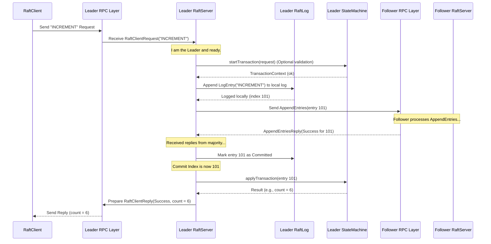

# Chapter 4: RaftServer

Welcome back! In the [previous chapter](03_raftclient_.md), we saw how a `RaftClient` acts as a remote control, allowing external applications to send commands ("INCREMENT", "GET") to our distributed counter service. The client cleverly finds the leader and handles retries for us.

But who is the client actually talking to? What process receives these requests, runs the Raft algorithm, and applies the commands to the [StateMachine](01_statemachine_.md)? This is the job of the **`RaftServer`**.

## What Problem Does RaftServer Solve?

Imagine our counter service needs to run on three computers (servers) to be fault-tolerant. We've defined the group membership using [RaftGroup & RaftPeer](02_raftgroup___raftpeer_.md). We've defined the counter logic using a [StateMachine](01_statemachine_.md). And we have a [RaftClient](03_raftclient_.md) ready to send commands.

We still need the actual software running on each of those three computers. This software needs to:

1.  Listen for network connections from clients and other servers.
2.  Participate in the Raft consensus protocol (electing leaders, replicating logs).
3.  Store the replicated log ([RaftLog](05_raftlog_.md)) persistently.
4.  Take committed log entries and give them to our `CounterStateMachine` to execute.

The `RaftServer` is the core abstraction in Ratis that represents this running process on a single machine within the cluster. It's the engine that drives the replication and consensus.

## What is a RaftServer?

Think of the `RaftGroup` as the definition of the entire committee, and a `RaftPeer` as the description of one member. The `RaftServer` is the *actual person* (or process) representing that member, sitting at the committee table, doing the work.

Each `RaftServer` instance:

*   **Represents a Single Node:** It runs on one machine in your cluster.
*   **Participates in Raft:** It implements the Raft consensus algorithm, communicating with its peers (other `RaftServer` instances) using the [RPC Layer](06_rpc_layer__rpctype__rpcfactory__raftserverrpc__raftclientrpc__.md).
*   **Manages Local State:** It maintains its own copy of the [RaftLog](05_raftlog_.md) (the sequence of agreed-upon commands) and other Raft-related state like the current term and who it voted for.
*   **Hosts the StateMachine:** It holds an instance of your application's [StateMachine](01_statemachine_.md) (like `CounterStateMachine`). When Raft agrees on a command, the `RaftServer` applies it to the StateMachine.
*   **Has a Role:** At any given time, a `RaftServer` is in one of three roles:
    *   **Leader:** The active coordinator for the group. Handles client writes, replicates logs to followers. There's usually only one leader per group at a time.
    *   **Follower:** A passive member. Replicates logs sent by the leader, responds to leader heartbeats, and votes in elections. Most servers are followers most of the time.
    *   **Candidate:** A temporary role. If a follower doesn't hear from the leader for a while, it becomes a candidate and starts an election to try and become the new leader.
*   **Listens for Requests:** It listens for RPC requests from both `RaftClient`s and other `RaftServer`s.

Essentially, a `RaftServer` ties together the networking, the consensus protocol, the persistent log, and your application's state machine logic on a single node.

## How to Create and Start a RaftServer

To run a node in your Ratis cluster, you need to create and start a `RaftServer` instance. This is typically done in the main entry point of your server application. We use the `RaftServer.newBuilder()` for this.

Let's look at a simplified example of how you might start one server for our counter application.

```java
import org.apache.ratis.conf.RaftProperties;
import org.apache.ratis.examples.counter.server.CounterStateMachine; // Your StateMachine
import org.apache.ratis.grpc.GrpcConfigKeys; // For setting network ports
import org.apache.ratis.protocol.*; // RaftGroup, RaftPeer, RaftPeerId
import org.apache.ratis.server.RaftServer;
import org.apache.ratis.server.RaftServerConfigKeys; // For setting storage dir
import org.apache.ratis.server.storage.RaftStorage;
import org.apache.ratis.statemachine.StateMachine;

import java.io.File;
import java.io.IOException;
import java.util.Collections;

// Assume 'counterGroup' is the RaftGroup defined in Chapter 2
// RaftGroup counterGroup = ... ;

// Assume 'thisPeerId' is the ID of the server we are currently starting
// RaftPeerId thisPeerId = RaftPeerId.valueOf("server1");

public class MyCounterServer {

    public static void main(String[] args) throws IOException {
        // 1. Define which server this is and where it stores data
        RaftPeerId thisPeerId = RaftPeerId.valueOf(args[0]); // e.g., "server1"
        File storageDir = new File("./storage-" + thisPeerId.toString());

        // 2. Create RaftProperties for configuration
        RaftProperties properties = new RaftProperties();

        // 3. Configure storage directory
        RaftServerConfigKeys.setStorageDir(properties, Collections.singletonList(storageDir));

        // 4. Configure the network port for this server
        // (Get the peer's address from the group definition)
        RaftPeer thisPeer = Constants.RAFT_GROUP.getPeer(thisPeerId);
        int port = org.apache.ratis.util.NetUtils.createSocketAddr(thisPeer.getAddress()).getPort();
        GrpcConfigKeys.Server.setPort(properties, port); // Using gRPC here

        // 5. Create the StateMachine instance
        StateMachine counterStateMachine = new CounterStateMachine();

        // 6. Build the RaftServer
        RaftServer server = RaftServer.newBuilder()
                .setServerId(thisPeerId)           // Identify this server
                .setGroup(Constants.RAFT_GROUP)   // Define the group and its members
                .setProperties(properties)        // Apply configuration
                .setStateMachine(counterStateMachine) // Set the application logic
                .setOption(RaftStorage.StartupOption.RECOVER) // Try to recover state on start
                .build();

        // 7. Start the server
        server.start();

        System.out.println(thisPeerId + " started. Press Ctrl+C to shutdown.");

        // Keep the server running (in a real app, might wait indefinitely)
        // server.close(); // Usually called on shutdown
    }
}
// Note: Constants.RAFT_GROUP needs to be defined elsewhere, similar to Chapter 2.
// This example uses code structure similar to ratis-examples/counter/server/CounterServer.java
```

**Explanation:**

1.  We identify the current server (e.g., "server1") and define a unique storage directory for it. `RaftServer` needs a place to store the [RaftLog](05_raftlog_.md) and snapshots.
2.  We create `RaftProperties` to hold configuration settings.
3.  `RaftServerConfigKeys.setStorageDir()` tells Ratis where to store its persistent data.
4.  We extract the network address for this specific peer from the `RaftGroup` definition and configure the corresponding network port (using gRPC settings in this case) in the properties. This tells the server which network address and port to listen on for communication.
5.  We create an instance of our `CounterStateMachine` ([Chapter 1: StateMachine](01_statemachine_.md)).
6.  `RaftServer.newBuilder()` starts the construction process:
    *   `.setServerId()`: Specifies the unique ID of this server process.
    *   `.setGroup()`: Tells the server which [RaftGroup](02_raftgroup___raftpeer_.md) it belongs to and who its peers are.
    *   `.setProperties()`: Applies all the configuration we set (storage, port, etc.). See [Configuration & Properties](09_configuration___properties__raftproperties__etc__.md).
    *   `.setStateMachine()`: Plugs in our application logic.
    *   `.setOption(RaftStorage.StartupOption.RECOVER)`: Tells the server to try and load existing state from the storage directory when starting. `FORMAT` would wipe existing state.
    *   `.build()`: Creates the `RaftServer` instance.
7.  `server.start()`: This crucial step initializes the server, starts the network listeners, loads state from storage, and begins participating in the Raft protocol (usually starting as a Follower).

After `start()`, the `RaftServer` is active, listening for requests, and ready to participate in the cluster.

## RaftServer Roles (A Quick Look)

As mentioned, a `RaftServer` operates in one of three roles: Leader, Follower, or Candidate. Ratis handles the transitions between these roles automatically based on the Raft algorithm rules (timeouts, voting, etc.). You don't typically manage these roles directly, but it's good to know they exist:

*   **Follower:** The default state. Listens to the Leader, replicates logs, votes in elections. Does *not* directly handle client write requests.
*   **Candidate:** If a Follower doesn't hear from the Leader within a certain timeout (the "election timeout"), it increases its term, votes for itself, and becomes a Candidate. It then sends `RequestVote` RPCs to other servers asking for their votes.
*   **Leader:** If a Candidate receives votes from a majority of the servers, it becomes the Leader. It then starts handling client requests, replicating log entries to Followers, and sending periodic heartbeats (empty `AppendEntries` RPCs) to maintain authority.

## How a RaftServer Handles a Client Write Request (Leader's View)

Let's trace how a `RaftServer` (specifically, the *Leader*) handles an "INCREMENT" request from a `RaftClient`:



**Simplified Steps:**

1.  **Receive:** The Leader's [RPC Layer](06_rpc_layer__rpctype__rpcfactory__raftserverrpc__raftclientrpc__.md) gets the client request.
2.  **Validate:** The `RaftServer` confirms it's the active, ready Leader. It might optionally call `stateMachine.startTransaction()` for early validation.
3.  **Log Locally:** The Leader creates a log entry for the command and appends it to its *own* [RaftLog](05_raftlog_.md).
4.  **Replicate:** The Leader sends `AppendEntries` RPCs containing the new log entry to all Follower servers.
5.  **Wait for Majority:** The Leader waits until it receives success replies from a majority of servers (including itself).
6.  **Commit:** Once a majority confirms they have the entry, the Leader considers the entry "committed". This means it's safely stored on most servers and won't be lost. The Leader updates its internal "commit index".
7.  **Apply:** The Leader passes the *committed* log entry to its local `CounterStateMachine` instance by calling `applyTransaction()`.
8.  **Reply:** The `StateMachine` executes the command (increments the counter) and returns the result. The Leader sends this result back to the `RaftClient`.

Followers also apply committed entries to their own StateMachines when they learn the commit index has advanced, ensuring all StateMachines eventually reach the same state.

## Code Dive (Light)

Where does the `RaftServer` logic live in the Ratis codebase?

*   **Interface:** `org.apache.ratis.server.RaftServer` (in `ratis-server-api`) defines the primary interface and the `Builder` we used earlier.
    ```java
    // From: ratis-server-api/src/main/java/org/apache/ratis/server/RaftServer.java
    public interface RaftServer extends Closeable /*, ... many RPC interfaces */ {
      // Get the server's unique ID
      RaftPeerId getId();

      // Get the RaftGroups this server is a member of
      Iterable<RaftGroupId> getGroupIds();
      Iterable<RaftGroup> getGroups() throws IOException;

      // Get the server's state specific to a group (Role, Log, SM, etc.)
      Division getDivision(RaftGroupId groupId) throws IOException;

      // Start the server process
      void start() throws IOException;

      // Get the server's lifecycle state (NEW, STARTING, RUNNING, CLOSED, ...)
      LifeCycle.State getLifeCycleState();

      // Get the builder
      static Builder newBuilder() { ... }

      // Inner interface representing the server's role within one specific group
      interface Division extends Closeable {
          DivisionInfo getInfo(); // Get role, leader ID, term, indices
          RaftLog getRaftLog();
          StateMachine getStateMachine();
          // ... other group-specific methods ...
      }

      // Builder class (simplified)
      class Builder {
        public Builder setServerId(RaftPeerId serverId);
        public Builder setGroup(RaftGroup group);
        public Builder setStateMachine(StateMachine stateMachine);
        public Builder setProperties(RaftProperties properties);
        public Builder setOption(RaftStorage.StartupOption option);
        public RaftServer build() throws IOException;
      }
    }
    ```
    *The `Division` inner interface is important: a single `RaftServer` process can potentially participate in multiple `RaftGroup`s simultaneously. The `Division` provides access to the state (log, state machine, role info) specific to one group.*

*   **Main Implementation:** `org.apache.ratis.server.impl.RaftServerProxy` (in `ratis-server`) is the typical entry point created by the builder. It acts as a manager or proxy.
    *   It holds the server's overall ID and configuration (`RaftProperties`).
    *   It manages the RPC endpoints.
    *   Crucially, it maintains a map from `RaftGroupId` to `RaftServerImpl` instances. If a server belongs to multiple groups, there will be multiple `RaftServerImpl` objects inside the `RaftServerProxy`.

*   **Group-Specific Implementation:** `org.apache.ratis.server.impl.RaftServerImpl` (in `ratis-server`) contains the core Raft logic for a *single group* within a server process.
    *   This class manages the `ServerState` (term, vote, log, configuration).
    *   It implements the role transitions (e.g., `changeToFollower`, `changeToLeader`, `changeToCandidate`).
    *   It handles incoming RPCs like `requestVote`, `appendEntries`, and `installSnapshot`.
    *   It interacts directly with the `RaftLog` and the `StateMachine` for that specific group.
    *   It contains the `RoleInfo` object which holds the current role (Leader, Follower, Candidate) and the state specific to that role (e.g., `LeaderStateImpl`, `FollowerState`).

You can see the `RaftServer.Builder` being used in the example server classes like:
*   `ratis-examples/src/main/java/org/apache/ratis/examples/counter/server/CounterServer.java`
*   `ratis-examples/src/main/java/org/apache/ratis/examples/arithmetic/cli/Server.java`
*   `ratis-examples/src/main/java/org/apache/ratis/examples/filestore/cli/Server.java`

These examples show how to configure properties, create a `StateMachine`, and then build and start the `RaftServer`.

## Conclusion

The `RaftServer` is the workhorse of a Ratis cluster. It's the actual running process on each node that embodies a `RaftPeer`. It executes the Raft consensus algorithm, manages the persistent log, listens for client and peer requests, and drives the application's `StateMachine`. By running multiple cooperating `RaftServer` instances defined by a `RaftGroup`, Ratis achieves fault tolerance and data replication.

Key takeaways:

*   `RaftServer` represents a single running node in the cluster.
*   It's built using `RaftServer.newBuilder()`, requiring configuration like ID, group, StateMachine, and properties.
*   It runs the Raft protocol, managing roles (Leader, Follower, Candidate).
*   It interacts with the [RaftLog](05_raftlog_.md) for persistence and the [StateMachine](01_statemachine_.md) to apply application logic.
*   `RaftServerProxy` often manages multiple `RaftServerImpl` instances, one for each group the server belongs to.

We've seen that the `RaftServer` relies heavily on storing the sequence of commands. How is this log managed? Let's dive into the persistent heart of Ratis in the next chapter.

**Next:** [Chapter 5: RaftLog](05_raftlog_.md)

---

Generated by [AI Codebase Knowledge Builder](https://github.com/The-Pocket/Tutorial-Codebase-Knowledge)