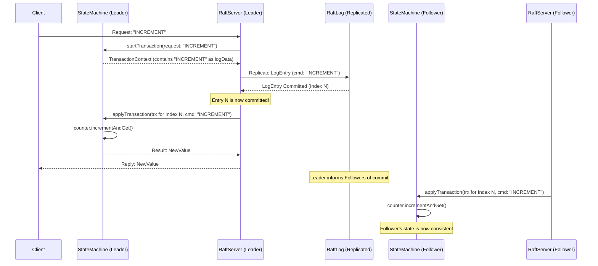

# Chapter 4: StateMachine - Where Your Application Logic Lives

In the [previous chapter on RaftLog](03_raftlog_.md), we learned how Ratis reliably stores a sequence of commands (log entries) agreed upon by all servers in a `RaftGroup`. Think of the `RaftLog` as a super-dependable, ordered to-do list. But just having a to-do list isn't enough; someone actually needs to *do* the tasks!

This is where the `StateMachine` comes into play. It's the component that takes these agreed-upon commands from the `RaftLog` and applies them to make changes to your application's data.

## What is a StateMachine? The Application's Worker Bee

Imagine Raft as a reliable delivery service for messages (we call these "transactions" or "commands"). The `RaftLog` ensures these messages arrive in the exact same order for everyone. The **StateMachine** is like the recipient at the destination who opens these messages (committed log entries) and acts upon them.

If your Ratis application is:
*   A distributed counter: The `StateMachine` increments the counter.
*   A distributed key-value store: The `StateMachine` puts or gets values.
*   A distributed configuration manager: The `StateMachine` updates configuration settings.

Essentially, **the `StateMachine` is where your application's specific business logic lives.**

It's responsible for:
1.  **Applying Committed Log Entries**: Taking commands that the Raft consensus process has confirmed (committed) and executing them. This changes the "state" of your application (e.g., the value of a counter, the contents of a database).
2.  **Maintaining Application State**: Holding the actual data of your application (e.g., in memory, in files).
3.  **Responding to Queries**: Answering read-only requests about the current state (e.g., "What's the current value of the counter?").
4.  **Snapshotting**: Periodically creating a "snapshot" of its current state. This helps to prevent the `RaftLog` from growing forever, as old log entries covered by the snapshot can then be discarded. (We'll cover this in detail in the [Snapshotting](08_snapshotting_.md) chapter).

Because every `RaftServer` in the group applies the *same sequence* of committed log entries to its *own instance* of the `StateMachine`, their application states remain consistent.

## The `StateMachine` Interface

In Ratis, your application logic is implemented by creating a class that implements the `org.apache.ratis.statemachine.StateMachine` interface. This interface defines the contract between the Ratis core (the `RaftServer`) and your application code.

Let's look at some of the most important methods you'll typically implement or interact with:

*   **`void initialize(RaftServer server, RaftGroupId groupId, RaftStorage storage) throws IOException;`**
    This method is called once when the `RaftServer` starts up your `StateMachine` for a particular `RaftGroup`. You can use it to load any persisted state (like the latest snapshot) and prepare your `StateMachine` for operation.

*   **`CompletableFuture<Message> applyTransaction(TransactionContext trx);`**
    This is the heart of the `StateMachine`! When a log entry is committed by the Raft protocol, the `RaftServer` calls this method on each peer. Your `StateMachine` implementation will:
    1.  Inspect the `TransactionContext` (`trx`) to get the command from the `LogEntryProto`.
    2.  Execute the command, changing its internal state.
    3.  Return a `CompletableFuture<Message>` which eventually contains the result of the operation (e.g., a success message, or the new value of a counter). This result is sent back to the client by the leader.

*   **`CompletableFuture<Message> query(Message request);`**
    This method handles read-only requests. It should not change the state of the `StateMachine`. It simply inspects the current state and returns a result. For example, getting the current value of a counter.

*   **`long takeSnapshot() throws IOException;`**
    This method is called by the `RaftServer` when it decides a snapshot is needed. Your `StateMachine` should save its current state to a persistent location (managed by `StateMachineStorage`) and return the log index up to which the state has been saved.

*   **`TransactionContext startTransaction(RaftClientRequest request) throws IOException;`**
    When the leader `RaftServer` receives a new request from a client, it calls this method on its `StateMachine`. The `StateMachine` can validate the request and prepare a `StateMachineLogEntryProto` (which contains the actual command bytes to be replicated). This is then packaged into a `TransactionContext` which Ratis will use to create the `LogEntryProto` for the `RaftLog`.

*   **`TermIndex getLastAppliedTermIndex();`**
    Your `StateMachine` needs to keep track of the term and index of the last log entry it has successfully applied. The `BaseStateMachine` (which we'll see soon) helps with this.

### What is `TransactionContext`?

You'll see `TransactionContext` passed around a lot. Think of it as a briefcase carrying all the relevant information about a single operation as it moves through Ratis and your `StateMachine`.

It can hold:
*   The original `RaftClientRequest` (on the leader when a transaction starts).
*   The `LogEntryProto` (when a committed entry is being applied or when a follower receives an entry). This `LogEntryProto` contains your `StateMachineLogEntryProto`, which has the actual command for your application.
*   Any exception that occurred during processing.
*   A place for the `StateMachine` to put any custom context it needs.

```java
// A peek at TransactionContext (simplified concept from TransactionContext.java)
public interface TransactionContext {
    RaftClientRequest getClientRequest(); // If it originated from a client on this server
    LogEntryProto getLogEntry();          // The Raft log entry being processed
    StateMachineLogEntryProto getStateMachineLogEntry(); // Your application-specific part of the log entry
    // ... other methods to set/get exceptions, context, etc.
}
```
This `TransactionContext` ensures that all necessary information is available at each stage of processing an operation.

## Example: A Simple Counter `StateMachine`

Let's build a very basic `StateMachine` that manages a single integer counter. It will support two operations: "increment" and "get".

We'll extend `org.apache.ratis.statemachine.impl.BaseStateMachine`, which provides helpful default implementations for many `StateMachine` methods, like managing the `lastAppliedTermIndex`.

```java
import org.apache.ratis.examples.counter.CounterCommand; // Defines GET, INCREMENT
import org.apache.ratis.proto.RaftProtos.LogEntryProto;
import org.apache.ratis.proto.RaftProtos.RaftPeerRole;
import org.apache.ratis.protocol.Message;
import org.apache.ratis.protocol.RaftClientRequest;
import org.apache.ratis.server.protocol.TermIndex;
import org.apache.ratis.statemachine.TransactionContext;
import org.apache.ratis.statemachine.impl.BaseStateMachine;
import org.apache.ratis.thirdparty.com.google.protobuf.ByteString;

import java.nio.ByteBuffer;
import java.util.concurrent.CompletableFuture;
import java.util.concurrent.atomic.AtomicInteger;

public class SimpleCounterStateMachine extends BaseStateMachine {
    private final AtomicInteger counter = new AtomicInteger(0);

    // Helper to convert int to ByteString for messages
    private static ByteString intToByteString(int value) {
        ByteBuffer buffer = ByteBuffer.allocate(Integer.BYTES);
        buffer.putInt(value);
        buffer.flip();
        return ByteString.copyFrom(buffer);
    }

    // Helper to convert ByteString to int
    private static int byteStringToInt(ByteString bs) {
        return bs.asReadOnlyByteBuffer().getInt();
    }

    @Override
    public CompletableFuture<Message> query(Message request) {
        String command = request.getContent().toStringUtf8();
        if (CounterCommand.GET.matches(command)) {
            // For GET, return the current counter value
            return CompletableFuture.completedFuture(Message.valueOf(intToByteString(counter.get())));
        }
        // If unknown command, return an error or handle appropriately
        return CompletableFuture.failedFuture(new IllegalArgumentException("Unknown query: " + command));
    }

    @Override
    public TransactionContext startTransaction(RaftClientRequest request) {
        ByteString command = request.getMessage().getContent();
        TransactionContext.Builder builder = TransactionContext.newBuilder()
                .setStateMachine(this)
                .setClientRequest(request);

        if (CounterCommand.INCREMENT.matches(command.toStringUtf8())) {
            // For INCREMENT, the command itself is the log data
            builder.setLogData(command);
        } else {
            // For other commands, you might set an exception or handle differently
            // For simplicity, let's assume only INCREMENT is a valid write transaction
            return builder.setException(new IllegalArgumentException("Unknown transaction: " + command)).build();
        }
        return builder.build();
    }

    @Override
    public CompletableFuture<Message> applyTransaction(TransactionContext trx) {
        LogEntryProto entry = trx.getLogEntry();
        // The StateMachineLogEntryProto contains the actual command from startTransaction
        String command = entry.getStateMachineLogEntry().getLogData().toStringUtf8();

        TermIndex currentTermIndex = TermIndex.valueOf(entry);
        int newValue = -1;

        if (CounterCommand.INCREMENT.matches(command)) {
            newValue = counter.incrementAndGet();
            // IMPORTANT: Update the last applied term and index
            updateLastAppliedTermIndex(currentTermIndex);
            if (trx.getServerRole() == RaftPeerRole.LEADER) {
                LOG.info("{}: Incremented counter to {} at {}", getId(), newValue, currentTermIndex);
            }
        } else {
            return CompletableFuture.failedFuture(
                    new IllegalArgumentException("Unknown command in log: " + command));
        }
        // Return the new counter value as the result of the transaction
        return CompletableFuture.completedFuture(Message.valueOf(intToByteString(newValue)));
    }

    // For takeSnapshot, loadSnapshot, initialize etc. we'd add more logic.
    // BaseStateMachine provides some defaults. For a real app, you'd implement snapshotting.
}
```

Let's break this down:
*   `counter`: An `AtomicInteger` holds our application's state (the current count).
*   `query(Message request)`:
    *   It checks if the request is "GET".
    *   If so, it reads the current value of `counter` and returns it in a `Message`.
    *   Read-only operations like this *must not* change the state.
*   `startTransaction(RaftClientRequest request)`:
    *   This is called on the Leader when a client sends a command like "INCREMENT".
    *   It checks if the command is "INCREMENT".
    *   If so, it sets the command itself as the `logData` in the `TransactionContext`. This `logData` will be replicated.
*   `applyTransaction(TransactionContext trx)`:
    *   This is called on *all* servers (Leader and Followers) once the "INCREMENT" command is committed in the `RaftLog`.
    *   It gets the command from the `LogEntryProto` within the `TransactionContext`.
    *   If it's "INCREMENT", it increments `counter.incrementAndGet()`.
    *   Crucially, it calls `updateLastAppliedTermIndex(currentTermIndex)` to tell `BaseStateMachine` (and Ratis) which log entry it has just processed.
    *   It returns the new counter value as the result.

When you create a `RaftServer` (as shown in [Chapter 2: RaftServer](02_raftserver_.md)), you would tell it to use this `StateMachine`:

```java
// ... (imports and setup from Chapter 2) ...
// RaftGroup raftGroup = ...;
// RaftProperties properties = ...;
// RaftPeerId myServerId = ...;

StateMachine.Registry smRegistry = new StateMachine.Registry() {
    @Override
    public StateMachine apply(RaftGroupId raftGroupId) {
        // For any group, return an instance of our SimpleCounterStateMachine
        return new SimpleCounterStateMachine();
    }
};

RaftServer server = RaftServer.newBuilder()
        .setServerId(myServerId)
        .setGroup(raftGroup) // Or add groups later
        .setStateMachineRegistry(smRegistry) // Here's where we plug it in!
        .setProperties(properties)
        .build();

// server.start();
```
Now, any requests for the `RaftGroup` that this server is part of will be processed by `SimpleCounterStateMachine`.

## How it Works: The Journey of an "Increment" Command

Let's trace what happens when a client wants to increment our distributed counter:



1.  **Client Request**: The client sends an "INCREMENT" command to the Ratis cluster. This request lands on the Leader `RaftServer`.
2.  **Leader: `startTransaction`**: The Leader `RaftServer` calls `startTransaction()` on its `SimpleCounterStateMachine`. The `StateMachine` validates the command and prepares the `logData` (which is just "INCREMENT" itself).
3.  **Log Replication**: The Leader `RaftServer` creates a `LogEntryProto` with this `logData` and replicates it to Follower servers using the `RaftLog` mechanism.
4.  **Commitment**: Once a majority of servers have acknowledged storing this log entry, the Leader considers it "committed".
5.  **Leader: `applyTransaction`**: The Leader `RaftServer` now calls `applyTransaction()` on its `SimpleCounterStateMachine` with the committed log entry. The `StateMachine` increments its `counter` and returns the new value.
6.  **Reply to Client**: The Leader `RaftServer` sends the new counter value back to the client.
7.  **Followers: `applyTransaction`**: Followers also learn that the log entry is committed (usually via the Leader's heartbeats or subsequent log appends). Each Follower `RaftServer` independently calls `applyTransaction()` on its *own* instance of `SimpleCounterStateMachine`. They too increment their `counter`.

Because everyone applies the same "INCREMENT" command from the same committed log entry, all counters across the cluster remain synchronized!

## A Quick Word on Snapshots

As your application runs, the `RaftLog` will grow longer and longer with committed entries. To prevent it from consuming too much disk space and to speed up recovery for new or restarted servers, Ratis uses snapshotting.

The `StateMachine` is responsible for:
*   **`takeSnapshot()`**: Creating a compact representation of its current state (e.g., for our counter, just writing the current integer value to a file) and telling Ratis the log index covered by this snapshot.
*   **Loading from a snapshot**: During `initialize()` or `reinitialize()`, the `StateMachine` must be able to read its state from the latest snapshot file.

Once a snapshot is taken, Ratis can safely purge older log entries from the `RaftLog` because their effects are already captured in the snapshot.

We won't dive deep into implementing `takeSnapshot()` here, as it's covered extensively in the [Snapshotting](08_snapshotting_.md) chapter. For `SimpleCounterStateMachine`, it would involve:
1.  Getting the current `counter` value and `lastAppliedTermIndex`.
2.  Writing these to a file managed by `StateMachineStorage`.
3.  Returning the `lastAppliedTermIndex.getIndex()`.

## Under the Hood: Key Files and Classes

You've seen the `StateMachine` interface. Let's briefly touch upon some relevant classes from the Ratis codebase that you might encounter or use:

*   **`ratis-server-api/src/main/java/org/apache/ratis/statemachine/StateMachine.java`**:
    This is the core interface we've been discussing. Key methods like `applyTransaction`, `query`, `takeSnapshot`, `initialize`, and `startTransaction` are defined here.

*   **`ratis-server-api/src/main/java/org/apache/ratis/statemachine/TransactionContext.java`**:
    As mentioned, this class acts as a container for transaction-related information. It's created by `RaftServer` (often with input from `StateMachine.startTransaction`) and passed to methods like `applyTransaction`.
    ```java
    // Simplified conceptual structure
    public interface TransactionContext {
        // ...
        LogEntryProto getLogEntry(); // The entry from RaftLog
        StateMachineLogEntryProto getStateMachineLogEntry(); // Data specific to SM
        RaftClientRequest getClientRequest(); // Original client request (on leader)
        TransactionContext setException(Exception e); // To report errors
        // ...
    }
    ```

*   **`ratis-server/src/main/java/org/apache/ratis/statemachine/impl/BaseStateMachine.java`**:
    This is a very convenient abstract class that provides default implementations for many `StateMachine` methods.
    For example, it handles the logic for `getLastAppliedTermIndex()` and `updateLastAppliedTermIndex()`.
    Most custom StateMachines in Ratis examples extend `BaseStateMachine` to reduce boilerplate code.
    ```java
    // Simplified from BaseStateMachine.java
    public class BaseStateMachine implements StateMachine {
        private final AtomicReference<TermIndex> lastAppliedTermIndex = new AtomicReference<>();

        public BaseStateMachine() {
            setLastAppliedTermIndex(TermIndex.INITIAL_VALUE);
        }

        @Override
        public TermIndex getLastAppliedTermIndex() {
            return lastAppliedTermIndex.get();
        }

        protected boolean updateLastAppliedTermIndex(TermIndex newTI) {
            // ... (logic to update and validate lastAppliedTermIndex) ...
            // This is called by your SM's applyTransaction
            return true; // if updated
        }

        // Provides default no-op or basic implementations for many other methods
        // like pause, reinitialize, close, takeSnapshot (returns invalid index) etc.
    }
    ```
    By extending `BaseStateMachine`, our `SimpleCounterStateMachine` inherited this `lastAppliedTermIndex` management.

*   **Example StateMachines in `ratis-examples`**:
    The `ratis-examples` module contains several `StateMachine` implementations:
    *   `org.apache.ratis.examples.counter.server.CounterStateMachine.java`: A more complete version of our simple counter, including snapshotting.
    *   `org.apache.ratis.examples.arithmetic.ArithmeticStateMachine.java`: Implements a distributed calculator that can store variables.
    *   `org.apache.ratis.examples.filestore.FileStoreStateMachine.java`: A more complex example demonstrating a distributed file store, including streaming data.

    Looking at these examples is a great way to see `StateMachine` concepts in action. For instance, in `CounterStateMachine.java`'s `applyTransaction`:
    ```java
    // Snippet from ratis-examples/.../counter/server/CounterStateMachine.java
    @Override
    public CompletableFuture<Message> applyTransaction(TransactionContext trx) {
        final LogEntryProto entry = trx.getLogEntry();
        //increment the counter and update term-index
        final TermIndex termIndex = TermIndex.valueOf(entry);
        final int incremented = incrementCounter(termIndex); // Calls counter.incrementAndGet() and updateLastApplied...

        //if leader, log the incremented value and the term-index
        if (LOG.isDebugEnabled() && trx.getServerRole() == RaftPeerRole.LEADER) {
            LOG.debug("{}: Increment to {}", termIndex, incremented);
        }

        //return the new value of the counter to the client
        return CompletableFuture.completedFuture(Message.valueOf(toByteString(incremented)));
    }
    ```
    This is very similar to our simplified version, showing the core pattern of extracting the command, updating state, and tracking the applied index.

## Conclusion

The `StateMachine` is where your specific application logic plugs into the Ratis framework. Raft takes care of reliably replicating and ordering your commands (as `LogEntryProto`s in the `RaftLog`), and the `StateMachine` takes those committed commands and applies them to your application's state. It ensures that all servers in the group end up with the same application state by processing the same commands in the same order.

You've now seen how a `RaftGroup` defines the team, a `RaftServer` acts as the engine for consensus within that team, the `RaftLog` serves as their shared memory, and the `StateMachine` does the actual application-specific work.

But how do users or external applications actually *submit* these commands to the Ratis cluster in the first place? That's where the [RaftClient](05_raftclient_.md) comes in, and we'll explore it in the next chapter!

---

Generated by [AI Codebase Knowledge Builder](https://github.com/The-Pocket/Tutorial-Codebase-Knowledge)