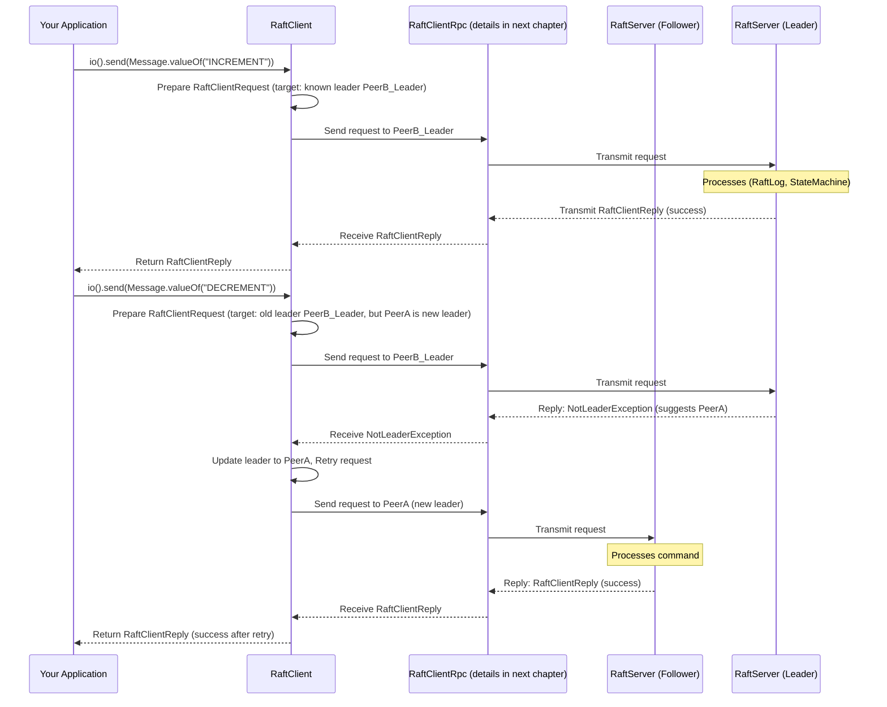

# Chapter 5: RaftClient - Your Application's Gateway to the Ratis Cluster

In [Chapter 4: StateMachine - Where Your Application Logic Lives](04_statemachine_.md), we saw how to implement the actual application logic (like our `SimpleCounterStateMachine`) that runs on each Ratis server. We know the `StateMachine` processes commands from the `RaftLog`. But how does your application, running outside the Ratis cluster, actually *tell* the cluster to "increment the counter" or "get its current value"?

This is where `RaftClient` steps in!

## What is a RaftClient? Your Friendly Customer Service Representative

Imagine the Ratis cluster (a group of [RaftServer](02_raftserver_.md)s working together) is a large, reliable company. Your application is a customer who wants to use this company's services. The `RaftClient` is like the company's dedicated customer service representative for your application.

You, as the application developer, don't need to know all the nitty-gritty details of which server in the Ratis cluster is currently the leader, or what to do if a server is temporarily busy. You just talk to your `RaftClient`, give it your request (a command or a query), and it takes care of the rest.

The `RaftClient` is responsible for:

1.  **Finding the Leader**: In a Ratis cluster, only one server (the Leader) can process commands that change state. The `RaftClient` figures out which server is the current Leader.
2.  **Sending Your Requests**: It packages your command (e.g., "INCREMENT") or query (e.g., "GET") into a message and sends it to the appropriate server in the correct [RaftGroup](01_raftgroup___raftpeer_.md).
3.  **Handling Retries**: If the Leader server is down, or if there's a temporary network issue, the `RaftClient` can automatically retry sending your request according to a defined policy.
4.  **Providing Results**: Once the Ratis cluster processes your request, the `RaftClient` gets the reply (e.g., the new counter value, or a success/failure status) and gives it back to your application.
5.  **Offering Different Communication Styles**: It provides ways to send requests and wait for the response (synchronous/blocking) or send requests and get notified later when the response is ready (asynchronous).

Essentially, `RaftClient` simplifies your application's interaction with the distributed Ratis cluster, making it much easier to build reliable distributed applications.

## Building Your RaftClient

Before your application can talk to a Ratis cluster, you need to create a `RaftClient` instance. This is typically done using `RaftClient.newBuilder()`.

You'll need to tell the `RaftClient` a few key things:
*   Which `RaftGroup` it should talk to. Remember from [Chapter 1: RaftGroup & RaftPeer](01_raftgroup___raftpeer_.md) that a `RaftGroup` defines the team of servers.
*   Some basic configuration properties (`RaftProperties`).

Let's assume we have a `RaftGroup` (e.g., `ourAwesomeTeam` from Chapter 1) and some `RaftProperties` set up.

```java
import org.apache.ratis.client.RaftClient;
import org.apache.ratis.conf.RaftProperties;
import org.apache.ratis.protocol.RaftGroup;
import org.apache.ratis.protocol.RaftPeer;
import org.apache.ratis.protocol.RaftGroupId;
import java.util.Arrays; // For creating a list easily

// Setup: Assume these are configured as in previous chapters
// 1. Define the RaftGroup
RaftPeer peer1 = RaftPeer.newBuilder().setId("s1").setAddress("localhost:6001").build();
RaftPeer peer2 = RaftPeer.newBuilder().setId("s2").setAddress("localhost:6002").build();
RaftPeer peer3 = RaftPeer.newBuilder().setId("s3").setAddress("localhost:6003").build();
RaftGroupId groupId = RaftGroupId.randomId(); // Or a specific one
RaftGroup raftGroup = RaftGroup.valueOf(groupId, Arrays.asList(peer1, peer2, peer3));

// 2. Define RaftProperties (can be empty for basic client)
RaftProperties properties = new RaftProperties();
// You might set RPC type or timeouts here, e.g.
// RaftConfigKeys.Rpc.setType(properties, org.apache.ratis.grpc.GrpcConfigKeys.RPC_TYPE_GRPC);

// 3. Build the RaftClient
RaftClient client = RaftClient.newBuilder()
        .setRaftGroup(raftGroup)    // Which Ratis group to talk to
        .setProperties(properties)  // Client-side configurations
        .build();

System.out.println("RaftClient created for group: " + client.getGroupId());
// Don't forget to close the client when your application shuts down
// client.close();
```
This code creates a `RaftClient` configured to communicate with the specified `raftGroup`. The `properties` can be used to configure various aspects like the RPC mechanism (e.g., gRPC, Netty) or retry policies. For now, default properties are often fine.

## Sending Requests: Your Two Main Styles

Once you have a `RaftClient`, you can start sending requests to your `StateMachine` (like our `SimpleCounterStateMachine`). Ratis offers two main styles for this:

1.  **Synchronous (Blocking) API**: Your application sends a request and *waits* until the response comes back. This is simpler to code if you don't need to do other work while waiting.
2.  **Asynchronous API**: Your application sends a request and gets back a "future" immediately. Your code can continue doing other things. The actual response will arrive later, and you can set up a callback to process it. This is better for high-performance applications that need to handle many things at once.

### 1. Synchronous (Blocking) API: `client.io()`

The blocking API is accessed via `client.io()`.

#### Sending a Command (Write Operation)

Commands are operations that can change the state of your `StateMachine`. For our counter, "INCREMENT" is a command. We use `client.io().send(Message)` for this.

```java
import org.apache.ratis.protocol.Message;
import org.apache.ratis.protocol.RaftClientReply;
import java.io.IOException;

// Assume 'client' is the RaftClient built earlier

try {
    // Prepare the message for the "INCREMENT" command
    Message incrementMessage = Message.valueOf("INCREMENT"); // Simple string message

    System.out.println("Sending INCREMENT command...");
    // Send the command and wait for the reply
    RaftClientReply reply = client.io().send(incrementMessage);

    if (reply.isSuccess()) {
        // The StateMachine's applyTransaction usually returns the new value
        Message resultMessage = reply.getMessage();
        // Assuming our SimpleCounterStateMachine returns the new int value as bytes
        int newValue = resultMessage.getContent().asReadOnlyByteBuffer().getInt();
        System.out.println("Successfully incremented counter! New value: " + newValue);
        System.out.println("Log index for this operation: " + reply.getLogIndex());
    } else {
        System.err.println("Increment command failed: " + reply.getException());
    }
} catch (IOException e) {
    System.err.println("Error sending INCREMENT command: " + e.getMessage());
    // Handle connection errors, etc.
}
// client.close(); // In a real app
```
When you call `client.io().send(...)`, your code pauses until the Ratis cluster processes the command and sends back a `RaftClientReply`.
The `RaftClientReply` object tells you:
*   `isSuccess()`: Whether the operation was successful.
*   `getMessage()`: The `Message` returned by your `StateMachine`'s `applyTransaction` method (e.g., the new counter value).
*   `getLogIndex()`: The index in the `RaftLog` where this command was recorded.
*   `getException()`: If an error occurred (e.g., `StateMachineException` if your `StateMachine` logic had an issue), this will contain the exception.

#### Sending a Query (Read-Only Operation)

Queries are operations that only read the state of your `StateMachine` and don't change it. For our counter, "GET" is a query. We use `client.io().sendReadOnly(Message)`.

```java
import org.apache.ratis.examples.counter.CounterCommand; // Using enum from Ratis examples

// Assume 'client' is the RaftClient built earlier

try {
    // Prepare the message for the "GET" command (using enum for clarity)
    Message getMessage = Message.valueOf(CounterCommand.GET.getName());

    System.out.println("Sending GET query...");
    RaftClientReply reply = client.io().sendReadOnly(getMessage);

    if (reply.isSuccess()) {
        Message resultMessage = reply.getMessage();
        int currentValue = resultMessage.getContent().asReadOnlyByteBuffer().getInt();
        System.out.println("Current counter value: " + currentValue);
    } else {
        System.err.println("GET query failed: " + reply.getException());
    }
} catch (IOException e) {
    System.err.println("Error sending GET query: " + e.getMessage());
}
// client.close(); // In a real app
```
Similar to `send()`, `sendReadOnly()` blocks until it gets a `RaftClientReply`. The key difference is that `sendReadOnly()` is meant for operations that don't modify state. Ratis can sometimes optimize read-only operations.

### 2. Asynchronous API: `client.async()`

The asynchronous API is accessed via `client.async()`. It returns a `CompletableFuture<RaftClientReply>`, which is like a promise that a `RaftClientReply` will be available later.

#### Sending an Asynchronous Command (Write Operation)

Let's send an "INCREMENT" command asynchronously.

```java
import java.util.concurrent.CompletableFuture;
import java.util.concurrent.ExecutionException;

// Assume 'client' is the RaftClient built earlier
Message incrementMessageAsync = Message.valueOf("INCREMENT");

System.out.println("Sending INCREMENT command asynchronously...");
CompletableFuture<RaftClientReply> futureReply = client.async().send(incrementMessageAsync);

// You can do other work here while the request is being processed...
System.out.println("Doing other work while waiting for async reply...");

// Handle the reply when it's ready
futureReply.thenAccept(reply -> {
    // This code runs when the reply is available
    if (reply.isSuccess()) {
        Message resultMessage = reply.getMessage();
        int newValue = resultMessage.getContent().asReadOnlyByteBuffer().getInt();
        System.out.println("(Async) Successfully incremented! New value: " + newValue);
    } else {
        System.err.println("(Async) Increment failed: " + reply.getException());
    }
}).exceptionally(ex -> {
    // This code runs if an exception occurred during the async operation
    System.err.println("(Async) Error sending INCREMENT: " + ex.getMessage());
    return null; // Must return a value (or throw)
});

// If you need to block and wait for the async result at some point (e.g., for demo)
try {
    RaftClientReply actualReply = futureReply.get(); // This will block
    System.out.println("(Async) Blocking get() completed. Success: " + actualReply.isSuccess());
} catch (InterruptedException | ExecutionException e) {
    System.err.println("(Async) Error waiting for future: " + e.getCause());
}
// client.close(); // In a real app
```
Here, `client.async().send(...)` returns immediately. The actual network communication and processing happen in the background.
*   `thenAccept(...)` registers a callback that will be executed when the reply arrives successfully.
*   `exceptionally(...)` registers a callback for errors.
*   `futureReply.get()` can be used if you need to wait for the result at some point, effectively making it synchronous from that point on.

#### When to Use Which?
*   **Synchronous (`client.io()`):**
    *   Simpler for basic tasks or scripts.
    *   When your application needs the result immediately before proceeding.
*   **Asynchronous (`client.async()`):**
    *   Better for applications that need high throughput (sending many requests without waiting for each one).
    *   Good for user interfaces to keep them responsive while background tasks complete.
    *   When you can perform other useful work while waiting for the Ratis cluster.

## What Happens Under the Hood? (RaftClient's Magic)

When you call a method like `client.io().send(...)`, several things happen behind the scenes:

1.  **Request Preparation**: The `RaftClient` creates a `RaftClientRequest` object. This includes your `Message`, a unique `ClientId`, a `callId` (to track this specific request), and the `RaftGroupId`.
2.  **Leader Discovery**:
    *   The `RaftClient` needs to send write requests to the current leader of the `RaftGroup`.
    *   It maintains a cached `leaderId`. If it doesn't know the leader, or if the cached leader seems to be wrong, it might try sending the request to a peer it knows, or it might pick one based on priority.
3.  **RPC Call**: The `RaftClient` uses an internal RPC (Remote Procedure Call) component (which we'll learn about in [RPC Abstraction (RaftServerRpc / RaftClientRpc)](06_rpc_abstraction__raftserverrpc___raftclientrpc_.md)) to send the `RaftClientRequest` to the chosen server.
4.  **Server Processing**: The [RaftServer](02_raftserver_.md) (hopefully the leader) receives the request.
    *   For writes: It proposes the command to the Raft consensus (writes to [RaftLog](03_raftlog_.md), replicates it). Once committed, it applies it to the [StateMachine](04_statemachine_.md).
    *   For reads: It queries the [StateMachine](04_statemachine_.md).
    *   The server then sends back a `RaftClientReply`.
5.  **Handling Replies and Retries**:
    *   If the reply is successful, the `RaftClient` gives it to your application.
    *   **NotLeaderException**: If the server contacted was not the leader, it sends back a `NotLeaderException` reply, possibly suggesting who the new leader is. The `RaftClient` updates its `leaderId` and automatically retries the request with the (new) suggested leader.
    *   **Other Errors**: For other transient errors (e.g., network timeouts, leader not ready yet), the `RaftClient` consults its `RetryPolicy` to decide whether to retry, how long to wait, and how many times.
    *   If retries are exhausted, it gives your application a failure reply with the exception.

This process is illustrated below:


This diagram shows a successful request and then a scenario where the client initially contacts a non-leader, receives a `NotLeaderException`, and then successfully retries with the correct leader.

## A Peek at Key Code Components

You generally don't need to interact with these internal classes directly, but knowing they exist can be helpful.

*   **`ratis-client/src/main/java/org/apache/ratis/client/RaftClient.java`**:
    This is the main interface you use. Its `Builder` inner class is how you construct `RaftClient` instances.
    ```java
    // Simplified from RaftClient.java
    public interface RaftClient extends Closeable {
        ClientId getId();
        RaftGroupId getGroupId();
        RaftPeerId getLeaderId(); // Current best guess for the leader
        BlockingApi io();        // For synchronous operations
        AsyncApi async();      // For asynchronous operations
        // ... other APIs like admin(), dataStreamApi() ...

        static Builder newBuilder() { /* ... */ }

        final class Builder {
            // Methods like setRaftGroup(), setProperties(), setClientId(), etc.
            public RaftClient build() { /* Creates RaftClientImpl */ }
        }
    }
    ```
    The `io()` and `async()` methods are your gateways to sending requests.

*   **`ratis-client/src/main/java/org/apache/ratis/client/impl/RaftClientImpl.java`**:
    This is the primary implementation of the `RaftClient` interface. It contains the logic for managing client state (like `leaderId`), handling retries, and coordinating with the RPC layer.
    When you call `RaftClient.newBuilder().build()`, you get an instance of `RaftClientImpl`. It handles leader discovery (e.g., `handleNotLeaderException`) and retry logic.

*   **`ratis-client/src/main/java/org/apache/ratis/client/api/BlockingApi.java`**:
    Defines the synchronous methods like `send(Message message)` and `sendReadOnly(Message message)`.

*   **`ratis-client/src/main/java/org/apache/ratis/client/api/AsyncApi.java`**:
    Defines the asynchronous methods like `send(Message message)` which returns a `CompletableFuture<RaftClientReply>`.

*   **`ratis-common/src/main/java/org/apache/ratis/protocol/RaftClientRequest.java`**:
    This class represents the actual request message sent from the client to the server. It wraps your `Message` along with IDs, type of request (read/write), and other metadata.
    ```java
    // Conceptual fields of RaftClientRequest
    public class RaftClientRequest extends RaftClientMessage {
        // ClientId clientId;
        // RaftPeerId serverId; // Target server
        // RaftGroupId groupId;
        // long callId;        // Unique ID for this call
        // Message message;     // Your actual payload
        // Type type;         // WRITE, READ, WATCH, etc.
        // ...
    }
    ```

*   **`ratis-common/src/main/java/org/apache/ratis/protocol/RaftClientReply.java`**:
    This class represents the reply message sent from the server back to the client.
    ```java
    // Conceptual fields of RaftClientReply
    public class RaftClientReply extends RaftClientMessage {
        // ClientId clientId;
        // RaftPeerId serverId; // Server that replied
        // RaftGroupId groupId;
        // long callId;        // Matches the request's callId
        // boolean success;
        // Message message;     // Reply payload from StateMachine
        // RaftException exception; // If an error occurred
        // long logIndex;      // For successful write operations
        // ...
    }
    ```

## Conclusion

The `RaftClient` is your application's indispensable tool for interacting with a Ratis cluster. It abstracts away many complexities of distributed systems, such as leader election, request routing, and retries, allowing you to focus on your application logic. Whether you prefer synchronous or asynchronous communication, `RaftClient` provides a clear API to send commands and queries to your distributed `StateMachine`.

You've now seen the "who" ([RaftGroup & RaftPeer](01_raftgroup___raftpeer_.md)), the "engine" ([RaftServer](02_raftserver_.md)), the "memory" ([RaftLog](03_raftlog_.md)), the "application logic" ([StateMachine](04_statemachine_.md)), and now the "gateway" (`RaftClient`).

But how does the `RaftClient` actually *talk* over the network to the `RaftServer`s? And how do `RaftServer`s talk to each other? This communication happens via Remote Procedure Calls (RPCs). In the next chapter, we'll explore the [RPC Abstraction (RaftServerRpc / RaftClientRpc)](06_rpc_abstraction__raftserverrpc___raftclientrpc__.md) that Ratis uses.

---

Generated by [AI Codebase Knowledge Builder](https://github.com/The-Pocket/Tutorial-Codebase-Knowledge)