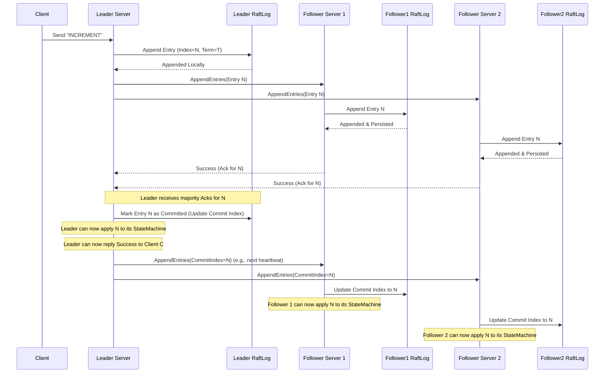

# Chapter 5: RaftLog

In the [previous chapter](04_raftserver_.md), we learned about the `RaftServer`, the process running on each node that participates in the Raft protocol, manages roles, and applies commands to the [StateMachine](01_statemachine_.md).

But how does the `RaftServer` keep track of all the commands it has agreed upon with its peers? If a server restarts, how does it remember the order of operations? And how does it ensure that this order is the *same* across all servers in the cluster?

This is where the **`RaftLog`** comes in. It's the persistent memory of the Raft group.

## What Problem Does RaftLog Solve?

Imagine our distributed counter service from earlier chapters. The [RaftClient](03_raftclient_.md) sends "INCREMENT" to the leader `RaftServer`. The leader convinces a majority of other servers to accept this command. Great! But where is this agreement recorded?

*   If the leader crashes immediately after getting agreement but before replying to the client, how does the *new* leader know that "INCREMENT" was already agreed upon?
*   How do followers catch up if they were temporarily disconnected? They need a reliable source of truth for the sequence of commands.
*   How do we ensure that Server A applies "INCREMENT" then "SET(10)", while Server B doesn't accidentally apply them as "SET(10)" then "INCREMENT"? The order matters!

`RaftLog` solves this by acting as the **official, ordered, durable record** of all operations agreed upon by the cluster. Think of it like the certified minutes of a very important meeting, or a tamper-proof ledger in accounting. Every decision (command) is written down in sequence, and this log becomes the single source of truth for the history of operations.

## What is a RaftLog?

The `RaftLog` is a core data structure within each `RaftServer`. It represents the sequence of log entries that the Raft cluster has agreed upon.

*   **Ordered Sequence:** Entries in the log have a specific order, defined by their **log index** (a sequential number like 1, 2, 3...). This order is crucial for consistency.
*   **Log Entries:** Each entry in the log (`LogEntryProto` in Ratis) typically contains:
    *   **Term:** The leader's election term when the entry was created. This helps detect inconsistencies.
    *   **Index:** The sequential position of the entry in the log.
    *   **Command:** The actual operation requested by the client (e.g., "INCREMENT", "SET(10)"), which will eventually be processed by the [StateMachine](01_statemachine_.md).
*   **Durable:** To survive crashes, the `RaftLog` is typically persisted to stable storage (like a hard drive or SSD) before a server acknowledges it. Ratis provides pluggable storage, with `SegmentedRaftLog` being the common durable implementation.
*   **Append-Only (Mostly):** New entries are always added to the *end* of the log. Existing committed entries are never changed (though the log might be truncated from the end under specific inconsistency scenarios, or purged from the beginning for cleanup).

Here's a simple visualization:

```
RaftLog on Server A:

Index | Term | Command       | Status
------|------|---------------|----------
  1   |  1   | SET(5)        | Committed
  2   |  1   | INCREMENT     | Committed
  3   |  2   | INCREMENT     | Committed
  4   |  2   | GET           | Committed <- Last Applied to StateMachine
  5   |  3   | SET(10)       | Committed <- Commit Index
  6   |  3   | INCREMENT     | Appended (Not Committed) <- Next Index
  7   |  3   | INCREMENT     | Appended (Not Committed)
```

## How RaftLog Works (Conceptual Flow)

The `RaftLog` is central to the Raft protocol's operation:

1.  **Leader Appends:** When the Leader `RaftServer` receives a command from a [RaftClient](03_raftclient_.md), it creates a new log entry containing the command, the current term, and the next available index (`getNextIndex()`). It appends this entry to its *own* `RaftLog`.
2.  **Leader Replicates:** The Leader sends this new entry (or entries) to its Followers via an `AppendEntries` RPC message (part of the [RPC Layer](06_rpc_layer__rpctype__rpcfactory__raftserverrpc__raftclientrpc_.md)).
3.  **Follower Appends:** Each Follower receives the `AppendEntries` message. If it agrees the message is valid (e.g., based on term and previous index), it appends the new entry (or entries) to its *own* `RaftLog`. Crucially, it ensures the entry is durably stored *before* replying.
4.  **Follower Acknowledges:** The Follower sends a success response back to the Leader.
5.  **Leader Commits:** The Leader waits for success responses from a *majority* of the servers (including itself). Once a majority has durably stored the entry, the Leader considers the entry **committed**. It updates its internal "commit index" (`getLastCommittedIndex()`), which is the highest index known to be stored on a majority.
6.  **Commit Index Propagation:** The Leader informs Followers about the updated commit index in subsequent `AppendEntries` messages (even heartbeats).
7.  **Follower Commits:** Followers update their own commit index based on the information received from the Leader.
8.  **Applying to StateMachine:** Both the Leader and Followers periodically check for log entries between their "last applied index" (the last entry they fed to their [StateMachine](01_statemachine_.md)) and their current "commit index". They apply these newly committed entries, in order, to their local `StateMachine` instance via the `applyTransaction` method.

Because all servers apply the *same* sequence of *committed* entries from their identical logs, their StateMachines remain consistent.

Here's a simplified sequence diagram:



## Key Properties and Operations in Ratis

The core interface defining the RaftLog abstraction in Ratis is `org.apache.ratis.server.raftlog.RaftLog`. Let's look at some key methods and concepts:

*   **`appendEntry(LogEntryProto entry)`:** Adds a new log entry to the end of the log. This is primarily used by the Leader when receiving a new command, or by Followers when receiving entries from the Leader. Returns a `CompletableFuture<Long>` indicating the asynchronous completion and the index of the appended entry.
*   **`TermIndex getLastEntryTermIndex()`:** Returns the term and index of the very last entry currently in the log (committed or not).
*   **`long getNextIndex()`:** Returns the index that should be assigned to the *next* entry appended to the log. It's typically `getLastEntryTermIndex().getIndex() + 1`.
*   **`long getLastCommittedIndex()`:** Returns the highest index of a log entry that is known to be replicated on a majority of servers. Only entries up to this index are safe to apply to the StateMachine.
*   **`boolean updateCommitIndex(...)`:** Used by the Leader to try and advance the commit index based on majority acknowledgements for a given index in the current term.
*   **`TermIndex getTermIndex(long index)`:** Retrieves the term associated with a specific log index, if the entry exists. Used for consistency checks.
*   **`ReferenceCountedObject<LogEntryProto> retainLog(long index)`:** Gets a reference to the log entry at the given index. This uses reference counting to manage memory efficiently, especially when entries are cached. The caller *must* release the reference when done.
*   **`CompletableFuture<Long> truncate(long index)`:** Removes all log entries *from* the given index onwards. This is used, for example, when a Follower discovers its log conflicts with the Leader's log; it truncates the conflicting part before accepting the Leader's entries.
*   **`CompletableFuture<Long> purge(long index)`:** Removes log entries *up to* (and possibly including) the given index. This is typically used for log cleaning after a [Snapshot](07_snapshotting__snapshotinfo__statemachinestorage_.md) has been taken, to reclaim disk space.

## Ratis Implementations

Ratis provides a pluggable `RaftLog` interface, allowing different storage backends. The two main ones are:

1.  **`MemoryRaftLog`:**
    *   Stores all log entries purely in memory.
    *   **Not durable!** If the server process stops, the log is lost.
    *   Very fast, but **only suitable for testing** or specific use cases where durability isn't required.
    *   Find it in: `ratis-server/src/main/java/org/apache/ratis/server/raftlog/memory/MemoryRaftLog.java`

2.  **`SegmentedRaftLog`:**
    *   The **default and recommended** implementation for production use.
    *   Stores log entries durably on disk in a sequence of files called "segments".
    *   An "open" segment (`log_inprogress_<start_index>`) is actively written to.
    *   When the open segment reaches a size limit (e.g., 8MB) or the term changes, it's closed and renamed (`log_<start_index>-<end_index>`), and a new open segment is created.
    *   Provides durability across server restarts.
    *   Uses caching (`SegmentedRaftLogCache`) to keep recent entries in memory for faster access.
    *   Find it in: `ratis-server/src/main/java/org/apache/ratis/server/raftlog/segmented/SegmentedRaftLog.java`

The `RaftServer` is configured (via `RaftProperties`) to use a specific `RaftLog` implementation when it starts up.

## Interaction with RaftServer

The `RaftServer` (specifically the `RaftServerImpl` for a given group) holds and interacts heavily with its `RaftLog` instance:

*   **Initialization:** When a `RaftServer` starts, it opens its `RaftLog` (`raftLog.open(...)`), loading existing entries from disk (for `SegmentedRaftLog`) and determining the start/end/commit indices.
*   **Leader Actions:** If Leader, it appends client requests (`raftLog.appendEntry(...)`) and replicates them. It updates the commit index based on follower responses (`raftLog.updateCommitIndex(...)`).
*   **Follower Actions:** If Follower, it appends entries received from the Leader (`raftLog.append(...)` or `raftLog.appendEntry(...)`) and truncates if necessary (`raftLog.truncate(...)`).
*   **StateMachine Application:** Both Leader and Followers use the `raftLog.getLastCommittedIndex()` and their own `lastAppliedIndex` to determine which entries need to be applied to the `StateMachine`. They retrieve these entries using `raftLog.retainLog(...)` or `raftLog.getEntries(...)`.

Let's look at a simplified conceptual code snippet showing how a Leader might use the log:

```java
// Inside Leader RaftServerImpl (Simplified Conceptual Code)
// On receiving a client command 'cmd'

// 1. Get the next index for the new entry
long nextIndex = raftLog.getNextIndex();
long currentTerm = getCurrentTerm(); // Get current election term

// 2. Create the log entry proto
LogEntryProto newEntry = LogProtoUtils.toLogEntryProto(
    cmd, // The client command payload
    currentTerm,
    nextIndex);

// 3. Append the entry locally (asynchronously)
//    This returns a future that completes when the log is written (maybe just to buffer)
CompletableFuture<Long> appendFuture = raftLog.appendEntry(newEntry);

// 4. After local append, replicate to followers
appendFuture.thenRun(() -> {
    sendAppendEntriesToFollowers(newEntry);
});

// ... Later, when enough followers acknowledge entry 'N' ...

// 5. Update the commit index in the log
boolean committed = raftLog.updateCommitIndex(N, currentTerm, true);

// 6. If commit index advanced, trigger StateMachine application
if (committed) {
    triggerStateMachineApply(); // Apply entries up to new commit index
}
```

**Explanation:**

1.  Determine the term and index for the new entry using the log's state.
2.  Create the `LogEntryProto` containing the command and metadata.
3.  Append the entry to the local `RaftLog`. Ratis log implementations are often asynchronous.
4.  Once the local append is initiated (or completed, depending on implementation details), start replicating to followers.
5.  When a majority acknowledge the entry with index `N`, the Leader tells the `RaftLog` to update its commit index.
6.  If the commit index actually moved forward, the server knows new entries are ready to be applied to the [StateMachine](01_statemachine_.md).

## Conclusion

The `RaftLog` is the backbone of consistency in Ratis. It serves as the ordered, durable, and replicated sequence of all commands agreed upon by the cluster.

Key takeaways:

*   It's the official record (like meeting minutes or a ledger).
*   Entries contain term, index, and the command.
*   It must be durable (usually via `SegmentedRaftLog` on disk).
*   The Leader appends and replicates; Followers append and acknowledge.
*   Entries are committed once stored on a majority.
*   Committed entries are applied in order to the [StateMachine](01_statemachine_.md) on all servers.
*   The `RaftLog` interface (`org.apache.ratis.server.raftlog.RaftLog`) defines operations like append, get, truncate, and commit updates.

Now that we understand how servers maintain this crucial log, how do they actually communicate over the network to send log entries, request votes, and exchange other protocol messages? That's the role of the networking layer.

**Next:** [Chapter 6: RPC Layer (RpcType, RpcFactory, RaftServerRpc, RaftClientRpc)](06_rpc_layer__rpctype__rpcfactory__raftserverrpc__raftclientrpc__.md)

---

Generated by [AI Codebase Knowledge Builder](https://github.com/The-Pocket/Tutorial-Codebase-Knowledge)