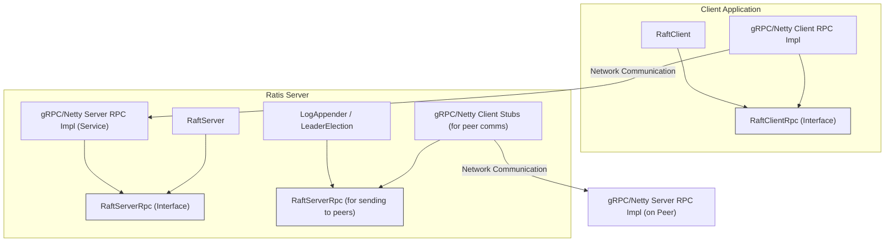

# Chapter 6: RPC Abstraction (`RaftServerRpc` / `RaftClientRpc`)

In [Chapter 5: RaftClient - Your Application's Gateway to the Ratis Cluster](05_raftclient_.md), we saw how your application uses `RaftClient` to send commands and queries to the Ratis cluster. We also know from [Chapter 2: RaftServer - The Engine of Consensus](02_raftserver_.md) that `RaftServer`s need to communicate with each other for things like log replication and leader election.

But *how* do these messages actually travel across the network? If `RaftClient` is like a customer service representative and `RaftServer`s are managers, what's the phone network or postal service they use to talk? This is where Ratis's RPC (Remote Procedure Call) abstraction comes in.

## The Need for a Communication Layer: The Postal Service

Imagine you want to send a letter (a command) to a company (the Ratis cluster). You give it to a mail carrier (`RaftClient`). The mail carrier needs a way to get it to the company's mailroom (`RaftServer` leader). Inside the company, different departments (`RaftServer` peers) also need to send memos (log entries, votes) to each other.

They all need a **communication system**. This system could be the local post, a private courier, email, or even carrier pigeons! The important part is that the message gets delivered.

In distributed systems like Ratis, components need to "call" functions on other components, often running on different machines. This is done using **Remote Procedure Calls (RPCs)**. Ratis is designed to be flexible about *which* underlying RPC technology it uses. You might want to use gRPC for its performance and features, or perhaps Apache Netty for different reasons.

Ratis provides an **RPC abstraction** to handle this. It defines a standard way for Ratis components to make and receive calls, without being hardcoded to a specific RPC technology. This is like defining a standard envelope format, regardless of which postal service delivers it.

This abstraction has two main parts:
*   `RaftClientRpc`: Handles communication between a `RaftClient` and a `RaftServer`.
*   `RaftServerRpc`: Handles communication between different `RaftServer`s within a `RaftGroup`.

## What is `RaftClientRpc`? The Client's Mail Carrier

`RaftClientRpc` is the interface responsible for transmitting a `RaftClientRequest` from the `RaftClient` to a `RaftServer` and bringing back the `RaftClientReply`.

Think of it as the specific "mail carrier service" your `RaftClient` uses to send its letters to one of the company's mailrooms (a `RaftServer`).

*   When your application calls `RaftClient.io().send(message)`, the `RaftClient` internally uses an instance of `RaftClientRpc` to actually package and send the request over the network.
*   The `RaftClientRpc` implementation (e.g., one using gRPC) knows how to establish a connection, serialize the request, send it, wait for the response, deserialize it, and hand it back to the `RaftClient`.

## What is `RaftServerRpc`? The Inter-Office Mail System

`RaftServerRpc` is the interface responsible for all server-to-server communication. This is crucial for the Raft consensus algorithm:
*   **Log Replication**: The Leader `RaftServer` uses it to send `AppendEntries` requests (containing new [RaftLog](03_raftlog_.md) entries) to Follower `RaftServer`s.
*   **Heartbeats**: The Leader sends regular heartbeat messages (which are often empty `AppendEntries` requests) to Followers.
*   **Voting**: Candidate `RaftServer`s use it to send `RequestVote` requests to other servers during leader elections.
*   **Installing Snapshots**: Leaders use it to send snapshot data to slow followers.

Think of `RaftServerRpc` as the company's internal mail system, ensuring memos, voting ballots, and important updates reach the correct departments (other `RaftServer`s).

When a `RaftServer` (say, the Leader) needs to send a log entry to another `RaftServer` (a Follower), it doesn't directly open a network socket and write bytes. Instead, it calls a method on its `RaftServerRpc` component, which then handles the actual network transmission using the chosen RPC technology (like gRPC or Netty).

## Pluggability: Choosing Your Postal Service

One of the great strengths of Ratis is that these RPC mechanisms are **pluggable**. This means you can choose which underlying "postal service" to use. Ratis comes with built-in support for:
*   **gRPC**: A modern, high-performance RPC framework from Google.
*   **Netty**: A powerful asynchronous event-driven network application framework.
*   (Historically, Hadoop RPC was also supported but might be less common now for new Ratis deployments outside the Hadoop ecosystem).

You can even implement your own if you have very specific needs, though most users will pick one of the provided options.

This pluggability is achieved through a system of factories and configuration:

*   **`RpcType.java`**: An interface that defines an RPC implementation type. Standard types are available in `SupportedRpcType.java` (e.g., `GRPC`, `NETTY`).
*   **`RpcFactory.java`**: An interface that an RPC implementation (like gRPC or Netty) provides. This factory is responsible for creating the actual client-side and server-side RPC components.
*   **Configuration**: You typically tell Ratis which RPC type to use via `RaftProperties`.

```java
import org.apache.ratis.conf.RaftProperties;
import org.apache.ratis.grpc.GrpcConfigKeys; // For gRPC specific keys
import org.apache.ratis.netty.NettyConfigKeys; // For Netty specific keys
import org.apache.ratis.RaftConfigKeys; // For general Ratis config keys
import org.apache.ratis.rpc.SupportedRpcType;

// Example: Configuring Ratis to use gRPC
RaftProperties grpcProperties = new RaftProperties();
RaftConfigKeys.Rpc.setType(grpcProperties, SupportedRpcType.GRPC);
// You might set gRPC-specific properties too, e.g., port numbers using GrpcConfigKeys

// Example: Configuring Ratis to use Netty
RaftProperties nettyProperties = new RaftProperties();
RaftConfigKeys.Rpc.setType(nettyProperties, SupportedRpcType.NETTY);
// You might set Netty-specific properties too, e.g., port numbers using NettyConfigKeys
```
When you build a `RaftClient` or `RaftServer` using these `RaftProperties`, Ratis will look up the specified `RpcType`, get its `RpcFactory`, and use that factory to create the necessary `RaftClientRpc` or `RaftServerRpc` instances.

For example, if you set `SupportedRpcType.GRPC`:
*   The `GrpcFactory` will be used.
*   `GrpcFactory.newRaftClientRpc(...)` will create a `GrpcClientRpc` instance for clients.
*   `GrpcFactory.newRaftServerRpc(...)` will create a `GrpcService` (which acts as the server-side RPC endpoint for gRPC) for servers.

## Visualizing the RPC Abstraction

Here's how the different components fit together:


This diagram shows:
*   A `RaftClient` uses a `RaftClientRpc` implementation (like gRPC or Netty client) to talk over the network.
*   A `RaftServer` has a `RaftServerRpc` implementation (like a gRPC or Netty server/service) to receive these requests.
*   For server-to-server communication (e.g., `LogAppender`), the `RaftServer` also uses `RaftServerRpc` components, which internally might use client stubs (like gRPC stubs) to connect to other peers.

## How it Works: Under the Hood

Let's trace a couple of scenarios.

### Scenario 1: Client Sends a Request

Imagine your application uses `RaftClient.io().send(message)`:

```mermaid
sequenceDiagram
    participant App as Your Application
    participant RClient as RaftClient
    participant ClientRpc as RaftClientRpc (e.g., GrpcClientRpc)
    participant Network
    participant ServerRpc as RaftServerRpc (e.g., GrpcService on Server)
    participant RServer as RaftServer

    App->>RClient: io().send(myMessage)
    RClient->>ClientRpc: sendRequest(raftClientRequest)
    ClientRpc->>Network: Serialize & Send request (using gRPC/Netty)
    Network->>ServerRpc: Receive & Deserialize request
    ServerRpc->>RServer: Pass request to RaftServer logic
    RServer->>RServer: Process request (Log, StateMachine)
    RServer-->>ServerRpc: RaftClientReply
    ServerRpc-->>Network: Serialize & Send reply
    Network-->>ClientRpc: Receive & Deserialize reply
    ClientRpc-->>RClient: Return RaftClientReply
    RClient-->>App: Return RaftClientReply
end
```
1.  Your **App** calls `RaftClient.io().send()`.
2.  The **`RaftClient`** prepares a `RaftClientRequest` and invokes `sendRequest()` on its configured **`RaftClientRpc`** instance (e.g., `GrpcClientRpc`).
3.  The **`RaftClientRpc`** implementation serializes the request and sends it over the **Network** using its underlying technology (e.g., gRPC).
4.  On the server side, the corresponding **`RaftServerRpc`** implementation (e.g., `GrpcService`) receives the raw network data, deserializes it into a `RaftClientRequest`.
5.  The **`RaftServerRpc`** (service part) then passes this request to the main **`RaftServer`** logic.
6.  The **`RaftServer`** processes it (involves [RaftLog](03_raftlog_.md), [StateMachine](04_statemachine_.md)) and generates a `RaftClientReply`.
7.  This reply travels back through the `ServerRpc` -> Network -> `ClientRpc` -> `RaftClient` -> **App**.

### Scenario 2: Leader Replicates a Log Entry

Imagine a Leader `RaftServer` needs to send a log entry to a Follower:

```mermaid
sequenceDiagram
    participant LeaderRS as RaftServer (Leader)
    participant LeaderServerRpc as RaftServerRpc (Leader's sending part)
    participant Network
    participant FollowerServerRpc as RaftServerRpc (Follower's receiving part)
    participant FollowerRS as RaftServer (Follower)

    LeaderRS->>LeaderRS: New log entry committed
    LeaderRS->>LeaderServerRpc: appendEntries(appendEntriesRequest for FollowerX)
    Note over LeaderServerRpc: Uses gRPC/Netty client stub for FollowerX
    LeaderServerRpc->>Network: Serialize & Send AppendEntriesRequest
    Network->>FollowerServerRpc: Receive & Deserialize request
    FollowerServerRpc->>FollowerRS: Pass appendEntriesRequest to Follower's logic
    FollowerRS->>FollowerRS: Append to local RaftLog
    FollowerRS-->>FollowerServerRpc: AppendEntriesReply
    FollowerServerRpc-->>Network: Serialize & Send reply
    Network-->>LeaderServerRpc: Receive & Deserialize reply
    LeaderServerRpc-->>LeaderRS: Return AppendEntriesReply
end
```
1.  The **Leader `RaftServer`** decides to send log entries to a Follower. It creates an `AppendEntriesRequest`.
2.  It invokes a method like `appendEntries(...)` on its **`RaftServerRpc`** component.
3.  This `RaftServerRpc` component (on the Leader side, acting as a client to the Follower) serializes the request and sends it over the **Network** to the target Follower. Specific RPC implementations like `GrpcLogAppender` (for gRPC) handle this.
4.  The **Follower's `RaftServerRpc`** (service part) receives and deserializes the request.
5.  It passes the `AppendEntriesRequest` to the **Follower `RaftServer`**'s core logic.
6.  The **Follower `RaftServer`** processes the request (e.g., appends to its [RaftLog](03_raftlog_.md)) and creates an `AppendEntriesReply`.
7.  The reply travels back to the Leader via the same RPC path.

## Peeking at the Code Interfaces

Let's look at the key interfaces involved.

### `RaftClientRpc.java`
This interface defines how a client communicates with a server.
(`ratis-client/src/main/java/org/apache/ratis/client/RaftClientRpc.java`)

```java
// Simplified from RaftClientRpc.java
public interface RaftClientRpc extends RaftPeer.Add, Closeable {
  // Async call to send a request.
  CompletableFuture<RaftClientReply> sendRequestAsync(RaftClientRequest request);

  // Send a request (blocking).
  RaftClientReply sendRequest(RaftClientRequest request) throws IOException;

  // Methods to add known peers, handle exceptions, etc.
  // void addPeers(Iterable<RaftPeer> peers);
  // boolean handleException(RaftPeerId serverId, Throwable t, boolean reconnect);
}
```
*   `sendRequestAsync()`: For asynchronous communication (used by `RaftClient.async()`).
*   `sendRequest()`: For synchronous/blocking communication (used by `RaftClient.io()`).
*   `addRaftPeers(Collection<RaftPeer> peers)` (from `RaftPeer.Add`): Allows the RPC layer to know about the servers in the group.

### `RaftServerRpc.java`
This interface defines how servers communicate with each other, and also how a server exposes its RPC services.
(`ratis-server-api/src/main/java/org/apache/ratis/server/RaftServerRpc.java`)

```java
// Simplified from RaftServerRpc.java
public interface RaftServerRpc extends RaftServerProtocol, ServerRpc, Closeable {
    // Inherits methods from RaftServerProtocol:
    // RaftClientReply submitClientRequest(RaftClientRequest request) throws IOException;
    // RaftClientReply setConfiguration(SetConfigurationRequest request) throws IOException;
    // AppendEntriesReplyProto appendEntries(AppendEntriesRequestProto request) throws IOException;
    // RequestVoteReplyProto requestVote(RequestVoteRequestProto request) throws IOException;
    // InstallSnapshotReplyProto installSnapshot(InstallSnapshotRequestProto request) throws IOException;

    // Inherits from ServerRpc:
    // InetSocketAddress getInetSocketAddress();
    // void start();
    // void shutdown();

    // Method to handle exceptions when connecting to other peers
    void handleException(RaftPeerId serverId, Exception e, boolean reconnect);
    
    // Get an asynchronous version of the server protocol
    RaftServerAsynchronousProtocol async();
}
```
*   It extends `RaftServerProtocol`, which defines the core Raft RPCs like `appendEntries`, `requestVote`, `installSnapshot`, and also `submitClientRequest` (for client requests landing on the server).
*   It also extends `ServerRpc` from `ratis-common`, which provides methods to get the server's listening address, start, and stop the RPC service.
*   Implementations of `RaftServerRpc` (like `GrpcService` for gRPC or `NettyRpcService` for Netty) will implement these methods to handle incoming RPCs and also to provide client-side stubs for the server to call out to other peers.

### Factories: `GrpcFactory.java` and `NettyFactory.java`

These classes implement `ClientFactory` and `ServerFactory`. They are responsible for creating the concrete RPC components.

*   `GrpcFactory.java` (`ratis-grpc/src/main/java/org/apache/ratis/grpc/GrpcFactory.java`):
    ```java
    // Simplified snippet
    public class GrpcFactory implements ServerFactory, ClientFactory {
        // ... (constructors, TLS config) ...

        @Override
        public GrpcServices newRaftServerRpc(RaftServer server) {
            // Builds and returns GrpcServicesImpl which implements RaftServerRpc
            // This is the server-side component that listens for gRPC requests
            return GrpcServicesImpl.newBuilder().setServer(server) /* ... */.build();
        }

        @Override
        public GrpcClientRpc newRaftClientRpc(ClientId clientId, RaftProperties properties) {
            // Returns an instance of GrpcClientRpc
            // This is the client-side component used by RaftClient
            return new GrpcClientRpc(clientId, properties, /* ... */);
        }

        @Override
        public LogAppender newLogAppender(RaftServer.Division server, LeaderState state, FollowerInfo f) {
            // Returns GrpcLogAppender for server-to-server log replication via gRPC
            return new GrpcLogAppender(server, state, f);
        }
    }
    ```
    The `GrpcFactory` creates `GrpcClientRpc` for client-side operations and `GrpcServices` (which wraps the gRPC server logic) for server-side operations. It also provides `GrpcLogAppender` for efficient log replication.

*   `NettyFactory.java` (`ratis-netty/src/main/java/org/apache/ratis/netty/NettyFactory.java`):
    ```java
    // Simplified snippet
    public class NettyFactory implements ServerFactory, ClientFactory {
        // ... (constructor) ...

        @Override
        public NettyRpcService newRaftServerRpc(RaftServer server) {
            // Builds and returns NettyRpcService which implements RaftServerRpc
            return NettyRpcService.newBuilder().setServer(server).build();
        }

        @Override
        public NettyClientRpc newRaftClientRpc(ClientId clientId, RaftProperties properties) {
            // Returns an instance of NettyClientRpc
            return new NettyClientRpc(clientId, properties);
        }
        // Netty also has its own LogAppender mechanism, implicitly part of NettyRpcService
    }
    ```
    Similarly, `NettyFactory` provides the Netty-based implementations.

Your `RaftProperties` (with `RaftConfigKeys.Rpc.setType(...)`) guide Ratis to pick the correct factory, which then builds the appropriate RPC machinery.

## Conclusion

The RPC abstraction in Ratis, centered around `RaftClientRpc` and `RaftServerRpc`, is a cornerstone of its flexibility and design. It decouples the core Raft logic from the underlying network communication technology, allowing you to choose (or even build) the RPC mechanism that best suits your needs—be it gRPC, Netty, or something else.

*   **`RaftClientRpc`** is the client's conduit to the servers.
*   **`RaftServerRpc`** is the server's way of handling incoming requests and communicating with its peers.
*   **Pluggability** means you can select your preferred "postal service" (gRPC, Netty) for message delivery.

Understanding this layer helps appreciate how Ratis components, even across different machines, can seamlessly communicate to achieve distributed consensus.

With the core components of Raft (groups, servers, logs, state machines, clients, and RPC) now covered, we can start looking at more operational aspects. In the next chapter, we'll explore [Configuration Management](07_configuration_management_.md), which deals with how the membership of a `RaftGroup` can change dynamically.

---

Generated by [AI Codebase Knowledge Builder](https://github.com/The-Pocket/Tutorial-Codebase-Knowledge)