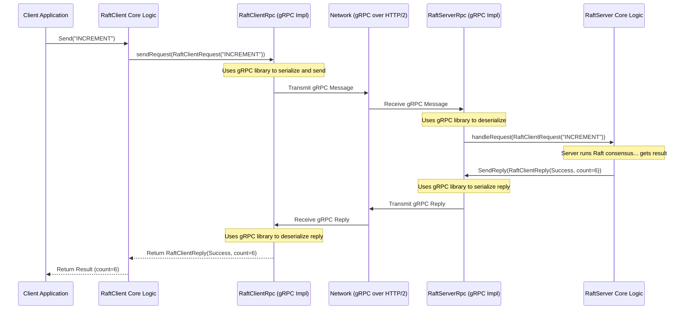

# Chapter 6: RPC Layer (RpcType, RpcFactory, RaftServerRpc, RaftClientRpc)

In the [previous chapter](05_raftlog_.md), we learned about the `RaftLog`, the crucial, ordered, and persistent record of commands agreed upon by the Ratis cluster. We saw how the leader adds entries and replicates them to followers, and how followers append entries they receive.

But *how* exactly do these servers send messages like "AppendEntries" or "RequestVote" to each other? How does a [RaftClient](03_raftclient_.md) send its "INCREMENT" command to the leader [RaftServer](04_raftserver_.md)? They need a communication system – a way to talk over the network.

This is the job of the **RPC Layer** in Ratis.

## What Problem Does the RPC Layer Solve?

Imagine our Raft servers are committee members working in different buildings (computers on a network). They need a reliable way to communicate:

*   The Leader needs to send copies of the latest decisions (log entries) to the Followers.
*   Servers need to ask each other for votes during elections.
*   Clients (external applications) need to submit new proposals (commands) to the committee Leader and get back the results.

How do they send and receive these messages? Do they have to use a specific type of phone system or postal service? What if one application prefers using a modern messaging app (like gRPC) while another environment requires an older, established phone line (like Netty)?

The RPC Layer solves this by defining *how* Ratis components talk to each other over the network. RPC stands for **Remote Procedure Call** – it's a way for one computer program to request a service or run a procedure on another computer across a network as if it were a local call.

Crucially, Ratis makes this communication mechanism **pluggable**. It doesn't force you to use only one specific network technology.

## The Ratis Approach: Pluggable RPC

Think of the RPC layer like choosing a delivery service. You might use FedEx, UPS, or the regular postal service depending on your needs. Ratis allows a similar choice for its network communication.

This flexibility is achieved through a few key concepts:

1.  **`RpcType`:** This is like the **name** of the delivery service you want to use. It identifies the specific network communication technology. Ratis comes with built-in support for several common ones, defined in `SupportedRpcType`:
    *   `GRPC`: Uses the popular gRPC framework developed by Google. Often a good default choice.
    *   `NETTY`: Uses the Netty framework, a powerful asynchronous networking library.
    *   (Others may exist or be added).
    You can even potentially implement your own custom `RpcType` if you have special networking needs.

    ```java
    // From: ratis-common/src/main/java/org/apache/ratis/rpc/SupportedRpcType.java
    public enum SupportedRpcType implements RpcType {
      GRPC, // Use gRPC
      NETTY, // Use Netty
      // ... other potential built-in types ...

      // Method to get the factory for this type
      @Override
      public RpcFactory newFactory(Parameters parameters) { ... }

      // Method to get the name
      @Override
      public String name() { ... }
    }
    ```

    *This enum lists the pre-defined network options Ratis understands.*

2.  **`RpcFactory`:** This is like the **company** that provides the chosen delivery service. Based on the selected `RpcType` (e.g., `GRPC`), the `RpcFactory` knows how to create the actual network components needed for communication.
    *   If you choose `GRPC`, the `GrpcFactory` will be used.
    *   If you choose `NETTY`, the `NettyFactory` will be used.

    The basic interface is simple:
    ```java
    // From: ratis-common/src/main/java/org/apache/ratis/rpc/RpcFactory.java
    /** The type of RPC Factory. */
    public interface RpcFactory extends RpcType.Get {
        // This interface inherits getRpcType()
        // Specific factories (like GrpcFactory) will implement methods
        // to create client and server RPC components.
    }
    ```

    *This interface acts as a blueprint. Real factories like `GrpcFactory` or `NettyFactory` implement it.*

    These factories are responsible for creating the specific client-side and server-side communication objects.

3.  **`RaftServerRpc`:** This is the component **on the server side** that listens for incoming network messages. Think of it as the local **post office branch** or **telephone exchange** for a specific `RaftServer`.
    *   It receives requests from clients (like `RaftClientRequest`) and other servers (like `AppendEntriesRequest`, `RequestVoteRequest`).
    *   It decodes these messages and passes them to the appropriate methods within the `RaftServer` core logic.
    *   It also sends replies back over the network.

    This component is created by a `ServerFactory` (which is a specialized `RpcFactory`):
    ```java
    // From: ratis-server-api/src/main/java/org/apache/ratis/server/ServerFactory.java
    public interface ServerFactory extends RpcFactory {
        // ... other methods ...

        /** Create the server-side network listener/handler */
        RaftServerRpc newRaftServerRpc(RaftServer server);
    }
    ```

    *The `ServerFactory` knows how to build the server's network endpoint (`RaftServerRpc`) using the chosen technology (gRPC, Netty, etc.).*

4.  **`RaftClientRpc`:** This is the component **on the client side** that sends messages out over the network. Think of it as the **mailbox** or **telephone** used by a `RaftClient` (or even a `RaftServer` when talking to another server).
    *   It takes requests (like `RaftClientRequest`) from the `RaftClient` logic.
    *   It encodes these requests and sends them over the network to the target server's `RaftServerRpc`.
    *   It receives replies and passes them back to the client logic.

    This component is created by a `ClientFactory` (also a specialized `RpcFactory`):
    ```java
    // From: ratis-client/src/main/java/org/apache/ratis/client/ClientFactory.java
    public interface ClientFactory extends RpcFactory {
        // ... other methods ...

        /** Create the client-side network sender */
        RaftClientRpc newRaftClientRpc(ClientId clientId, RaftProperties properties);
    }
    ```

    *The `ClientFactory` knows how to build the client's network communication tool (`RaftClientRpc`) using the chosen technology.*

## How It Fits Together: Configuration

You usually tell Ratis which RPC implementation (which delivery service) to use when you configure your `RaftServer` or `RaftClient` using `RaftProperties`.

```java
import org.apache.ratis.conf.RaftProperties;
import org.apache.ratis.rpc.SupportedRpcType;
import org.apache.ratis.server.RaftServerConfigKeys;

// Create properties object
RaftProperties properties = new RaftProperties();

// Specify which RpcType to use (e.g., gRPC)
// This key might vary slightly, check RaftServerConfigKeys or RaftClientConfigKeys
RaftServerConfigKeys.Rpc.setType(properties, SupportedRpcType.GRPC);

// ... set other properties like storage dir, ports ...

// Now, when you build the RaftServer or RaftClient using these properties:
// RaftServer server = RaftServer.newBuilder()
//     .setProperties(properties)
//     // ... other settings ...
//     .build();
```

**Explanation:**

1.  We create a `RaftProperties` object to hold configuration.
2.  We use a configuration key (like `RaftServerConfigKeys.Rpc.setType`) to tell Ratis we want to use `SupportedRpcType.GRPC`.
3.  When `RaftServer.newBuilder().build()` or `RaftClient.newBuilder().build()` is called:
    *   Ratis reads the `RpcType` (`GRPC`) from the properties.
    *   It calls `SupportedRpcType.GRPC.newFactory(parameters)` to get the corresponding `RpcFactory` (which will be a `GrpcFactory` instance).
    *   If building a server, it calls `grpcFactory.newRaftServerRpc(server)` to create the gRPC-based server network listener (`GrpcService`).
    *   If building a client, it calls `grpcFactory.newRaftClientRpc(...)` to create the gRPC-based client network sender (`GrpcClientRpc`).

This way, the core logic of `RaftServer` and `RaftClient` doesn't need to know the specific details of gRPC or Netty. It just interacts with the standard `RaftServerRpc` and `RaftClientRpc` interfaces, and the factory ensures the correct underlying implementation is plugged in.

## Under the Hood (Simplified Example)

Let's imagine a `RaftClient` sending an "INCREMENT" request to the Leader `RaftServer`, assuming we configured Ratis to use gRPC.



**Explanation:**

1.  The application calls the `RaftClient`.
2.  The `RaftClient` core logic uses its `RaftClientRpc` instance (which happens to be the gRPC implementation) to send the request.
3.  The `RaftClientRpc` handles the details of gRPC communication (serialization, network protocol) and sends the message over the network.
4.  The message arrives at the target server's `RaftServerRpc` (the gRPC implementation on the server).
5.  The `RaftServerRpc` receives the network data, uses gRPC to understand it, and passes the standard `RaftClientRequest` object to the core `RaftServer` logic.
6.  The `RaftServer` processes the request (runs Raft, applies to StateMachine, etc.) and generates a reply.
7.  The `RaftServer` gives the reply back to its `RaftServerRpc`.
8.  The `RaftServerRpc` uses gRPC to send the reply back over the network.
9.  The `RaftClientRpc` receives the reply, deserializes it, and gives the standard `RaftClientReply` object back to the `RaftClient` core logic.
10. The `RaftClient` returns the result to the application.

If we had configured Ratis to use `SupportedRpcType.NETTY`, the `ClientRpc` and `ServerRpc` boxes would be the Netty implementations (`NettyClientRpc`, `NettyServerRpc`), but the interaction flow with the `RaftClient` and `RaftServer` core logic would remain the same.

## Code Interfaces

The core interfaces define the contract, regardless of the underlying implementation (gRPC, Netty, etc.).

*   **`RpcType`**: Identifies the RPC system.
    ```java
    // From: ratis-common/src/main/java/org/apache/ratis/rpc/RpcType.java
    public interface RpcType {
      String name(); // e.g., "GRPC", "NETTY"
      RpcFactory newFactory(Parameters parameters); // Creates the factory
      interface Get { RpcType getRpcType(); } // Implemented by factories
    }
    ```
*   **`RpcFactory`**: Creates RPC components.
    ```java
    // From: ratis-common/src/main/java/org/apache/ratis/rpc/RpcFactory.java
    public interface RpcFactory extends RpcType.Get {}
    // Extended by ClientFactory and ServerFactory
    ```
*   **`ClientFactory`**: Creates the client-side RPC part.
    ```java
    // From: ratis-client/src/main/java/org/apache/ratis/client/ClientFactory.java
    public interface ClientFactory extends RpcFactory {
      RaftClientRpc newRaftClientRpc(ClientId clientId, RaftProperties properties);
    }
    ```
*   **`ServerFactory`**: Creates the server-side RPC part.
    ```java
    // From: ratis-server-api/src/main/java/org/apache/ratis/server/ServerFactory.java
    public interface ServerFactory extends RpcFactory {
      RaftServerRpc newRaftServerRpc(RaftServer server);
      // ... may include methods for other server components like LogAppender ...
    }
    ```
*   **`RaftClientRpc`**: The client's tool for sending requests.
    ```java
    // From: ratis-client/src/main/java/org/apache/ratis/client/RaftClientRpc.java
    public interface RaftClientRpc extends RaftPeer.Add, Closeable {
      // Send request and wait for reply (blocking)
      RaftClientReply sendRequest(RaftClientRequest request) throws IOException;
      // Send request asynchronously (non-blocking)
      CompletableFuture<RaftClientReply> sendRequestAsync(RaftClientRequest request);
      // Handle connection exceptions
      boolean handleException(RaftPeerId serverId, Throwable t, boolean reconnect);
    }
    ```
*   **`RaftServerRpc`**: The server's listener for incoming requests.
    ```java
    // From: ratis-server-api/src/main/java/org/apache/ratis/server/RaftServerRpc.java
    // Implements RaftServerProtocol (methods like appendEntries, requestVote)
    // and ServerRpc (methods like start, stop, getInetSocketAddress)
    public interface RaftServerRpc extends RaftServerProtocol, ServerRpc, /*...*/ {
      // Get address client connects to
      InetSocketAddress getClientServerAddress();
      // Get address admin connects to
      InetSocketAddress getAdminServerAddress();
      // Handle connection exceptions to peers
      void handleException(RaftPeerId serverId, Exception e, boolean reconnect);
      // Interface for async server methods (if supported)
      RaftServerAsynchronousProtocol async();
    }
    ```

You can find the specific implementations for gRPC in the `ratis-grpc` module (e.g., `GrpcFactory`, `GrpcClientRpc`, `GrpcService`) and for Netty in the `ratis-netty` module (e.g., `NettyFactory`, `NettyClientRpc`, `NettyServerRpc`).

## Conclusion

The RPC Layer is the communication backbone of a Ratis cluster, enabling servers to coordinate via the Raft protocol and clients to interact with the replicated service. Its pluggable design, centered around `RpcType` and `RpcFactory`, allows Ratis to be adapted to different network environments by swapping out implementations like gRPC or Netty without changing the core Raft logic. The `RaftServerRpc` listens on the server, and the `RaftClientRpc` sends from the client (or server-to-server).

Key Takeaways:

*   RPC enables network communication between Ratis nodes and clients.
*   Ratis uses a pluggable RPC system (`RpcType`, `RpcFactory`).
*   Common options are `GRPC` and `NETTY`.
*   `RaftServerRpc` is the server's network endpoint.
*   `RaftClientRpc` is the client's network communication tool.
*   Configuration (`RaftProperties`) determines which RPC implementation is used.

We've covered how servers talk and how they maintain their log. But logs can grow infinitely! How does Ratis manage log size? The next chapter explores how state machines can condense their state into a compact snapshot.

**Next:** [Chapter 7: Snapshotting (SnapshotInfo, StateMachineStorage)](07_snapshotting__snapshotinfo__statemachinestorage_.md)

---

Generated by [AI Codebase Knowledge Builder](https://github.com/The-Pocket/Tutorial-Codebase-Knowledge)