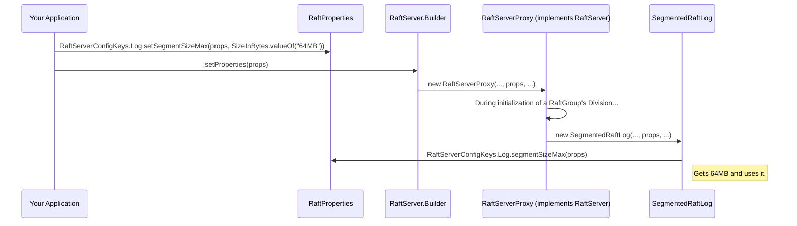

# Chapter 7: Configuration Management

Welcome to Chapter 7! In [Chapter 6: RPC Abstraction (RaftServerRpc / RaftClientRpc)](06_rpc_abstraction__raftserverrpc___raftclientrpc__.md), we learned how Ratis components talk to each other, whether it's a client talking to a server or servers talking amongst themselves. We saw that Ratis can use different "postal services" like gRPC or Netty for this. But how do you tell Ratis *which* service to use, or what address and port to listen on? And what about other operational settings, like where to store data or how long to wait for certain operations?

This is where **Configuration Management** comes in. It's all about how you fine-tune Ratis to fit your specific needs.

## Why Do We Need Configuration? The Need for Tuning

Imagine you've just bought a new car. It comes with factory default settings for the seat position, mirror angles, and radio volume. These defaults might work okay, but for the best driving experience, you'll want to adjust them to your preferences.

Similarly, Ratis comes with sensible default settings for many of its operations. However, every application and every environment is different:
*   You might be running Ratis on powerful servers with fast SSDs, or on more modest virtual machines.
*   Your network might be super fast and reliable, or it might have higher latency.
*   The amount of data your Ratis cluster manages could be small or enormous.

To get the best performance, reliability, and resource usage out of Ratis, you need a way to "tune" its behavior. Configuration Management provides this mechanism. It allows you to specify:
*   **Storage locations**: Where should the [RaftServer](02_raftserver_.md) store its precious [RaftLog](03_raftlog_.md) and snapshots?
*   **Timeouts**: How long should a [RaftClient](05_raftclient_.md) wait for a reply? How long should a server wait before considering another server to be unresponsive?
*   **Buffer sizes**: How much memory should be used for certain network operations or log queues?
*   **RPC settings**: Which RPC framework (like gRPC or Netty) should be used, and on which ports should they listen?

## The Core Idea: `RaftProperties` and `RaftConfigKeys`

Ratis's configuration system is built around two main concepts:

1.  **`RaftProperties`**:
    *   Think of this class (`org.apache.ratis.conf.RaftProperties`) as a central "settings panel" or an "instruction sheet" for a Ratis component (like a `RaftServer` or `RaftClient`).
    *   It's an object that holds a collection of key-value pairs, where each pair represents a specific configuration setting.

2.  **`RaftConfigKeys` (and its friends)**:
    *   These are special helper classes that define the standard "names" (keys) for all the different settings you can configure in Ratis. They provide predefined constant strings for these keys.
    *   Using these predefined keys helps avoid typos and ensures you're using the correct name for a setting.
    *   Examples:
        *   `org.apache.ratis.RaftConfigKeys`: For general Ratis settings, like choosing the RPC type.
        *   `org.apache.ratis.server.RaftServerConfigKeys`: For settings specific to `RaftServer`s (e.g., storage directories, log segment sizes, snapshot parameters).
        *   `org.apache.ratis.client.RaftClientConfigKeys`: For settings specific to `RaftClient`s (e.g., RPC timeouts, retry policies).
        *   `org.apache.ratis.grpc.GrpcConfigKeys`: For gRPC-specific settings (e.g., gRPC server port).
        *   `org.apache.ratis.netty.NettyConfigKeys`: For Netty-specific settings.
    *   These `*ConfigKeys` classes often provide convenient static methods to easily set and get typed configuration values (like integers, booleans, file paths, time durations) from a `RaftProperties` object, complete with default values.

## How to Configure Ratis: A Practical Example

Let's see how you can use `RaftProperties` and `RaftConfigKeys` to customize Ratis.

### Step 1: Create a `RaftProperties` Object

First, you need an instance of `RaftProperties`.

```java
import org.apache.ratis.conf.RaftProperties;

// Create an empty RaftProperties object
RaftProperties properties = new RaftProperties();
```
This `properties` object is now ready to hold your custom settings.

### Step 2: Set Configuration Values

Now, you can use the static methods from the various `*ConfigKeys` classes to set your desired values.

**Example 1: Setting the Storage Directory for a `RaftServer`**
Let's say you want your `RaftServer` to store its data in `/var/data/ratis-node1` instead of the default `/tmp/raft-server/`.

```java
import org.apache.ratis.server.RaftServerConfigKeys;
import java.io.File;
import java.util.Collections;
import java.util.List;

// Assuming 'properties' is your RaftProperties object from Step 1

List<File> myStorageDirs = Collections.singletonList(new File("/var/data/ratis-node1"));
RaftServerConfigKeys.setStorageDir(properties, myStorageDirs);

System.out.println("Storage directory set to: " + RaftServerConfigKeys.storageDir(properties));
```
If you run this, the output will be:
```
Storage directory set to: [/var/data/ratis-node1]
```
Here, `RaftServerConfigKeys.setStorageDir(...)` updates the `properties` object with the new storage location. `RaftServerConfigKeys.storageDir(...)` can be used to retrieve the value.

**Example 2: Choosing an RPC Type and Port**
Let's configure Ratis to use Netty for RPC and set the server's Netty RPC port to 9876.

```java
import org.apache.ratis.RaftConfigKeys;
import org.apache.ratis.rpc.SupportedRpcType;
import org.apache.ratis.netty.NettyConfigKeys;

// Assuming 'properties' is your RaftProperties object

// Set the general RPC type to NETTY
RaftConfigKeys.Rpc.setType(properties, SupportedRpcType.NETTY);

// Set the port for the Netty server
NettyConfigKeys.Server.setPort(properties, 9876);

System.out.println("RPC Type: " + RaftConfigKeys.Rpc.type(properties, null)); // null logger for simplicity
System.out.println("Netty Server Port: " + NettyConfigKeys.Server.port(properties));
```
Output:
```
RPC Type: NETTY
Netty Server Port: 9876
```

**Example 3: Setting a Client RPC Request Timeout**
If your client needs to wait longer for responses, you can adjust its timeout.

```java
import org.apache.ratis.client.RaftClientConfigKeys;
import org.apache.ratis.util.TimeDuration;
import java.util.concurrent.TimeUnit;

// Assuming 'properties' is your RaftProperties object

TimeDuration clientTimeout = TimeDuration.valueOf(5, TimeUnit.SECONDS);
RaftClientConfigKeys.Rpc.setRequestTimeout(properties, clientTimeout);

System.out.println("Client RPC Timeout: " + RaftClientConfigKeys.Rpc.requestTimeout(properties));
```
Output:
```
Client RPC Timeout: 5s
```

### Step 3: Pass `RaftProperties` to Ratis Components

Once you've populated your `RaftProperties` object, you pass it to the builder of the Ratis component you're creating (e.g., `RaftServer.newBuilder()` or `RaftClient.newBuilder()`).

```java
// For a RaftServer (conceptual, assuming other variables are defined)
// RaftPeerId myServerId = ...;
// RaftGroup myGroup = ...;
// StateMachine.Registry myStateMachineRegistry = ...;

// RaftServer server = RaftServer.newBuilder()
//         .setServerId(myServerId)
//         .setGroup(myGroup)
//         .setStateMachineRegistry(myStateMachineRegistry)
//         .setProperties(properties) // <-- Here's where you pass it!
//         .build();

// For a RaftClient (conceptual)
// RaftGroup targetGroup = ...;

// RaftClient client = RaftClient.newBuilder()
//         .setRaftGroup(targetGroup)
//         .setProperties(properties) // <-- And here for the client!
//         .build();
```
When `build()` is called, the `RaftServer` or `RaftClient` (and its internal parts) will read the settings from the `properties` object you provided and use them.

## Common Things You Can Configure

There are many settings you can tune. Here are some common areas:

*   **Storage**:
    *   `RaftServerConfigKeys.setStorageDir(...)`: Main data directory.
*   **RPC Communication**:
    *   `RaftConfigKeys.Rpc.setType(...)`: Choose between `GRPC`, `NETTY`.
    *   `GrpcConfigKeys.Server.setPort(...)` or `NettyConfigKeys.Server.setPort(...)`: Set the listening port for server-to-server and client-to-server RPCs.
    *   Various timeout settings in `RaftServerConfigKeys.Rpc` and `RaftClientConfigKeys.Rpc`.
*   **Raft Log**:
    *   `RaftServerConfigKeys.Log.setSegmentSizeMax(...)`: How large individual log segment files can grow.
    *   `RaftServerConfigKeys.Log.setPreallocatedSize(...)`: How much space to preallocate for new log segments.
*   **Snapshots**:
    *   `RaftServerConfigKeys.Snapshot.setAutoTriggerThreshold(...)`: How many log entries before a snapshot is automatically triggered.
    *   `RaftServerConfigKeys.Snapshot.setCreationGap(...)`: Minimum log entries between snapshots.
*   **Thread Pools**:
    *   Various settings under `RaftServerConfigKeys.ThreadPool` to control the size and type of thread pools used for different tasks.
*   **Leader Election Timeouts**:
    *   `RaftServerConfigKeys.Rpc.setTimeoutMin(...)` and `setTimeoutMax(...)` control the range for election timeouts.

You can find a comprehensive list of configurations in the [Ratis Configurations Documentation](https://ratis.apache.org/docs/configurations.html) (or locally in `ratis-docs/src/site/markdown/configurations.md`).

## Dynamic Reconfiguration: Changing Settings on the Fly!

One powerful feature in Ratis is that some configuration properties can be changed *while the Ratis server is running*, without needing a restart! This is called dynamic reconfiguration.

This is useful if you need to adjust a timeout, change a buffer size, or tweak a performance parameter in a live cluster.

Ratis components that support this implement the `org.apache.ratis.conf.Reconfigurable` interface. This interface allows properties to be updated, typically through administrative commands or APIs.

For example, the retry cache expiry time (`RaftServerConfigKeys.RetryCache.EXPIRY_TIME_KEY`) can often be reconfigured.

We won't dive deep into how to perform dynamic reconfiguration in this beginner chapter, but it's good to know that Ratis offers this flexibility for advanced operational management.

## Under the Hood: How It Works

Let's peek a bit into how Ratis handles these configurations internally.

### The `RaftProperties` Class

The `org.apache.ratis.conf.RaftProperties` class is relatively straightforward. At its core, it uses a map (specifically, a `ConcurrentHashMap`) to store property names (strings) and their values (also strings).

```java
// Simplified conceptual structure of RaftProperties.java
package org.apache.ratis.conf;

import java.util.concurrent.ConcurrentHashMap;
import java.util.concurrent.ConcurrentMap;
// ... other imports

public class RaftProperties {
    private final ConcurrentMap<String, String> properties = new ConcurrentHashMap<>();

    public void set(String name, String value) {
        // Name and value are validated (e.g., not null)
        properties.put(name.trim(), value);
    }

    public String get(String name) {
        String rawValue = properties.get(name.trim());
        // It also supports variable substitution e.g. ${env.MY_VAR:-default}
        // but we'll keep it simple here.
        return rawValue;
    }

    // It also has methods to get typed values, like:
    // getInt(String name, Integer defaultValue)
    // getBoolean(String name, Boolean defaultValue)
    // getTimeDuration(String name, TimeDuration defaultValue, TimeUnit defaultUnit)
    // getSizeInBytes(String name, SizeInBytes defaultValue)
    // These often use ConfUtils to parse the string value.
}
```
When you use methods like `RaftServerConfigKeys.setStorageDir(properties, dirs)`, these helper methods ultimately call `properties.set(KEY_STRING, valueString)` after converting the typed value (like a `List<File>`) into a string. Conversely, when a Ratis component needs a setting, it calls something like `RaftServerConfigKeys.storageDir(properties)`, which uses `properties.get(KEY_STRING)` and then parses the string back into the required type (e.g., `List<File>`), often providing a default if the key isn't found.

### The `*ConfigKeys` Classes

Classes like `RaftServerConfigKeys`, `GrpcConfigKeys`, etc., serve two main purposes:
1.  **Define Constant Keys**: They declare `public static final String` constants for all known configuration keys. This avoids "magic strings" in the code.
    ```java
    // Example from RaftServerConfigKeys.java
    public interface RaftServerConfigKeys {
        String PREFIX = "raft.server"; // Base prefix for all server keys
        // ...
        interface Log {
            String PREFIX = RaftServerConfigKeys.PREFIX + ".log"; // Prefix for log keys
            String SEGMENT_SIZE_MAX_KEY = PREFIX + ".segment.size.max";
            // ...
        }
    }
    ```
2.  **Provide Typed Accessors**: They offer static helper methods for getting and setting these properties in a type-safe way, often handling default values and parsing to/from strings. These helpers usually rely on utility methods from `org.apache.ratis.conf.ConfUtils`.

    ```java
    // Example from RaftServerConfigKeys.Log
    import org.apache.ratis.util.SizeInBytes;
    import static org.apache.ratis.conf.ConfUtils.getSizeInBytes;
    import static org.apache.ratis.conf.ConfUtils.setSizeInBytes;

    public interface RaftServerConfigKeys {
        // ...
        interface Log {
            // ...
            String SEGMENT_SIZE_MAX_KEY = PREFIX + ".segment.size.max";
            SizeInBytes SEGMENT_SIZE_MAX_DEFAULT = SizeInBytes.valueOf("32MB");

            static SizeInBytes segmentSizeMax(RaftProperties properties) {
                // Uses ConfUtils.getSizeInBytes to read the property,
                // parse it as SizeInBytes, and return default if not set.
                return getSizeInBytes(properties::getSizeInBytes,
                    SEGMENT_SIZE_MAX_KEY, SEGMENT_SIZE_MAX_DEFAULT, null /*logger*/);
            }

            static void setSegmentSizeMax(RaftProperties properties, SizeInBytes segmentSizeMax) {
                // Uses ConfUtils.setSizeInBytes to set the property.
                setSizeInBytes(properties::set, SEGMENT_SIZE_MAX_KEY, segmentSizeMax);
            }
            // ...
        }
    }
    ```

### How Components Use `RaftProperties`

When a Ratis component (like `RaftServerProxy` or `SegmentedRaftLog`) is initialized, it's typically given a `RaftProperties` object. During its initialization, it will call the appropriate `*ConfigKeys` static methods to retrieve the settings it needs.

Let's visualize this with a simplified sequence:


This shows how your setting flows from your code, through `RaftProperties`, and into the Ratis component that uses it.

### The `Reconfigurable` Interface

For dynamic reconfiguration, relevant Ratis components implement `org.apache.ratis.conf.Reconfigurable`.

```java
package org.apache.ratis.conf;

import java.util.Collection;

public interface Reconfigurable {
    RaftProperties getProperties(); // Access the current properties

    // Attempt to change a property
    String reconfigureProperty(String property, String newValue)
        throws ReconfigurationException;

    // Check if a property can be reconfigured
    boolean isPropertyReconfigurable(String property);

    // List all reconfigurable properties
    Collection<String> getReconfigurableProperties();
}
```
When an administrative command triggers a reconfiguration, the `reconfigureProperty` method is called on the target component. The component then updates its internal state based on the new value and potentially propagates the change to other `Reconfigurable` sub-components.

## Conclusion

Configuration management is key to tailoring Ratis to your specific operational environment and application needs.
*   **`RaftProperties`** acts as your "settings panel."
*   The various **`*ConfigKeys`** classes provide the names for these settings and helper methods to use them safely.
*   You set these properties when building Ratis clients or servers.
*   Ratis is highly tunable, from storage and RPC to intricate Raft protocol parameters.
*   Some properties can even be reconfigured dynamically while the system is live.

By understanding and using Ratis configurations effectively, you can optimize its performance, reliability, and resource consumption.

Now that we know how to configure Ratis, including settings related to its log and snapshots, it's time to dive deeper into one of the most critical operational aspects for long-running Raft groups: [Chapter 8: Snapshotting](08_snapshotting_.md). Snapshots are essential for managing log growth and ensuring fast recovery.

---

Generated by [AI Codebase Knowledge Builder](https://github.com/The-Pocket/Tutorial-Codebase-Knowledge)