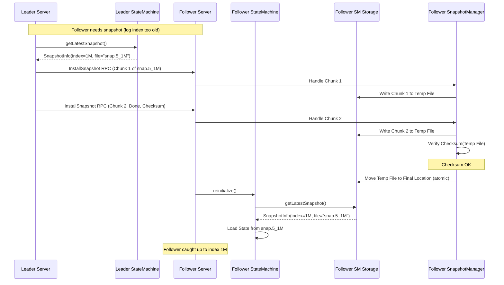

# Chapter 7: Snapshotting (SnapshotInfo, StateMachineStorage)

Welcome to Chapter 7! In the [previous chapter](06_rpc_layer__rpctype__rpcfactory__raftserverrpc__raftclientrpc_.md), we learned how Ratis servers and clients communicate over the network using the pluggable RPC Layer. We saw how the Leader replicates log entries to Followers.

But what happens when the application runs for a long time? If we keep appending log entries (like "INCREMENT" for our counter), the [RaftLog](05_raftlog_.md) can grow incredibly large! Imagine millions or billions of entries. This consumes a lot of disk space, and more importantly, when a server restarts, it would need to replay this entire massive log to rebuild its state, which could take a very long time. How can we prevent the log from growing forever and speed up recovery?

This is where **Snapshotting** comes in.

## What Problem Does Snapshotting Solve?

Think back to our distributed counter example. Every time we send "INCREMENT", Ratis adds an entry to the [RaftLog](05_raftlog_.md).

```
Log Index | Entry
----------|-------------
1         | INCREMENT
2         | INCREMENT
...       | ...
1,000,000 | INCREMENT
```

After a million increments, the counter's value is 1,000,000. The log tells us the *history* of how we got there. But if we just want to know the *current* value, do we really need all million individual "INCREMENT" entries?

If a server crashes and restarts, it has to read and apply all 1,000,000 entries to figure out the current count is 1,000,000. That's slow! Similarly, if a new server joins the cluster, the leader would have to send all 1,000,000 entries to it.

Snapshotting solves this by allowing the system to take a "picture" of the application's current state (e.g., "the counter value is 1,000,000") and save it. Once this picture (snapshot) is safely stored, the system can delete the old log entries that are covered by the snapshot (e.g., entries 1 to 1,000,000).

## What is a Snapshot?

A snapshot is essentially a **checkpoint** of your application's state at a specific point in the Raft log history.

*   **State Capture:** It captures the complete state managed by your [StateMachine](01_statemachine_.md) (like the counter's value).
*   **Log Point:** It corresponds to a specific log index (`TermIndex`). The snapshot represents the result of applying all log entries up to that index.
*   **Durable:** Snapshots are saved to persistent storage (like disk) so they survive restarts.

## Why Snapshot?

Taking snapshots provides two main benefits:

1.  **Log Compaction:** By saving the current state in a compact snapshot, we can safely delete older log entries, preventing the [RaftLog](05_raftlog_.md) from growing indefinitely and saving disk space.
2.  **Faster Recovery & Bootstrapping:**
    *   When a server restarts, instead of replaying the entire log, it can load the latest snapshot and then only replay the log entries *after* the snapshot. This is much faster.
    *   When a new server joins, the leader can send the latest snapshot file(s) directly, which is usually much more efficient than sending potentially millions of log entries.

## The StateMachine's Role in Snapshotting

Your [StateMachine](01_statemachine_.md) implementation is responsible for creating and loading snapshots because only *it* truly understands the application's state. Ratis tells the StateMachine *when* to take or load a snapshot, but the StateMachine does the actual work via specific methods:

*   **`long takeSnapshot() throws IOException;`**
    *   Ratis calls this method on your StateMachine when it decides a snapshot should be taken (e.g., automatically when the log grows too large, or triggered by an admin).
    *   Your implementation must:
        1.  Get the current state (e.g., read the `counter` value).
        2.  Save this state to durable storage (usually one or more files). The `StateMachineStorage` interface helps manage these files.
        3.  Return the **log index** up to which the state has been saved. This tells Ratis which older log entries are now covered by this snapshot.

*   **`SnapshotInfo getLatestSnapshot();`**
    *   Ratis needs to know about the most recent snapshot available (e.g., for log cleaning or sending to followers).
    *   Your StateMachine must implement this to return information about the latest snapshot it has successfully saved, typically by querying its associated `StateMachineStorage`.

*   **`void initialize(...) throws IOException;`**
    *   When your StateMachine starts (e.g., when the [RaftServer](04_raftserver_.md) starts), this method is called.
    *   Your implementation should:
        1.  Check if any snapshots exist using `StateMachineStorage`.
        2.  If a snapshot exists, load the state from the **latest** snapshot file.
        3.  Update its internal state (e.g., set the `counter` to the value loaded from the snapshot).
        4.  Remember the index of the loaded snapshot, as this becomes the `lastAppliedIndex` initially. Ratis will then start applying log entries *after* this index.

*   **`void reinitialize() throws IOException;`**
    *   Called after a server receives and installs a snapshot from the leader (e.g., when a new server joins or a lagging follower catches up).
    *   Similar to `initialize`, your StateMachine needs to load the state from this newly installed snapshot.

## `StateMachineStorage`: The Snapshot Album

How does the StateMachine know *where* to save snapshots or *how* to find the latest one? It uses a `StateMachineStorage` object. Think of this as the dedicated storage manager or "photo album" for your StateMachine's snapshots.

The `StateMachineStorage` interface defines how snapshots are physically managed:

```java
// From: ratis-server-api/src/main/java/org/apache/ratis/statemachine/StateMachineStorage.java
public interface StateMachineStorage {
    // Initialize with RaftStorage (provides directory context)
    void init(RaftStorage raftStorage) throws IOException;

    // Get info about the latest snapshot found in storage
    SnapshotInfo getLatestSnapshot();

    // Prepare storage for first use (optional)
    void format() throws IOException;

    // Delete old snapshots based on a retention policy
    void cleanupOldSnapshots(SnapshotRetentionPolicy snapshotRetentionPolicy) throws IOException;

    // Get the main directory where snapshots are stored
    default File getSnapshotDir() { /*...*/ }

    // Get a temporary directory for operations like receiving snapshots
    default File getTmpDir() { /*...*/ }
}
```

*   Ratis provides the StateMachine with an instance of `StateMachineStorage` during initialization.
*   Your StateMachine uses this instance (e.g., calling `getSnapshotDir()`) to determine where to read/write snapshot files.
*   It uses `getLatestSnapshot()` to report the latest available snapshot index and files back to Ratis.

Ratis provides a common implementation: `SimpleStateMachineStorage`. This implementation stores each snapshot as a single file in the state machine directory, following a specific naming pattern.

## `SnapshotInfo`: The Label on the Photo

When the StateMachine (or Ratis) talks about a snapshot, it uses a `SnapshotInfo` object. This object provides the metadata, like the label on the back of our photo.

```java
// From: ratis-server-api/src/main/java/org/apache/ratis/statemachine/SnapshotInfo.java
public interface SnapshotInfo {
    // Which point in the Raft log does this snapshot represent?
    TermIndex getTermIndex();

    // What are the actual file(s) that make up this snapshot?
    List<FileInfo> getFiles();

    // Convenience methods
    default long getTerm() { return getTermIndex().getTerm(); }
    default long getIndex() { return getTermIndex().getIndex(); }
}
```

*   `getTermIndex()`: Returns the Term and Index of the last log entry included in this snapshot. This is crucial for Ratis to know which log entries can be purged.
*   `getFiles()`: Returns a list of `FileInfo` objects describing the actual file(s) on disk that contain the snapshot data. This is needed when a leader needs to send the snapshot to a follower. A snapshot might consist of multiple files for complex state machines.

Ratis provides implementations like `SingleFileSnapshotInfo` (for snapshots stored in one file) and `FileListSnapshotInfo` (for multi-file snapshots).

## Using Snapshotting in `CounterStateMachine`

Let's update our `CounterStateMachine` to support basic snapshotting using `SimpleStateMachineStorage`.

### 1. Storing Snapshots (`takeSnapshot`)

We need to implement `takeSnapshot` to save the current counter value to a file. We'll use `SimpleStateMachineStorage` (which Ratis will provide) to manage the snapshot file.

```java
// Inside CounterStateMachine (extends BaseStateMachine)

// Assume storage is injected/set during initialization
private SimpleStateMachineStorage storage = new SimpleStateMachineStorage();

@Override
public long takeSnapshot() throws IOException {
    // 1. Get the current state and the last applied index
    final long currentCount = counter.get();
    final TermIndex lastApplied = getLastAppliedTermIndex();

    // 2. Create the snapshot file path using storage helper
    // Format: snapshot.<term>_<index>
    final File snapshotFile = storage.getSnapshotFile(
                                        lastApplied.getTerm(),
                                        lastApplied.getIndex());

    LOG.info("Taking snapshot up to index {} to file {}", lastApplied, snapshotFile);

    // 3. Write the state to the file (atomically recommended)
    // In a real SM, use AtomicFileOutputStream or similar for safety
    try (OutputStream out = new FileOutputStream(snapshotFile);
         DataOutputStream dataOut = new DataOutputStream(out)) {
        dataOut.writeLong(currentCount);
    } // TODO: Handle exceptions properly, use atomic writes

    // 4. Create SnapshotInfo (using SimpleStateMachineStorage's helper class)
    // This also calculates and saves an MD5 checksum file automatically
    final SingleFileSnapshotInfo snapshotInfo = storage.findLatestSnapshot(storage.getStateMachineDir().toPath());

    // 5. Update the storage's view of the latest snapshot
    storage.updateLatestSnapshot(snapshotInfo);

    // 6. Return the index included in the snapshot
    return lastApplied.getIndex();
}

```

**Explanation:**

1.  We get the current counter value and the `TermIndex` (term and log index) of the last transaction we applied. This index defines the point captured by the snapshot.
2.  We ask our `SimpleStateMachineStorage` instance for the correct file path for a snapshot corresponding to this `TermIndex`. `SimpleStateMachineStorage` uses the pattern `snapshot.<term>_<index>`.
3.  We write the `currentCount` into this file. **Important:** Real applications should use atomic file writing (like `AtomicFileOutputStream` provided by Ratis) to prevent corruption if the server crashes mid-write.
4.  We ask the storage to find the snapshot file we just wrote and create a `SingleFileSnapshotInfo` object for it. This helper also calculates and saves a `.md5` checksum file alongside the snapshot.
5.  We tell the storage object about this new snapshot, so it knows it's the latest one.
6.  We return the log index (`lastApplied.getIndex()`) that this snapshot represents. Ratis uses this index for log purging.

### 2. Finding the Latest Snapshot (`getLatestSnapshot`)

The `StateMachine` needs to report the latest snapshot it knows about.

```java
// Inside CounterStateMachine

@Override
public SnapshotInfo getLatestSnapshot() {
    // Delegate to the storage object
    return storage.getLatestSnapshot();
}
```

**Explanation:**
We simply ask our `StateMachineStorage` instance for the `SnapshotInfo` of the latest snapshot it has recorded or found on disk.

### 3. Loading Snapshots (`initialize`)

When the server starts, the `StateMachine` needs to load state from the latest snapshot, if one exists.

```java
// Inside CounterStateMachine

@Override
public void initialize(RaftServer raftServer, RaftGroupId raftGroupId, RaftStorage raftStorage) throws IOException {
    super.initialize(raftServer, raftGroupId, raftStorage); // Base class init

    // Initialize our storage helper
    this.storage.init(raftStorage);

    // Load state from the latest snapshot
    loadSnapshot(storage.getLatestSnapshot());
}

// Helper method to load state from a snapshot
private void loadSnapshot(SnapshotInfo snapshot) throws IOException {
    if (snapshot == null) {
        LOG.info("No snapshot found. Starting with count = 0.");
        return;
    }

    // Check if it's the type we expect (SingleFileSnapshotInfo)
    if (!(snapshot instanceof SingleFileSnapshotInfo)) {
        LOG.warn("Found snapshot but it's not a SingleFileSnapshotInfo: {}", snapshot);
        // Handle error or try different loading logic
        return;
    }

    final SingleFileSnapshotInfo info = (SingleFileSnapshotInfo) snapshot;
    final File snapshotFile = info.getFile().getPath().toFile();

    if (!snapshotFile.exists()) {
        LOG.warn("Snapshot file {} does not exist for snapshot {}", snapshotFile, info);
        return; // Or throw exception
    }

    LOG.info("Loading state from snapshot {}", info);

    // Read the state from the file
    long loadedCount;
    try (InputStream in = new FileInputStream(snapshotFile);
         DataInputStream dataIn = new DataInputStream(in)) {
        loadedCount = dataIn.readLong();
    } // TODO: Handle exceptions properly

    // Update internal state
    counter.set(loadedCount);

    // Update last applied index based on the snapshot
    updateLastAppliedTermIndex(info.getTerm(), info.getIndex());

    LOG.info("Loaded snapshot up to index {}. Count set to {}.",
             getLastAppliedTermIndex(), counter.get());
}

@Override
public void reinitialize() throws IOException {
    // Called after receiving a snapshot from leader
    // Re-load state from the (potentially new) latest snapshot on disk
    loadSnapshot(storage.getLatestSnapshot());
}

```

**Explanation:**

1.  In `initialize`, after calling the base class `initialize` and initializing our `StateMachineStorage`, we call `loadSnapshot` with the result of `storage.getLatestSnapshot()`.
2.  The `loadSnapshot` helper checks if a snapshot was found.
3.  It verifies the snapshot is the expected type (`SingleFileSnapshotInfo`).
4.  It gets the snapshot `File` from the `SnapshotInfo`.
5.  It reads the `long` value from the snapshot file.
6.  It updates the `StateMachine`'s `counter` with the loaded value.
7.  Crucially, it updates the `lastAppliedTermIndex` using the `TermIndex` from the `SnapshotInfo`. This tells Ratis where to start applying log entries *after* the snapshot.
8.  The `reinitialize` method simply calls `loadSnapshot` again, as Ratis guarantees the latest snapshot files are in place before calling it.

## How Ratis Manages Snapshots Internally

Let's peek under the hood at how Ratis orchestrates snapshotting.

1.  **Triggering:**
    *   **Automatic:** The [RaftServer](04_raftserver_.md) monitors the size of the [RaftLog](05_raftlog_.md) (number of entries since the last snapshot). If it exceeds a configured threshold (`raft.server.snapshot.auto.trigger.threshold`), it triggers a snapshot. (Requires `raft.server.snapshot.auto.trigger.enabled=true`).
    *   **Manual:** An administrator can use the `SnapshotManagementApi` via the [RaftClient](03_raftclient_.md) to request a snapshot creation.

2.  **Taking the Snapshot:**
    *   The `RaftServer` (specifically `RaftServerImpl`) calls `stateMachine.takeSnapshot()`.
    *   Your StateMachine code executes, interacting with `StateMachineStorage` to write snapshot files (e.g., `snapshot.5_1000000`).
    *   The StateMachine returns the snapshot index (e.g., 1,000,000) to the `RaftServer`.

3.  **Log Purging:**
    *   The `RaftServer` informs its `RaftLog` component (e.g., `SegmentedRaftLog`) about the latest snapshot index (1,000,000).
    *   The `RaftLog` can now safely delete log segment files containing entries with indices less than or equal to 1,000,000 (subject to other retention policies, like ensuring entries are committed everywhere first unless configured otherwise).

4.  **Installing Snapshots on Followers:**
    *   A Leader realizes a Follower is far behind (its next required log index is older than the Leader's oldest available log entry, because logs were purged).
    *   The Leader calls `stateMachine.getLatestSnapshot()` to get the `SnapshotInfo`.
    *   The Leader reads the snapshot file(s) listed in `SnapshotInfo`.
    *   The Leader sends the snapshot data to the Follower in chunks using `InstallSnapshot` RPC messages (part of the [RPC Layer](06_rpc_layer__rpctype__rpcfactory__raftserverrpc__raftclientrpc_.md)).
    *   The Follower receives these chunks via its `RaftServerRpc`. A component called `SnapshotManager` on the follower handles receiving these chunks.
    *   `SnapshotManager` writes the chunks to a temporary location managed by the follower's `StateMachineStorage` (e.g., using `getTmpDir()`).
    *   Once all chunks are received, `SnapshotManager` verifies the snapshot (e.g., checking MD5 checksums provided by the leader).
    *   If valid, `SnapshotManager` atomically moves the temporary snapshot files into the final `StateMachineStorage` location (`getSnapshotDir()`), replacing any older state.
    *   The Follower's `RaftServer` then calls `stateMachine.reinitialize()` to load this new state.
    *   The Follower is now caught up to the snapshot index and can start receiving regular log entries again.

Here's a simplified view of snapshot installation:



### Code Dive: `SimpleStateMachineStorage`

This implementation (`ratis-server/.../impl/SimpleStateMachineStorage.java`) manages snapshots as single files:

*   **File Naming:** Uses the pattern `snapshot.<term>_<index>` (e.g., `snapshot.5_1000000`). It also creates a corresponding `.md5` file (e.g., `snapshot.5_1000000.md5`).
    ```java
    // From SimpleStateMachineStorage.java
    static final String SNAPSHOT_FILE_PREFIX = "snapshot";
    public static final Pattern SNAPSHOT_REGEX =
        Pattern.compile(SNAPSHOT_FILE_PREFIX + "\\.(\\d+)_(\\d+)");

    public static String getSnapshotFileName(long term, long endIndex) {
        return SNAPSHOT_FILE_PREFIX + "." + term + "_" + endIndex;
    }

    public File getSnapshotFile(long term, long endIndex) {
        // Returns new File(stateMachineDir, getSnapshotFileName(term, endIndex));
    }
    ```
*   **Finding Latest:** `findLatestSnapshot` scans the `stateMachineDir` for files matching the pattern, parses the term and index from the filenames, and returns the `SingleFileSnapshotInfo` for the one with the highest index. It also reads the `.md5` file.
    ```java
    // Simplified logic from findLatestSnapshot / getSingleFileSnapshotInfos
    static SingleFileSnapshotInfo findLatestSnapshot(Path dir) throws IOException {
        // 1. List files in dir matching SNAPSHOT_REGEX
        // 2. For each match, parse term & index from filename
        // 3. Keep track of the info with the highest index found
        // 4. Read the corresponding .md5 file for the latest snapshot
        // 5. Return new SingleFileSnapshotInfo(latestFile, latestTerm, latestIndex, md5)
    }
    ```
*   **Updating:** `updateLatestSnapshot` keeps an `AtomicReference` to the latest known `SingleFileSnapshotInfo`, updating it atomically when a new, higher-index snapshot is created or found.

### Code Dive: `SnapshotManager`

This class (`ratis-server/.../storage/SnapshotManager.java`) exists on the server side to handle the *receiving* and installation process:

*   Its `installSnapshot(InstallSnapshotRequestProto request, StateMachine stateMachine)` method is called when an `InstallSnapshot` RPC arrives.
*   It processes the `FileChunkProto` messages within the request.
*   It uses the `StateMachineStorage`'s `getTmpDir()` to create temporary files/directories.
*   It writes the received chunk data to the temporary files, calculating a checksum as it goes.
*   When the last chunk arrives (`chunk.getDone() == true`), it verifies the calculated checksum against the one sent by the leader (`chunk.getFileDigest()`).
*   If valid, it calls a helper method (`rename`) to atomically move the temporary directory to the final `StateMachineStorage` location (`getSnapshotDir()`), effectively installing the snapshot.

## Conclusion

Snapshotting is a vital mechanism in Ratis for managing the size of the [RaftLog](05_raftlog_.md) and ensuring fast recovery times. Your [StateMachine](01_statemachine_.md) plays a key role by implementing `takeSnapshot` to save its state and `initialize`/`reinitialize` to load state from snapshots. The `StateMachineStorage` interface and its implementations (like `SimpleStateMachineStorage`) provide the mechanism for managing snapshot files on disk, while `SnapshotInfo` carries the essential metadata about each snapshot. By taking snapshots, Ratis can safely purge old log entries, keeping the system efficient and responsive even after long periods of operation.

Key Takeaways:

*   Snapshots capture StateMachine state at a specific log index (`TermIndex`).
*   They enable log compaction (saving disk space) and faster recovery/bootstrapping.
*   The StateMachine implements `takeSnapshot`, `getLatestSnapshot`, `initialize`, `reinitialize`.
*   `StateMachineStorage` manages *how* and *where* snapshots are stored (e.g., `SimpleStateMachineStorage` uses single files like `snapshot.term_index`).
*   `SnapshotInfo` describes a snapshot (its index and files).
*   Ratis automatically uses snapshots for log purging and installing state on followers.

Sometimes, the state you need to snapshot, or the data involved in transactions, can be very large. How does Ratis handle potentially huge amounts of data efficiently?

**Next:** [Chapter 8: DataStream API](08_datastream_api_.md)

---

Generated by [AI Codebase Knowledge Builder](https://github.com/The-Pocket/Tutorial-Codebase-Knowledge)