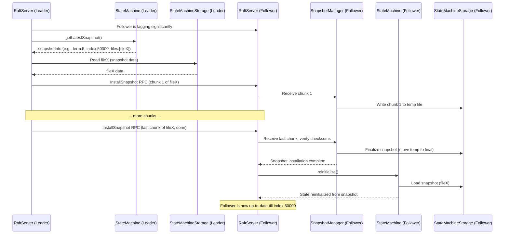
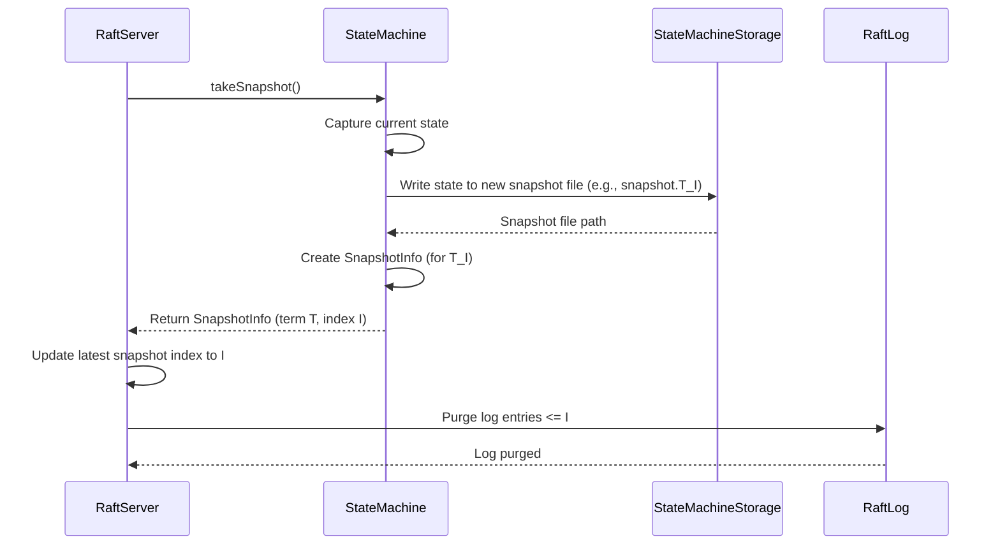

# Chapter 8: Snapshotting

In [Chapter 7: Configuration Management](07_configuration_management_.md), we learned how to fine-tune Ratis using `RaftProperties` to suit our needs, including settings for where data is stored. As your Ratis application runs, the [RaftLog](03_raftlog_.md) (the ordered list of all commands) keeps getting longer and longer. This is good for reliability, but a very long log can cause a couple of problems:

1.  **Disk Space**: It can take up a lot of disk space.
2.  **Recovery Time**: If a server restarts, or if a new server joins the group, it needs to replay all the log entries to catch up to the current state. Replaying a massive log can take a very long time!

Imagine writing a book. The `RaftLog` is like the complete manuscript, detailing every single word change from start to finish. If the book is thousands of pages long, and someone wants to know the current story, making them read the entire edit history from page 1 is inefficient.

This is where **Snapshotting** comes to the rescue!

## What is Snapshotting? Taking a "Photograph" of Your State

Snapshotting is like taking a photograph of the current state of your [StateMachine](04_statemachine_.md) at a specific point in time.
*   This "photograph" (the snapshot file) captures the complete state of your application (e.g., the current value of our counter, the contents of a key-value store).
*   This snapshot is saved to persistent storage.
*   Once the snapshot is securely saved, Ratis can then safely **discard all the old log entries that happened *before* the snapshot was taken**.

Continuing our book analogy: Instead of the full edit history, you publish "Chapter 10, First Edition" (the snapshot). Now, new readers can just start from there, and you only need to keep the edit history for changes made *after* Chapter 10 was published.

This dramatically:
*   **Saves disk space**: Old, redundant log entries are removed.
*   **Speeds up recovery**: Servers can load the latest snapshot and then only replay the much shorter log of recent changes.

## Key Components in Snapshotting

Let's look at the main pieces involved in the snapshotting process:

### 1. The `StateMachine`'s Role

Your [StateMachine](04_statemachine_.md) is central to snapshotting because it *owns* the application state.

*   **`long takeSnapshot() throws IOException;`**
    When Ratis decides it's time for a snapshot, it calls this method on your `StateMachine`. Your `StateMachine` must:
    1.  Write its current, complete state to one or more files.
    2.  Return the `log index` of the last log entry that is included in this snapshot. This tells Ratis how "up-to-date" the snapshot is.

*   **`SnapshotInfo getLatestSnapshot();`**
    Your `StateMachine` must be able to tell Ratis about its most recent snapshot. This method returns a `SnapshotInfo` object describing it.

*   **Loading from a Snapshot (during `initialize` or `reinitialize`)**
    When a `StateMachine` starts up (e.g., after a server restart or when a new server gets a snapshot from the leader), it needs to:
    1.  Find the latest snapshot on disk.
    2.  Load this snapshot to restore its state.
    3.  Then, it will apply any subsequent log entries from the `RaftLog`.

### 2. `SnapshotInfo`: The Snapshot's Label

`org.apache.ratis.statemachine.SnapshotInfo` is an interface that describes a snapshot. Think of it as the label on your photograph, telling you what it's a picture of. It primarily includes:

*   **`TermIndex getTermIndex();`**: The term and log index of the last applied log entry that this snapshot represents. This is crucial for knowing which log entries are now covered by the snapshot.
*   **`List<FileInfo> getFiles();`**: A list of `FileInfo` objects, each describing a file that is part of this snapshot (path on disk, size, and potentially a checksum).

A common implementation is `org.apache.ratis.statemachine.impl.SingleFileSnapshotInfo`, used when your snapshot consists of just one file.

```java
// In your StateMachine, when you create a snapshot:
import org.apache.ratis.server.protocol.TermIndex;
import org.apache.ratis.server.storage.FileInfo;
import org.apache.ratis.statemachine.SnapshotInfo;
import org.apache.ratis.statemachine.impl.SingleFileSnapshotInfo;
import java.io.File;
import java.nio.file.Path;

// After saving state to 'snapshotFile' at 'lastAppliedTermIndex':
Path snapshotFilePath = new File("path/to/your/snapshot_1000_2.dat").toPath();
long fileSize = 1024; // Example size
TermIndex snapshotTermIndex = TermIndex.valueOf(2, 1000); // term 2, index 1000

FileInfo fileInfo = new FileInfo(snapshotFilePath, fileSize, null); // MD5 digest can be null or calculated
SnapshotInfo mySnapshot = new SingleFileSnapshotInfo(fileInfo, snapshotTermIndex);

System.out.println("Snapshot created for index: " + mySnapshot.getIndex());
System.out.println("Snapshot file path: " + mySnapshot.getFiles().get(0).getPath());
```
This code snippet shows how you might create a `SingleFileSnapshotInfo` after successfully saving your state machine's data.

### 3. `StateMachineStorage`: The Snapshot's Home

`org.apache.ratis.statemachine.StateMachineStorage` is an interface that defines how and where your `StateMachine`'s snapshots are stored and managed on disk. Your `StateMachine` will use an implementation of this to:
*   Find a place to write new snapshot files.
*   Discover existing snapshots when it starts up.
*   Clean up old snapshots according to a retention policy.

A simple and common implementation is `org.apache.ratis.statemachine.impl.SimpleStateMachineStorage`. This typically stores snapshots as files directly within the state machine's directory (usually `ratis_storage_dir/group_id/statemachine/`). It often names files like `snapshot.<term>_<index>`.

```java
// Conceptual usage inside SimpleStateMachineStorage:
// To find the latest snapshot, it might scan its directory:
File smDir = new File("path/to/statemachine_directory");
// It would look for files like "snapshot.2_1000", "snapshot.3_1500"
// and pick the one with the highest index.
```
`SimpleStateMachineStorage` helps manage these files, including their MD5 checksum files (e.g., `snapshot.2_1000.md5`) to ensure integrity.

## Taking a Snapshot: The `SimpleCounterStateMachine` Example

Let's revisit our `SimpleCounterStateMachine` from [Chapter 4: StateMachine - Where Your Application Logic Lives](04_statemachine_.md) and add basic snapshotting. We'll use `SimpleStateMachineStorage` implicitly by extending `BaseStateMachine` and managing files ourselves for simplicity here.

```java
import org.apache.ratis.statemachine.impl.BaseStateMachine;
import org.apache.ratis.statemachine.StateMachineStorage;
import org.apache.ratis.statemachine.SnapshotInfo;
import org.apache.ratis.statemachine.impl.SimpleStateMachineStorage;
import org.apache.ratis.statemachine.impl.SingleFileSnapshotInfo;
import org.apache.ratis.server.protocol.TermIndex;
import org.apache.ratis.server.storage.RaftStorage;
import org.apache.ratis.protocol.RaftGroupId;
import org.apache.ratis.server.RaftServer;
import org.apache.ratis.server.storage.FileInfo;

import java.io.File;
import java.io.FileInputStream;
import java.io.FileOutputStream;
import java.io.IOException;
import java.io.ObjectInputStream;
import java.io.ObjectOutputStream;
import java.util.concurrent.atomic.AtomicInteger;

public class SnapshottableCounterStateMachine extends BaseStateMachine {
    private final AtomicInteger counter = new AtomicInteger(0);
    // SimpleStateMachineStorage will manage snapshot files in the SM directory.
    private final SimpleStateMachineStorage storage = new SimpleStateMachineStorage();

    @Override
    public void initialize(RaftServer server, RaftGroupId groupId, RaftStorage raftStorage) throws IOException {
        super.initialize(server, groupId, raftStorage);
        this.storage.init(raftStorage); // Initialize SM storage
        loadLatestSnapshot(); // Load state from the latest snapshot
    }

    private void loadLatestSnapshot() throws IOException {
        SnapshotInfo latestSnapshot = storage.getLatestSnapshot();
        if (latestSnapshot == null) {
            LOG.info("No snapshot found. Starting counter from 0.");
            return;
        }

        LOG.info("Loading snapshot: {}", latestSnapshot);
        File snapshotFile = latestSnapshot.getFiles().get(0).getPath().toFile();
        try (ObjectInputStream ois = new ObjectInputStream(new FileInputStream(snapshotFile))) {
            counter.set(ois.readInt());
            TermIndex snapshotTermIndex = TermIndex.valueOf(ois.readLong(), ois.readLong());
            updateLastAppliedTermIndex(snapshotTermIndex); // Critical: update lastApplied
            LOG.info("Loaded counter value {} from snapshot at {}", counter.get(), snapshotTermIndex);
        }
    }

    @Override
    public long takeSnapshot() throws IOException {
        TermIndex lastApplied = getLastAppliedTermIndex();
        if (lastApplied.getIndex() == TermIndex.DEFAULT_INIT_INDEX) {
            LOG.warn("No transactions applied yet, skipping snapshot.");
            return RaftServer.INVALID_LOG_INDEX; // Or a specific indicator for no snapshot
        }

        File snapshotFile = storage.getSnapshotFile(lastApplied.getTerm(), lastApplied.getIndex());
        LOG.info("Taking snapshot up to {} into file {}", lastApplied, snapshotFile.getAbsolutePath());

        try (ObjectOutputStream oos = new ObjectOutputStream(new FileOutputStream(snapshotFile))) {
            oos.writeInt(counter.get());
            oos.writeLong(lastApplied.getTerm());   // Store term
            oos.writeLong(lastApplied.getIndex());  // Store index
        }
        // Update storage with info about the new snapshot (e.g. so getLatestSnapshot() works)
        FileInfo fileInfo = new FileInfo(snapshotFile.toPath(), snapshotFile.length(), null);
        storage.updateLatestSnapshot(new SingleFileSnapshotInfo(fileInfo, lastApplied.getTerm(), lastApplied.getIndex()));
        LOG.info("Snapshot taken successfully: {}", snapshotFile.getName());
        return lastApplied.getIndex();
    }

    // query(), startTransaction(), applyTransaction() would be similar to SimpleCounterStateMachine
    // ... (Ensure applyTransaction calls updateLastAppliedTermIndex appropriately) ...
}
```
Breakdown:
1.  **`storage`**: We use a `SimpleStateMachineStorage` instance. It needs to be initialized with the `RaftStorage` from the server to know where its directories are.
2.  **`initialize()`**: Calls `storage.init()` and then `loadLatestSnapshot()`.
3.  **`loadLatestSnapshot()`**:
    *   Asks `storage.getLatestSnapshot()` for the newest snapshot.
    *   If found, it reads the counter value and the `TermIndex` from the snapshot file (here, using Java serialization for simplicity).
    *   Crucially, it calls `updateLastAppliedTermIndex()` to set the `StateMachine`'s baseline.
4.  **`takeSnapshot()`**:
    *   Gets the `lastAppliedTermIndex` (this `StateMachine` knows which log entry it processed last).
    *   Uses `storage.getSnapshotFile(term, index)` to get a designated file path for this snapshot.
    *   Writes the current `counter` value and the `lastAppliedTermIndex` to this file.
    *   Informs the `storage` about this new snapshot file using `updateLatestSnapshot`.
    *   Returns the `lastApplied.getIndex()` to tell Ratis this snapshot covers all log entries up to this index.

Now, if Ratis calls `takeSnapshot()`, our `SnapshottableCounterStateMachine` saves its current count. If the server restarts, `initialize()` will load this saved count.

## How Ratis Triggers Snapshots

Ratis can decide to take a snapshot in a few ways:

1.  **Automatic Triggering**:
    You can configure Ratis to automatically trigger a snapshot after a certain number of log entries have been applied. This is done using [Configuration Management](07_configuration_management_.md) settings:
    ```java
    import org.apache.ratis.conf.RaftProperties;
    import org.apache.ratis.server.RaftServerConfigKeys;

    RaftProperties properties = new RaftProperties();
    // Enable automatic snapshots
    RaftServerConfigKeys.Snapshot.setAutoTriggerEnabled(properties, true);
    // Trigger a snapshot after, say, 10,000 log entries are applied since the last one
    RaftServerConfigKeys.Snapshot.setAutoTriggerThreshold(properties, 10000L);

    // When building your RaftServer:
    // RaftServer server = RaftServer.newBuilder().setProperties(properties)...build();
    ```
    With these settings, the `RaftServer` will monitor the number of applied log entries and call `stateMachine.takeSnapshot()` when the threshold is met.

2.  **Manual Triggering**:
    You can also trigger a snapshot manually. Ratis provides APIs and command-line tools for this. For example, using the Ratis shell:
    ```bash
    # Assuming 'ratis sh' is on your PATH and configured
    # and group_id is your target Raft group's ID.
    ratis sh snapshot create -groupid <group_id_hex_string> -peers <peer1_addr,peer2_addr,...>
    ```
    The `ratis-shell` (see `SnapshotCommand.java`) uses the `RaftClient`'s administrative APIs to send a snapshot request to the Raft group leader.

## Log Purging: The Big Payoff!

Once a `StateMachine` has successfully taken a snapshot (e.g., up to log index 10000), and Ratis knows this snapshot is stable (e.g., it's also replicated or acknowledged appropriately within the Raft group), the `RaftServer` can instruct its `RaftLog` to **purge** (delete) all log entries with an index less than or equal to 10000.

This is the primary benefit: the `RaftLog` shrinks, saving disk space and reducing future replay times.

## Installing Snapshots on Followers

What happens if a new server joins the Raft group, or an existing follower falls very far behind (e.g., it was offline for a long time)? Sending it potentially millions of individual log entries would be very slow and network-intensive.

Instead, the Leader can send its latest snapshot directly to that follower:
1.  The Leader `RaftServer` detects a follower is too far behind.
2.  The Leader calls `getLatestSnapshot()` on its own `StateMachine` to get the `SnapshotInfo`.
3.  The Leader reads the snapshot files (listed in `SnapshotInfo`) from its `StateMachineStorage`.
4.  It then sends these files, chunk by chunk, to the lagging follower using special `InstallSnapshot` RPCs.
5.  The follower `RaftServer` receives these chunks. A component called `SnapshotManager` on the follower side helps in assembling these chunks into complete snapshot files in a temporary location within the follower's `StateMachineStorage`.
6.  Once all chunks are received and verified (e.g., checksums match), the `SnapshotManager` moves the snapshot to its final location in the follower's `StateMachineStorage`.
7.  The follower `RaftServer` then calls `reinitialize()` on its `StateMachine`. The `StateMachine` loads this newly received snapshot, bringing it quickly up-to-date.
8.  The follower can then start receiving and applying any log entries that occurred *after* the snapshot was taken.

This process is much more efficient than replaying the entire log history.



## Managing Multiple Snapshots: `SnapshotRetentionPolicy`

You might not want to keep every snapshot ever taken. `StateMachineStorage` implementations like `SimpleStateMachineStorage` can use a `SnapshotRetentionPolicy` to decide how many old snapshots to keep.
The default (`SnapshotRetentionPolicy.DEFAULT_ALL_SNAPSHOTS_RETAINED = -1`) means keep all.
If you set `RaftServerConfigKeys.Snapshot.setRetentionFileNum(properties, N);` (where N > 0), `SimpleStateMachineStorage` (via `cleanupOldSnapshots`) will keep the N most recent snapshots and delete older ones.

```java
// From StateMachineStorage.java
public interface StateMachineStorage {
    // ...
    void cleanupOldSnapshots(SnapshotRetentionPolicy snapshotRetentionPolicy) throws IOException;
    // ...
}

// From SnapshotRetentionPolicy.java
public interface SnapshotRetentionPolicy {
  int DEFAULT_ALL_SNAPSHOTS_RETAINED = -1;
  default int getNumSnapshotsRetained() {
    return DEFAULT_ALL_SNAPSHOTS_RETAINED;
  }
}
```
When `cleanupOldSnapshots` is called, the `StateMachineStorage` will look at the policy and delete snapshots that are no longer needed.

## A Glimpse Under the Hood

*   **`StateMachine.java`**: Defines `takeSnapshot()`, `getLatestSnapshot()`, `initialize()`, `reinitialize()`. Your application logic for creating and loading snapshots resides here.
*   **`SnapshotInfo.java`** (`ratis-server-api`): Interface describing a snapshot.
    *   **`SingleFileSnapshotInfo.java`** (`ratis-server`): A common implementation for snapshots consisting of a single file.
*   **`StateMachineStorage.java`** (`ratis-server-api`): Interface for snapshot storage management.
    *   **`SimpleStateMachineStorage.java`** (`ratis-server`): Provides a file-based implementation. It defines conventions for snapshot file names (e.g., `snapshot.<term>_<index>`) and handles finding the latest snapshot and cleaning up old ones.
        ```java
        // In SimpleStateMachineStorage.java
        public static String getSnapshotFileName(long term, long endIndex) {
            return SNAPSHOT_FILE_PREFIX + "." + term + "_" + endIndex; // e.g., "snapshot.2_1000"
        }
        ```
*   **`SnapshotManager.java`** (`ratis-server`): A class within the `RaftServer` responsible for handling the *installation* of snapshots received from a leader. It takes care of receiving chunks, assembling files, verifying checksums, and placing the snapshot into the local `StateMachineStorage`.
*   **`RaftServerConfigKeys.Snapshot`** (`ratis-server-api`): Contains configuration keys for snapshot behavior, like auto-trigger thresholds and retention numbers.

**Simplified Flow of `takeSnapshot`:**


## Conclusion

Snapshotting is a vital mechanism in Ratis for managing the growth of the `RaftLog`. By allowing the `StateMachine` to periodically save its entire state, Ratis can discard old log entries, saving significant disk space and drastically speeding up server recovery and the process of bringing new followers up-to-date.

You've learned that your `StateMachine` plays the lead role in creating and loading snapshots, `SnapshotInfo` describes these snapshots, and `StateMachineStorage` (often `SimpleStateMachineStorage`) manages their persistence. Ratis provides mechanisms to trigger snapshots and for leaders to efficiently install them on lagging followers.

Snapshots are crucial for long-term, healthy operation of a Ratis cluster. Sometimes, the data being snapshotted or even individual log entries can be very large. In the next chapter, we'll look at the [Chapter 9: DataStream API](09_datastream_api_.md), which provides an efficient way to stream large data in and out of Ratis.

---

Generated by [AI Codebase Knowledge Builder](https://github.com/The-Pocket/Tutorial-Codebase-Knowledge)