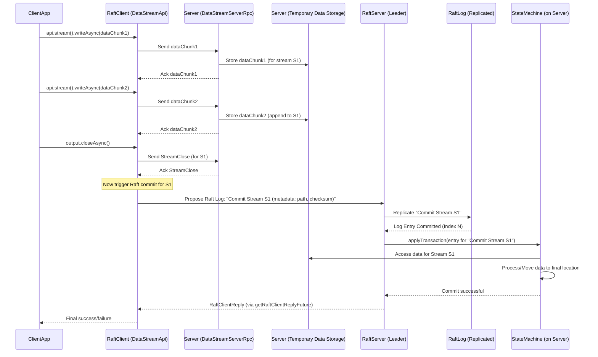

# Chapter 9: DataStream API

In [Chapter 8: Snapshotting](08_snapshotting_.md), we learned how Ratis manages the growth of its log by taking snapshots of the `StateMachine`'s state. This is crucial for long-term operation. Sometimes, the data involved in an operation, or even the snapshot itself, can be very large. Sending huge chunks of data through the standard [RaftLog](03_raftlog_.md) (which is designed for relatively small, ordered commands) can be inefficient. It can make the log very big, very quickly, and put a lot of strain on the leader server, which has to replicate all that data.

Imagine you want to upload a 1GB video file to a distributed file system built on Ratis. If you tried to send that 1GB as a single command through the Raft log, it would be like trying to mail a grand piano through the regular postal service – not very practical!

This is where the **DataStream API** comes in. It's designed for efficiently streaming large amounts of data within the Ratis cluster.

## What is the DataStream API? A High-Speed Conveyor Belt

Think of the DataStream API as a **high-speed conveyor belt system** for moving large packages (your bulk data) directly to multiple destinations (servers in the Ratis group). This is different from the regular Raft log, which is more like sending small, carefully ordered letters through a central sorting facility (the leader).

With the DataStream API:
*   **Data can be streamed directly**: From a client to peers in the Ratis group, or even between peers.
*   **Leader bottleneck avoided (for bulk data)**: The massive data itself doesn't necessarily have to pass through the leader's Raft log replication path. Only a small message (metadata) saying "the large data has arrived and is ready" needs to go through the Raft consensus process.
*   **Efficiency for large objects**: This is perfect for state machines that handle large data objects, like files, large messages, or even parts of snapshots.

The core idea is to separate the transfer of bulk data from the consensus on the metadata about that data. The data takes the "conveyor belt," and a small "receipt" for the data goes through the standard Raft log.

## How it Works: A Conceptual Overview

Let's walk through how streaming a large piece of data typically works:

1.  **Client Initiates Stream**: Your application (the [RaftClient](05_raftclient_.md)) decides to send a large chunk of data. It uses the DataStream API to start a stream to the Ratis cluster.
2.  **Data Packets Flow**: The client sends the data in smaller packets. These packets are often sent directly to one or more servers in the Raft group. The chosen server could be the leader, or a server that's geographically closer to the client (if the system is topology-aware).
3.  **Server Receives and Stores**: The server(s) receiving these data packets will typically store them temporarily (e.g., in a temporary file or memory buffer). If the data is streamed to multiple servers, each will store its copy.
4.  **Client Closes Stream**: Once all data packets are sent, the client signals that the stream is complete by closing it.
5.  **Commit via Raft Log (Metadata only!)**: Now, a *small* message is proposed to the Raft log. This message doesn't contain the large data itself. Instead, it contains metadata like:
    *   A unique ID for the stream.
    *   Information about where the streamed data is stored (e.g., the path to the temporary file on each server).
    *   A checksum of the data to ensure integrity.
    This small metadata message goes through the normal Raft consensus process (leader replicates to followers).
6.  **StateMachine Links the Data**: When this metadata log entry is committed and applied to the [StateMachine](04_statemachine_.md) (via its `applyTransaction` method), the `StateMachine` now knows that the large data associated with the stream ID is complete and available. It can then:
    *   Access the streamed data from its temporary location.
    *   Move it to a final, permanent location.
    *   Update its own application state to reflect the new data.

This way, the large data transfer happens efficiently, and the Raft log remains small and fast, only dealing with the commitment of the metadata.

## Using the DataStream API: Client-Side

Let's see how your client application can stream data.

### Step 1: Get the `DataStreamApi`

First, you obtain a `DataStreamApi` instance from your `RaftClient`:

```java
import org.apache.ratis.client.RaftClient;
import org.apache.ratis.client.api.DataStreamApi;

// Assume 'client' is your already configured RaftClient instance
// RaftClient client = RaftClient.newBuilder()...build();

DataStreamApi dataStreamApi = client.getDataStreamApi();

if (dataStreamApi != null) {
    System.out.println("DataStreamApi obtained successfully.");
} else {
    System.err.println("DataStream is not enabled or supported by the client's RPC type.");
    // Handle this case, e.g., by ensuring client properties enable DataStream
    // For Netty, DataStream is typically available.
}
```
This gives you the entry point for all data streaming operations. If `dataStreamApi` is null, it means data streaming might not be enabled or supported by the configured RPC type (e.g., see `RaftConfigKeys.DataStream.setType` and `SupportedDataStreamType.NETTY`).

### Step 2: Create a `DataStreamOutput`

To send data, you create a `DataStreamOutput` object from the `DataStreamApi`:

```java
import org.apache.ratis.client.api.DataStreamOutput;
import java.nio.ByteBuffer; // For an optional header message

// Assume 'dataStreamApi' is available

// You can optionally provide a header message for the stream.
// This header can be used by the StateMachine to understand the context of the stream.
// For this example, we'll use a null header.
ByteBuffer streamHeader = null;
DataStreamOutput dataOutput = dataStreamApi.stream(streamHeader);

System.out.println("DataStreamOutput created. Ready to write data.");
```
The `stream()` method returns a `DataStreamOutput`, which is like an asynchronous pipe you can write your data into. You can also pass a `ByteBuffer` as a header, which can be useful for the [StateMachine](04_statemachine_.md) to understand the context of the incoming stream.

### Step 3: Write Data Asynchronously

Now you can write your data to the `DataStreamOutput`. This is done asynchronously.

```java
import org.apache.ratis.protocol.DataStreamReply;
import org.apache.ratis.io.WriteOption;
import java.nio.charset.StandardCharsets;
import java.util.concurrent.CompletableFuture;

// Assume 'dataOutput' is your DataStreamOutput object

String largeDataString = "Hello, Ratis DataStream! This is a large piece of data.";
ByteBuffer dataBuffer = ByteBuffer.wrap(largeDataString.getBytes(StandardCharsets.UTF_8));

// Write the data. We use WriteOption.SYNC to ensure this packet is acknowledged
// before the returned future completes. Other options like ASYNC exist.
// For simplicity, we send one chunk. In reality, you'd loop for very large data.
CompletableFuture<DataStreamReply> writeFuture = dataOutput.writeAsync(
        dataBuffer, WriteOption.SYNC // SYNC ensures this packet is acked by the server
);

System.out.println("Data write initiated asynchronously...");

// You can handle the reply for each write, or proceed and handle the final close reply
writeFuture.thenAccept(reply -> {
    if (reply.isSuccess()) {
        System.out.println("Data packet write successful. Bytes written: " + reply.getBytesWritten());
    } else {
        System.err.println("Data packet write failed.");
    }
});
```
*   `writeAsync(ByteBuffer, WriteOption...)` sends the data from the `ByteBuffer`.
*   `WriteOption.SYNC` means the `CompletableFuture` will complete after this specific packet is acknowledged by the server it was sent to. Other options like `ASYNC` or `FLUSH` exist for different behaviors.
*   For very large data, you would typically read it in chunks (e.g., from a file) and call `writeAsync` multiple times in a loop.

### Step 4: Close the Stream

Once all data has been written, you must close the `DataStreamOutput`. This signals to Ratis that the stream is complete and triggers the final commit process.

```java
import org.apache.ratis.protocol.RaftClientReply;

// Assume 'dataOutput' is your DataStreamOutput object and all data has been written

CompletableFuture<DataStreamReply> closeFuture = dataOutput.closeAsync();
System.out.println("Stream close initiated asynchronously...");

// The closeAsync() future gives you the DataStreamReply for the close operation.
// To get the final RaftClientReply (indicating the stream is committed via Raft log),
// you use getRaftClientReplyFuture().
CompletableFuture<RaftClientReply> raftCommitFuture = dataOutput.getRaftClientReplyFuture();

raftCommitFuture.thenAccept(raftReply -> {
    if (raftReply.isSuccess()) {
        System.out.println("Stream closed and committed successfully via Raft! Log index: " + raftReply.getLogIndex());
        // The StateMachine has now processed the commit for this stream.
    } else {
        System.err.println("Stream commit failed: " + raftReply.getException());
    }
}).exceptionally(e -> {
    System.err.println("Exception while waiting for stream commit: " + e.getMessage());
    return null;
});

// For a simple demo, you might block until completion:
// try {
//     RaftClientReply finalReply = raftCommitFuture.get(); // Blocks
//     System.out.println("Final reply received: " + finalReply.isSuccess());
// } catch (Exception e) {
//     e.printStackTrace();
// }
```
*   `closeAsync()` sends a final message to indicate the end of the stream.
*   The `CompletableFuture<DataStreamReply>` returned by `closeAsync()` signals the acknowledgment of the close operation at the stream level.
*   More importantly, `dataOutput.getRaftClientReplyFuture()` returns a `CompletableFuture<RaftClientReply>`. This future completes only after the Raft log entry (the small metadata message) for this stream has been committed and processed by the `StateMachine`. This is your ultimate confirmation.

## Using the DataStream API: Server-Side (`StateMachine`)

Now, how does your `StateMachine` on the server handle this streamed data? The `FileStoreStateMachine` in Ratis examples (`ratis-examples/src/main/java/org/apache/ratis/examples/filestore/FileStoreStateMachine.java`) provides a good pattern.

The `StateMachine` needs to:
1.  **Potentially Handle Stream Initiation**: A method in the `StateMachine` might be called when a client wants to start streaming to it (especially if the client targets the leader). This method can prepare the server to receive data.
2.  **Process the Commit**: When the small metadata log entry (for the completed stream) is applied via `applyTransaction`, the `StateMachine` uses this metadata to finalize the streamed data.

Let's simplify and adapt the `FileStoreStateMachine` concepts.

### StateMachine Interaction

Imagine our `StateMachine` is designed to receive files.
1.  **Stream Initiation (Optional/Implicit)**:
    When the client starts streaming (e.g., by calling `dataStreamApi.stream()`), the underlying `DataStreamServerRpc` on a Ratis server starts receiving data packets. This server component might interact with your `StateMachine` or a dedicated data management part of your application to store these incoming packets (e.g., in a temporary file named with the stream ID).
    In some designs (like `FileStoreStateMachine`), the client might first send a regular Raft request that calls a method like `stream(RaftClientRequest)` on the `StateMachine`. This method prepares the `StateMachine` (e.g., creates a temporary file) and returns a `DataStreamReply` that essentially "opens the pipe" for the client to then send data packets to.

2.  **Committing the Stream (The "Link" Operation)**:
    After the client calls `dataOutput.closeAsync()`, the Ratis client framework will eventually ensure a Raft log entry is proposed and committed. This log entry's content is specific to your application but typically tells the `StateMachine`: "Stream XYZ is complete. The data is located at [temporary_path/ID]. Its checksum is [checksum]."
    Your `StateMachine`'s `applyTransaction(TransactionContext trx)` method will receive this.

```java
import org.apache.ratis.statemachine.StateMachine;
import org.apache.ratis.statemachine.TransactionContext;
import org.apache.ratis.statemachine.impl.BaseStateMachine;
import org.apache.ratis.protocol.Message;
import org.apache.ratis.protocol.RaftClientRequest;
import org.apache.ratis.protocol.DataStreamReply;
import org.apache.ratis.server.storage.RaftStorage;
import org.apache.ratis.util.FileUtils;

import java.io.File;
import java.io.IOException;
import java.nio.file.Path;
import java.nio.file.Paths;
import java.nio.file.StandardCopyOption;
import java.util.concurrent.CompletableFuture;

public class SimpleFileReceiverStateMachine extends BaseStateMachine {

    private File baseDir; // Directory to store final files

    @Override
    public void initialize(org.apache.ratis.server.RaftServer server,
                           org.apache.ratis.protocol.RaftGroupId groupId,
                           RaftStorage raftStorage) throws IOException {
        super.initialize(server, groupId, raftStorage);
        this.baseDir = new File(raftStorage.getStorageDir().getTmpDir(), "final_files");
        if (!baseDir.exists()) {
            baseDir.mkdirs();
        }
        // StateMachineStorage for snapshots can also be initialized here
        // getStateMachineStorage().init(raftStorage);
    }

    // This method might be called by the leader StateMachine when a client wants
    // to initiate a stream to it. It prepares the server for receiving data.
    // The actual data packets are handled by DataStreamServerRpc.
    public CompletableFuture<DataStreamReply> stream(RaftClientRequest request) {
        // For example, generate a unique stream ID or path for temporary storage.
        // The DataStreamServerRpc implementation will use this information.
        // This is a simplified view; actual implementation is more involved.
        LOG.info("StateMachine: Preparing to receive a stream for request: {}", request.getCallId());
        // Return a DataStreamReply that acknowledges stream initiation.
        // The actual data will flow via DataStreamServerRpc.
        // For simplicity, we assume Ratis framework handles temporary storage of streamed data.
        return CompletableFuture.completedFuture(
            // A real reply would contain stream ID, etc.
            () -> request.getClientId() // Dummy DataStreamReply
        );
    }


    // This method is called via applyTransaction when a "commit stream" log entry is applied.
    public Message commitStreamedData(TransactionContext trx) throws IOException {
        // The LogEntryProto in trx would contain metadata:
        // - streamId (or path to temporarily stored streamed data)
        // - finalFileName
        // For this example, let's assume logData is "streamId:finalFileName"
        String logData = trx.getLogEntry().getStateMachineLogEntry().getLogData().toStringUtf8();
        String[] parts = logData.split(":");
        String streamId = parts[0];
        String finalFileName = parts[1];

        // Path where Ratis (DataStreamServerRpc + StateMachine data handling)
        // temporarily stored the fully streamed data.
        // THIS IS A SIMPLIFIED ASSUMPTION. In a real scenario, the StateMachine
        // would have a more robust way to locate this data, possibly via an
        // internal registry populated during the stream reception by DataStreamServerRpc.
        Path tempStreamedDataPath = Paths.get(
            getStateMachineStorage().getSmDir().getAbsolutePath(), // SM's own dir
            "temp_stream_data", // A conventional temporary subdir
            streamId // The unique ID for the stream
        );

        File finalFile = new File(baseDir, finalFileName);

        LOG.info("StateMachine: Committing stream {} to final file {}", streamId, finalFile.getAbsolutePath());

        if (!tempStreamedDataPath.toFile().exists()) {
            String errorMsg = "Streamed data not found at temporary location: " + tempStreamedDataPath;
            LOG.error(errorMsg);
            throw new IOException(errorMsg);
        }

        // Move the temporarily stored streamed data to its final location
        FileUtils.move(tempStreamedDataPath.toFile(), finalFile, StandardCopyOption.REPLACE_EXISTING);
        
        LOG.info("StateMachine: Successfully committed stream {} to {}", streamId, finalFile.getAbsolutePath());
        return Message.valueOf("Successfully committed: " + finalFileName);
    }

    @Override
    public CompletableFuture<Message> applyTransaction(TransactionContext trx) {
        try {
            // Check if this is a "commit stream" operation
            // (e.g., based on a specific command in the log entry)
            // For simplicity, we assume a specific log entry format or type.
            String command = trx.getLogEntry().getStateMachineLogEntry().getLogData().toStringUtf8();
            if (command.startsWith("COMMIT_STREAM:")) {
                 // Reformat command to fit commitStreamedData's expectation
                String streamInfo = command.substring("COMMIT_STREAM:".length());
                // This is a simplified way to pass data to commitStreamedData.
                // In a real system, you might have a more structured LogEntry.
                // We're essentially faking the log entry here for demonstration.
                org.apache.ratis.proto.RaftProtos.LogEntryProto adaptedEntry =
                    trx.getLogEntry().toBuilder().setStateMachineLogEntry(
                        trx.getLogEntry().getStateMachineLogEntry().toBuilder()
                           .setLogData(org.apache.ratis.thirdparty.com.google.protobuf.ByteString.copyFromUtf8(streamInfo))
                    ).build();
                TransactionContext adaptedTrx = TransactionContext.newBuilder(trx).setLogEntry(adaptedEntry).build();

                return CompletableFuture.completedFuture(commitStreamedData(adaptedTrx));
            }
            // ... handle other types of transactions ...
            return super.applyTransaction(trx); // Or handle other commands
        } catch (IOException e) {
            return CompletableFuture.failedFuture(e);
        }
    }
    // ... (query, snapshotting methods etc.)
}
```
**Explanation of `SimpleFileReceiverStateMachine`:**
*   **`initialize()`**: Sets up a `baseDir` where final files will be stored.
*   **`stream(RaftClientRequest request)`**: This is a conceptual method. In some Ratis patterns (like `FileStoreStateMachine`), the client might first send a regular Raft message to the leader's `StateMachine` to "open" a stream. This `stream` method would then prepare the server (e.g., note down the stream ID, perhaps create a temporary file placeholder) and return a `DataStreamReply`. The actual data bytes would then be sent by the client using `DataStreamOutput` and received by the `DataStreamServerRpc` on the server, which would write to that temporary placeholder.
*   **`commitStreamedData(TransactionContext trx)`**: This is the crucial part for finalizing. It's called when `applyTransaction` processes a log entry signifying a stream commit.
    *   It extracts metadata (like a `streamId` identifying the temporary data and the `finalFileName`) from the log entry.
    *   **Simplified Assumption**: It assumes the Ratis framework (specifically, the `DataStreamServerRpc` part, possibly in conjunction with logic within or coordinated by the `StateMachine`) has already received the full data stream and stored it in a known temporary location based on `streamId` (e.g., `getStateMachineStorage().getSmDir() + "/temp_stream_data/" + streamId`).
    *   It then moves this data from the temporary location to its final permanent location (`baseDir/finalFileName`).
*   **`applyTransaction(TransactionContext trx)`**:
    *   It checks if the incoming log entry is a special "commit stream" command.
    *   If so, it calls `commitStreamedData`.
    *   (The adaptation of `trx` is a workaround for this simplified example to pass the necessary data to `commitStreamedData`. A real application would design its log entries more cleanly for this.)

**Important Note on Data Path**: In a real, robust implementation, the `DataStreamServerRpc` (e.g., `NettyDataStreamService`) would handle incoming data packets. It would need a way to associate these packets with a stream ID and store them. The `StateMachine` then, upon receiving the commit message, would use this stream ID to find the fully assembled data. Ratis provides hooks and infrastructure for `StateMachine`s to participate in this, but the exact mechanics can be complex. The `FileStoreStateMachine` is the best reference.

For our beginner tutorial, the key takeaway is:
1.  Client streams data in packets.
2.  Servers receive and temporarily store these packets.
3.  Client closes the stream, triggering a Raft commit of *metadata*.
4.  `StateMachine.applyTransaction` gets this metadata and "claims" or finalizes the already-received bulk data.

## Under the Hood: The Journey of Streamed Data

Let's visualize the flow:



**Key Code Components Involved:**

*   **Client-Side:**
    *   `org.apache.ratis.client.api.DataStreamApi` ([ratis-client/src/main/java/org/apache/ratis/client/api/DataStreamApi.java](ratis-client/src/main/java/org/apache/ratis/client/api/DataStreamApi.java)): Interface obtained from `RaftClient`.
    *   `org.apache.ratis.client.api.DataStreamOutput` ([ratis-client/src/main/java/org/apache/ratis/client/api/DataStreamOutput.java](ratis-client/src/main/java/org/apache/ratis/client/api/DataStreamOutput.java)): Interface for writing data to the stream.
    *   `org.apache.ratis.client.DataStreamClient` ([ratis-client/src/main/java/org/apache/ratis/client/DataStreamClient.java](ratis-client/src/main/java/org/apache/ratis/client/DataStreamClient.java)): The actual client implementation handling the stream logic, using a `DataStreamClientRpc`.

*   **Server-Side:**
    *   `org.apache.ratis.server.DataStreamServerRpc` ([ratis-server-api/src/main/java/org/apache/ratis/server/DataStreamServerRpc.java](ratis-server-api/src/main/java/org/apache/ratis/server/DataStreamServerRpc.java)): The server-side RPC component that receives incoming data packets from clients. Implementations exist for different RPC types (e.g., Netty).
    *   The `StateMachine` itself, as it needs to react to the stream commit log entry and potentially manage temporary storage or be aware of it.

*   **Common / Configuration:**
    *   `org.apache.ratis.datastream.SupportedDataStreamType` ([ratis-common/src/main/java/org/apache/ratis/datastream/SupportedDataStreamType.java](ratis-common/src/main/java/org/apache/ratis/datastream/SupportedDataStreamType.java)): Enum to specify the data stream implementation (e.g., `NETTY`). You configure this via `RaftConfigKeys.DataStream.setType(properties, SupportedDataStreamType.NETTY)`.
    *   `org.apache.ratis.netty.NettyDataStreamUtils` ([ratis-netty/src/main/java/org/apache/ratis/netty/NettyDataStreamUtils.java](ratis-netty/src/main/java/org/apache/ratis/netty/NettyDataStreamUtils.java)): If using Netty for data streaming, this utility class handles the low-level encoding and decoding of data stream packets on the wire. It defines how headers and data are formatted for network transmission.

The `DataStreamServerRpc` implementation (e.g., for Netty) is responsible for listening for incoming stream connections, reading data packets, and potentially writing them to a temporary location that the `StateMachine` can later access. The coordination between `DataStreamServerRpc` and the `StateMachine` for managing this temporary data is an important detail in a full implementation.

## Conclusion

The DataStream API provides a powerful and efficient way to handle large data in Ratis. By separating bulk data transfer from the Raft consensus process (which only handles small metadata messages), it avoids bloating the Raft log and improves performance for applications dealing with large objects.

You've learned:
*   The motivation behind the DataStream API – the "conveyor belt" for large data.
*   How clients use `DataStreamApi` and `DataStreamOutput` to send data.
*   How `StateMachine`s on the server-side can be designed to handle the commit of streamed data.
*   The general flow of data packets and the subsequent metadata commit via Raft.

This API is particularly useful when building systems like distributed file stores, large message queues, or any application where individual operations might involve megabytes or gigabytes of data.

With this understanding of how Ratis handles various data operations, both small and large, we are now equipped to look into how Ratis exposes information about its own health and performance. In the next chapter, we'll explore the [Chapter 10: Metrics Framework](10_metrics_framework_.md).

---

Generated by [AI Codebase Knowledge Builder](https://github.com/The-Pocket/Tutorial-Codebase-Knowledge)