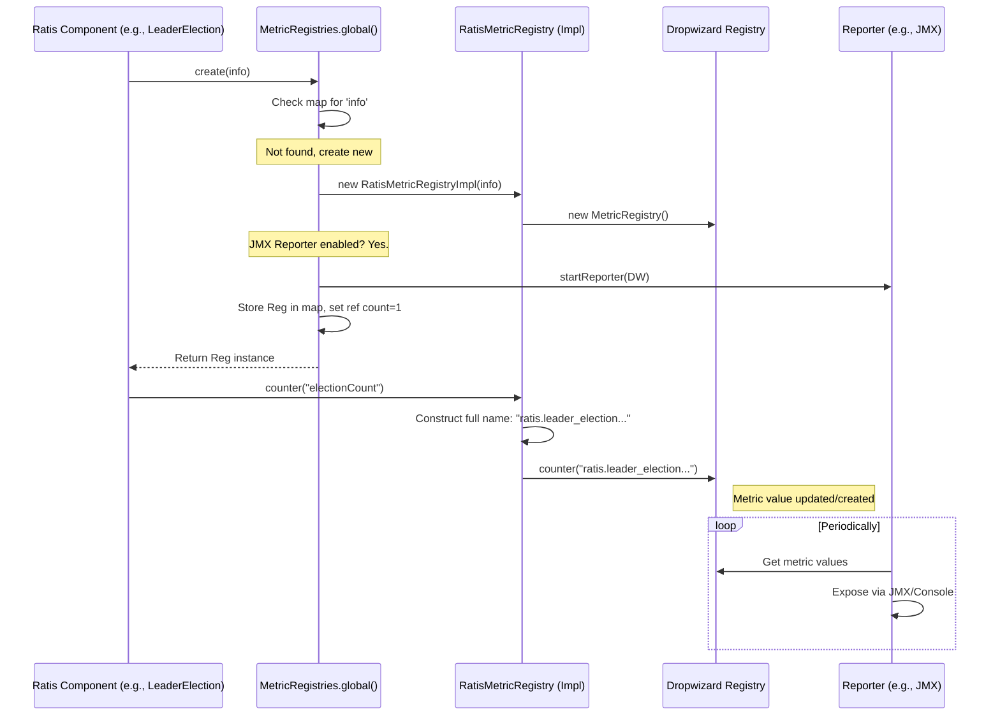

# Chapter 10: Metrics (RatisMetricRegistry, MetricRegistries)

Welcome to the final chapter of our core concepts tutorial! In [Chapter 9: Configuration & Properties](09_configuration___properties__raftproperties__raftserverconfigkeys__etc__.md), we learned how to configure and tune various aspects of Ratis using `RaftProperties`. Now that we have our Ratis cluster configured and running, how do we know what's actually happening inside? Is it healthy? Is it performing well? How long are operations taking?

This is where **Metrics** come into play.

## What Problem Do Metrics Solve?

Imagine you're driving a car. You need a dashboard with instruments like a speedometer, fuel gauge, and engine temperature warning light. Without these, you wouldn't know how fast you're going, if you're about to run out of gas, or if the engine is overheating. Driving would be risky and inefficient!

Similarly, running a distributed system like Ratis without visibility is difficult. We need a way to observe its internal state and performance. For example, we might want to know:

*   How many leader elections have happened recently? Are elections happening too often?
*   How long does it take for the leader to replicate a log entry to followers?
*   How many client requests are currently waiting in the server's queue? Is the queue filling up?
*   What's the hit rate of the Raft log cache?
*   How long does it take for our [StateMachine](01_statemachine_.md) to take a snapshot?

Metrics provide this visibility. They are like the **instruments on the dashboard** for your Ratis cluster, providing key performance indicators (KPIs) and health information. This helps you understand the system's behavior, diagnose problems, tune performance, and set up monitoring alerts.

## Key Concepts

### 1. What are Metrics? (Counters, Timers, Gauges)

Metrics are numerical measurements tracked by the system. Ratis, using the underlying Dropwizard Metrics library by default, primarily uses three types:

*   **Counters:** Simple numerical values that can go up or down. Used for counting events.
    *   *Example:* `leader_election.electionCount` (counts the total number of elections).
    *   *Example:* `log_worker.flushCount` (counts how many times the log was flushed).
*   **Timers:** Measure the duration of operations and also track the rate at which they occur. Great for understanding latency.
    *   *Example:* `leader_election.electionTime` (measures how long elections take).
    *   *Example:* `log_worker.flushTime` (measures how long log flushes take).
    *   *Example:* `server.clientWriteRequest` (measures latency of client write requests).
*   **Gauges:** Provide a snapshot of a value at a specific point in time. Useful for current states or levels.
    *   *Example:* `server.numPendingRequestInQueue` (shows the current number of requests waiting).
    *   *Example:* `log_worker.dataQueueSize` (shows the current size of the log data queue).
    *   *Example:* `state_machine.appliedIndex` (shows the latest log index applied by the StateMachine).

### 2. Pluggable Metrics System

Ratis doesn't implement its own metrics recording system from scratch. It uses a **pluggable interface**, allowing different backend metrics libraries to be used. The default and most common implementation uses **Dropwizard Metrics** (either version 3 via `ratis-metrics-dropwizard3` or the shaded version in `ratis-metrics-default`).

This means Ratis components record their metrics using Ratis's own interfaces (`RatisMetricRegistry`), and a compatibility layer translates these into calls for the underlying library (like Dropwizard).

### 3. `MetricRegistryInfo`: Identifying a Dashboard

Each set of related metrics in Ratis belongs to a specific "registry". Think of a registry as one specific dashboard panel (e.g., the "Engine Vitals" panel). To uniquely identify each registry, Ratis uses `MetricRegistryInfo`. This object contains:

*   `applicationName`: Usually "ratis".
*   `metricsComponentName`: The logical component (e.g., "leader_election", "log_worker", "server", "state_machine").
*   `prefix`: Often includes the Raft group ID or server ID to distinguish metrics from different groups or servers running in the same process.
*   `metricsDescription`: A human-readable description.

This info helps organize metrics and is often used to construct the names under which metrics are exposed (e.g., in JMX).

Example `MetricRegistryInfo` might represent: Metrics for the leader election component of the Raft group "group-XYZ".

```java
// From: ratis-metrics-api/src/main/java/org/apache/ratis/metrics/MetricRegistryInfo.java
public class MetricRegistryInfo {
  private final String prefix; // e.g., "group-XYZ"
  private final String applicationName; // e.g., "ratis"
  private final String metricsComponentName; // e.g., "leader_election"
  private final String metricsDescription; // e.g., "Metrics for Leader Election"

  // Constructor and getter methods...
}
```

### 4. `RatisMetricRegistry`: The Ratis Metrics Interface

This is the core interface Ratis components use to interact with the metrics system. It defines methods for creating counters, timers, and gauges, abstracting away the underlying implementation (like Dropwizard).

```java
// From: ratis-metrics-api/src/main/java/org/apache/ratis/metrics/RatisMetricRegistry.java
public interface RatisMetricRegistry {
  Timekeeper timer(String name); // Create/get a timer
  LongCounter counter(String name); // Create/get a counter
  boolean remove(String name); // Remove a metric
  <T> void gauge(String name, Supplier<Supplier<T>> gaugeSupplier); // Register a gauge
  MetricRegistryInfo getMetricRegistryInfo(); // Get the info for this registry
}
```

Each major Ratis component (like `RaftServerImpl`, `LeaderElection`, `SegmentedRaftLog`) will typically obtain a `RatisMetricRegistry` specific to its function and group/server context.

### 5. `MetricRegistries`: The Global Manager

How do components get their specific `RatisMetricRegistry`? They ask the global `MetricRegistries` manager. Think of `MetricRegistries` as the **factory and central directory** for all metric registries within the application (JVM).

*   **Singleton Access:** You usually interact with it via `MetricRegistries.global()`.
*   **Registry Creation/Retrieval:** When a component requests a registry using a `MetricRegistryInfo`, `MetricRegistries` checks if a registry with that exact info already exists.
    *   If yes, it returns the existing one (and increments a reference count).
    *   If no, it creates a new one (using the configured backend, e.g., Dropwizard), stores it, sets the reference count to 1, and returns it.
*   **Reporter Management:** `MetricRegistries` is also responsible for managing **reporters** – components that expose the collected metrics to the outside world (like JMX or the console).

```java
// From: ratis-metrics-api/src/main/java/org/apache/ratis/metrics/MetricRegistries.java
public abstract class MetricRegistries {
  // Get the singleton global instance
  public static MetricRegistries global() { /*...*/ }

  // Create/get a registry (handles reuse and ref counting)
  public abstract RatisMetricRegistry create(MetricRegistryInfo info);

  // Remove a registry (decrements ref count, removes if 0)
  public abstract boolean remove(MetricRegistryInfo key);

  // Get an existing registry if present
  public abstract Optional<RatisMetricRegistry> get(MetricRegistryInfo info);

  // Manage reporters (e.g., enable JMX, Console)
  public abstract void enableJmxReporter();
  public abstract void enableConsoleReporter(TimeDuration consoleReportRate);
  // ... other methods ...
}
```

### 6. Reporters (JMX, Console, etc.)

Recording metrics internally isn't useful unless you can see them! Reporters are components that take the metrics collected in the registries and publish them somewhere accessible. Ratis (via Dropwizard) supports common reporters:

*   **JMX Reporter:** Exposes metrics as Java Management Extensions (JMX) MBeans. You can then use tools like `jconsole`, VisualVM, or other JMX monitoring systems (like JManage, Zabbix, Nagios via plugins) to view the metrics live. This is very common for Java applications.
*   **Console Reporter:** Periodically prints the current metric values to the standard output (console). Useful for quick checks during development or debugging.
*   (Other reporters like Graphite, Ganglia, etc., can often be configured if using Dropwizard directly or by adding custom reporter hooks).

You typically enable these reporters via the `MetricRegistries.global()` instance.

## How to Use Ratis Metrics (Viewing)

As an application developer using Ratis, you usually don't need to manually register the core Ratis metrics – the Ratis library does that automatically. Your main interaction is enabling reporters to *view* these metrics.

### Enabling JMX Reporter

This is often the most useful reporter for monitoring a running server.

```java
import org.apache.ratis.metrics.MetricRegistries;

// In your server's initialization code (e.g., main method)
public static void main(String[] args) throws Exception {
    // ... setup RaftProperties, StateMachine, etc. ...

    // Enable the JMX Reporter for all Ratis metric registries
    MetricRegistries.global().enableJmxReporter();

    // ... build and start RaftServer ...
    // RaftServer server = RaftServer.newBuilder()...build();
    // server.start();
    System.out.println("Ratis server started with JMX metrics enabled.");
    // ... keep server running ...
}
```

**Explanation:**
Calling `MetricRegistries.global().enableJmxReporter()` tells the global metrics manager to start a JMX reporter for any metric registries it creates. Ratis components will automatically create their registries (via `MetricRegistries.global().create(...)`), and those registries will now be exposed via JMX.

**Viewing with JConsole:**
1.  Start your Ratis server application with the JMX reporter enabled.
2.  Start `jconsole` (usually included with the JDK).
3.  Connect `jconsole` to your running Ratis server process.
4.  Navigate to the "MBeans" tab.
5.  You should see MBeans under domains like `org.apache.ratis` or based on the `MetricRegistryInfo` (e.g., `ratis.leader_election`).
6.  Expand these to find specific metrics (like `electionCount`, `electionTime`, `lastLeaderElapsedTime`) and view their attributes (values, counts, rates, percentiles for timers).

The exact MBean names will depend on the Dropwizard version and configuration, but they generally follow the pattern: `ApplicationName.ComponentName.Prefix.MetricName`.

### Enabling Console Reporter

This is useful for debugging or simple visibility without external tools.

```java
import org.apache.ratis.metrics.MetricRegistries;
import org.apache.ratis.util.TimeDuration;
import java.util.concurrent.TimeUnit;

// In your server's initialization code
public static void main(String[] args) throws Exception {
    // ... setup ...

    // Enable the Console Reporter to print metrics every 10 seconds
    TimeDuration reportInterval = TimeDuration.valueOf(10, TimeUnit.SECONDS);
    MetricRegistries.global().enableConsoleReporter(reportInterval);

    // ... build and start RaftServer ...
    System.out.println("Ratis server started with Console metrics reporter enabled.");
    // ... keep server running ...
}
```

**Explanation:**
Calling `MetricRegistries.global().enableConsoleReporter(...)` starts a background thread that will periodically dump the values of all registered metrics to `System.out`.

**Example Console Output (Simplified):**
You'll see output sections for each registry, looking something like this (format depends on Dropwizard version):

```
-- Gauges ------------------------------------------------------
ratis.server.group-XYZ.numPendingRequestInQueue
             value = 0
ratis.state_machine.group-XYZ.appliedIndex
             value = 10500

-- Counters ----------------------------------------------------
ratis.leader_election.group-XYZ.electionCount
             count = 5

-- Timers ------------------------------------------------------
ratis.server.group-XYZ.clientWriteRequest
             count = 1500
         mean rate = 10.50 calls/second
     1-minute rate = 10.00 calls/second
     5-minute rate = 9.80 calls/second
    15-minute rate = 9.75 calls/second
               min = 0.80 ms
               max = 15.20 ms
              mean = 2.50 ms
            stddev = 1.50 ms
            median = 2.10 ms
              75% <= 3.00 ms
              95% <= 5.50 ms
              98% <= 7.00 ms
              99% <= 8.50 ms
            99.9% <= 12.00 ms
```

### Example Ratis Metrics

Ratis exposes many useful metrics. Here are just a few examples (refer to `metrics.md` in the Ratis docs source for a more complete list):

*   **StateMachine:** `appliedIndex`, `takeSnapshot` (timer)
*   **Leader Election:** `electionCount`, `timeoutCount`, `electionTime` (timer), `lastLeaderElapsedTime`
*   **Log Appender (Leader -> Follower):** `follower_{peer}_next_index`, `follower_{peer}_match_index`, `follower_{peer}_rpc_response_time`
*   **Raft Log Worker:** `flushTime` (timer), `syncTime` (timer), `cacheHitCount`, `cacheMissCount`, `appendEntryLatency` (timer)
*   **Raft Server:** `follower_append_entry_latency` (timer), `clientWriteRequest` (timer), `numPendingRequestInQueue`, `retryCacheHitRate`

## Internal Implementation

How do these pieces work together?

1.  **Instantiation:** A Ratis component (e.g., `LeaderElection` for a specific group) needs to record metrics.
2.  **Registry Info:** It creates a `MetricRegistryInfo` object describing itself (e.g., app=`ratis`, component=`leader_election`, prefix=`my_group_id`).
3.  **Get Registry:** It calls `MetricRegistries.global().create(info)`.
4.  **MetricRegistries Logic:**
    *   The global `MetricRegistries` instance (e.g., `DefaultMetricRegistriesImpl`) checks its internal map for an existing registry matching `info`.
    *   If not found, it creates a new `RatisMetricRegistry` implementation instance (e.g., `RatisMetricRegistryImpl` from `ratis-metrics-default`). This implementation internally creates a Dropwizard `MetricRegistry`.
    *   If reporters (like JMX or Console) have been enabled via `MetricRegistries.global()`, the `MetricRegistries` instance starts the reporter, linking it to the *newly created* Dropwizard `MetricRegistry`.
    *   It stores the new registry in its map and sets its reference count.
    *   It returns the `RatisMetricRegistry` instance to the component.
5.  **Metric Registration:** The Ratis component calls methods on the returned `RatisMetricRegistry` (e.g., `registry.counter("electionCount")`).
6.  **Implementation Call:** The `RatisMetricRegistryImpl` translates this call to the equivalent call on its internal Dropwizard `MetricRegistry` (e.g., `dropwizardRegistry.counter("ratis.leader_election.my_group_id.electionCount")`). It constructs the full metric name using the `MetricRegistryInfo`.
7.  **Reporting:** The previously configured reporters (JMX, Console) read the values from the Dropwizard `MetricRegistry` and expose them.



### Code Dive (Light)

*   **`RatisMetricRegistryImpl` (`ratis-metrics-default`)**: Wraps a Dropwizard `MetricRegistry`.
    ```java
    // From: ratis-metrics-default/.../RatisMetricRegistryImpl.java
    public class RatisMetricRegistryImpl implements RatisMetricRegistry {
      // The actual Dropwizard registry
      private final MetricRegistry metricRegistry = new MetricRegistry();
      private final MetricRegistryInfo info;
      private final String namePrefix; // Constructed from info
      private final Map<String, String> metricNameCache = new ConcurrentHashMap<>();
      // References to reporters, managed by MetricRegistries
      private JmxReporter jmxReporter;
      private ConsoleReporter consoleReporter;

      public RatisMetricRegistryImpl(MetricRegistryInfo info) {
        this.info = Objects.requireNonNull(info, "info == null");
        // Example: "ratis.leader_election.group-XYZ"
        this.namePrefix = MetricRegistry.name(
            info.getApplicationName(), info.getMetricsComponentName(), info.getPrefix());
      }

      // Helper to get the full Dropwizard metric name
      private String getMetricName(String shortName) {
        return metricNameCache.computeIfAbsent(
            shortName, key -> MetricRegistry.name(namePrefix, shortName));
            // Example: "ratis.leader_election.group-XYZ.electionCount"
      }

      @Override
      public LongCounter counter(String name) {
        // Get/create counter in Dropwizard registry using full name
        Counter dwCounter = metricRegistry.counter(getMetricName(name));
        // Return a Ratis wrapper around the Dropwizard counter
        return RatisMetricRegistryImpl.toLongCounter(dwCounter);
      }

      @Override
      public Timekeeper timer(String name) {
        // Get/create timer in Dropwizard registry using full name
        Timer dwTimer = metricRegistry.timer(getMetricName(name));
        // Return a Ratis wrapper
        return new DefaultTimekeeperImpl(dwTimer);
      }
      // ... other methods for gauge, remove ...

      // Methods used by MetricRegistries to manage reporters
      void setJmxReporter(JmxReporter jmxReporter) { this.jmxReporter = jmxReporter; }
      JmxReporter getJmxReporter() { return this.jmxReporter; }
      // ... similar for consoleReporter ...
      public MetricRegistry getDropWizardMetricRegistry() { return metricRegistry; }
    }
    ```
*   **`DefaultMetricRegistriesImpl` (`ratis-metrics-default`)**: Manages the collection of registries.
    ```java
    // Simplified structure from DefaultMetricRegistriesImpl
    public class DefaultMetricRegistriesImpl extends MetricRegistries {
        // Map from Info to the registry and its reference count
        private final Map<MetricRegistryInfo, Pair<RatisMetricRegistryImpl, AtomicInteger>> registries
            = new ConcurrentHashMap<>();
        private boolean jmxReporterEnabled = false;
        private boolean consoleReporterEnabled = false;
        private TimeDuration consoleReportRate;
        // Hooks for custom reporters (simplified)
        private final List<Consumer<RatisMetricRegistry>> reporterRegistrations = ...;

        @Override
        public synchronized RatisMetricRegistry create(MetricRegistryInfo info) {
            Pair<RatisMetricRegistryImpl, AtomicInteger> pair = registries.computeIfAbsent(info, key -> {
                RatisMetricRegistryImpl registry = new RatisMetricRegistryImpl(key);
                // If reporters are enabled globally, start them for this new registry
                if (jmxReporterEnabled) {
                    startJmxReporter(registry);
                }
                if (consoleReporterEnabled) {
                    startConsoleReporter(registry, consoleReportRate);
                }
                // Apply custom reporter hooks
                reporterRegistrations.forEach(hook -> hook.accept(registry));

                return Pair.of(registry, new AtomicInteger(0));
            });
            pair.getRight().incrementAndGet(); // Increment reference count
            return pair.getLeft();
        }

        @Override
        public synchronized boolean remove(MetricRegistryInfo info) {
            Pair<RatisMetricRegistryImpl, AtomicInteger> pair = registries.get(info);
            if (pair != null && pair.getRight().decrementAndGet() == 0) {
                 // If ref count hits zero, stop reporters and remove from map
                 stopReporters(pair.getLeft());
                 registries.remove(info);
                 return true;
            }
            return false;
        }

        @Override
        public synchronized void enableJmxReporter() {
            if (!jmxReporterEnabled) {
                jmxReporterEnabled = true;
                // Start JMX reporter for all *existing* registries
                registries.values().forEach(pair -> startJmxReporter(pair.getLeft()));
            }
        }
        // ... similar logic for enableConsoleReporter ...
        // ... helper methods startJmxReporter, stopReporters etc. ...
    }
    ```

## Conclusion

Metrics are essential for understanding the health and performance of your Ratis cluster. Ratis provides a rich set of built-in metrics covering various components like the Raft log, leader election, server request handling, and the state machine. By leveraging the pluggable metrics system (defaulting to Dropwizard) and the global `MetricRegistries` manager, you can easily enable reporters like JMX or Console to gain crucial visibility into your running system. Observing these metrics allows you to diagnose issues, optimize performance, and ensure the stability of your Ratis-based application.

Key Takeaways:

*   Metrics provide observability into Ratis internals (performance, health).
*   Common types: Counters, Timers, Gauges.
*   Ratis uses a pluggable system, defaulting to Dropwizard Metrics.
*   `RatisMetricRegistry` is the interface used by Ratis components, identified by `MetricRegistryInfo`.
*   `MetricRegistries.global()` manages all registries and reporters.
*   Enable reporters (like JMX, Console) via `MetricRegistries.global()` to view metrics.
*   Use tools like `jconsole` to view metrics exposed via JMX.

This chapter concludes our journey through the core concepts of Apache Ratis. We hope this tutorial has provided you with a solid foundation for building your own reliable, replicated applications!

---

Generated by [AI Codebase Knowledge Builder](https://github.com/The-Pocket/Tutorial-Codebase-Knowledge)