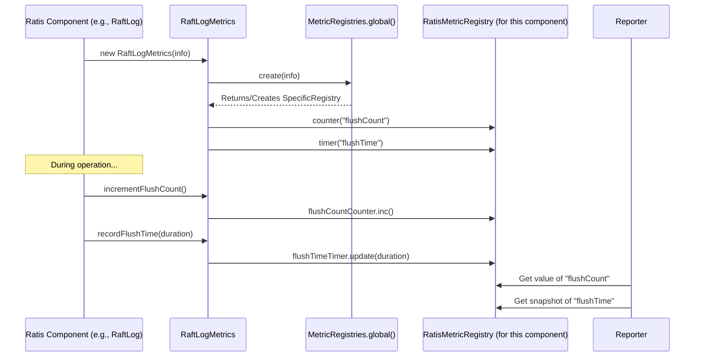

# Chapter 10: Metrics Framework

Welcome to the final chapter in our Ratis beginner series! In [Chapter 9: DataStream API](09_datastream_api_.md), we saw how Ratis can efficiently handle large data streams. Now, as your Ratis application runs, processing both small commands and potentially large data streams, how do you know if it's healthy and performing well? How can you peek under the hood to see what's going on?

This is where Ratis's **Metrics Framework** comes into play.

## What is a Metrics Framework? Your System's Dashboard

Imagine you're driving a car. The dashboard shows you crucial information:
*   Your current speed (performance).
*   The engine RPM (workload).
*   The fuel level (resource usage).
*   Warning lights if something is wrong (health).

Without this dashboard, driving would be a guessing game!

Similarly, a distributed system like Ratis is a complex machine. The **Metrics Framework** acts as its dashboard. It provides a way for Ratis to:
1.  **Collect** various internal statistics, like how many operations are happening, how long they take, or the current state of different components.
2.  **Report** these statistics so that operators and developers can monitor the health, performance, and behavior of a Ratis cluster.

These metrics are invaluable for:
*   **Monitoring**: Keeping an eye on the system's vital signs.
*   **Troubleshooting**: Diagnosing problems when they occur (e.g., "Why is replication slow?").
*   **Performance Tuning**: Identifying bottlenecks and areas for optimization.
*   **Capacity Planning**: Understanding resource usage to predict future needs.

## Key Concepts in Ratis Metrics

Ratis's metrics framework is designed to be comprehensive yet easy to use. Here are the main ideas:

1.  **Metrics**: These are the individual pieces of information being tracked. They come in several types:
    *   **Counters**: Count how many times something happens (e.g., number of leader elections, number of log entries written). They only go up (or down if explicitly decremented).
    *   **Gauges**: Measure a current value (e.g., size of a queue, amount of free disk space, last committed log index). This value can go up or down.
    *   **Timers**: Measure how long operations take (e.g., latency of a Raft log flush, time taken for a client request). They also track the rate at which these operations occur.

2.  **`RatisMetricRegistry`**:
    *   This is like a central bulletin board where different parts of Ratis can "pin up" their metrics.
    *   Each distinct component or functional area in Ratis (e.g., the RaftLog, a specific RaftServer instance for a group) often has its own `RatisMetricRegistry` instance.
    *   This registry holds all the metrics (counters, gauges, timers) for that specific area.

3.  **Specific Metric Sets**:
    Ratis defines several classes that group related metrics. For example:
    *   `RaftServerMetrics`: Tracks metrics related to a Raft server's operation, like client request latencies or retry cache statistics.
    *   `RaftLogMetrics`: Tracks metrics specific to the Raft log, such as flush times, cache hit/miss rates, and number of entries of different types.
    *   `StateMachineMetrics`: Tracks metrics for your StateMachine, like the time it takes to take a snapshot.
    *   (Many other specialized metrics exist, e.g., for leader election, log appenders, gRPC, Netty).

4.  **Underlying Implementation (Dropwizard Metrics)**:
    By default, Ratis uses the popular [Dropwizard Metrics](https://metrics.dropwizard.io/) library as its underlying metrics engine. This is a powerful and flexible library that provides the core metric types and reporting capabilities. You don't usually need to interact with Dropwizard directly, as Ratis provides its own `RatisMetricRegistry` abstraction on top of it.

## How Ratis Uses Metrics Internally

You, as a Ratis application developer, typically *consume* these metrics rather than creating many of them yourself (though you can add custom metrics to your `StateMachine` if needed). Ratis components are already instrumented to update these metrics automatically.

**Example: A Log Flush Operation**

1.  A `RaftServer` needs to flush some log entries to disk.
2.  Before starting the flush, it might start a timer (e.g., `RaftLogMetrics.getFlushTimeTimer().time()`).
3.  The flush operation happens.
4.  After the flush completes, the timer is stopped. The duration is automatically recorded by the `RaftLogMetrics`.
5.  A counter for the number of flushes (`RaftLogMetrics.getFlushCount()`) is incremented.

This happens transparently within Ratis. Your job is to set up ways to *see* these recorded values.

## Accessing Ratis Metrics

Ratis, through Dropwizard Metrics, supports various ways to report or expose these collected metrics:

1.  **JMX (Java Management Extensions)**:
    *   This is a common way to monitor Java applications.
    *   Metrics can be exposed as JMX MBeans, which can then be viewed using tools like JConsole (comes with the JDK), VisualVM, or other JMX-compatible monitoring systems (e.g., Prometheus JMX Exporter, Jolokia).
    *   Ratis can be configured to automatically register its metrics with the JMX MBean server.

2.  **Console Reporter**:
    *   For quick debugging or simple observation, Ratis can print metrics to the console periodically.

3.  **Other Reporters**:
    *   Since Ratis uses Dropwizard Metrics, it can be extended to use any reporter compatible with Dropwizard, such as:
        *   Graphite Reporter
        *   Prometheus Reporter (often via a bridge or exporter)
        *   SLF4J Reporter (logs metrics to a logging framework)
        *   And more.

### Enabling Reporters

You typically enable reporters through configuration when setting up your Ratis servers.

**Example: Enabling Console and JMX Reporters**
This is usually done at a global level using the `MetricRegistries` class.

```java
import org.apache.ratis.metrics.MetricRegistries;
import org.apache.ratis.util.TimeDuration;
import java.util.concurrent.TimeUnit;

public class RatisMetricsSetup {
    public static void main(String[] args) {
        // Get the global singleton MetricRegistries instance
        MetricRegistries registries = MetricRegistries.global();

        // Enable JMX reporting for all Ratis metric registries
        registries.enableJmxReporter();
        System.out.println("JMX Reporter enabled.");

        // Enable Console reporting every 10 seconds
        TimeDuration consoleReportRate = TimeDuration.valueOf(10, TimeUnit.SECONDS);
        registries.enableConsoleReporter(consoleReportRate);
        System.out.println("Console Reporter enabled. Metrics will print every 10 seconds.");

        // ... your Ratis server/client setup would go here ...
        // When Ratis components create their RatisMetricRegistry,
        // these reporters will automatically pick them up.

        // Keep the application running to see console reports
        // try {
        //     Thread.sleep(60000); // Run for 60 seconds
        // } catch (InterruptedException e) {
        //     Thread.currentThread().interrupt();
        // }
    }
}
```
When you run this (along with a Ratis server in the same JVM process, for instance), you'd see metrics printed to the console every 10 seconds, and you could connect with JConsole to see the MBeans.

**Output in JConsole (Conceptual)**:
If you connect with JConsole and navigate to the MBeans tab, you'd find entries like:
*   `org.apache.ratis.metrics.default.RatisMetricRegistryImpl`:
    *   `ratis.server.<group_id_prefix>.<server_id_prefix>.log_worker`:
        *   `flushCount` (Attribute: Count)
        *   `flushTime` (Attributes: MeanRate, Min, Max, Mean, P99, etc.)
    *   `ratis.server.<group_id_prefix>.<server_id_prefix>.leader_election`:
        *   `electionCount`

**Output on Console (Conceptual Snippet)**:
```
-- Timers ----------------------------------------------------------------------
ratis.server.myGroup.s1.log_worker.flushTime
             count = 120
         mean rate = 2.00 calls/second
     1-minute rate = 2.00 calls/second
     5-minute rate = 2.00 calls/second
    15-minute rate = 2.00 calls/second
               min = 0.50 milliseconds
               max = 5.20 milliseconds
              mean = 1.50 milliseconds
            stddev = 0.80 milliseconds
            median = 1.20 milliseconds
              75% <= 1.80 milliseconds
              95% <= 3.00 milliseconds
              98% <= 3.50 milliseconds
              99% <= 4.00 milliseconds
            99.9% <= 5.20 milliseconds

-- Counters --------------------------------------------------------------------
ratis.server.myGroup.s1.log_worker.flushCount
             count = 120
ratis.server.myGroup.s1.leader_election.electionCount
             count = 1
... (many more metrics) ...
```

## Examples of Useful Ratis Metrics

Ratis exposes a wealth of metrics. You can find a detailed list in the Ratis documentation (often in a file named `metrics.md` within the `ratis-docs` module). Here are a few examples and what they mean:

From `metrics.md` (Raft Log Worker Metrics):
| Component  | Name                      | Type    | Description                                        |
| :--------- | :------------------------ | :------ | :------------------------------------------------- |
| log_worker | `flushTime`               | Timer   | Time taken to flush log                            |
| log_worker | `flushCount`              | Counter | Number of times log-flush was invoked              |
| log_worker | `dataQueueSize`           | Gauge   | Raft log data queue size (operations in queue)     |
| log_worker | `stateMachineLogEntryCount` | Counter | Number of state machine log entries                |
| log_worker | `appendEntryLatency`      | Timer   | Total time taken to append a raft log entry        |

*   **`log_worker.flushTime` (Timer)**: Tells you how long disk flushes are taking. High values might indicate slow disk I/O.
*   **`log_worker.flushCount` (Counter)**: How many flushes have occurred.
*   **`log_worker.dataQueueSize` (Gauge)**: If this number is consistently high, it might mean log operations are being produced faster than they can be written.
*   **`server.follower_append_entry_latency` (Timer)**: Measures how long followers take to append entries. Useful for diagnosing slow followers.
*   **`server.{peer}_peerCommitIndex` (Gauge)**: Shows the commit index for each peer. Helps see if any follower is lagging significantly.
*   **`leader_election.lastLeaderElapsedTime` (Gauge)**: Time since the current server (if it's a follower) last heard from an active leader. High values trigger elections.

## Under the Hood: A Simplified Look

Let's see conceptually how a metric gets registered and updated.

1.  **Registry Creation**:
    *   When a Ratis component that needs metrics (e.g., `SegmentedRaftLog` for `RaftLogMetrics`, or `RaftServerImpl` for `RaftServerMetrics`) is initialized, it creates or gets a `RatisMetricRegistry`.
    *   This is typically done by creating a `MetricRegistryInfo` object that uniquely describes this registry (application name, component name, specific prefix like group ID and server ID).
    *   It then calls `MetricRegistries.global().create(info)` to get the actual `RatisMetricRegistry` instance. The `MetricRegistries` class manages these, ensuring that if multiple components refer to the same logical registry, they get the same instance.

2.  **Metric Registration**:
    *   The component (e.g., `RaftLogMetrics`) then uses methods on the `RatisMetricRegistry` to declare its specific metrics.
        *   `registry.counter("flushCount")` creates a counter named "flushCount".
        *   `registry.timer("flushTime")` creates a timer named "flushTime".
        *   `registry.gauge("dataQueueSize", () -> () -> myDataQueue.size())` creates a gauge that will call `myDataQueue.size()` whenever its value is requested. (Note the double `Supplier` for gauges, a Dropwizard convention).

3.  **Metric Update**:
    *   During its operation, the Ratis component updates these metrics.
        *   `myFlushCounter.inc()`
        *   `Timer.Context ctx = myFlushTimer.time(); ... operation ...; ctx.stop();`

4.  **Reporting**:
    *   Reporters (JMX, Console, etc.), which are registered with `MetricRegistries.global()`, periodically access each `RatisMetricRegistry`.
    *   They iterate through the metrics in the registry and report their current values.

**Sequence Diagram: Metric Registration and Update**


### Key Code Components:

*   **`org.apache.ratis.metrics.MetricRegistryInfo`** ([ratis-metrics-api/.../MetricRegistryInfo.java](ratis-metrics-api/src/main/java/org/apache/ratis/metrics/MetricRegistryInfo.java)):
    Defines the identity of a metric registry.
    ```java
    // From MetricRegistryInfo.java
    public class MetricRegistryInfo {
        // private final String prefix; // e.g., ServerId for server-specific metrics
        // private final String applicationName; // Usually "ratis"
        // private final String metricsComponentName; // e.g., "log_worker", "leader_election"
        // ...
        public MetricRegistryInfo(String prefix, String applicationName, 
                                  String metricsComponentName, String metricsDescription) {
            // ...
        }
    }
    ```

*   **`org.apache.ratis.metrics.RatisMetricRegistry`** ([ratis-metrics-api/.../RatisMetricRegistry.java](ratis-metrics-api/src/main/java/org/apache/ratis/metrics/RatisMetricRegistry.java)):
    The Ratis interface for a metric registry.
    ```java
    // From RatisMetricRegistry.java
    public interface RatisMetricRegistry {
      Timekeeper timer(String name);
      LongCounter counter(String name);
      <T> void gauge(String name, Supplier<Supplier<T>> gaugeSupplier);
      MetricRegistryInfo getMetricRegistryInfo();
      // ...
    }
    ```
    `Timekeeper` and `LongCounter` are Ratis's thin wrappers around Dropwizard's `Timer` and `Counter`.

*   **`org.apache.ratis.metrics.RatisMetrics`** ([ratis-metrics-api/.../RatisMetrics.java](ratis-metrics-api/src/main/java/org/apache/ratis/metrics/RatisMetrics.java)):
    A base class often extended by specific metric holders (like `RaftLogMetrics`). It helps in creating/getting the `RatisMetricRegistry`.
    ```java
    // From RatisMetrics.java
    public class RatisMetrics {
        // private final RatisMetricRegistry registry;

        protected RatisMetrics(RatisMetricRegistry registry) {
            this.registry = registry;
        }

        // Helper to create/get a registry
        protected static RatisMetricRegistry create(MetricRegistryInfo info) {
            // Uses MetricRegistries.global().create(info)
            // ...
        }
        public final RatisMetricRegistry getRegistry() {
            return registry;
        }
    }
    ```

*   **`org.apache.ratis.metrics.MetricRegistries`** ([ratis-metrics-api/.../MetricRegistries.java](ratis-metrics-api/src/main/java/org/apache/ratis/metrics/MetricRegistries.java)):
    The global manager for all `RatisMetricRegistry` instances and their reporters.
    ```java
    // From MetricRegistries.java
    public abstract class MetricRegistries {
        public static MetricRegistries global() { /* Returns singleton */ }
        public abstract RatisMetricRegistry create(MetricRegistryInfo info);
        public abstract boolean remove(MetricRegistryInfo key);
        public abstract void enableJmxReporter();
        public abstract void enableConsoleReporter(TimeDuration consoleReportRate);
        // ...
    }
    ```

*   **`org.apache.ratis.metrics.impl.RatisMetricRegistryImpl`** ([ratis-metrics-default/.../RatisMetricRegistryImpl.java](ratis-metrics-default/src/main/java/org/apache/ratis/metrics/impl/RatisMetricRegistryImpl.java)):
    The default implementation of `RatisMetricRegistry` using Dropwizard Metrics.
    ```java
    // From RatisMetricRegistryImpl.java
    public class RatisMetricRegistryImpl implements RatisMetricRegistry {
        // Uses a Dropwizard MetricRegistry internally
        // private final com.codahale.metrics.MetricRegistry metricRegistry = new com.codahale.metrics.MetricRegistry();
        // private final MetricRegistryInfo info;
        // ...
        @Override
        public Timekeeper timer(String name) {
            // Creates/gets a Dropwizard Timer and wraps it in a DefaultTimekeeperImpl
            // ...
        }
        // Similar for counter() and gauge()
    }
    ```

## Conclusion

The Ratis Metrics Framework is an essential tool for understanding the behavior, performance, and health of your Ratis cluster. By collecting a wide array of internal statistics and exposing them through common mechanisms like JMX or console reporting, it empowers you to monitor, diagnose, and optimize your distributed applications. Leveraging these metrics can make the difference between a smoothly running system and one that's difficult to manage.

This concludes our introductory journey through the core concepts of Apache Ratis! You've learned about:
*   The basic building blocks: [RaftGroup & RaftPeer](01_raftgroup___raftpeer_.md)
*   The consensus engine: [RaftServer](02_raftserver_.md)
*   The replicated log: [RaftLog](03_raftlog_.md)
*   Your application logic holder: [StateMachine](04_statemachine_.md)
*   Client interaction: [RaftClient](05_raftclient_.md)
*   Communication layers: [RPC Abstraction (RaftServerRpc / RaftClientRpc)](06_rpc_abstraction__raftserverrpc___raftclientrpc_.md)
*   System tuning: [Configuration Management](07_configuration_management_.md)
*   Log management: [Snapshotting](08_snapshotting_.md)
*   Handling large data: [DataStream API](09_datastream_api_.md)
*   And now, system monitoring: Metrics Framework

With this foundation, you are well-equipped to start building and operating robust, fault-tolerant applications with Apache Ratis. There's always more to explore in the Ratis documentation and examples, but hopefully, this series has given you a friendly and solid start. Happy distributing!

---

Generated by [AI Codebase Knowledge Builder](https://github.com/The-Pocket/Tutorial-Codebase-Knowledge)