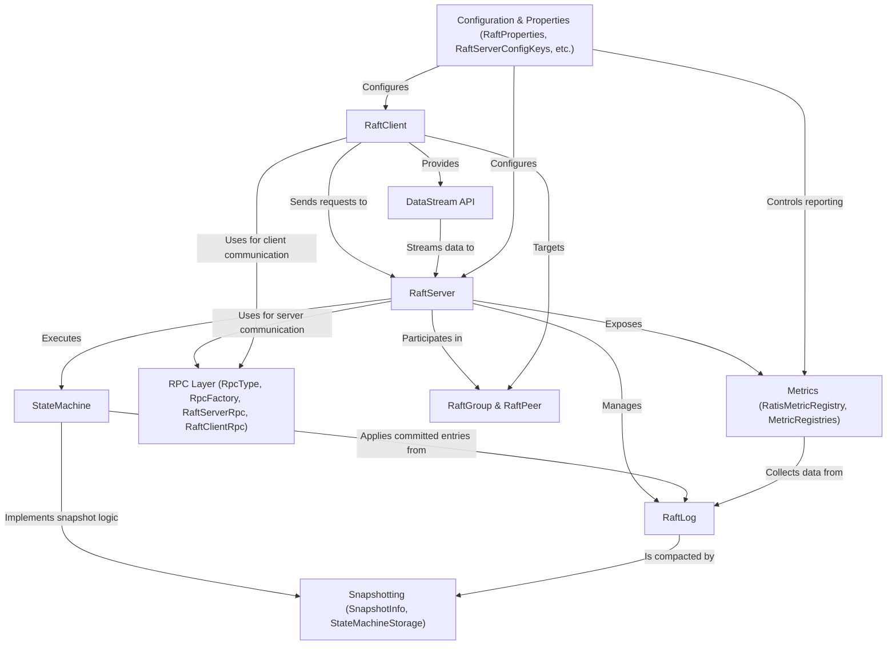

# Tutorial: ratis

Ratis is a Java library that provides a **Raft** *consensus protocol* implementation.
It allows developers to build *fault-tolerant* and *consistent* distributed systems by managing a replicated state machine across multiple servers. Clients interact with the server group to propose state changes or query the current state, ensuring reliability even if some servers fail.

**Source Repository:** [None](None)

## Chapters

1. [StateMachine
](01_statemachine_.md)
2. [RaftGroup & RaftPeer
](02_raftgroup___raftpeer_.md)
3. [RaftClient
](03_raftclient_.md)
4. [RaftServer
](04_raftserver_.md)
5. [RaftLog
](05_raftlog_.md)
6. [RPC Layer (RpcType, RpcFactory, RaftServerRpc, RaftClientRpc)
](06_rpc_layer__rpctype__rpcfactory__raftserverrpc__raftclientrpc__.md)
7. [Snapshotting (SnapshotInfo, StateMachineStorage)
](07_snapshotting__snapshotinfo__statemachinestorage__.md)
8. [DataStream API
](08_datastream_api_.md)
9. [Configuration & Properties (RaftProperties, RaftServerConfigKeys, etc.)
](09_configuration___properties__raftproperties__raftserverconfigkeys__etc___.md)
10. [Metrics (RatisMetricRegistry, MetricRegistries)
](10_metrics__ratismetricregistry__metricregistries__.md)

---

Generated by [AI Codebase Knowledge Builder](https://github.com/The-Pocket/Tutorial-Codebase-Knowledge)