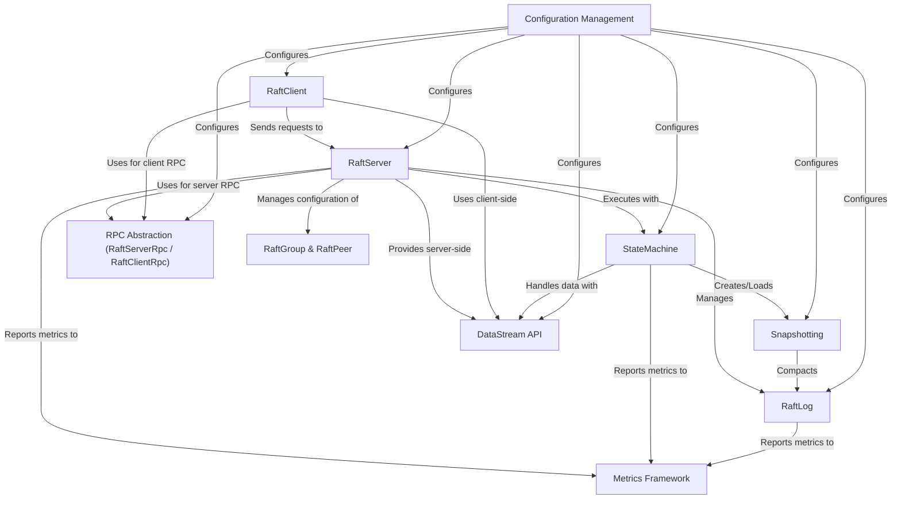

# Tutorial: ratis

Ratis is a **Java library** that implements the *Raft consensus algorithm*.
It helps developers build *fault-tolerant* and *data-consistent* distributed applications
by providing a reliable way to replicate and agree upon a sequence of operations (a *log*)
across a cluster of servers. Key components include the *RaftServer* (the consensus engine),
the *StateMachine* (where application logic resides), the *RaftLog* (the replicated log itself),
and the *RaftClient* (for application interaction).

**Source Repository:** [None](None)

## Chapters

1. [RaftGroup & RaftPeer
](01_raftgroup___raftpeer_.md)
2. [RaftServer
](02_raftserver_.md)
3. [RaftLog
](03_raftlog_.md)
4. [StateMachine
](04_statemachine_.md)
5. [RaftClient
](05_raftclient_.md)
6. [RPC Abstraction (RaftServerRpc / RaftClientRpc)
](06_rpc_abstraction__raftserverrpc___raftclientrpc__.md)
7. [Configuration Management
](07_configuration_management_.md)
8. [Snapshotting
](08_snapshotting_.md)
9. [DataStream API
](09_datastream_api_.md)
10. [Metrics Framework
](10_metrics_framework_.md)

---

Generated by [AI Codebase Knowledge Builder](https://github.com/The-Pocket/Tutorial-Codebase-Knowledge)