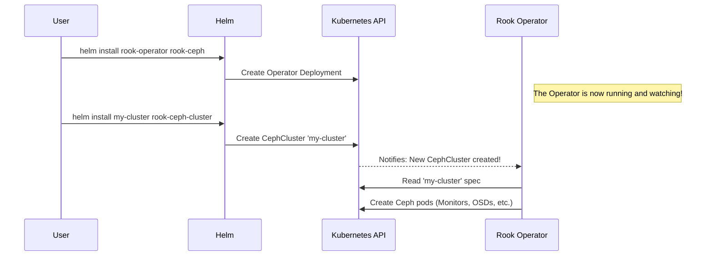

# Chapter 1: Helm Chart Architecture (Operator vs. Cluster)

Welcome to the world of Rook Ceph! Before we start deploying powerful storage solutions, it's essential to understand the "big picture" of how Rook is structured. This chapter will explain the core architectural decision that makes Rook so flexible and robust: the separation between the **Operator** and the **Cluster**.

### Why Two Separate Parts?

Imagine you're setting up a new computer. First, you install the operating system (like Windows or macOS). This is your "control panel"—it manages all the software, drivers, and settings. Once the OS is running, you can then install applications like a web browser or a game.

Rook Ceph works in a very similar way. The project is split into two main Helm charts:

1.  **`rook-ceph` (The Operator):** This is like installing the operating system or "control panel". It sets up the manager, the "brain" that knows how to build and manage storage clusters.
2.  **`rook-ceph-cluster` (The Cluster):** This is like installing an application. You use this chart to tell the control panel, "Please build me a new storage cluster with these specific settings."

This separation is powerful because it separates the *management software* from the *data storage software*. You can update the control panel (the Operator) without taking your storage offline, or you can manage multiple, completely separate storage clusters using just one control panel.

### The Two Key Players

Let's look at the two Helm charts that represent these two parts.

#### 1. The `rook-ceph` Chart: Our Control Panel

This chart installs the **Rook Ceph Operator**. The Operator is a program that runs in your Kubernetes cluster, constantly watching for requests to build or manage storage. It doesn't store any of your actual data; its only job is to be the expert manager.

Here’s a peek at its definition file. Notice the `name` is `rook-ceph`.

```yaml
# File: charts/rook-ceph/Chart.yaml
apiVersion: v2
description: File, Block, and Object Storage Services for your Cloud-Native Environment
name: rook-ceph
version: 0.0.1
# ... more details
```

Installing this chart is **Step 1**. It gets our manager ready to work.

#### 2. The `rook-ceph-cluster` Chart: Our Storage Blueprint

This chart doesn't install a big piece of software itself. Instead, it creates a simple "blueprint" or "request" that the Operator understands. This blueprint is a [`CephCluster` Custom Resource](04__cephcluster__custom_resource__.md), which we will cover in detail later. For now, just think of it as an order form you submit to the Operator.

This is the chart you use to define your actual storage cluster—how many disks to use, how much to replicate data, etc.

```yaml
# File: charts/rook-ceph-cluster/Chart.yaml
apiVersion: v2
description: Manages a single Ceph cluster namespace for Rook
name: rook-ceph-cluster
version: 0.0.1
# ... more details
```

Installing this chart is **Step 2**. It tells our manager what to build.

### How It All Works Together

So, how do these two charts interact? It's a simple two-step process.

1.  **Deploy the Operator:** You first install the `rook-ceph` chart. This brings the Rook Operator pod to life inside your Kubernetes cluster. It immediately starts watching for any `CephCluster` resources.

2.  **Deploy the Cluster:** Next, you install the `rook-ceph-cluster` chart. This creates a `CephCluster` resource in Kubernetes. The Operator sees this new resource, reads its configuration, and springs into action. It follows the instructions in your blueprint to build the Ceph storage cluster, creating all the necessary pods and services to store your data.

This interaction is a core concept in Kubernetes, often called the "Operator Pattern".

### Under the Hood: A Quick Tour

Let's visualize the process when you deploy a new cluster.



As you can see, the Operator acts as an intelligent agent. You don't tell Kubernetes *how* to build a Ceph cluster; you just tell the Operator *what* you want, and it handles all the complex details for you.

How does the cluster "know" which operator to talk to? The `rook-ceph-cluster` chart has a setting for it.

```yaml
# File: charts/rook-ceph-cluster/values.yaml
# -- Namespace of the main rook operator
operatorNamespace: rook-ceph
```

This simple line of configuration tells your cluster blueprint where to find its manager. We'll explore more settings like this in the next chapter on [Configuration via `values.yaml`](02_configuration_via__values_yaml__.md).

### Conclusion

You've just learned the most fundamental concept of Rook's architecture: the separation of the Operator (the manager) from the Cluster (the data storage).

*   **`rook-ceph` Chart:** Installs the Operator, our "control panel".
*   **`rook-ceph-cluster` Chart:** Sends a request to the Operator to build a specific storage cluster.

This two-step approach provides a clean, manageable, and powerful way to run stateful storage systems on Kubernetes.

Now that we understand the structure, let's learn how to configure it. In the next chapter, we will explore [Configuration via `values.yaml`](02_configuration_via__values_yaml__.md).

---

Generated by [AI Codebase Knowledge Builder](https://github.com/The-Pocket/Tutorial-Codebase-Knowledge)