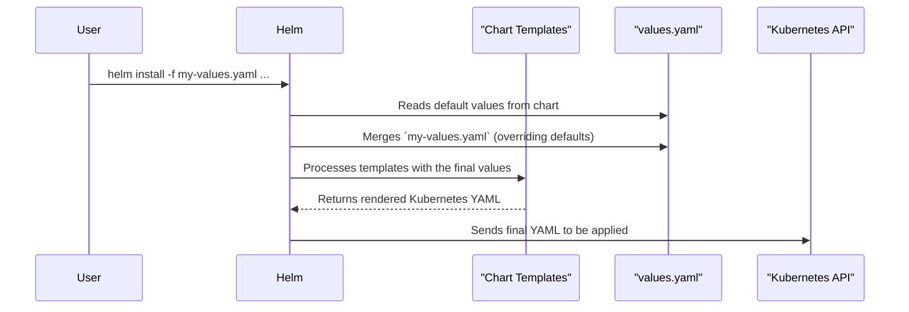

# Chapter 2: Configuration via `values.yaml`

In the last chapter, we learned about the two-part structure of Rook Ceph: the [Helm Chart Architecture (Operator vs. Cluster)](01_helm_chart_architecture__operator_vs__cluster__.md). We have the `rook-ceph` chart for the manager (the Operator) and the `rook-ceph-cluster` chart for the storage blueprint (the Cluster).

But how do we actually *tell* these charts what we want? What if we need to use a specific version of Ceph, or tell Rook which hard drives to use for storage? This is where Helm's configuration system comes in, and it's beautifully simple.

### Your Deployment's Control Panel

Imagine you're playing a video game. Before you start, you go to the "Settings" menu. You can change the difficulty, adjust the graphics, and configure your controls. You don't have to rewrite the game's code; you just use the control panel the developers gave you.

In the world of Helm, the **`values.yaml`** file is that settings menu.

Each of our Helm charts (`rook-ceph` and `rook-ceph-cluster`) comes with its own `values.yaml` file. This file is a centralized list of every setting you can possibly tweak for that part of the deployment.

*   **`charts/rook-ceph/values.yaml`**: The control panel for the Operator.
*   **`charts/rook-ceph-cluster/values.yaml`**: The control panel for the actual storage cluster.

By editing these files *before* you run `helm install`, you can tailor the entire deployment to your exact needs without ever touching the complex underlying Kubernetes templates.

### A Practical Example: Customizing Our Setup

Let's imagine we have two requirements for our new storage cluster:

1.  **For the Operator:** We're trying to debug an issue, so we need the Operator to produce more detailed logs. We want to change its log level from `INFO` to `DEBUG`.
2.  **For the Cluster:** We're just building a small test cluster on a single machine, so we only need one Ceph Monitor daemon instead of the production default of three.

Let's see how `values.yaml` makes this easy.

#### Step 1: Adjusting the Operator's Log Level

First, we'll look inside the `rook-ceph` chart's configuration file.

```yaml
# File: charts/rook-ceph/values.yaml

# -- Global log level for the operator.
# Options: `ERROR`, `WARNING`, `INFO`, `DEBUG`
logLevel: INFO

# ... many other settings
```
This is a small snippet from the Operator's `values.yaml`. We can see a setting called `logLevel` which is set to `INFO`.

To change this, we don't edit the original file. Instead, we create our own small YAML file, let's call it `operator-overrides.yaml`, with just the setting we want to change.

```yaml
# File: operator-overrides.yaml
logLevel: DEBUG
```
When we install the chart, we'll tell Helm to use this file. Helm is smart enough to merge our setting on top of the defaults.

#### Step 2: Reducing the Monitor Count

Next, we need to configure our storage cluster. We'll look inside the `rook-ceph-cluster` chart's configuration.

```yaml
# File: charts/rook-ceph-cluster/values.yaml

cephClusterSpec:
  # ... other cluster settings
  mon:
    # Set the number of mons to be started.
    count: 3
    allowMultiplePerNode: false
  # ... many other settings
```
Here, we see that `cephClusterSpec.mon.count` is set to `3`.

Just like before, we'll create a new file, say `cluster-overrides.yaml`, with our desired change.

```yaml
# File: cluster-overrides.yaml
cephClusterSpec:
  mon:
    count: 1
```
Now we have two simple files that clearly state our custom configuration. When we run `helm install`, we'll provide these files, and Helm will build a deployment perfectly tailored to our needs.

### How Does It Work Under the Hood?

You might be wondering how Helm turns these simple values into full-blown Kubernetes configuration. The process is called **templating**.

Think of it like a "mail merge" in a word processor. You have a letter template with placeholders like `{{customer_name}}`, and you have a list of names. The mail merge combines them to create personalized letters.

Helm does the same thing:
1.  The chart contains **template files** (e.g., `deployment.yaml`, `configmap.yaml`) with placeholders.
2.  The **`values.yaml`** file provides the actual data for those placeholders.
3.  When you run `helm install`, the Helm templating engine reads the `values.yaml` file, fills in the placeholders in the templates, and generates the final Kubernetes manifest files.

Let's visualize this process:



#### A Quick Look at a Template

Let's peek at a real template to see how our `logLevel` value is used.

Here's our value from `charts/rook-ceph/values.yaml`:
```yaml
# ...
logLevel: INFO
# ...
```

And here's a snippet from a template file within that same chart:
```yaml
# File: charts/rook-ceph/templates/configmap.yaml

kind: ConfigMap
apiVersion: v1
metadata:
  name: rook-ceph-operator-config
data:
  ROOK_LOG_LEVEL: {{ .Values.logLevel | quote }}
  # ... more configuration
```
Look at the line with `{{ .Values.logLevel }}`. This is a Helm placeholder! When Helm processes this file, it will replace that placeholder with the value of `logLevel` from `values.yaml`.

The final output sent to Kubernetes will look like this:
```yaml
# Final rendered output
kind: ConfigMap
apiVersion: v1
metadata:
  name: rook-ceph-operator-config
data:
  ROOK_LOG_LEVEL: "INFO"
  # ...
```
If we had used our override file to set `logLevel: DEBUG`, the output would be `"DEBUG"` instead. This simple but powerful mechanism is the foundation for all configuration in the `deploy` project.

### Conclusion

You've just learned the most important skill for customizing a Rook Ceph deployment!

*   The **`values.yaml`** file is the central "control panel" for a Helm chart.
*   We have two of them: one for the **Operator** (`rook-ceph`) and one for the **Cluster** (`rook-ceph-cluster`).
*   To customize a deployment, you create your own small YAML file with just the settings you want to change and tell Helm to use it during installation.
*   Helm uses a **templating** engine to combine your values with the chart's templates to produce the final Kubernetes configuration.

Now that we understand *how* to configure the operator, let's take a closer look at the operator itself and the key settings you might want to change. In the next chapter, we'll dive deep into the [Rook Ceph Operator](03_rook_ceph_operator_.md).

---

Generated by [AI Codebase Knowledge Builder](https://github.com/The-Pocket/Tutorial-Codebase-Knowledge)