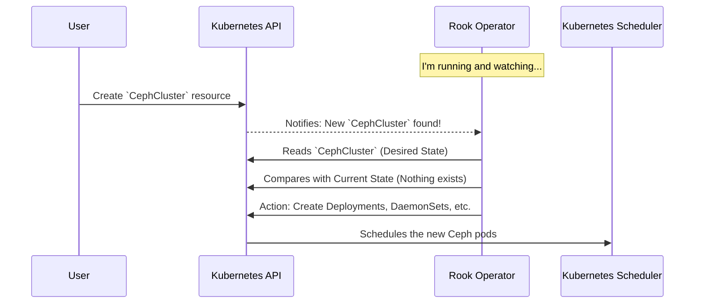

# Chapter 3: Rook Ceph Operator

In the previous chapter on [Configuration via `values.yaml`](02_configuration_via__values_yaml__.md), we learned *how* to change the settings for our deployment. Now, let's zoom in on the most important component we're configuring: the **Rook Ceph Operator**. This is the "brain" of the entire system.

### What is an Operator? Your Automated Fleet Manager

Imagine you are the manager of a large fleet of delivery trucks. Your job is incredibly complex: you have to make sure each truck is running, has fuel, follows the right route, and gets repaired if it breaks down. It's a full-time job requiring constant attention.

Now, what if you could hire an automated manager—a robot—that could do all of that for you? You would simply give the robot a high-level goal, like "Make sure 50 packages are delivered to City B by 5 PM," and the robot would handle all the details: dispatching the right number of trucks, monitoring their progress, and even scheduling repairs automatically.

The Rook Ceph Operator is that automated manager for your storage cluster.

It is a program that runs inside a Pod in your Kubernetes cluster. Its single purpose is to watch for your instructions and manage the complex lifecycle of a Ceph storage cluster. It automates difficult tasks that would otherwise require a storage expert:

*   **Deployment:** Setting up all the core components (Monitors, OSDs, Managers).
*   **Scaling:** Adding or removing storage capacity.
*   **Failure Recovery:** Detecting if a disk has failed and automatically healing the cluster.
*   **Upgrades:** Safely upgrading the Ceph software version with minimal downtime.

By using an Operator, you shift from telling Kubernetes *how* to do something (imperative) to simply telling it *what* you want (declarative).

### The Operator's Loop: Watch, Compare, Act

So how does this automated manager actually work? It follows a continuous loop, often called a **reconciliation loop**.

1.  **Watch:** The Operator constantly watches the Kubernetes API for special resources that it understands. The most important one is the [`CephCluster` Custom Resource](04__cephcluster__custom_resource__.md), which acts as our high-level instruction sheet.
2.  **Compare:** When it sees a `CephCluster` resource, it compares the "desired state" (what's written in your YAML file) with the "current state" (what is actually running in Kubernetes).
3.  **Act:** If there's a difference, the Operator takes action to make the current state match the desired state.

Let's see this in action with a simple example.



If you later edit the `CephCluster` resource to scale up, the Operator sees the change and creates the additional resources needed. If you delete the `CephCluster` resource, the Operator sees that too and cleans everything up. It's a tireless, automated administrator.

### Under the Hood: How the Operator Gets Its Power

The Operator isn't magic; it's just a clever use of standard Kubernetes features. Let's look at two key files from the `rook-ceph` Helm chart that bring it to life.

#### 1. The Deployment: Running the Brain

First, the Operator itself needs to run as a Pod. The `deployment.yaml` template in the Helm chart defines this.

```yaml
# File: charts/rook-ceph/templates/deployment.yaml
apiVersion: apps/v1
kind: Deployment
metadata:
  name: rook-ceph-operator
spec:
  replicas: 1
  template:
    spec:
      containers:
      - name: rook-ceph-operator
        image: "docker.io/rook/ceph:master"
        args: ["ceph", "operator"]
# ... other settings
```

This is a standard Kubernetes Deployment. The most important line is `args: ["ceph", "operator"]`, which runs the program that contains all the automation logic.

#### 2. The ClusterRole: Giving the Brain Permissions

An automated manager can't do its job if it doesn't have the authority to act. In Kubernetes, this authority is granted through Roles and ClusterRoles (RBAC). The `clusterrole.yaml` file gives the Rook Operator the permissions it needs.

Here's a small, simplified piece of that file.

```yaml
# File: charts/rook-ceph/templates/clusterrole.yaml

# Rule 1: Allow the operator to WATCH for CephCluster resources
- apiGroups: ["ceph.rook.io"]
  resources: ["cephclusters"]
  verbs: ["get", "list", "watch"]

# Rule 2: Allow the operator to CREATE Deployments
- apiGroups: ["apps"]
  resources: ["deployments", "daemonsets"]
  verbs: ["create", "update", "delete"]
```

*   **Rule 1** gives the Operator permission to perform the "Watch" step of its loop. It can see the instructions you give it.
*   **Rule 2** gives the Operator permission to perform the "Act" step. It can create and manage the actual Ceph components.

Together, these files deploy the Operator pod and give it the permissions it needs to manage your storage cluster on your behalf.

### Configuring the Operator Itself

While the Operator's main job is to manage storage clusters, it has its own settings you can configure. These are found in the `rook-ceph` chart's `values.yaml` file. For example, you can control how many resources the Operator pod itself is allowed to use.

```yaml
# File: charts/rook-ceph/values.yaml

# -- Pod resource requests & limits for the operator itself
resources:
  limits:
    memory: 512Mi
  requests:
    cpu: 200m
    memory: 128Mi
```

By changing these values, you're fine-tuning the automated manager, not the storage fleet it controls. This is useful for ensuring the Operator runs smoothly in resource-constrained environments.

### Conclusion

You've now learned about the heart of the Rook Ceph system:

*   The **Rook Ceph Operator** is an automated manager that handles the complex lifecycle of a Ceph cluster.
*   It follows a **Watch, Compare, Act** loop to make the running state of your cluster match your desired state.
*   This pattern turns complex manual operations into a simple, declarative process managed through YAML files.
*   It gets its power from standard Kubernetes concepts like Deployments and RBAC Roles.

The Operator is our tireless manager, but it needs instructions to know what to build. In the next chapter, we will learn all about the "blueprint" or "order form" we give to the Operator: the [`CephCluster` Custom Resource](04__cephcluster__custom_resource__.md).

---

Generated by [AI Codebase Knowledge Builder](https://github.com/The-Pocket/Tutorial-Codebase-Knowledge)