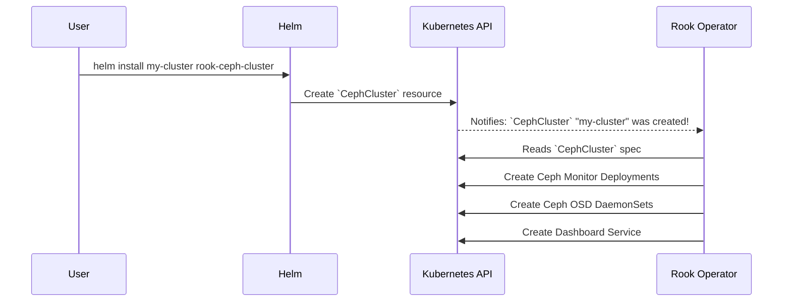

# Chapter 4: `CephCluster` Custom Resource

In the previous chapter, we met the [Rook Ceph Operator](03_rook_ceph_operator_.md), our tireless automated manager. We learned that its job is to watch for instructions and act on them. But what do those instructions look like? How do we tell the Operator what kind of storage cluster we want to build?

This chapter introduces the single most important "order form" in the entire system: the `CephCluster` Custom Resource.

### Your Cluster's Blueprint

Imagine you're ordering a custom-built computer. You don't just say "give me a computer." You fill out a detailed form specifying the processor, the amount of RAM, the size of the hard drives, and the graphics card.

The `CephCluster` is that order form for your storage cluster.

It is a special type of resource, defined by Rook, that you create in Kubernetes. It doesn't create any pods directly. Instead, it's a declarative blueprint that tells the Rook Operator exactly what you want. The Operator reads this blueprint and then works tirelessly to build and maintain a cluster that precisely matches your specifications.

### Anatomy of an Order Form

So what can we specify in our `CephCluster` blueprint? Let's look at the most important sections. We configure these details in the `cephClusterSpec` section of our `rook-ceph-cluster` chart's `values.yaml` file.

#### 1. The Ceph Version (`cephVersion`)

This is like choosing the model year of your car. It tells the Operator which version of the core Ceph software to deploy.

```yaml
# File: charts/rook-ceph-cluster/values.yaml

cephClusterSpec:
  cephVersion:
    # This tells the Operator to use the "Squid" release of Ceph.
    image: quay.io/ceph/ceph:v19.2.3
```
This simple block ensures that every component of your storage cluster—from the monitors to the storage daemons—will run a consistent, specified version of Ceph.

#### 2. The Monitors (`mon`)

Monitors are the "brains" of the Ceph cluster, responsible for maintaining the master copy of the cluster map. You typically want an odd number of them (like 3 or 5) for high availability.

```yaml
# ... inside cephClusterSpec:
  mon:
    # We are ordering a cluster with 3 monitors.
    count: 3
    # For reliability, don't allow them on the same physical machine.
    allowMultiplePerNode: false
```
Here, we're telling the Operator: "Please create and maintain exactly three Ceph Monitor pods for me, and make sure they are spread across different nodes for safety."

#### 3. Storage Selection (`storage`)

This is where you tell Rook which disks to use. This is the most critical part of the configuration. For a simple test cluster, you can tell Rook to just use any available empty disks it finds on your nodes.

```yaml
# ... inside cephClusterSpec:
  storage:
    # Look for storage on all Kubernetes nodes.
    useAllNodes: true
    # Use any empty, available disk you can find.
    useAllDevices: true
```
The Operator will now scan the nodes in your Kubernetes cluster, find any unused disks, and automatically format and configure them to be part of the Ceph storage pool. In a production setup, you would use more specific filters to select exactly the right disks.

#### 4. The Dashboard (`dashboard`)

Ceph comes with a powerful web-based dashboard for monitoring the cluster's health and performance. We can ask the Operator to enable it for us with one simple flag.

```yaml
# ... inside cephClusterSpec:
  dashboard:
    # Yes, please enable the web dashboard!
    enabled: true
    # And make sure it uses a secure SSL connection.
    ssl: true
```
The Operator will not only enable the dashboard but also automatically generate the necessary secrets and services to expose it within the cluster.

### From `values.yaml` to a Real Resource

As we learned in [Configuration via `values.yaml`](02_configuration_via__values_yaml__.md), the `rook-ceph-cluster` Helm chart takes our values and uses them to render a final Kubernetes manifest.

When you run `helm install`, the chart combines all the `cephClusterSpec` settings from your `values.yaml` into a single `CephCluster` resource file and sends it to Kubernetes.

**Input (`values.yaml` snippet):**
```yaml
cephClusterSpec:
  cephVersion:
    image: quay.io/ceph/ceph:v19.2.3
  mon:
    count: 3
  dashboard:
    enabled: true
  storage:
    useAllNodes: true
```

**Output (Final Kubernetes Resource):**
```yaml
# This is what Helm creates in Kubernetes
apiVersion: ceph.rook.io/v1
kind: CephCluster
metadata:
  name: rook-ceph
  namespace: rook-ceph
spec:
  cephVersion:
    image: quay.io/ceph/ceph:v19.2.3
  dashboard:
    enabled: true
  mon:
    count: 3
  storage:
    useAllNodes: true
```
This final resource is the official "order" that the Rook Operator receives and acts upon.

### Under the Hood: The Blueprint in Action

Let's trace the journey of our `CephCluster` blueprint from creation to a running storage system.

1.  You run `helm install rook-ceph-cluster` with your custom values.
2.  Helm renders the `CephCluster` template and creates the resource in Kubernetes.
3.  The Rook Operator, which is constantly watching for `CephCluster` resources, is immediately notified of the new blueprint.
4.  The Operator reads the `spec` section of the resource.
5.  It translates your high-level requests into low-level Kubernetes resources (Deployments for Monitors, DaemonSets for storage daemons, Services for networking, etc.) and creates them.

This process is visualized below:



The magic happens inside the `rook-ceph-cluster` chart's template file. It's surprisingly simple.

```yaml
# File: charts/rook-ceph-cluster/templates/cephcluster.yaml
apiVersion: ceph.rook.io/v1
kind: CephCluster
metadata:
  name: {{ default .Release.Namespace .Values.clusterName }}
  namespace: {{ .Release.Namespace }}
spec:
{{ toYaml .Values.cephClusterSpec | indent 2 }}
```
This template takes the entire `cephClusterSpec` block from your `values.yaml` file (`.Values.cephClusterSpec`) and injects it directly into the `spec` section of the final `CephCluster` resource. It's a clean and direct mapping from your configuration to the Operator's instructions.

### Conclusion

You've now learned about the declarative heart of a Rook deployment.

*   The **`CephCluster`** is a custom resource that acts as a blueprint for your entire storage cluster.
*   You define its specifications inside the `cephClusterSpec` section of the `rook-ceph-cluster` chart's `values.yaml`.
*   You can control key aspects like the **Ceph version**, **monitor count**, **storage devices**, and **dashboard**.
*   The **Rook Operator** reads this blueprint and handles all the complex work of building and maintaining the cluster to match your desired state.

We've successfully submitted our order and the Operator has built our powerful storage machine. But what can we do with it? In the next chapter, we'll learn how to carve up this raw storage for different uses by exploring [Ceph Storage Primitives (Pools, Filesystems, Object Stores)](05_ceph_storage_primitives__pools__filesystems__object_stores__.md).

---

Generated by [AI Codebase Knowledge Builder](https://github.com/The-Pocket/Tutorial-Codebase-Knowledge)