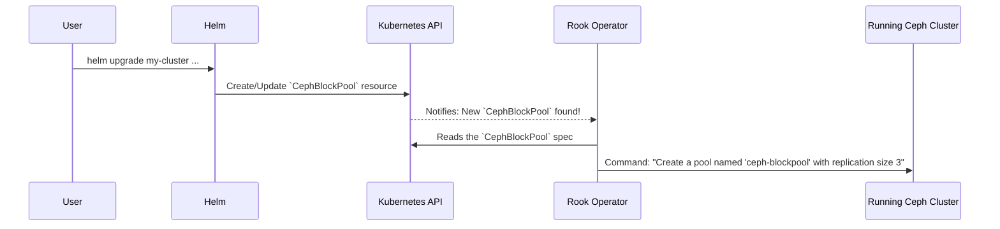

# Chapter 5: Ceph Storage Primitives (Pools, Filesystems, Object Stores)

In the last chapter, we learned how to define our storage cluster's blueprint using the [`CephCluster` Custom Resource](04__cephcluster__custom_resource__.md). Think of this as building a giant, powerful, but completely empty warehouse. Now that the warehouse is built, we need to set up different types of storage sections inside it to hold different kinds of goods.

This chapter is all about creating those "storage sections." In Ceph, these are the actual storage products you can use. They are called **storage primitives**, and they come in three main flavors to solve different problems.

### Your Warehouse's Storage Aisles

Imagine our big, empty warehouse. We need to organize it. We might set up:
1.  **A section of heavy-duty shelves** to hold individual, heavy pallets. Each pallet gets its own dedicated spot.
2.  **A large, open floor area** where teams can share tools and materials, all working from the same space.
3.  **A secure locker room** with a reception desk, where you can drop off or pick up packages by asking the clerk.

Ceph's storage primitives work just like this:

*   **`CephBlockPool` (The Heavy-Duty Shelves):** Provides raw "block" storage. Think of these as virtual hard drives that you can attach to a single application (a Pod). Perfect for things like databases that need their own dedicated, high-performance disk.

*   **`CephFileSystem` (The Shared Floor Area):** Provides a shared file system that many applications can read from and write to at the same time. It's like a network drive (NFS). Perfect for a team of web servers that all need to access the same website content.

*   **`CephObjectStore` (The Secure Locker Room):** Provides S3-compatible object storage. Instead of mounting a drive, your application talks to it over an API to upload and download files (called "objects"). Perfect for storing user-uploaded photos, videos, or backups, just like a private Dropbox or Amazon S3.

You define these storage products as custom resources, and the [Rook Ceph Operator](03_rook_ceph_operator_.md) automatically builds and manages them for you inside your Ceph cluster.

### How to Order Your Storage Products

Just like we configured our cluster, we define the storage products we want in the `rook-ceph-cluster` chart's `values.yaml` file. The Helm chart then creates the necessary custom resources for us.

Let's look at how to order one of each type.

#### 1. Ordering a `CephBlockPool`

To get some virtual hard drives, we add a configuration to the `cephBlockPools` section of our `values.yaml`.

```yaml
# File: charts/rook-ceph-cluster/values.yaml

cephBlockPools:
  - name: ceph-blockpool
    spec:
      replicated:
        # Store 3 copies of the data for safety
        size: 3
```
This is our order form. We're asking for a new block pool named `ceph-blockpool`. The most important setting here is `replicated.size: 3`. This tells Ceph, "For every piece of data written to this pool, please keep three copies on different physical disks. That way, if one disk fails, my data is still safe."

#### 2. Ordering a `CephFileSystem`

To get a shared network drive, we configure the `cephFileSystems` section.

```yaml
# File: charts/rook-ceph-cluster/values.yaml

cephFileSystems:
  - name: ceph-filesystem
    spec:
      metadataPool:
        replicated:
          size: 3
      dataPools:
        - replicated:
            size: 3
```
This looks a bit more complex, but it's simple. A filesystem needs two kinds of pools:
*   `metadataPool`: This is like the library's card catalog. It stores information *about* your files (filenames, permissions, folders).
*   `dataPools`: This is where the actual content of your files is stored.

Again, we're asking for `size: 3` replication on both to ensure our data is highly available.

#### 3. Ordering a `CephObjectStore`

Finally, to get our own private S3, we configure the `cephObjectStores` section.

```yaml
# File: charts/rook-ceph-cluster/values.yaml

cephObjectStores:
  - name: ceph-objectstore
    spec:
      metadataPool:
        replicated:
          size: 3
      dataPool:
        replicated:
          size: 3
      gateway:
        port: 80
        instances: 1
```
This also has metadata and data pools. The new part is the `gateway`. The gateway is the "front door" or the "reception desk" for our object store. It's a web server that listens on `port: 80` and speaks the S3 API, allowing applications to store and retrieve objects.

### Under the Hood: The Operator as the Warehouse Manager

How does a simple change in `values.yaml` create a fully functional storage system? The [Rook Ceph Operator](03_rook_ceph_operator_.md) acts as our automated warehouse manager.

1.  You run `helm upgrade` with your updated `values.yaml` file.
2.  The Helm chart creates the `CephBlockPool`, `CephFileSystem`, and `CephObjectStore` custom resources in Kubernetes.
3.  The Rook Operator sees these new resources.
4.  The Operator reads their specifications and sends commands to the running Ceph cluster to create the actual pools and start the necessary services (like the object storage gateway).

Here's a diagram of the process for creating a `CephBlockPool`:



The Operator translates your simple, high-level request into the specific, low-level commands that Ceph understands.

#### A Peek at the Helm Templates

The magic of turning your values into Kubernetes resources happens in the Helm chart's template files. Let's look at a simplified version of the template for block pools.

```yaml
# File: charts/rook-ceph-cluster/templates/cephblockpool.yaml

{{- range $blockpool := .Values.cephBlockPools -}}
---
apiVersion: ceph.rook.io/v1
kind: CephBlockPool
metadata:
  name: {{ $blockpool.name }}
spec:
{{ toYaml $blockpool.spec | indent 2 }}
{{- end }}
```
This is a simple loop. It goes through each item you defined in the `cephBlockPools` list in your `values.yaml` and creates a `CephBlockPool` resource for it. The `toYaml $blockpool.spec` part takes the entire `spec` you wrote and injects it directly into the final Kubernetes manifest.

### Conclusion

You've just learned how to carve up your raw storage cluster into useful, finished products!

*   A `CephCluster` is the raw warehouse; storage primitives are the organized sections inside it.
*   **`CephBlockPool`** provides virtual hard drives for individual pods.
*   **`CephFileSystem`** provides a shared network drive for multiple pods.
*   **`CephObjectStore`** provides an S3-compatible service for applications.
*   You create these simply by defining them in the `rook-ceph-cluster` chart's `values.yaml`, and the Rook Operator does all the heavy lifting.

Our storage products are now ready and waiting. But how do our applications actually start using them? In the next chapter, we'll connect our pods to this storage using the Kubernetes standard: [Container Storage Interface (CSI) Integration](06_container_storage_interface__csi__integration__.md).

---

Generated by [AI Codebase Knowledge Builder](https://github.com/The-Pocket/Tutorial-Codebase-Knowledge)