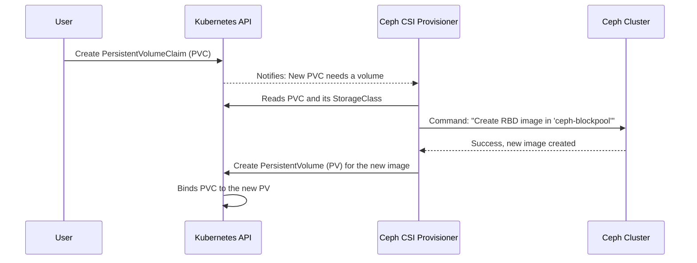

# Chapter 6: Container Storage Interface (CSI) Integration

In the previous chapter on [Ceph Storage Primitives](05_ceph_storage_primitives__pools__filesystems__object_stores__.md), we learned how to build our "storage warehouse" and set up different "aisles" for block storage, file systems, and object stores. Our powerful storage products are ready and waiting.

But how do our applications, running as pods in Kubernetes, actually start *using* this storage? How does a simple database pod get its own dedicated virtual hard drive from our Ceph cluster? This is the crucial "last mile" connection, and it's handled by a Kubernetes standard called the Container Storage Interface, or CSI.

### The Universal Power Adapter for Storage

Imagine the world before USB. Every phone, camera, and MP3 player had its own unique, custom charging cable. It was a mess! Now, with a standard like USB-C, you can use one type of cable and one type of wall adapter to charge almost anything. You don't need to know how the power grid works; you just need the standard plug.

**CSI is the USB-C for Kubernetes storage.**

It's a standard "plug-in" system that lets Kubernetes talk to any storage system (like Ceph, NetApp, or AWS EBS) in a generic, universal way. Your application doesn't need to know anything about Ceph. It just asks Kubernetes for storage in a standard way, and the CSI driver for Ceph handles all the complex translation in the background.

Rook's CSI integration is the crucial plumbing that automatically installs and configures this "Ceph adapter" for you, making sophisticated Ceph storage look like a simple, native feature to your applications.

### The Three Key Parts of a Storage Request

When your application needs storage, three Kubernetes objects work together to make it happen.

1.  **`StorageClass` (The Menu):** This is a menu of the different "flavors" of storage you offer. For example, you might have a "fast-ssd" class and a "cheap-hdd" class. The `StorageClass` tells Kubernetes which CSI driver (which plug) to use and what parameters to pass to it.

2.  **`PersistentVolumeClaim` (PVC - The Order):** This is the request an application makes. It's like filling out an order form: "I would like 10GB of storage from the `fast-ssd` menu, please."

3.  **`PersistentVolume` (PV - The Delivered Item):** This is the actual piece of storage that the CSI driver creates to fulfill the order. Kubernetes automatically creates this for you. It's the specific, provisioned virtual disk that is ready for your application to use.

### A Practical Example: Giving a Database a Disk

Let's walk through the process of giving a new PostgreSQL database pod a persistent disk from the `ceph-blockpool` we created in the last chapter.

#### Step 1: Create the `StorageClass` (The Menu)

First, an administrator needs to create a `StorageClass` that tells Kubernetes how to use our Ceph block pool. Rook will often create a default one for you, but let's look at what it contains.

```yaml
# storageclass.yaml
apiVersion: storage.k8s.io/v1
kind: StorageClass
metadata:
  name: ceph-rbd
provisioner: rook-ceph.rbd.csi.ceph.com # The name of our Ceph "plug"
parameters:
  pool: ceph-blockpool # Use the pool we created earlier
  # ... other Ceph-specific settings
reclaimPolicy: Delete
```
This manifest defines our "menu item" called `ceph-rbd`.
*   `provisioner`: This is the most important part. It tells Kubernetes to use the Rook Ceph CSI driver for block devices (RBD).
*   `parameters.pool`: This tells the Ceph CSI driver *which* block pool to create the virtual disks in.
*   `reclaimPolicy: Delete`: This tells Kubernetes to delete the underlying Ceph disk when the user deletes their claim, keeping things tidy.

#### Step 2: Create the `PersistentVolumeClaim` (The Order)

Now, a developer wanting to deploy the database can create a simple request for storage.

```yaml
# pvc.yaml
apiVersion: v1
kind: PersistentVolumeClaim
metadata:
  name: postgres-pvc
spec:
  accessModes:
    - ReadWriteOnce # This disk can only be attached to one pod at a time
  storageClassName: ceph-rbd # Order from our "ceph-rbd" menu item
  resources:
    requests:
      storage: 5Gi # I need 5 Gigabytes of space
```
This is the developer's order. They don't need to know anything about Ceph, pools, or replication. They just ask for 5Gi of storage using the `ceph-rbd` class.

#### Step 3: Use the Claim in a Pod

Finally, the developer includes the `PersistentVolumeClaim` in their pod definition.

```yaml
# pod.yaml
apiVersion: v1
kind: Pod
metadata:
  name: postgres-pod
spec:
  containers:
    - name: postgres
      image: postgres:13
      volumeMounts:
        - mountPath: /var/lib/postgresql/data # Mount the disk inside the container
          name: postgres-storage
  volumes:
    - name: postgres-storage
      persistentVolumeClaim:
        claimName: postgres-pvc # Use the storage we ordered
```
The `volumes` section of the pod spec tells Kubernetes to find the PVC named `postgres-pvc` and make it available to the container at the path `/var/lib/postgresql/data`. Kubernetes and the Ceph CSI driver handle the rest!

### Under the Hood: How the Magic Happens

So what actually happens when you create that `postgres-pvc`? How does an abstract request turn into a real, formatted disk attached to your pod?

1.  A user creates the `PersistentVolumeClaim` (PVC).
2.  Kubernetes sees the PVC and looks at its `storageClassName`, which points to the Ceph CSI driver.
3.  Kubernetes calls the Ceph CSI **Provisioner** pod, saying "Please create a 5Gi volume for me from the `ceph-blockpool`."
4.  The CSI Provisioner connects to the Ceph cluster and runs a command like `rbd create ...` to create a new virtual disk (an RBD image).
5.  The CSI Provisioner creates a `PersistentVolume` (PV) object in Kubernetes to represent this new disk.
6.  Kubernetes "binds" the user's PVC to the new PV. The order is fulfilled!
7.  When the `postgres-pod` is scheduled to a node, the Ceph CSI **Node Plugin** (running on that node) is called. It attaches the RBD image to the host machine and mounts it into the pod's container.

This entire automated workflow is orchestrated by Rook and Ceph CSI.



#### Rook's Role: The Automated Installer

Manually installing and configuring a CSI driver can be complex. This is where Rook shines. When you install the `rook-ceph` Helm chart, it handles everything for you.

Notice in the `Chart.yaml` for the `rook-ceph` operator, it has a dependency:

```yaml
# File: charts/rook-ceph/Chart.yaml
dependencies:
  # ...
  - name: ceph-csi-operator
    repository: https://ceph.github.io/ceph-csi-operator
    condition: csi.rookUseCsiOperator
```
This line tells Helm to pull in and install the official Ceph CSI Operator. Rook then configures it to connect to the `CephCluster` you created.

This is controlled by a few simple values in the `rook-ceph` chart's `values.yaml`:

```yaml
# File: charts/rook-ceph/values.yaml

csi:
  # Set to true to automatically deploy the CSI driver
  rookUseCsiOperator: true
  # Enable the block storage (RBD) driver
  enableRbdDriver: true
  # Enable the filesystem (CephFS) driver
  enableCephfsDriver: true
```
By simply setting these flags to `true`, the [Rook Ceph Operator](03_rook_ceph_operator_.md) ensures that the entire CSI system—the provisioner pods, the node daemonsets, and the necessary RBAC permissions—are deployed and ready to serve storage requests from your applications.

### Conclusion

You've just learned how to bridge the gap between your powerful Ceph cluster and your Kubernetes applications.

*   **CSI** is the standard, "universal adapter" for storage in Kubernetes.
*   Rook automatically deploys and manages the **Ceph CSI driver** for you.
*   Applications request storage using standard Kubernetes objects: a **`PersistentVolumeClaim`** (the order) which refers to a **`StorageClass`** (the menu).
*   This system hides all the complexity of Ceph from your application developers, allowing them to consume storage in a simple, cloud-native way.

We've covered how to get block and file storage for pods using the standard PVC method. But what about object storage? The PVC model doesn't quite fit. In the next chapter, we'll explore a special, parallel system designed specifically for object storage: [Object Bucket Claims (OBCs)](07_object_bucket_claims__obcs__.md).

---

Generated by [AI Codebase Knowledge Builder](https://github.com/The-Pocket/Tutorial-Codebase-Knowledge)