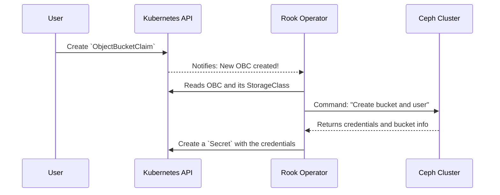

# Chapter 7: Object Bucket Claims (OBCs)

In our last chapter on [Container Storage Interface (CSI) Integration](06_container_storage_interface__csi__integration__.md), we saw how applications can request block and file storage using a standard "order form" called a `PersistentVolumeClaim` (PVC). This works perfectly for things that look like a hard drive.

But what about object storage? Applications don't "mount" an S3 bucket like a disk. They talk to it over a network API using a URL, an access key, and a secret key. The PVC model doesn't fit this at all. We need a different kind of order form. This is where Object Bucket Claims (OBCs) come in.

### The Vending Machine for S3 Buckets

Imagine you're building a new photo-sharing application. You need a private S3 bucket where your application can store all the user-uploaded images. In the old days, you would have to file a ticket with the storage administrator, wait for them to manually create a bucket and a user, and then email you the credentials. This is slow and tedious.

What if you could have a self-service vending machine instead? You just walk up, press a button for "New S3 Bucket," and it dispenses a new bucket with its own private set of keys, ready to use in seconds.

**Object Bucket Claims (OBCs) are that vending machine for S3 buckets.**

They provide a simple, Kubernetes-native way for your application to request its own object storage bucket. You, the developer, create a tiny YAML file, and the [Rook Ceph Operator](03_rook_ceph_operator_.md) does all the administrative work for you automatically.

### A Practical Example: Getting a Bucket for Our App

Let's walk through the process. Our photo-sharing app needs a new S3 bucket. Here's how we use the vending machine.

#### Step 1: The `StorageClass` (Knowing Which Vending Machine to Use)

First, the cluster administrator sets up a `StorageClass` that points to our `CephObjectStore`. This tells Kubernetes how to fulfill bucket requests. The `rook-ceph-cluster` chart can create this for you automatically if you enable it in `values.yaml`.

```yaml
# A StorageClass for our Ceph object store
apiVersion: storage.k8s.io/v1
kind: StorageClass
metadata:
  name: ceph-bucket
# This is the "magic" provisioner name for Rook's OBC controller
provisioner: rook-ceph.ceph.rook.io/bucket
reclaimPolicy: Delete
parameters:
  # Tells the provisioner which object store to create buckets in
  objectStoreName: ceph-objectstore
  objectStoreNamespace: rook-ceph
```
This `StorageClass` acts as a menu, telling Kubernetes that any requests for the `ceph-bucket` class should be handled by Rook's bucket provisioner, using the `ceph-objectstore` we created in Chapter 5.

#### Step 2: The `ObjectBucketClaim` (Pressing the Button)

Now, as an application developer, you can make your request. You create a simple `ObjectBucketClaim` manifest.

```yaml
# my-app-bucket-claim.yaml
apiVersion: objectbucket.io/v1alpha1
kind: ObjectBucketClaim
metadata:
  name: my-photo-app-bucket
spec:
  # Use the menu item we defined above
  storageClassName: ceph-bucket
  # Ask Rook to generate a unique bucket name for us
  generateBucketName: photo-storage
```
This is it! This tiny file is your entire request. You're simply saying, "I'd like a new bucket, please. Use the `ceph-bucket` vending machine, and please make the bucket name start with `photo-storage`."

#### Step 3: Getting the Credentials (Collecting Your Item)

When you apply this YAML file, the Rook Operator springs into action. It creates a new bucket and a dedicated user. Then, it places all the connection details into a Kubernetes `Secret` and a `ConfigMap` for your application to use.

The `Secret` will have the same name as your `ObjectBucketClaim` (`my-photo-app-bucket`) and will contain the credentials. If you were to look inside, it would look like this (decoded for readability):

**Output (The generated Secret):**
```yaml
# The secret automatically created by Rook
apiVersion: v1
kind: Secret
metadata:
  name: my-photo-app-bucket
type: Opaque
data:
  # The secret credentials your app needs
  AWS_ACCESS_KEY_ID: ABC123DEF456GHI789
  AWS_SECRET_ACCESS_KEY: mySuperSecretKeyThatWasAutoGenerated
```
Rook delivers the keys to your bucket right into a standard Kubernetes `Secret`, ready for your application to consume. Your application can now mount this Secret as environment variables and immediately start talking to its new, private S3 bucket.

### Under the Hood: The Automated Provisioning Flow

How does that simple `ObjectBucketClaim` result in a fully provisioned bucket with credentials? The [Rook Ceph Operator](03_rook_ceph_operator_.md) acts as the logic inside the vending machine.

1.  A developer creates an `ObjectBucketClaim` resource.
2.  The Rook Operator, which is watching for these resources, sees the new claim.
3.  The Operator reads the `storageClassName` and finds the `CephObjectStore` it needs to talk to.
4.  It connects to the Ceph cluster and commands it to create a new bucket and a new S3 user.
5.  Ceph returns the new bucket's details and the user's access/secret keys.
6.  The Operator takes these details and creates a new `Secret` and `ConfigMap` in the same namespace as the claim.
7.  The developer's application pod can now reference that `Secret` and get everything it needs.

Let's visualize this self-service flow.



#### Where Does the Logic Live?

This powerful automation isn't magic; it's defined in the Rook Helm charts.

**1. The Permissions:** How does the Operator have permission to do all this? The `rook-ceph` chart defines a special `ClusterRole` just for this purpose.

```yaml
# File: charts/rook-ceph/templates/clusterrole.yaml
# (Simplified snippet)

kind: ClusterRole
apiVersion: rbac.authorization.k8s.io/v1
metadata:
  name: rook-ceph-object-bucket
rules:
  - apiGroups: ["objectbucket.io"]
    resources: ["objectbucketclaims"]
    verbs: ["get", "list", "watch", "update"]
  - apiGroups: [""]
    resources: ["secrets", "configmaps"]
    verbs: ["get", "create", "update"]
```
This rule grants the Rook Operator the power to `watch` for `ObjectBucketClaims` and the power to `create` the `Secrets` that hold the final credentials.

**2. The StorageClass Template:** How is the `StorageClass` for buckets created? The `rook-ceph-cluster` chart contains a template that generates it for you if you ask.

```yaml
# File: charts/rook-ceph-cluster/templates/cephobjectstore.yaml
# (Simplified snippet)

{{- if $objectstore.storageClass.enabled }}
apiVersion: storage.k8s.io/v1
kind: StorageClass
metadata:
  name: {{ $objectstore.storageClass.name }}
provisioner: {{ $root.Release.Namespace }}.ceph.rook.io/bucket
parameters:
  objectStoreName: {{ $objectstore.name }}
{{- end }}
```
This template takes the settings from the `cephObjectStores` section of your `values.yaml` and builds the `StorageClass` manifest that connects user requests to your actual object store.

### Conclusion

You've now learned about the elegant, self-service pattern for provisioning object storage in Kubernetes.

*   **Object Bucket Claims (OBCs)** are the "vending machine" for requesting S3-compatible buckets.
*   They provide a simple, declarative way for developers to get the storage they need without manual intervention.
*   The workflow is simple: the developer creates an **OBC**, the **Rook Operator** sees it, provisions a bucket in Ceph, and returns the credentials in a Kubernetes **Secret**.
*   This pattern cleanly separates the concerns of the application developer from the storage administrator.

Our storage cluster is now fully functional, serving block, file, and object storage to our applications in a cloud-native way. But how do we know if it's healthy? How do we get alerts if a disk is about to fail? In our final chapter, we'll explore [Monitoring & Alerting](08_monitoring___alerting__.md).

---

Generated by [AI Codebase Knowledge Builder](https://github.com/The-Pocket/Tutorial-Codebase-Knowledge)