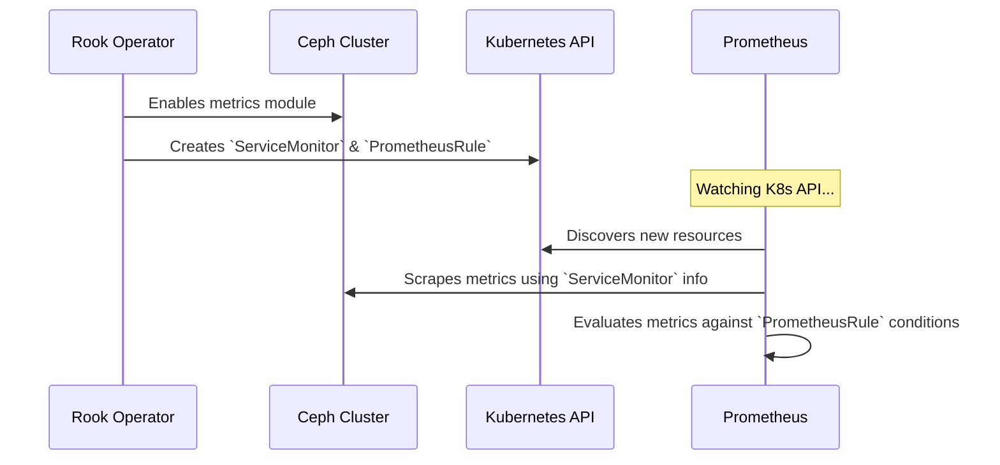

# Chapter 8: Monitoring & Alerting

In our previous chapter on [Object Bucket Claims (OBCs)](07_object_bucket_claims__obcs__.md), we completed our tour of Ceph's storage capabilities, learning how to provide block, file, and object storage to our applications. Our storage cluster is now fully deployed and serving data. But how do we know if it's healthy? What happens if a disk starts to fail, or a storage pool is about to run out of space?

This is where monitoring and alerting come in. It's the system that gives us visibility into the health of our cluster and warns us *before* small problems become big outages.

### Your Cluster's Dashboard and Alarm System

Imagine you've just built a high-performance race car. The engine is powerful, the aerodynamics are perfect, and it's ready to go. But what if you built it without a dashboard? You wouldn't know your speed, your engine temperature, or how much fuel you have left. You'd be driving blind, waiting for something to go wrong.

Monitoring and alerting is the dashboard for your Ceph cluster.

*   **Monitoring (The Gauges):** This provides the raw numbers, or **metrics**, about how the cluster is performing. How much data is stored? How many operations per second are being handled? How much free space is left on each disk?
*   **Alerting (The Warning Lights):** This is the alarm system. It watches the metrics and, based on pre-defined rules, tells you when something is wrong. For example, if the "free space" gauge drops below 15%, a "low fuel" warning light turns on.

Rook makes setting up this entire system incredibly simple. It can automatically configure Ceph to expose its metrics in a format that a very popular monitoring tool, **Prometheus**, can understand.

### Enabling Your Dashboard with a Single Switch

To turn on monitoring, you just need to flip a few switches in your `rook-ceph-cluster` chart's `values.yaml` file.

Let's look at the `monitoring` section.

```yaml
# File: charts/rook-ceph-cluster/values.yaml

monitoring:
  # This is the main switch to turn on monitoring.
  enabled: true
  # This tells Rook to create the pre-configured alerts.
  createPrometheusRules: true
```

That's it! By setting these two values to `true` and upgrading your Helm release, you've told the [Rook Ceph Operator](03_rook_ceph_operator_.md) to do all the hard work of setting up the monitoring pipeline.

### What Happens When You Flip the Switch?

When you enable monitoring, the Rook Operator performs several key actions:

1.  **Activates Ceph's Metrics:** It tells the main Ceph Manager daemon to enable its internal "prometheus" module. This opens up a special web page (an endpoint) where all of Ceph's internal statistics are published in real-time.
2.  **Creates a `ServiceMonitor`:** It creates a special Kubernetes resource called a `ServiceMonitor`. This acts like a signpost, telling your Prometheus server where to find the Ceph metrics endpoint.
3.  **Creates `PrometheusRule`s:** It creates another resource that contains a set of pre-configured alerting rules. These rules are curated by Ceph experts and represent best practices for a healthy cluster.

These rules define critical conditions like:
*   A Ceph OSD (a disk) has been down for over 5 minutes.
*   A storage pool is nearly full.
*   The cluster's overall health status is in an error state.

### Under the Hood: The Monitoring Flow

Let's follow the data from a Ceph disk all the way to an alert on your screen. This assumes you already have a Prometheus server running in your Kubernetes cluster.

1.  You enable monitoring in `values.yaml`.
2.  The Rook Operator configures the Ceph cluster to expose metrics.
3.  The Operator also creates `ServiceMonitor` and `PrometheusRule` resources in Kubernetes.
4.  Your Prometheus server, which is always watching Kubernetes, automatically discovers the new `ServiceMonitor`. It reads it and learns the address of the Ceph metrics endpoint.
5.  Prometheus begins "scraping" this endpoint every few seconds, collecting all the metrics and storing them in its time-series database.
6.  Prometheus also discovers the `PrometheusRule` resource and loads all the alert conditions.
7.  Continuously, Prometheus compares the metrics it's collecting against the rules. If a metric crosses a threshold defined in a rule (e.g., `ceph_pool_percent_used > 85`), it fires an alert.

This automated discovery and configuration is a hallmark of cloud-native monitoring.



#### A Look at the Rules

Where do these powerful alerts come from? They are defined in a simple YAML file within the Helm chart. Let's look at a simplified version of a real alert that warns you when a pool is nearly full.

```yaml
# File: charts/rook-ceph-cluster/prometheus/localrules.yaml

- alert: "CephPoolNearFull"
  expr: ceph_health_detail{name="POOL_NEAR_FULL"} > 0
  for: "5m"
  annotations:
    summary: "One or more Ceph pools are nearly full"
    description: "A pool has exceeded the warning threshold..."
```

Let's break this down:
*   `alert`: The name of our warning light.
*   `expr`: The condition. This PromQL expression simply says, "fire this alert if the Ceph health check named `POOL_NEAR_FULL` is active."
*   `for`: The duration. This makes the alert more stable, requiring the condition to be true for 5 continuous minutes before firing. This prevents alerts from flapping on and off for temporary issues.
*   `annotations`: The helpful message that you will receive when the alert fires.

The `rook-ceph-cluster` chart is packed with dozens of these expert-defined rules, giving you a comprehensive safety net for your cluster right out of the box.

The template that creates this `PrometheusRule` resource in Kubernetes is straightforward.

```yaml
# File: charts/rook-ceph-cluster/templates/prometheusrules.yaml
{{- if .Values.monitoring.createPrometheusRules }}
---
apiVersion: monitoring.coreos.com/v1
kind: PrometheusRule
metadata:
  name: prometheus-ceph-rules
spec:
  # ... The chart injects all the rules from the file here ...
{{- end }}
```
This template simply checks if `createPrometheusRules` is true and, if so, creates the Kubernetes resource containing all the pre-defined alert rules.

### Conclusion: Driving with Confidence

Congratulations! You have now journeyed through all the core concepts of deploying a powerful, cloud-native storage cluster with Rook Ceph.

We started with the [Helm Chart Architecture](01_helm_chart_architecture__operator_vs__cluster__.md) and finished by setting up our cluster's dashboard and alarm system. You've learned how to configure the [Operator](03_rook_ceph_operator_.md), define a [`CephCluster`](04__cephcluster__custom_resource__.md), create different [storage products](05_ceph_storage_primitives__pools__filesystems__object_stores__.md), and connect them to applications using [CSI](06_container_storage_interface__csi__integration__.md) and [OBCs](07_object_bucket_claims__obcs__.md).

With Monitoring & Alerting enabled, you are no longer driving blind. You have the tools to:
*   **Observe** the performance and health of your cluster.
*   **Understand** capacity and usage trends over time.
*   **React** proactively to alerts *before* they impact your users.

You now have the foundational knowledge to confidently deploy, manage, and maintain resilient storage for your applications on Kubernetes.

---

Generated by [AI Codebase Knowledge Builder](https://github.com/The-Pocket/Tutorial-Codebase-Knowledge)