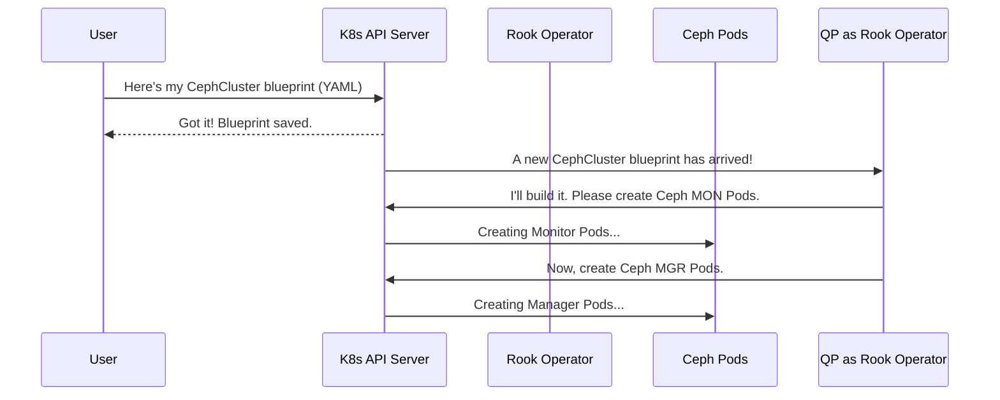

# Chapter 1: Ceph Custom Resources (CRDs)

Welcome to the first chapter of our journey into the Rook codebase! We're going to start with the most fundamental concept: how you, the user, tell Rook what you want.

Imagine you're in charge of a massive construction project (your Kubernetes cluster). You need to add a specialized, highly reliable storage facility (a Ceph cluster). How do you give the construction crew (Rook) the plans? You don't shout instructions; you hand them a set of detailed blueprints. In the world of Rook and Kubernetes, these blueprints are called **Custom Resources**.

### What Problem Do Custom Resources Solve?

Out of the box, Kubernetes knows about basic concepts like `Pods`, `Deployments`, and `Services`. It does *not* know what a "Ceph Cluster" or a "Block Pool" is. It's like a builder who knows how to build houses and apartments but has never heard of a data center.

**Custom Resource Definitions (CRDs)** are how we extend Kubernetes's vocabulary. When Rook is installed, it first teaches Kubernetes a new set of words related to Ceph storage. Once Kubernetes understands these new words, you can create instances of them, which are called **Custom Resources (CRs)**.

Think of it this way:
*   **CRD (The Definition):** This is like adding a new word, "SwimmingPool," to the dictionary of construction terms.
*   **CR (The Resource):** This is your specific blueprint that says, "I want a 10-meter long, rectangular `SwimmingPool` in the backyard."

In Rook, these are the blueprints you provide to define your desired storage cluster.

### The Main Blueprints in Rook

Rook has several "blueprint" types, but let's focus on the most important ones.

#### 1. `CephCluster`: The Master Blueprint

This is the most important CRD. It's the master plan for the entire storage facility. It defines the core components, version, and overall configuration of your Ceph cluster.

Here is a very simple example of what a `CephCluster` blueprint looks like in a YAML file:

```yaml
# ceph-cluster.yaml
apiVersion: ceph.rook.io/v1
kind: CephCluster
metadata:
  name: my-first-cluster
  namespace: rook-ceph
spec:
  # ... other settings
  storage:
    useAllNodes: true
    useAllDevices: true
```

*   `apiVersion: ceph.rook.io/v1`: Tells Kubernetes we are using a custom "word" from the `ceph.rook.io` dictionary.
*   `kind: CephCluster`: This specifies we are creating a `CephCluster`, our master blueprint.
*   `spec`: This is where you describe *what you want*. In this case, we're telling Rook to use all available storage devices on all nodes in the Kubernetes cluster.

When you give this blueprint to Kubernetes, the Rook operator (our builder) sees it and starts constructing your Ceph cluster.

#### 2. `CephBlockPool` and `CephObjectStore`: Detailed Room Plans

Once your main building is up, you need to define specific areas.
*   **`CephBlockPool`**: This is like a blueprint for a secure vault. It provides "block storage," which acts like a virtual hard drive that your applications (Pods) can attach to.
*   **`CephObjectStore`**: This is like a blueprint for a massive, organized garage. It provides "object storage" (like Amazon S3), perfect for storing files, images, and backups.

Here's a blueprint for a `CephBlockPool`:

```yaml
# block-pool.yaml
apiVersion: ceph.rook.io/v1
kind: CephBlockPool
metadata:
  name: replicapool
  namespace: rook-ceph
spec:
  replicated:
    size: 3 # Make 3 copies of my data for safety!
```

This simple plan tells Rook: "Create a block storage pool named `replicapool` and, for every piece of data I put in it, please keep three copies to prevent data loss."

You define *what* you want in these YAML files, and the Rook operator brings your storage to life.

### How It Works Under the Hood

So what happens when you run `kubectl apply -f ceph-cluster.yaml`?

1.  **You submit the blueprint:** You send your YAML file to the Kubernetes API Server.
2.  **Kubernetes accepts it:** Because the CRDs were installed by Rook, Kubernetes understands what a `CephCluster` is and stores your blueprint.
3.  **The builder gets notified:** The Rook operator, which is always watching for new or changed blueprints, is immediately notified by Kubernetes about your new `CephCluster`.
4.  **Construction begins:** The operator reads your `spec` and starts creating the necessary Kubernetes resources (Pods, Services, etc.) to build a real Ceph cluster that matches your design.

This process is a core concept in Kubernetes called the "control loop," which we will explore in the next chapter on [Operator Controllers](02_operator_controllers_.md).

Here is a simple diagram of the flow:



### A Peek into the Code

You might be wondering, "Where in the code are these blueprints defined?" They live inside the `apis/` directory.

The file `apis/ceph.rook.io/v1/register.go` is like the master index that lists all the custom blueprint types Rook introduces to Kubernetes.

---
*File: `apis/ceph.rook.io/v1/register.go`*
```go
// Adds the list of known types to api.Scheme.
func addKnownTypes(scheme *runtime.Scheme) error {
	scheme.AddKnownTypes(SchemeGroupVersion,
		&CephCluster{},
		&CephClusterList{},
		&CephBlockPool{},
		&CephBlockPoolList{},
		&CephFilesystem{},
		&CephFilesystemList{},
		&CephObjectStore{},
		&CephObjectStoreList{},
		// ... and many more
	)
	// ...
	return nil
}
```
---

This `addKnownTypes` function is crucial. It programmatically tells the Kubernetes machinery about each of our custom resource types, like `CephCluster` and `CephBlockPool`. This is how Kubernetes learns the new vocabulary.

Each of these types is defined as a Go `struct`. For example, the `CephCluster` CRD is backed by a `CephCluster` struct in Go.

---
*File: `apis/ceph.rook.io/v1/cluster.go`*
```go
type CephCluster struct {
	metav1.TypeMeta   `json:",inline"`
	metav1.ObjectMeta `json:"metadata,omitempty"`
	Spec              ClusterSpec   `json:"spec"`
	Status            ClusterStatus `json:"status,omitempty"`
}

// ... more structs defining Spec and Status
```
---

Notice how the fields in the struct (`Spec`, `Status`, `metadata`) directly correspond to the fields you write in your YAML file. The Go code defines the valid structure and fields for the blueprint.

These structs also contain helpful functions that the operator uses to understand your intent. For example, `CephBlockPool` has a function to check if you want a replicated pool.

---
*File: `apis/ceph.rook.io/v1/pool.go`*
```go
// IsReplicated checks if the pool is configured for replication.
func (p *PoolSpec) IsReplicated() bool {
	return p.Replicated.Size > 0
}
```
---
When the operator processes your `CephBlockPool` blueprint, it can simply call this `IsReplicated()` method on the Go object to see if it needs to create a replicated pool or an erasure-coded one. This keeps the logic clean and organized.

### Conclusion

You've just learned about the most important concept for interacting with Rook: **Custom Resources**. They are the blueprints that bridge the gap between your intent ("I want a storage cluster") and Rook's actions.

*   **CRDs** extend Kubernetes's vocabulary.
*   **Custom Resources** are the YAML blueprints you write, like `CephCluster` and `CephBlockPool`.
*   The Rook operator is the builder that reads these blueprints and makes your storage cluster a reality.

These blueprints are just the beginning. The real magic happens inside the operator, which actively works to bring these resources to life.

In our next chapter, we'll dive into the builder itself: the [Operator Controllers](02_operator_controllers_.md). We'll see how they watch for your blueprints and start the construction process.

---

Generated by [AI Codebase Knowledge Builder](https://github.com/The-Pocket/Tutorial-Codebase-Knowledge)