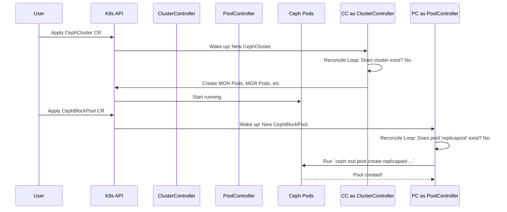

# Chapter 2: Operator Controllers

In the [previous chapter](01_ceph_custom_resources__crds__.md), we learned about the blueprints for our storage cluster: the Custom Resources (CRs). We hand these YAML blueprints to Kubernetes, describing exactly what we want.

But who reads these blueprints and does the actual construction work? That's where **Operator Controllers** come in. They are the diligent, tireless construction crew that turns your plans into a functioning Ceph cluster.

### What Problem Do Controllers Solve?

Submitting a blueprint to Kubernetes is like dropping off plans at a city planning office. The office files the plan, but nothing gets built automatically. You need a construction crew that reads the plan and takes action.

In the Rook-Ceph operator, controllers are the "brains" and the "hands" of the operation. They constantly watch for new or updated blueprints (`CephCluster`, `CephBlockPool`, etc.) and then work to make the real world (your cluster) match what's on paper.

### The Reconciliation Loop: A Self-Correcting System

The core job of every controller is to run a "reconciliation loop." This might sound complex, but the idea is simple and powerful. Imagine you're managing a thermostat:

1.  **Desired State:** You set the thermostat to 72°F. This is your *intent*.
2.  **Actual State:** The controller checks the room's current temperature. It's 68°F.
3.  **Reconcile:** The desired state (72°F) does not match the actual state (68°F). The controller takes action: it turns on the heater.
4.  **Repeat:** The controller continuously repeats this check. Once the room hits 72°F, the desired and actual states match, so the heater turns off. If a window opens and the room cools down, the loop will detect the difference and turn the heater back on.

Rook's controllers do the same thing, but for your storage cluster. They constantly compare the "desired state" from your CR blueprint with the "actual state" of the Kubernetes resources (Pods, Services, etc.). If there's a difference, the controller takes action to fix it.

### The Construction Crew: General Contractor and Subcontractors

Rook uses a team of controllers, each with a specific job, much like a construction project.

*   **The `ClusterController` (General Contractor):** This is the main controller. It's responsible for the `CephCluster` blueprint—the master plan. When you create a `CephCluster`, the `ClusterController` is the first one on the job. It orchestrates the big picture, like setting up the core Ceph monitor and manager daemons.

*   **Specialized Controllers (Subcontractors):** The `ClusterController` doesn't do all the work itself. It delegates specialized tasks to other controllers:
    *   **`CephBlockPoolController`:** The specialist for creating and managing storage pools (the "vaults" from Chapter 1).
    *   **`CephObjectStoreController`:** The expert for setting up S3-compatible object stores (the "garages").
    *   **`CephFilesystemController`:** The pro for building shared filesystems.

Each "subcontractor" controller only cares about its specific blueprint. The `CephBlockPoolController` doesn't know or care about object stores; it just watches for `CephBlockPool` CRs and gets to work.

### How It Works: A Step-by-Step Example

Let's see what happens when you create a `CephCluster` and then a `CephBlockPool`.



1.  **You apply `ceph-cluster.yaml`:** Kubernetes tells the Rook Operator about it.
2.  **The `ClusterController` wakes up:** Its `Reconcile` function is called. It sees there's a `CephCluster` CR but no actual Ceph Monitor pods running.
3.  **It takes action:** The `ClusterController` creates the Deployments and Services needed for the Ceph Monitors and Managers.
4.  **You apply `block-pool.yaml`:** Kubernetes notifies the Rook Operator.
5.  **The `CephBlockPoolController` wakes up:** Its `Reconcile` function is called. It sees the `CephBlockPool` CR for `replicapool` but confirms that this pool doesn't actually exist in the Ceph cluster yet.
6.  **It takes action:** It connects to the Ceph cluster (which the `ClusterController` already set up) and runs the command to create the pool with 3 replicas.

This reconciliation loop is always running. If a Ceph MON pod crashes, the `ClusterController` will notice the actual state doesn't match the desired state and will work with Kubernetes to restart it.

### A Peek into the Code

So, where does this all happen in the codebase?

#### Registering the Controllers

The main operator process needs to know which controllers (subcontractors) are available for work. This happens in a central registration list.

---
*File: `operator/ceph/cr_manager.go`*
```go
// AddToManagerFuncs is a list of functions to add all Controllers to the Manager
var AddToManagerFuncs = []func(manager.Manager, *clusterd.Context, context.Context, opcontroller.OperatorConfig) error{
	pool.Add,
	object.Add,
	file.Add,
	// ... and many more specialized controllers
}
```
---
This `AddToManagerFuncs` slice is like the general contractor's phonebook. It lists all the specialized controllers (`pool`, `object`, `file`) that need to be started and put to work.

#### The `Reconcile` Function

The heart of every controller is its `Reconcile` method. This is the code that gets executed every time a change is detected. Let's look at a simplified version of the `ClusterController`'s `Reconcile` function.

---
*File: `operator/ceph/cluster/controller.go`*
```go
func (r *ReconcileCephCluster) Reconcile(context context.Context, request reconcile.Request) (reconcile.Result, error) {
	// 1. Fetch the CephCluster blueprint from Kubernetes
	cephCluster := &cephv1.CephCluster{}
	err := r.client.Get(r.opManagerContext, request.NamespacedName, cephCluster)
	// ... error handling ...

	// 2. Check if the blueprint is being deleted
	if !cephCluster.GetDeletionTimestamp().IsZero() {
		return r.reconcileDelete(cephCluster)
	}

	// 3. Do the actual work to match the blueprint
	if err := r.clusterController.reconcileCephCluster(cephCluster, ownerInfo); err != nil {
		return reconcile.Result{}, /*...*/, err
	}

	// 4. All done for now, no need to retry immediately
	return reconcile.Result{}, *cephCluster, nil
}
```
---
You can see the thermostat logic right here:
1.  **Fetch the Desired State:** It gets the `CephCluster` CR you wrote.
2.  **Handle Deletion:** If the CR is being deleted, it runs cleanup logic.
3.  **Reconcile:** It calls `reconcileCephCluster`, a helper function that contains the logic to create or update the Ceph pods to match the `spec`.
4.  **Finish:** It reports success. The controller framework will call this function again if anything changes.

The specialized controllers follow the exact same pattern. Here is the `Reconcile` function for the `CephBlockPoolController`. Notice how similar it is!

---
*File: `operator/ceph/pool/controller.go`*
```go
func (r *ReconcileCephBlockPool) Reconcile(context context.Context, request reconcile.Request) (reconcile.Result, error) {
	// 1. Fetch the CephBlockPool blueprint
	cephBlockPool := &cephv1.CephBlockPool{}
	err := r.client.Get(r.opManagerContext, request.NamespacedName, cephBlockPool)
	// ... error handling ...

	// 2. Handle deletion...
	if !cephBlockPool.GetDeletionTimestamp().IsZero() {
		// ... deletion logic ...
	}

	// 3. Do the actual work (CREATE/UPDATE)
	_, err = r.reconcileCreatePool(clusterInfo, &cephCluster.Spec, cephBlockPool)
	// ... error handling ...

	return reconcile.Result{}, *cephBlockPool, nil
}
```
---
This consistent pattern makes the operator easier to understand and maintain. Each controller has a clear, single responsibility, managed by its own `Reconcile` loop.

### Conclusion

You've now met the construction crew! **Operator Controllers** are the active components that bring your storage cluster to life.

*   They are the **brains** of the Rook operator.
*   The main **`ClusterController`** acts as a general contractor for the whole `CephCluster`.
*   **Specialized controllers** for pools, object stores, and filesystems act as subcontractors.
*   They all operate on a **reconciliation loop**, constantly comparing your desired state (CRs) with the cluster's actual state and fixing any differences.

This self-correcting design is what makes the Rook operator so powerful and reliable. It doesn't just set things up; it continuously works to ensure your cluster remains healthy and configured exactly as you intended.

In the next chapter, we will dive deeper into one of the most critical jobs performed by the `ClusterController`: [OSD Provisioning](03_osd_provisioning_.md). We'll see how Rook discovers storage devices and prepares them for use in the Ceph cluster.

---

Generated by [AI Codebase Knowledge Builder](https://github.com/The-Pocket/Tutorial-Codebase-Knowledge)