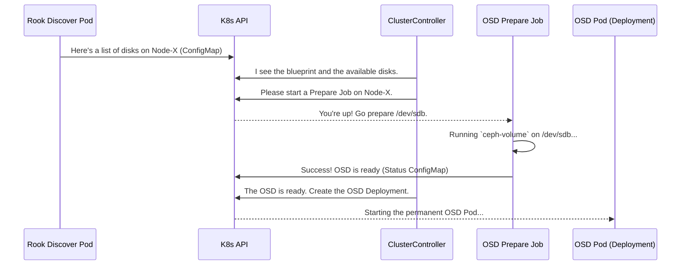

# Chapter 3: OSD Provisioning

In the [previous chapter](02_operator_controllers_.md), we met the "construction crew"—the [Operator Controllers](02_operator_controllers_.md) that read your blueprints and get to work. Now, we're going to zoom in on one of their most important and complex tasks: building the actual foundation of our storage facility.

This process is called **OSD Provisioning**. An OSD (Object Storage Daemon) is the software that manages a physical disk, and it's where your data actually lives. Before you can store any data, you need OSDs.

### The Problem: How Do You Turn a Raw Disk into a Ceph OSD?

Imagine you've added several new, empty hard drives to your Kubernetes nodes. How does Rook turn those raw disks into a usable part of the Ceph cluster? It's not as simple as just using the disk. The process involves:

1.  **Discovering** which disks are available on which nodes.
2.  **Validating** that a disk is empty and safe to use.
3.  **Formatting** the disk with a special filesystem called `BlueStore` that Ceph understands.
4.  **Registering** the new OSD with the Ceph cluster.
5.  **Launching** a permanent Pod to run the OSD daemon for that disk.

Doing this manually would be incredibly tedious and error-prone. OSD Provisioning is Rook's automated solution to this entire workflow. It acts like a specialized foundation crew for our storage building.

### The Foundation Crew: A Four-Step Process

Think of OSD provisioning as a highly coordinated construction process with four main phases.

#### Step 1: The Survey (Discovery)

First, a surveyor must inspect the land to see what's available. In Rook, this is done by a special DaemonSet called `rook-discover`. A `rook-discover` pod runs on every node that might have storage. Its only job is to scan for attached storage devices and report its findings in a Kubernetes ConfigMap.

This report includes details like the disk's name (e.g., `/dev/sda`), size, and whether it's empty.

#### Step 2: The Blueprint Check (Controller Logic)

The main `ClusterController` (our General Contractor) sees your `CephCluster` blueprint, which might say "use all available devices on all nodes." It compares this blueprint with the survey reports from the `rook-discover` pods to decide which disks need to be prepared.

#### Step 3: Preparing the Ground (The OSD Prepare Job)

For each disk that needs to be turned into an OSD, the `ClusterController` launches a temporary **Kubernetes Job**. This job, called `rook-ceph-osd-prepare`, is the ground preparation crew. It runs on the specific node where the disk is located.

Inside this job, Rook uses a powerful Ceph-native tool called `ceph-volume`. This tool does the heavy lifting: it takes the raw disk path (like `/dev/sdb`), zaps any old data, partitions it, formats it with BlueStore, and prepares it to join the cluster.

#### Step 4: Pouring the Concrete (The OSD Deployment)

Once the `prepare` job is finished, it updates a status ConfigMap to say, "Success! The OSD is ready." The `ClusterController` sees this message and proceeds with the final step: it creates a permanent Kubernetes **Deployment** for the new OSD. This Deployment runs the actual `ceph-osd` daemon that will manage the disk and handle your data. The foundation is now poured and ready to use.

This entire flow is designed to be robust and idempotent. If something fails, Rook can safely retry the process.

### How It Works: A Visual Guide

Let's visualize this process from start to finish.



### A Peek into the Code

Let's trace this process through the codebase.

#### 1. The Surveyor: `rook-discover`

The discovery pod's logic lives in `daemon/discover/`. The `Run` function sets up a loop that periodically calls `probeDevices` to check the hardware and `updateDeviceCM` to save the results to a ConfigMap.

---
*File: `daemon/discover/discover.go`*
```go
// Run is the entry point of that package execution
func Run(ctx context.Context, context *clusterd.Context, probeInterval time.Duration, useCV bool) error {
	// ... setup ...

	// Periodically check for devices and update the ConfigMap
	for {
		select {
		// ... signal handling ...
		case <-time.After(probeInterval):
			if err := updateDeviceCM(ctx, context); err != nil {
				logger.Errorf("failed to update device configmap. %v", err)
			}
		// ... more cases ...
		}
	}
}
```
---
This simple loop is the heartbeat of the discovery process, ensuring the operator always has an up-to-date view of the available storage.

#### 2. Launching the Prepare Job

The `ClusterController` logic for launching jobs is in `operator/ceph/cluster/osd/create.go`. The function `startProvisioningOverNodes` identifies which nodes need OSDs and then calls `runPrepareJob`.

---
*File: `operator/ceph/cluster/osd/create.go`*
```go
func (c *Cluster) runPrepareJob(osdProps *osdProperties, config *provisionConfig) error {
	// ...

	// Create the Kubernetes Job object
	job, err := c.makeJob(*osdProps, config)
	if err != nil {
		return errors.Wrapf(err, "failed to generate osd provisioning job template")
	}

	// Submit the Job to Kubernetes
	if err := k8sutil.RunReplaceableJob(c.clusterInfo.Context, c.context.Clientset, job, false); err != nil {
		return errors.Wrapf(err, "failed to run osd provisioning job")
	}

	logger.Infof("started OSD provisioning job for %s", osdProps.crushHostname)
	return nil
}
```
---
This shows how the controller translates the need for an OSD into a concrete Kubernetes resource—a `Job`. The details of that job are defined in the `makeJob` function.

#### 3. The `ceph-volume` Tool

The most critical part happens inside the `prepare` job. This job runs a container that eventually calls the `ceph-volume` command-line tool. The logic for orchestrating this is in `daemon/ceph/osd/volume.go`.

---
*File: `daemon/ceph/osd/volume.go`*
```go
func (a *OsdAgent) initializeDevicesRawMode(context *clusterd.Context, devices *DeviceOsdMapping) error {
	baseCommand := "stdbuf"
	cephVolumeMode := "raw"
	// ...

	baseArgs := []string{"-oL", cephVolumeCmd, cephVolumeMode, "prepare", storeFlag}

	for name, device := range devices.Entries {
		deviceArg := path.Join("/dev", name)
		// ... logic to build the full command ...
		immediateExecuteArgs := append(baseArgs, /*... more args ...*/)

		// Execute `ceph-volume raw prepare --data /dev/sdb ...`
		op, err := context.Executor.ExecuteCommandWithCombinedOutput(baseCommand, immediateExecuteArgs...)
		// ... error handling ...
	}
	return nil
}
```
---
This snippet shows Rook building and executing the `ceph-volume` command. This is where the raw disk is actually formatted and prepared. Rook supports different `ceph-volume` modes, like `raw` for whole devices or `lvm` for creating logical volumes, giving it great flexibility.

#### 4. Creating the Final OSD Deployment

After the prepare job succeeds, the `ClusterController`'s reconciliation loop will see the "complete" status. It then creates the final OSD deployment.

---
*File: `operator/ceph/cluster/osd/create.go`*
```go
func createDaemonOnNode(c *Cluster, osd *OSDInfo, nodeName string, config *provisionConfig) error {
	// Define the OSD Deployment
	d, err := deploymentOnNode(c, osd, nodeName, config)
	if err != nil {
		return err
	}
	
	// Submit the Deployment to Kubernetes
	_, err = k8sutil.CreateDeployment(c.clusterInfo.Context, c.context.Clientset, d)
	if err != nil {
		return errors.Wrapf(err, "failed to create deployment for OSD %d on node %q", osd.ID, nodeName)
	}
	return nil
}
```
---
This function, `createDaemonOnNode`, is responsible for creating the long-running pod that becomes the home for your data.

### Conclusion

OSD Provisioning is the engine that builds the foundation of your Ceph cluster. It's a sophisticated, multi-stage process that Rook completely automates for you.

*   It starts with **discovery** to see what disks are available.
*   It uses temporary **prepare jobs** to safely format and configure each disk.
*   It relies on the official **`ceph-volume`** tool to do the heavy lifting.
*   It finishes by creating the final **OSD Deployments** that manage the storage.

This robust process is what allows you to simply tell Rook, "use these disks," and have a fully functioning, production-ready storage cluster emerge automatically.

Now that we have a cluster with OSDs, the operator needs a way to communicate with it to perform administrative tasks like creating storage pools. In the next chapter, we'll explore the [Ceph Client Wrapper](04_ceph_client_wrapper_.md), the operator's personal toolkit for managing the Ceph cluster.

---

Generated by [AI Codebase Knowledge Builder](https://github.com/The-Pocket/Tutorial-Codebase-Knowledge)