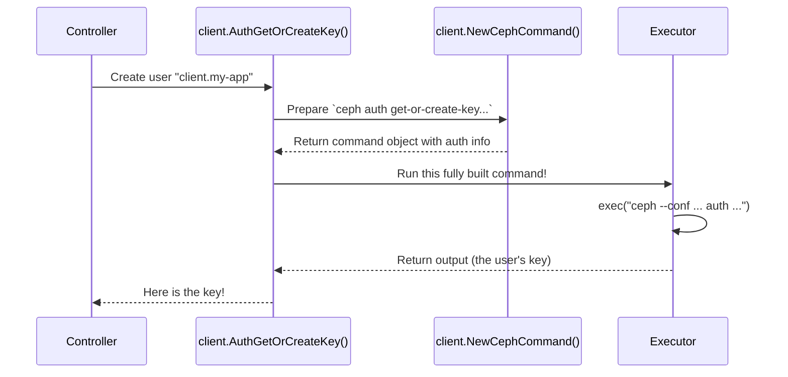

# Chapter 4: Ceph Client Wrapper

In the [previous chapter on OSD Provisioning](03_osd_provisioning_.md), we saw how Rook builds the storage foundation by preparing disks and starting OSDs. Now that we have a basic Ceph cluster running, how does the Rook operator *talk* to it? How does it create a storage pool, check the cluster's health, or manage users?

This is where the **Ceph Client Wrapper** comes in. It is the operator's personal toolkit for communicating directly with the Ceph cluster it manages.

### What Problem Does the Wrapper Solve?

Imagine you're a construction site manager (the Rook operator). You've just built the frame of a new building (the Ceph cluster). Now you need to perform specific tasks like installing plumbing (creating a block pool) or checking the electrical system (checking cluster health). You wouldn't use a sledgehammer for these jobs; you'd use a specific set of tools like wrenches and voltmeters.

Similarly, the Rook operator needs to run Ceph's command-line tools (`ceph`, `rbd`, `rados`) to manage the cluster. The Ceph Client Wrapper is a collection of Go functions that "wraps" these command-line tools, making them easy and reliable to use from within the operator's code. It handles all the messy details like:

*   Finding the right Ceph configuration files.
*   Providing the correct authentication keys.
*   Formatting the command arguments correctly.
*   Executing the command and parsing its output.

This lets the rest of the operator focus on *what* it wants to do, not the low-level details of *how* to run a command.

### The Toolkit in Action: Creating a User

Let's take a simple use case: an operator controller needs to create a new Ceph user named `client.my-app` with certain permissions. Instead of manually building a shell command, it uses a high-level function from the wrapper.

Here's how that looks in the code:

```go
// The permissions we want to grant the new user
caps := []string{"mon", "allow r", "osd", "allow rw pool=my-pool"}

// Use the wrapper to create the user and get their secret key
key, err := client.AuthGetOrCreateKey(context, clusterInfo, "client.my-app", caps)
if err != nil {
    return errors.Wrap(err, "could not create ceph user")
}
```

This simple function call does everything needed. It finds the cluster, authenticates as an admin, runs the `ceph auth get-or-create-key` command with the right arguments, and returns the secret key. The controller logic stays clean and simple.

### Under the Hood: How a Command is Executed

So what's happening inside that `client.AuthGetOrCreateKey` call? It's a well-defined, step-by-step process.

1.  **Prepare the Command:** The high-level function (`AuthGetOrCreateKey`) knows it needs to run the `ceph` tool. It uses a helper, `NewCephCommand`, to create a command object.
2.  **Add Authentication:** This command object is bundled with a `ClusterInfo` struct, which is like an access badge. It contains the cluster's unique ID (FSID) and the admin username and secret key, so Ceph knows who is making the request.
3.  **Build the Full Command Line:** A function called `FinalizeCephCommandArgs` takes the simple arguments (like `auth`, `get-or-create-key`) and adds all the necessary flags like `--conf`, `--keyring`, and `--cluster` using the information from the `ClusterInfo` badge.
4.  **Execute:** Finally, the wrapper uses a low-level executor to run the fully formed command (e.g., `ceph --cluster rook-ceph --conf ... --keyring ... auth get-or-create-key ...`).
5.  **Return the Result:** The output from the command line is returned to the original caller.

Here’s a simplified diagram of this flow:



### A Peek into the Code

Let's look at the key pieces of this toolkit in the `daemon/ceph/client/` directory.

#### 1. The Access Badge: `ClusterInfo`

Everything starts with knowing *which* cluster to talk to. The `ClusterInfo` struct holds all that context.

---
*File: `daemon/ceph/client/info.go`*
```go
// ClusterInfo is a collection of information about a particular Ceph cluster.
type ClusterInfo struct {
	FSID          string
	MonitorSecret string
	CephCred      CephCred
	Namespace     string
    // ... other fields
}

// CephCred represents the Ceph cluster username and key
type CephCred struct {
	Username string
	Secret   string
}
```
---
This struct is the "access badge." Before any command is run, the operator fills this out with the target cluster's namespace, FSID, and the admin credentials needed to perform administrative tasks.

#### 2. Picking a Tool: `NewCephCommand`

Next, the code needs to choose which tool to use (`ceph`, `rbd`, etc.) and what it should do. This is handled by command constructors.

---
*File: `daemon/ceph/client/command.go`*
```go
// NewCephCommand creates a new command object for the 'ceph' tool.
func NewCephCommand(context *clusterd.Context, clusterInfo *ClusterInfo, args []string) *CephToolCommand {
	return &CephToolCommand{
		context:     context,
		tool:        CephTool, // "ceph"
		clusterInfo: clusterInfo,
		args:        args,
	}
}
```
---
This function is like picking the "ceph" screwdriver from your toolkit. It takes the access badge (`clusterInfo`) and the specific task (`args`) and prepares a command object, ready to be finalized and run.

#### 3. Building the Full Command: `FinalizeCephCommandArgs`

This is where the wrapper shines. It takes the simple arguments and combines them with the context from `ClusterInfo` to build a complete, runnable command.

---
*File: `daemon/ceph/client/command.go`*
```go
// FinalizeCephCommandArgs builds the command line to be called
func FinalizeCephCommandArgs(command string, clusterInfo *ClusterInfo, args []string, configDir string) (string, []string) {
	// ...
	keyringPath := path.Join(configDir, clusterInfo.Namespace, "client.admin.keyring")

	configArgs := []string{
		fmt.Sprintf("--cluster=%s", clusterInfo.Namespace),
		fmt.Sprintf("--conf=%s", CephConfFilePath(configDir, clusterInfo.Namespace)),
		fmt.Sprintf("--name=%s", clusterInfo.CephCred.Username),
		fmt.Sprintf("--keyring=%s", keyringPath),
	}

	return command, append(args, configArgs...)
}
```
---
This function automatically adds all the required authentication and configuration flags. This prevents bugs and keeps the high-level controller logic extremely clean.

#### 4. The High-Level API: Putting It All Together

Finally, let's look at a high-level function like the one we first mentioned. You can see how it uses the low-level pieces to provide a simple, task-oriented API.

---
*File: `daemon/ceph/client/auth.go`*
```go
// AuthGetOrCreateKey gets or creates the key for the given user.
func AuthGetOrCreateKey(context *clusterd.Context, clusterInfo *ClusterInfo, name string, caps []string) (string, error) {
	// 1. Prepare the simple arguments
	args := append([]string{"auth", "get-or-create-key", name}, caps...)

	// 2. Create the command object
	cmd := NewCephCommand(context, clusterInfo, args)

	// 3. Run it and get the output
	buf, err := cmd.Run()
	if err != nil {
		return "", errors.Wrapf(err, "failed get-or-create-key %s", name)
	}

	// 4. Parse the output to get just the key
	return parseAuthKey(buf)
}
```
---
This function perfectly demonstrates the wrapper's value. It translates a clear goal ("get or create a key") into the necessary command-line execution, hiding all the complexity from its caller.

### Conclusion

The **Ceph Client Wrapper** is a fundamental abstraction in Rook. It is the operator's toolkit for safely and reliably managing the Ceph cluster.

*   It provides high-level Go functions for common Ceph tasks (e.g., `CreatePool`, `AuthGetOrCreateKey`).
*   It handles the complex details of command-line execution, including authentication and configuration.
*   It uses the `ClusterInfo` struct as an "access badge" to connect to the correct cluster with the right credentials.
*   This keeps the main operator logic clean, readable, and focused on the desired state of the cluster.

So far, we've seen how the operator discovers disks, provisions OSDs, and talks to the Ceph cluster. But the operator also needs to talk extensively to another system: Kubernetes itself!

In the next chapter, we'll explore the [k8sutil Package](05_k8sutil_package_.md), a similar toolkit of helpers for interacting with the Kubernetes API.

---

Generated by [AI Codebase Knowledge Builder](https://github.com/The-Pocket/Tutorial-Codebase-Knowledge)